# Operit 项目架构图 (Mermaid)

> 生成日期：2026-05-07
> 项目：Operit AI 助手 (com.ai.assistance.operit)
> 格式：Mermaid

---

## 目录

1. [整体系统架构图](#1-整体系统架构图)
2. [核心模块内部架构图](#2-核心模块内部架构图)
3. [组件运行时架构图](#3-组件运行时架构图)
4. [数据流存储架构图](#4-数据流存储架构图)
5. [AI 模型推理管线图](#5-ai-模型推理管线图)

---

## 1. 整体系统架构图

```mermaid
graph TB
    subgraph External["外部服务层"]
        OpenAI["OpenAI API"]
        Claude["Anthropic Claude"]
        Gemini["Google Gemini"]
        LocalVendors["Minimax / SiliconFlow / ..."]
    end

    subgraph App["App 主模块 (:app)"]
        direction TB
        subgraph UI["UI Layer"]
            MainActivity["MainActivity"]
            OperitApp["OperitApp (Compose)"]
            FloatingUI["FloatingWindow UI"]
            WidgetGlance["Widget (Glance)"]
        end
        subgraph Core["Core Layer"]
            ChatEngine["Chat Engine (AIMessageManager)"]
            ToolSystem["Tool System (ToolRegistration)"]
            Workflow["Workflow Engine"]
            Avatar["Avatar System"]
            Config["Config / SystemPrompts"]
            Subpack["Subpack (APK/EXE Editor)"]
        end
        subgraph Data["Data Layer"]
            Repository["Repositories"]
            Preferences["Preferences (28 类)"]
            ObjectBox["ObjectBox DB"]
            Room["Room DB"]
            Backup["Backup System"]
        end
        subgraph Api["API Layer"]
            EnhancedAI["EnhancedAIService"]
            TTS["Voice Service (TTS)"]
            STT["Speech Service (STT)"]
        end
        subgraph Service["Service Layer"]
            ChatSvc["ChatServiceCore"]
            FloatingSvc["FloatingChatService"]
            VoiceSvc["VoiceInteractionService"]
            NotifSvc["NotificationListener"]
        end
        subgraph Provider["Provider Layer"]
            MemoryProvider["MemoryDocumentsProvider"]
            WorkspaceProvider["WorkspaceDocumentsProvider"]
        end
    end

    subgraph SubModules["子模块层"]
        DragonBones["dragonbones (2D动画)"]
        Terminal["terminal (终端)"]
        MNN["mnn (本地LLM推理)"]
        Llama["llama (llama.cpp)"]
        MMD["mmd (MMD 3D)"]
        FBX["fbx (FBX 3D)"]
        ShowerClient["showerclient (投屏)"]
        QuickJS["quickjs (JS引擎)"]
    end

    subgraph SDK["平台 & SDK 层"]
        Android["Android SDK 26+"]
        Compose["Jetpack Compose"]
        Shizuku["Shizuku API"]
        Libsu["libsu (Root)"]
        MLKit["ML Kit"]
        Filament["Filament (3D)"]
        FFmpeg["FFmpeg Kit"]
        MCP["MCP SDK (1.1.0)"]
        Tasker["Tasker Plugin"]
        Glance["Glance AppWidget"]
        WorkManager["WorkManager"]
    end

    %% 外部服务 -> API
    OpenAI --> EnhancedAI
    Claude --> EnhancedAI
    Gemini --> EnhancedAI
    LocalVendors --> EnhancedAI
    LocalVendors --> TTS
    OpenAI --> STT

    %% UI -> Core
    MainActivity --> ChatEngine
    FloatingUI --> ChatEngine
    OperitApp --> ChatEngine

    %% Core 内部
    ChatEngine --> ToolSystem
    ChatEngine --> Workflow
    ChatEngine --> Avatar
    ChatEngine --> Config
    ToolSystem --> Subpack

    %% Core -> Data
    ChatEngine --> Repository
    ToolSystem --> Repository
    Workflow --> Repository
    Avatar --> Preferences

    %% Data 内部
    Repository --> ObjectBox
    Repository --> Preferences
    Repository --> Room
    Preferences --> Backup

    %% API -> Core
    EnhancedAI --> ChatEngine
    EnhancedAI --> ToolSystem
    TTS --> ChatEngine
    STT --> ChatEngine

    %% Service -> Core
    ChatSvc --> ChatEngine
    FloatingSvc --> ChatEngine
    VoiceSvc --> ChatEngine
    NotifSvc --> ChatEngine

    %% Provider -> Data
    MemoryProvider --> Repository
    WorkspaceProvider --> Repository

    %% App -> SubModules
    ChatEngine --> DragonBones
    ChatEngine --> Terminal
    ChatEngine --> MNN
    ChatEngine --> Llama
    ChatEngine --> MMD
    ChatEngine --> FBX
    ChatEngine --> ShowerClient
    ToolSystem --> QuickJS

    %% App -> SDK
    UI --> Android
    UI --> Compose
    Core --> Shizuku
    Core --> Libsu
    Data --> MLKit
    App --> Filament
    Provider --> FFmpeg
    ToolSystem --> MCP
    Workflow --> Tasker
    WidgetGlance --> Glance
    Workflow --> WorkManager
```

### 分层说明

| 层级 | 描述 |
|------|------|
| **UI Layer** | Jetpack Compose 构建的用户界面，包含主界面、浮动窗口、Widget |
| **Core Layer** | 核心业务逻辑：聊天引擎、工具系统、工作流、Avatar、配置、子包编辑 |
| **Data Layer** | 数据访问与持久化：ObjectBox/Room 数据库、Repository、Preferences、备份 |
| **API Layer** | 外部服务抽象：LLM 调用、TTS 语音合成、STT 语音识别 |
| **Service Layer** | Android 后台服务：聊天、浮动窗口、语音交互、通知监听 |
| **Provider Layer** | ContentProvider：记忆文档、工作区文档 |
| **子模块层** | 独立的 Android Library 模块：2D/3D 动画、终端、AI 推理、JS 引擎、投屏 |
| **平台&SDK层** | Android 平台和第三方 SDK 依赖 |

---

## 2. 核心模块内部架构图

### 2.1 Core 层内部架构

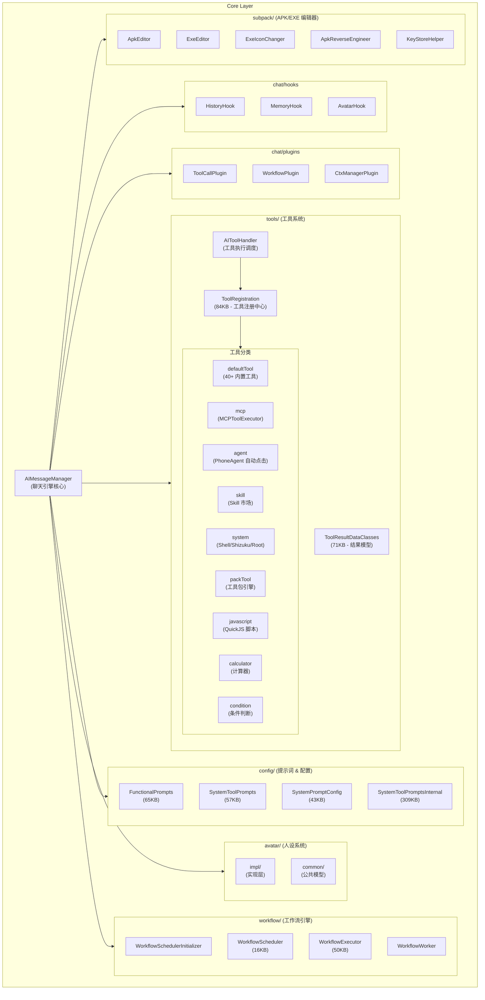

### 2.2 Data 层内部架构

```mermaid
graph TB
    subgraph DataLayer["Data Layer"]
        subgraph DB["数据库"]
            ObjectBoxDB["ObjectBox\n(核心实体存储)"]
            RoomDB["Room DB\n(辅助存储)"]
            HNSW["HNSW Vector Index\n(向量搜索)"]
        end
        
        subgraph Repos["Repository 仓库层"]
            MemoryRepo["MemoryRepository\n(110KB - 记忆管理)"]
            ChatHistory["ChatHistoryManager\n(62KB - 对话历史)"]
            AvatarRepo["AvatarRepository\n(44KB)"]
            WorkflowRepo["WorkflowRepository\n(27KB)"]
            UIHierarchy["UIHierarchyManager\n(19KB)"]
            EmojiRepo["CustomEmojiRepository\n(15KB)"]
        end
        
        subgraph PrefsGroup["Preferences 偏好设置 (28 类)"]
            UserPrefs["UserPreferencesManager\n(83KB)"]
            ApiPrefs["ApiPreferences\n(36KB)"]
            CharCard["CharacterCardManager\n(59KB)"]
            WaifuPrefs["WaifuPreferences"]
            WakeWord["WakeWordPreferences"]
            OtherPrefs["其他 23 个配置类 ..."]
        end
        
        subgraph MCPMod["MCP 模块"]
            MCPRepo["MCPRepository\n(48KB)"]
            MCPLocal["MCPLocalServer\n(38KB)"]
            MCPSkillRepo["SkillRepository"]
        end
        
        subgraph BackupMod["Backup 备份系统"]
            RawBackup["RawSnapshotBackupManager"]
            RoomBackup["RoomDatabaseBackupManager"]
            RoomRestore["RoomDatabaseRestoreManager"]
            BackupDirs["OperitBackupDirs"]
        end
        
        subgraph ExportConvert["导出 & 转换"]
            HtmlExp["HtmlExporter"]
            TextExp["TextExporter"]
            MarkdownExp["MarkdownExporter"]
            ChatFmt["ChatFormat"]
            ChatGPTConv["ChatGPTConverter"]
            ChatBoxConv["ChatBoxConverter"]
        end
        
        subgraph Updates["更新管理"]
            UpdateMgr["UpdateManager"]
            FullInstaller["FullUpdateInstaller"]
            PatchInstaller["PatchUpdateInstaller\n(39KB)"]
        end
    end
    
    Repos --> DB
    Repos --> PrefsGroup
    MCPMod --> Repos
    PrefsGroup --> BackupMod
    ExportConvert --> Repos
```

### 2.3 UI 层内部架构

```mermaid
graph TB
    subgraph UILayer["UI Layer"]
        MainActivity["MainActivity\n(38KB - 主入口)"]
        OperitApp["OperitApp\n(Compose 根组件)"]
        
        subgraph Screens["features/ (18 个功能页面)"]
            ChatScreen["chat/ (聊天界面)"]
            SettingsScreen["settings/ (设置)"]
            MemoryScreen["memory/ (记忆管理)"]
            WorkflowScreen["workflow/ (工作流编辑)"]
            ToolboxScreen["toolbox/ (工具箱)"]
            PackagesScreen["packages/ (包管理)"]
            TokenScreen["token/ (Token 统计)"]
            UpdateScreen["update/ (更新)"]
            StartupScreen["startup/ (启动引导)"]
            DemoPage["demo/ (示例)"]
            HelpPage["help/ (帮助)"]
            AboutPage["about/ (关于)"]
            AssistantPage["assistant/ (语音助手)"]
            MigrationPage["migration/ (数据迁移)"]
            PermissionPage["permission/ (权限管理)"]
            WebSession["websession/ (网页会话)"]
            Announcement["announcement/ (公告)"]
            Agreement["agreement/ (协议)"]
        end
        
        subgraph FloatingMod["floating/ (浮动窗口)"]
            FloatContext["FloatContext"]
            FloatingMode["FloatingMode"]
            FloatChat["FloatingChatWindow"]
            FloatTheme["FloatingWindowTheme"]
            FloatVoice["voice/ (语音浮动)"]
            FloatUI["ui/ (浮动UI组件)"]
        end
        
        subgraph ThemeMod["theme/ (主题系统)"]
            ThemeMain["Theme.kt (29KB)"]
            ThemeColor["Color.kt"]
            ThemeType["Type.kt"]
            ThemeUtils["ThemeUtils"]
            WaterGlass["WaterGlass 效果"]
            LiquidGlass["LiquidGlass 效果"]
            TextLayout["TextLayoutSettings"]
        end
        
        subgraph CommonMod["common/ (通用组件)"]
            MarkdownView["markdown/ (渲染)"]
            Animations["animations/ (动画)"]
            Displays["displays/ (展示组件)"]
            Composed["composedsl/ (DSL组件)"]
        end
        
        subgraph PermissionMod["permissions/ (权限)"]
            PermDialog["ToolPermissionDialog"]
            PermSystem["ToolPermissionSystem"]
            PermOverlay["PermissionRequestOverlay"]
        end
    end
    
    MainActivity --> OperitApp
    OperitApp --> Screens
    OperitApp --> FloatingMod
    Screens --> ThemeMod
    Screens --> CommonMod
    FloatingMod --> ThemeMod
    Screens --> PermissionMod
```

## 3. 组件运行时架构图

### 3.1 Android 组件与进程架构

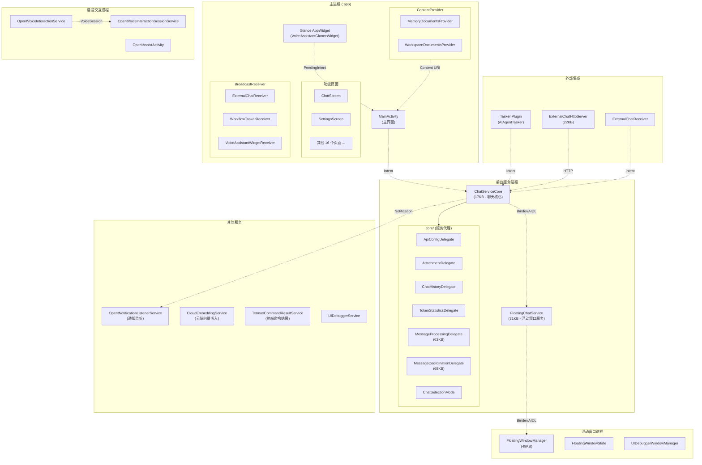

### 3.2 组件间通信机制

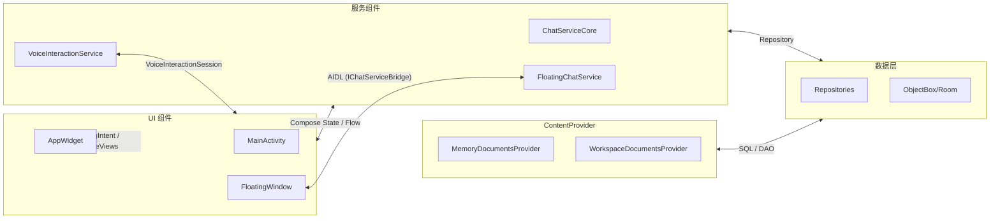

---

## 4. 数据流存储架构图

### 4.1 数据持久化全景

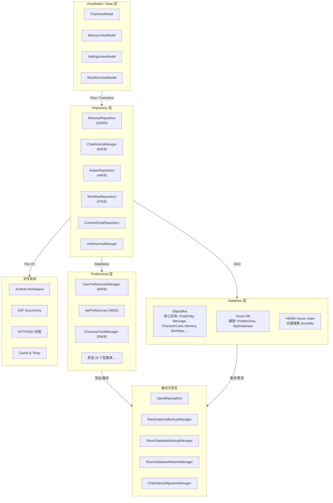

### 4.2 数据读写数据流

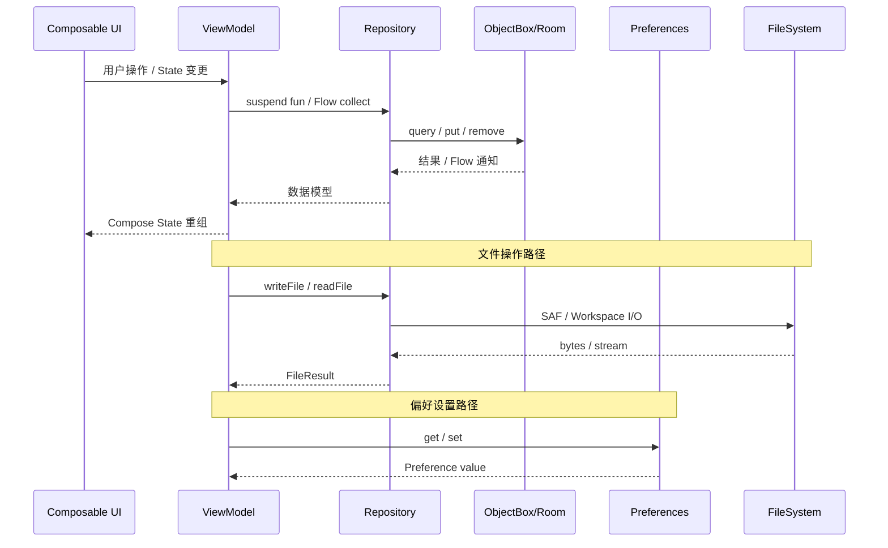

---

## 5. AI 模型推理管线图

### 5.1 LLM 对话推理全链路

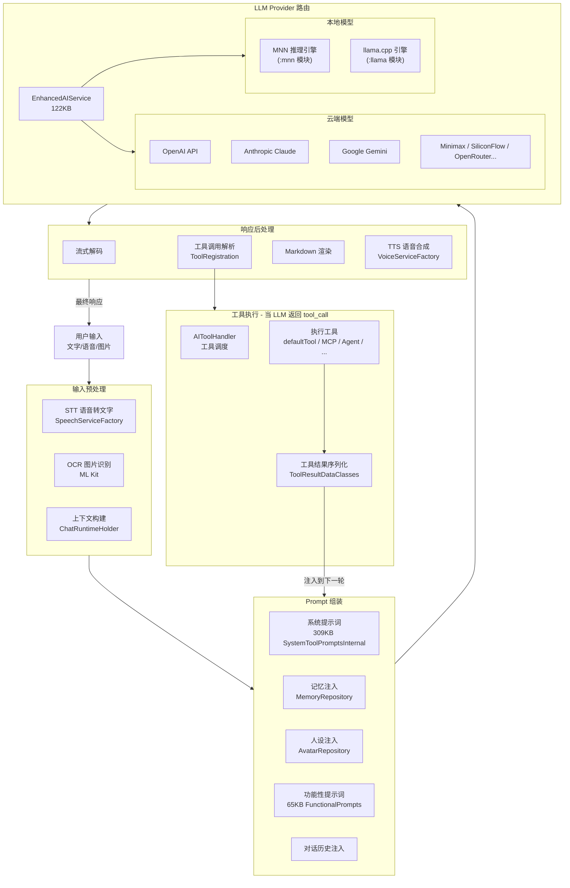

### 5.2 TTS / STT 语音管线

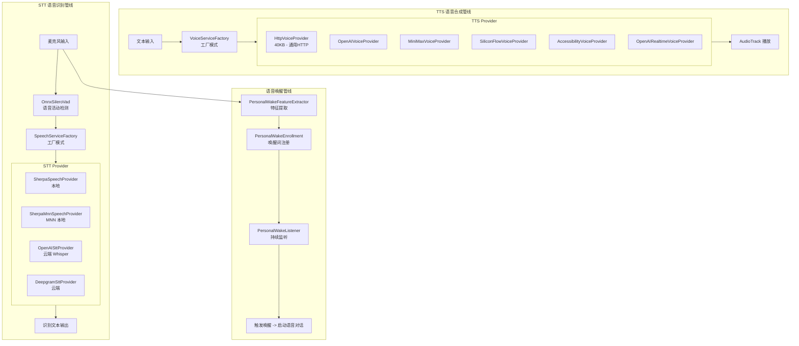

### 5.3 Tool Calling 循环

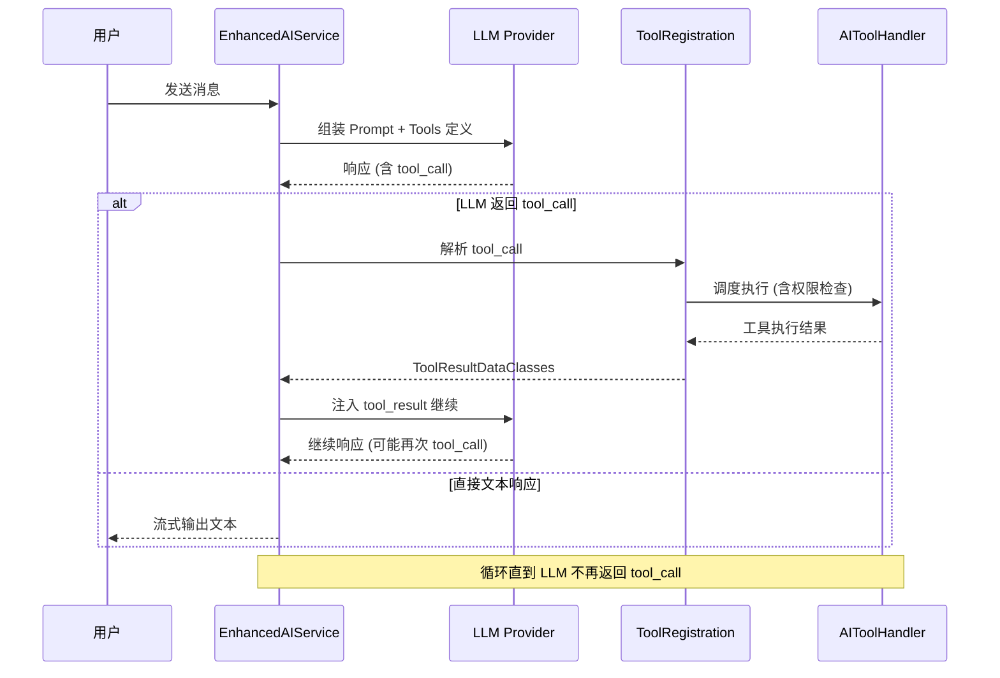