# Operit 项目架构图 (PlantUML)

> 生成日期：2026-05-07
> 项目：Operit AI 助手 (com.ai.assistance.operit)
> 格式：PlantUML

---

## 目录

1. [整体系统架构图](#1-整体系统架构图)
2. [核心模块内部架构图](#2-核心模块内部架构图)
3. [组件运行时架构图](#3-组件运行时架构图)
4. [数据流存储架构图](#4-数据流存储架构图)
5. [AI 模型推理管线图](#5-ai-模型推理管线图)

---

## 1. 整体系统架构图

```plantuml
@startuml
skinparam packageStyle rectangle
skinparam componentStyle rectangle

package "外部服务层" as External {
    [OpenAI API] as OpenAICloud
    [Anthropic Claude] as Claude
    [Google Gemini] as Gemini
    [Minimax / SiliconFlow / ...] as LocalVendors
}

package "App 主模块 (:app)" as AppMain {
    
    package "UI Layer" as UILayer {
        [MainActivity] as MainActivity
        [OperitApp (Compose)] as OperitApp
        [FloatingWindow UI] as FloatingUI
        [Widget (Glance)] as WidgetGlance
    }
    
    package "Core Layer" as CoreLayer {
        [Chat Engine\n(AIMessageManager)] as ChatEngine
        [Tool System\n(ToolRegistration)] as ToolSystem
        [Workflow Engine] as Workflow
        [Avatar System] as Avatar
        [Config / SystemPrompts] as Config
        [Subpack\n(APK/EXE Editor)] as Subpack
    }
    
    package "Data Layer" as DataLayer {
        [Repositories] as Repository
        [Preferences (28类)] as Preferences
        [ObjectBox DB] as ObjectBox
        [Room DB] as Room
        [Backup System] as Backup
    }
    
    package "API Layer" as ApiLayer {
        [EnhancedAIService] as EnhancedAI
        [Voice Service (TTS)] as TTS
        [Speech Service (STT)] as STT
    }
    
    package "Service Layer" as ServiceLayer {
        [ChatServiceCore] as ChatSvc
        [FloatingChatService] as FloatingSvc
        [VoiceInteractionService] as VoiceSvc
        [NotificationListener] as NotifSvc
    }
    
    package "Provider Layer" as ProviderLayer {
        [MemoryDocumentsProvider] as MemoryProvider
        [WorkspaceDocumentsProvider] as WorkspaceProvider
    }
}

package "子模块层" as SubModules {
    [dragonbones\n(2D动画)] as DragonBones
    [terminal\n(终端)] as Terminal
    [mnn\n(本地LLM)] as MNN
    [llama\n(llama.cpp)] as Llama
    [mmd\n(MMD 3D)] as MMD
    [fbx\n(FBX 3D)] as FBX
    [showerclient\n(投屏)] as ShowerClient
    [quickjs\n(JS引擎)] as QuickJS
}

package "平台 & SDK 层" as SDKLayer {
    [Android SDK 26+] as Android
    [Jetpack Compose] as Compose
    [Shizuku API] as Shizuku
    [libsu (Root)] as Libsu
    [ML Kit] as MLKit
    [Filament (3D)] as Filament
    [FFmpeg Kit] as FFmpeg
    [MCP SDK (1.1.0)] as MCP
    [Tasker Plugin] as Tasker
    [Glance AppWidget] as Glance
    [WorkManager] as WorkManager
}

' 外部服务 -> API
OpenAICloud --> EnhancedAI
Claude --> EnhancedAI
Gemini --> EnhancedAI
LocalVendors --> EnhancedAI
LocalVendors --> TTS
OpenAICloud --> STT

' UI -> Core
MainActivity --> ChatEngine
FloatingUI --> ChatEngine
OperitApp --> ChatEngine

' Core 内部
ChatEngine --> ToolSystem
ChatEngine --> Workflow
ChatEngine --> Avatar
ChatEngine --> Config
ToolSystem --> Subpack

' Core -> Data
ChatEngine --> Repository
ToolSystem --> Repository
Workflow --> Repository
Avatar --> Preferences

' Data 内部
Repository --> ObjectBox
Repository --> Preferences
Repository --> Room
Preferences --> Backup

' API -> Core
EnhancedAI --> ChatEngine
EnhancedAI --> ToolSystem
TTS --> ChatEngine
STT --> ChatEngine

' Service -> Core
ChatSvc --> ChatEngine
FloatingSvc --> ChatEngine
VoiceSvc --> ChatEngine
NotifSvc --> ChatEngine

' Provider -> Data
MemoryProvider --> Repository
WorkspaceProvider --> Repository

' App -> SubModules
ChatEngine --> DragonBones
ChatEngine --> Terminal
ChatEngine --> MNN
ChatEngine --> Llama
ChatEngine --> MMD
ChatEngine --> FBX
ChatEngine --> ShowerClient
ToolSystem --> QuickJS

' App -> SDK
UILayer ..> Android
UILayer ..> Compose
CoreLayer ..> Shizuku
CoreLayer ..> Libsu
DataLayer ..> MLKit
AppMain ..> Filament
ProviderLayer ..> FFmpeg
ToolSystem ..> MCP
Workflow ..> Tasker
WidgetGlance ..> Glance
Workflow ..> WorkManager

@enduml
```

---

## 2. 核心模块内部架构图

### 2.1 Core 层内部架构

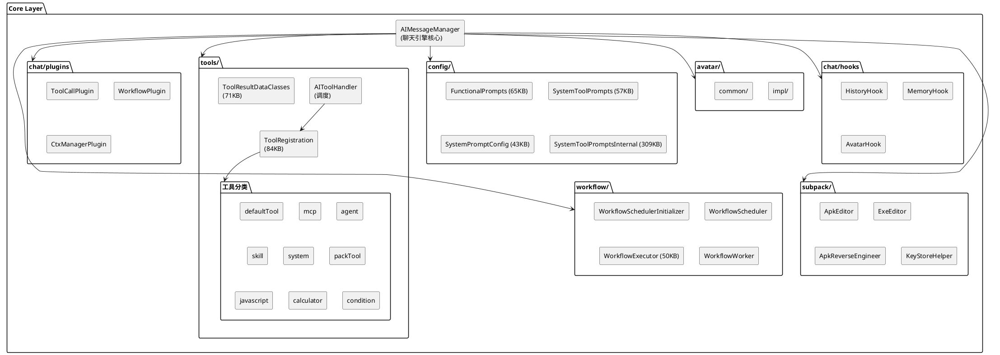

### 2.2 Data 层内部架构

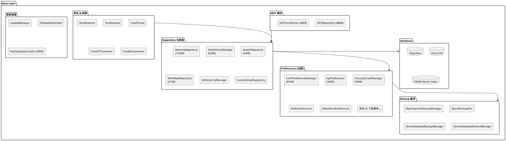

### 2.3 UI 层内部架构

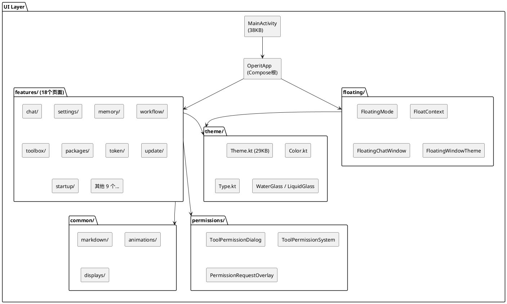

---

## 3. 组件运行时架构图

### 3.1 Android 组件与进程架构

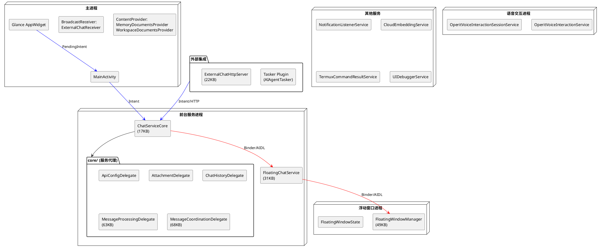

### 3.2 组件间通信机制

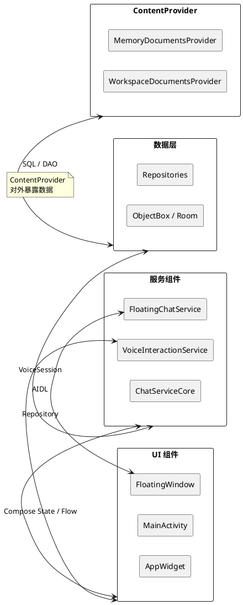

---

## 4. 数据流存储架构图

### 4.1 数据持久化全景

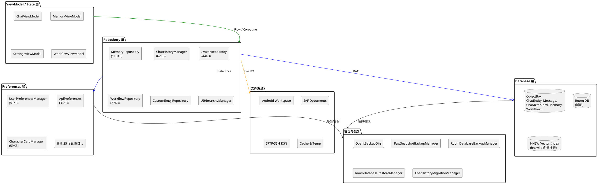

### 4.2 数据读写数据流

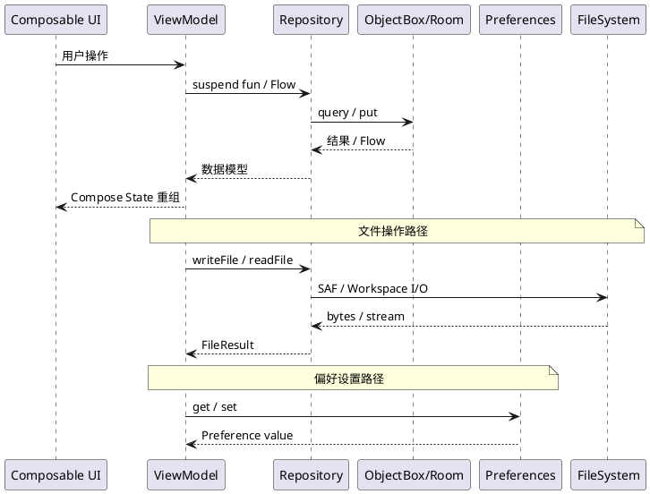

---

## 5. AI 模型推理管线图

### 5.1 LLM 对话推理全链路

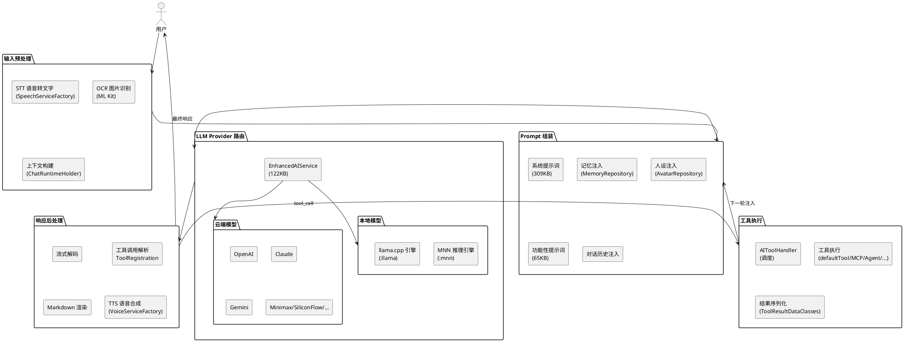

### 5.2 TTS / STT 语音管线

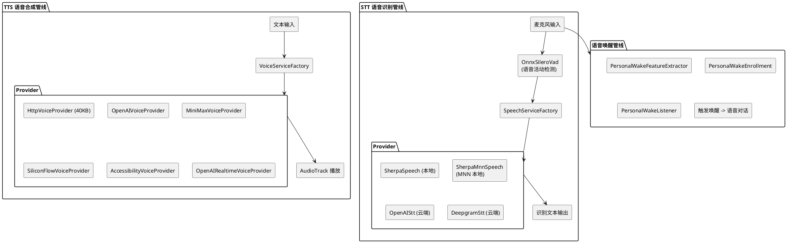

### 5.3 Tool Calling 循环

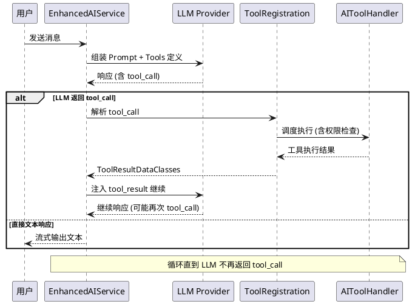