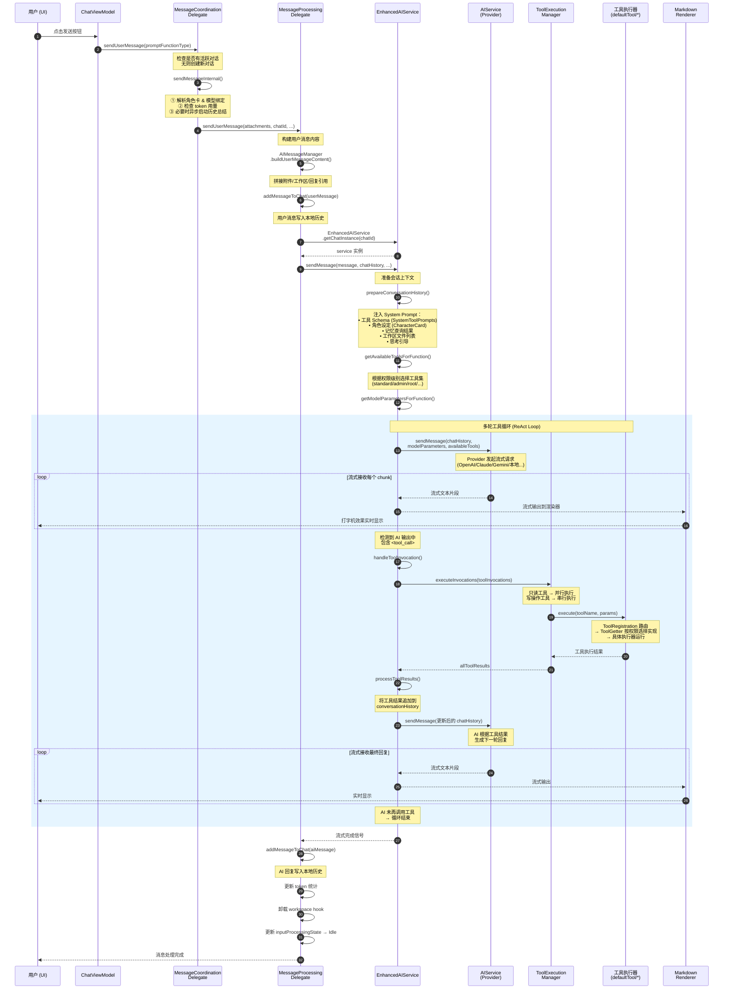

# 一次完整请求的调用链时序图

## 场景：用户发送一条消息，AI 调用工具后返回最终回复



## 关键节点说明

### 1. System Prompt 注入 (`prepareConversationHistory`)

每次请求前动态生成，包含：

| 内容 | 来源 |
|------|------|
| 工具描述 (schema) | `SystemToolPrompts.kt` |
| 角色设定 | `CharacterCard` / `ActivePromptManager` |
| 记忆上下文 | 记忆库向量搜索结果 |
| 工作区文件列表 | 当前绑定的工作区目录 |
| 思考引导 | 配置开关 (`enableThinkingGuidance`) |

### 2. 工具权限路由 (`ToolGetter`)

```
用户授权级别
    ├── Standard  → defaultTool/standard/*
    ├── Admin     → defaultTool/admin/*     (Shizuku)
    ├── ADB       → defaultTool/debugger/*
    ├── A11y      → defaultTool/accessbility/*
    └── Root      → defaultTool/root/*
```

同一工具名，不同权限下路由到不同实现。例如 `shell_command`：
- Standard 模式 → 只能在沙盒内执行
- Root 模式 → 拥有完整 root shell

### 3. 工具调用循环 (ReAct Loop)

```
AI 输出 → 包含 <tool_call>? 
    ├── 是 → 执行工具 → 结果放回历史 → 再次请求 AI → 循环
    └── 否 → 输出纯文字 → 结束
```

循环终止条件：
- AI 未输出任何 `<tool_call>` 标签
- 达到最大工具调用轮次上限
- Token 超限（触发总结后自动续写）

### 4. 流式渲染管线

```
AI 流式 chunk → EnhancedAIService 
    → StreamCollector → StreamMarkdownRenderer (KMP 算法)
        → BatchNodeUpdater (批量 UI 更新) 
            → Compose SnapshotStateList (增量重组)
```
