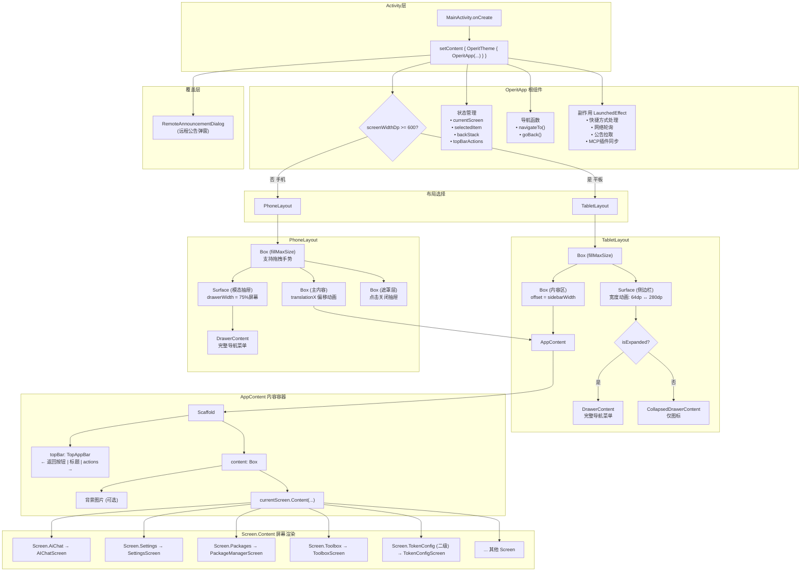
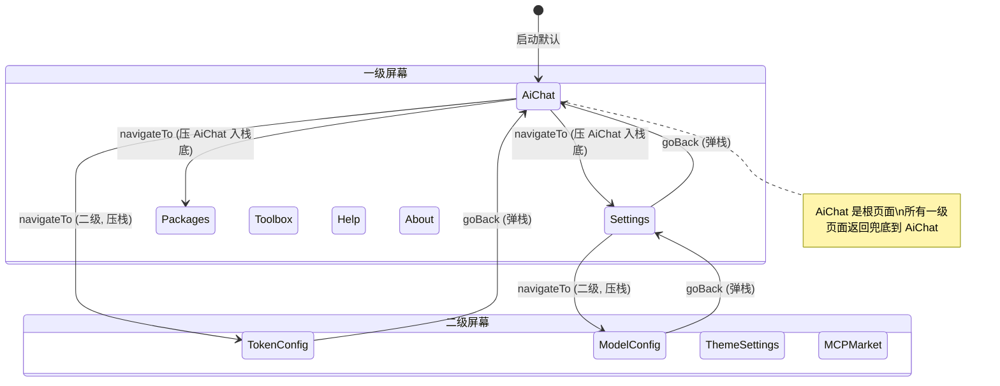

# 屏幕装配流程图

本文档描述 Operit 应用从 Activity 入口到最终 Screen 渲染的完整装配链路。

## 架构概览

Operit 采用 **单一 Activity + 多 Composable** 架构，使用自定义导航栈（非 Jetpack Navigation），支持手机和平板两种响应式布局。

## 装配流程图



## 装配链路（5 层）

| 层级 | 组件 | 职责 |
|------|------|------|
| **1. Activity** | `MainActivity` | 生命周期管理、权限检查、通过 `setContent` 启动 Compose |
| **2. OperitApp** | `OperitApp` | 全局状态管理、设备检测、布局分叉、导航逻辑 |
| **3. Layout** | `TabletLayout` / `PhoneLayout` | 侧边栏/抽屉 + 内容区的排列方式 |
| **4. AppContent** | `AppContent` | Scaffold(TopAppBar + 内容区)、屏幕缓存 |
| **5. Screen** | `Screen.Content()` | 每个 Screen 子类渲染对应的具体业务页面 |

## 关键分支点

| 分支 | 条件 | 结果 |
|------|------|------|
| **布局选择** | `screenWidthDp >= 600` | 平板: `TabletLayout` / 手机: `PhoneLayout` |
| **侧边栏形态** | `isTabletSidebarExpanded` | 展开: `DrawerContent` / 收起: `CollapsedDrawerContent` |
| **返回按钮显示** | `currentScreen.isSecondaryScreen` | 二级页面显示返回箭头 |
| **TopBar Actions** | 由子屏幕通过 `LocalTopBarActions` 注入 | AiChat/TokenConfig 有自定义按钮，其余页面清空 |

## 导航菜单结构 (DrawerContent)

```
Column (可滚动)
├── App 标题 ("Operit") + 网络状态
├── NavGroup: AI 功能
│   ├── AiChat
│   ├── AssistantConfig
│   ├── Packages
│   └── MemoryBase
├── NavGroup: 工具
│   ├── Toolbox
│   ├── ShizukuCommands
│   └── Workflow
└── NavGroup: 系统
    ├── Settings
    ├── Help
    ├── About
    └── UpdateHistory
```

## 导航状态机



## 核心文件清单

| 文件 | 路径 |
|------|------|
| **MainActivity** | `ui/main/MainActivity.kt` |
| **OperitApp** | `ui/main/OperitApp.kt` |
| **PhoneLayout** | `ui/main/layout/PhoneLayout.kt` |
| **TabletLayout** | `ui/main/layout/TabletLayout.kt` |
| **AppContent** | `ui/main/components/AppContent.kt` |
| **DrawerContent** | `ui/main/components/DrawerContent.kt` |
| **OperitScreens** | `ui/main/screens/OperitScreens.kt` |
| **NavItem** | `ui/common/NavItem.kt` |
