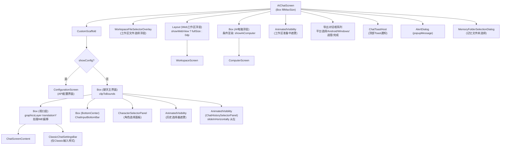
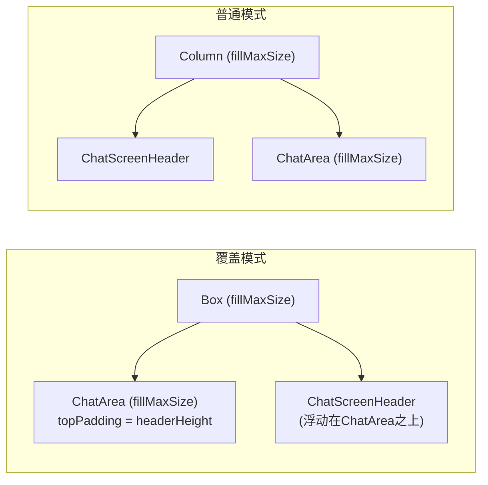

# Screen.AiChat 页面结构

本文档详细描述 `Screen.AiChat` 的完整 UI 组件树、布局层次和交互状态。

## 一、总体架构

`Screen.AiChat` 是应用的默认首页，也是最复杂的 Screen。它内部承载了 **聊天主界面**、**API 配置界面**、**Web 工作区**、**AI 电脑终端** 四种主要视图，通过状态切换实现复用。

### 入口链路

```
MainActivity (initialNavItem = NavItem.AiChat)
  → OperitApp (导航状态管理)
    → AppContent (TopAppBar + Crossfade容器)
      → Screen.AiChat.Content()          [OperitScreens.kt:124]
        → AIChatScreen()                 [AIChatScreen.kt:107]
```

### TopBar Actions 注入

`AIChatScreen` 通过 `LocalTopBarActions` 向 AppContent 的 TopAppBar 注入两个按钮：

| 按钮 | 图标 | 功能 |
|------|------|------|
| AI 电脑 | `Icons.Default.Terminal` | 切换 AI 电脑终端 (ComputerScreen) |
| Web 开发 | `Icons.Default.Code` | 切换 Web 工作区 (WorkspaceScreen) |

准备中状态时显示 `CircularProgressIndicator` 替代图标。

---

## 二、AIChatScreen 组件树



---

## 三、视图状态矩阵

AIChatScreen 的显示内容由多个布尔状态组合决定：

| 状态 | 默认值 | 控制的视图 |
|------|--------|------------|
| `showConfig` | 首次未配置时 true | ConfigurationScreen vs 聊天主界面 |
| `showWebView` | false | WorkspaceScreen 浮层 |
| `showAiComputer` | false | ComputerScreen 浮层 |
| `isWorkspacePreparing` | false | 准备中遮罩 (CircularProgressIndicator) |
| `showChatHistorySelector` | false | 聊天历史侧边面板 + 遮罩 |
| `showCharacterSelector` | false | 角色切换面板 |
| `showWorkspaceFileSelector` | false | 工作区文件选择浮层 |

### 视图互斥关系

```
正常聊天模式 (默认)
    ↕ onWorkspaceButtonClick()
Web 工作区模式 (showWebView = true, 覆盖聊天区)
    ↕ onAiComputerButtonClick()  
AI 电脑模式 (showAiComputer = true, 覆盖聊天区)
```

Web 工作区使用 `Layout` 包裹实现「不可见时不测量但保留组合」的性能优化；AI 电脑模式使用条件渲染，关闭时完全移出组合以释放 SurfaceView。

---

## 四、ChatScreenContent 详解

聊天主内容区域，包含 Header + 消息列表 + 覆盖层。

### 4.1 布局模式

根据 `chatHeaderOverlayMode && chatHeaderTransparent` 分为两种布局：



### 4.2 ChatScreenHeader 结构

```
Row (fillMaxWidth, 水平padding=16dp, 垂直padding=6dp)
├── ChatHeader (weight=1f)
│   ├── 历史按钮
│   │   ├── runningTaskCount >= 2: 带计数的药丸形 Surface
│   │   └── runningTaskCount < 2: 圆形 IconButton (History图标)
│   ├── PiP 悬浮窗按钮 (PictureInPicture图标)
│   └── 角色切换 Chip
│       ├── 24dp 圆形头像 (Coil加载 / Person占位)
│       └── Text (角色名, 最长12字符)
└── Row (统计信息)
    └── Box (可点击)
        ├── CircularProgressIndicator (上下文使用率环形进度)
        ├── Text (百分比数字, 9sp)
        └── DropdownMenu (展开时显示)
            ├── 上下文窗口大小
            ├── 输入 Token 数
            ├── 输出 Token 数
            └── 总 Token 数 (加粗高亮)
```

### 4.3 ChatArea 结构

消息列表区域，采用分页窗口机制：

```
Box (透明背景, 捕获视口高度)
└── Column (fillMaxWidth, verticalScroll, 水平/顶部/底部padding)
    ├── [hasOlderPages] Text("加载更早的历史") — 可点击
    ├── [forEach 可见消息窗口]
    │   key(message.timestamp)
    │     Box (位置锚点追踪)
    │       └── MessageItem(...)
    │   Spacer(8.dp)
    ├── [hasNewerPages] Text("加载更新的历史") — 可点击
    └── [showLoadingIndicator]
        └── LoadingDotsIndicator (加载动画)
```

**分页机制**：最多显示 `MAX_VISIBLE_CHAT_PAGES = 2` 页，上下翻页按钮可滑动窗口。

**消息渲染样式**：由 `chatStyle` 参数决定

| chatStyle | 渲染组件 | 视觉效果 |
|-----------|----------|----------|
| `CURSOR` | `CursorStyleChatMessage` | 类 Cursor 编辑器风格 (消息条) |
| `BUBBLE` | `BubbleStyleChatMessage` | 传统气泡聊天风格 |

每种样式下的消息组件层次：

```
CursorStyleChatMessage
├── UserMessageComposable     (用户消息 — 右侧卡片)
├── AiMessageComposable       (AI回复 — 左侧平铺)
└── SummaryMessageComposable  (总结消息)

BubbleStyleChatMessage
├── BubbleUserMessageComposable  (用户气泡 — 右对齐)
│   └── BubbleImageBackgroundSurface (可选图片背景)
└── BubbleAiMessageComposable    (AI气泡 — 左对齐)
    └── BubbleImageBackgroundSurface (可选图片背景)
```

### 4.4 覆盖层组件

在 ChatScreenContent 的 Box 内，叠加在 ChatArea 之上的组件：

| 组件 | 位置 | 触发条件 | 功能 |
|------|------|----------|------|
| 多选操作栏 | BottomCenter | `isMultiSelectMode` | 全选/分享/删除已选消息 |
| 停止朗读按钮 | 可拖拽位置 | `isPlaying \|\| isAutoReadEnabled` | SmallFAB, 可拖拽定位 |
| 滚动到底部 | BottomCenter | 非底部时显示 | ScrollToBottomButton |
| 消息编辑器 | 全屏Dialog | `editingMessageIndex != null` | MessageEditor (编辑/重发) |
| 工作区回滚确认 | Dialog | `pendingRollbackIndex != null` | WorkspaceChangeConfirmDialog |
| 编辑重发确认 | Dialog | `pendingRewindIndex != null` | WorkspaceChangeConfirmDialog |

---

## 五、ChatInputBottomBar 详解

底部输入栏，根据 `inputStyle` 切换两种实现：

### 5.1 输入样式对比

| 维度 | Agent 风格 | Classic 风格 |
|------|------------|--------------|
| 组件 | `AgentChatInputSection` | `ClassicChatInputSection` |
| 设置面板 | 内联弹出式 (AgentExtraSettingsPopup) | 独立浮动设置栏 (ClassicChatSettingsBar) |
| 功能开关位置 | 输入框内/弹出菜单 | 右侧独立设置栏 |
| 视觉风格 | 现代紧凑 | 经典分离 |

### 5.2 消息发送队列

当 AI 正在处理消息时，用户可将新消息加入**待发队列** (`pendingQueueMessages`)：

```
用户输入 → isQueueBlocked?
    ├── 否 → 直接发送 (sendMessage)
    └── 是 → 加入 pendingQueueMessages
            → AI处理完毕 → 自动发送队首消息 (FIFO)
```

队列支持：删除 / 编辑 / 立即发送（取消当前对话后发送）。

### 5.3 输入框外观变体

输入框外观受多个偏好组合控制：

| 偏好 | 效果 |
|------|------|
| `chatInputTransparent` | 背景透明 (alpha=0) |
| `chatInputFloating` | 悬浮样式 (与底部分离) |
| `chatInputLiquidGlass` | 液态玻璃材质 |
| `chatInputWaterGlass` | 水玻璃材质 (优先级高于液态玻璃) |
| `hasBackgroundImage` | 非透明时背景 alpha=0.85 |

### 5.4 IME (输入法) 处理

根据当前视图模式动态切换 SoftInputMode：

| 条件 | SoftInputMode | 处理方式 |
|------|---------------|----------|
| Agent输入 + 非工作区 | `ADJUST_NOTHING` | Compose 局部 translationY 偏移 |
| Web工作区 / AI电脑 | `ADJUST_RESIZE` | 系统 resize |
| 其他 | `ADJUST_PAN` | 系统 pan (Manifest默认) |

---

## 六、侧边面板与浮层

### 6.1 ChatHistorySelectorPanel (聊天历史)

从左侧滑入的面板，宽度 280dp：

```
Box (280dp, fillMaxHeight, 圆角右侧4dp)
└── ChatHistorySelector
    ├── 搜索框 (searchQuery)
    ├── 新建对话按钮
    ├── 显示模式切换 (全部 / 仅当前角色)
    └── LazyList (历史列表)
        ├── [按文件夹分组 / 平铺]
        ├── 每项: 标题 + 时间 + 角色绑定
        ├── 长按: 重命名 / 删除 / 移动分组
        └── 快速滚动条 (HistoryQuickScroller)
```

### 6.2 CharacterSelectorPanel (角色选择)

角色切换面板，显示可用角色卡和角色组：

```
CharacterSelectorPanel
├── CharacterItem (单个角色卡)
│   ├── 头像
│   ├── 角色名
│   └── 选中指示器
└── CharacterGroupItem (角色组)
    ├── 组头像
    ├── 组名
    └── 成员数量
```

### 6.3 WorkspaceFileSelectorOverlay (工作区文件选择)

从底部滑入的文件选择器，用于在输入框中 `@` 引用工作区文件：

```
AnimatedVisibility (fadeIn/fadeOut)
└── Box (fillMaxSize)
    ├── Box (遮罩层, 点击关闭)
    └── WorkspaceFileSelector (slideInVertically)
        ├── 文件树列表
        └── 选择文件 → 插入相对路径到输入框
```

---

## 七、Web 工作区 & AI 电脑

### 7.1 WorkspaceScreen (Web 开发模式)

通过 `Layout` 包裹实现性能优化：
- **可见时**：正常测量和放置，全屏覆盖
- **不可见时**：`layout(0, 0) {}` 跳过测量/放置，但保留在组合中维持状态
- 首次打开后 `hasEverShownWebView = true`，之后即使隐藏也不移出组合

### 7.2 ComputerScreen (AI 电脑终端)

使用条件渲染 (`if (showAiComputer)`)：
- 关闭时完全移出组合，确保 SurfaceView 被释放
- 避免机型相关的画面残影问题

---

## 八、对话框清单

| 对话框 | 触发条件 | 功能 |
|--------|----------|------|
| `ErrorDialog` | `errorMessage != null` | 显示错误信息 |
| `AlertDialog` (模型建议) | 模型名含 `deepseek-r1-0528-qwen3-8b:free` | 建议更换模型 |
| `AlertDialog` (弹窗消息) | `popupMessage != null` | 显示通知消息 |
| `MemoryFolderSelectionDialog` | 输入栏附件菜单 → 记忆 | 选择记忆文件夹 |
| `ExportPlatformDialog` | 工作区导出按钮 | 选择导出平台 (Android/Windows) |
| `AndroidExportDialog` | 选择 Android 平台 | 配置包名/应用名/图标/版本 |
| `WindowsExportDialog` | 选择 Windows 平台 | 配置应用名/图标 |
| `ExportProgressDialog` | 导出进行中 | 显示进度条和状态 |
| `ExportCompleteDialog` | 导出完成 | 显示结果，可打开文件 |
| `MessageEditor` | 长按消息 → 编辑 | 编辑消息内容，可重发 |
| `WorkspaceChangeConfirmDialog` | 回滚/编辑重发有工作区 | 预览文件变更后确认 |
| `SharedFileTargetDialog` | 外部分享文件到应用 | 选择处理方式 |
| `ChatMessageLocatorDialog` | ChatScrollNavigator 触发 | 定位到指定消息 |

---

## 九、主要偏好配置项

影响 AIChatScreen 外观和行为的关键偏好项：

| 偏好项 | 类型 | 影响 |
|--------|------|------|
| `chatStyle` | CURSOR / BUBBLE | 消息渲染风格 |
| `inputStyle` | AGENT / CLASSIC | 输入栏风格 |
| `useBackgroundImage` | Boolean | 聊天背景图 |
| `chatHeaderTransparent` | Boolean | Header 是否透明 |
| `chatHeaderOverlayMode` | Boolean | Header 覆盖模式 vs 顺序排列 |
| `chatInputTransparent` | Boolean | 输入框透明度 |
| `chatInputFloating` | Boolean | 输入框悬浮样式 |
| `chatInputLiquidGlass` | Boolean | 液态玻璃材质 |
| `chatInputWaterGlass` | Boolean | 水玻璃材质 |
| `chatAreaHorizontalPadding` | Float(dp) | 聊天区水平内边距 |
| `cursorUserBubbleFollowTheme` | Boolean | Cursor 风格用户气泡跟随主题 |
| `cursorUserBubbleColor` | Color? | Cursor 风格用户气泡颜色 |
| `bubbleUserBubbleColor` | Color? | Bubble 风格用户气泡颜色 |
| `bubbleAiBubbleColor` | Color? | Bubble 风格 AI 气泡颜色 |
| `bubbleUser/AiUseImage` | Boolean | 气泡图片背景 |
| `bubbleImageRenderMode` | String | 图片渲染模式 (九宫格平铺等) |
| `enableEnterToSend` | Boolean | 回车键发送 |
| `showInputProcessingStatus` | Boolean | 显示输入处理状态 |
| `showChatFloatingDotsAnimation` | Boolean | 聊天浮动点动画 |

---

## 十、核心文件清单

| 文件 | 路径 (相对于 `ui/features/chat/`) | 职责 |
|------|------|------|
| **AIChatScreen** | `screens/AIChatScreen.kt` | 页面入口，状态收集，视图编排 |
| **ChatScreenContent** | `components/ChatScreenContent.kt` | 聊天内容区 (Header + 消息列表 + 覆盖层) |
| **ChatScreenHeader** | `components/ChatScreenHeader.kt` | 顶部栏 (角色/历史/统计) |
| **ChatHeader** | `components/ChatHeader.kt` | Header 内部组件 (按钮 + 角色 Chip) |
| **ChatArea** | `components/ChatArea.kt` | 消息列表 (分页、滚动、消息渲染) |
| **ChatHistorySelector** | `components/ChatHistorySelector.kt` | 聊天历史选择器 |
| **CharacterSelectorPanel** | `components/CharacterSelectorPanel.kt` | 角色切换面板 |
| **AgentChatInputSection** | `components/style/input/agent/AgentChatInputSection.kt` | Agent 风格输入栏 |
| **ClassicChatInputSection** | `components/style/input/classic/ClassicChatInputSection.kt` | Classic 风格输入栏 |
| **ClassicChatSettingsBar** | `components/style/input/classic/ClassicChatSettingsBar.kt` | Classic 风格设置栏 |
| **CursorStyleChatMessage** | `components/style/cursor/CursorStyleChatMessage.kt` | Cursor 风格消息渲染 |
| **BubbleStyleChatMessage** | `components/style/bubble/BubbleStyleChatMessage.kt` | Bubble 风格消息渲染 |
| **ChatViewModel** | `viewmodel/ChatViewModel.kt` | 聊天业务逻辑 ViewModel |
| **WorkspaceScreen** | `webview/workspace/WorkspaceScreen.kt` | Web 工作区 |
| **ComputerScreen** | `webview/computer/ComputerScreen.kt` | AI 电脑终端 |
| **WorkspaceFileSelector** | `webview/WorkspaceFileSelector.kt` | 工作区文件选择器 |
| **ConfigurationScreen** | `components/ConfigurationScreen.kt` | API 配置界面 |
