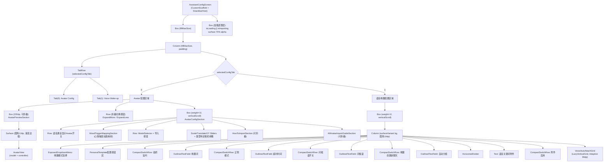

# Screen.AssistantConfig 页面结构

本文档详细描述 `Screen.AssistantConfig` 的完整 UI 组件树、布局层次和交互状态。

## 一、总体架构

`Screen.AssistantConfig` 是助手配置页面，包含 **Avatar（虚拟形象）配置** 和 **语音唤醒配置** 两个 Tab 页。页面通过 `AssistantConfigViewModel` 管理 Avatar 相关状态，通过 `WakeWordPreferences` DataStore 直接管理语音唤醒状态。

### 入口链路

```
MainActivity (NavItem.AssistantConfig)
  → OperitApp (导航状态管理)
    → AppContent (TopAppBar + Crossfade容器)
      → Screen.AssistantConfig.Content()      [OperitScreens.kt:596]
        → AssistantConfigScreen()             [AssistantConfigScreen.kt]
```

### 导航属性

| 属性 | 值 |
|------|------|
| 路由 | `"assistant_config"` |
| 图标 | `Icons.Default.Tune` |
| 导航组 | AI Features |
| 是否叶子节点 | 是（无子页面跳转） |
| Crossfade 动画 | 不参与 (`participatesInCrossfadeTransition = false`) |

---

## 二、状态管理

### 2.1 AssistantConfigViewModel

通过自定义 `Factory(context)` 构建，内部组合 `AvatarRepository` 的四个 Flow (`configs`, `currentAvatar`, `instanceSettings`, `settings`)。

**UiState 数据类字段：**

| 字段 | 类型 | 说明 |
|------|------|------|
| `isLoading` | `Boolean` | 全局加载（删除/重命名操作） |
| `isImporting` | `Boolean` | 导入特有加载状态 |
| `avatarConfigs` | `List<AvatarConfig>` | 所有已注册的 Avatar 模型 |
| `currentAvatarConfig` | `AvatarConfig?` | 当前选中 Avatar 的配置记录 |
| `currentAvatarModel` | `AvatarModel?` | 当前选中 Avatar 的运行时模型对象 |
| `config` | `AvatarInstanceSettings?` | 当前 Avatar 的缩放/位移/自定义设置 |
| `isVoiceCallAvatarEnabled` | `Boolean` | 语音通话时是否显示 Avatar |
| `emotionAnimationMapping` | `Map<AvatarEmotion, String>` | 情绪 → 动画名映射 |
| `moodAnimationMapping` | `Map<String, String>` | 触发键 → 动画名映射 |
| `customMoodDefinitions` | `List<AvatarCustomMoodDefinition>` | 用户自定义心情类型 |
| `errorMessage` | `String?` | 通过 Snackbar 显示 |
| `operationSuccess` | `Boolean` | 触发成功 Snackbar |
| `scrollPosition` | `Int` | 持久化滚动位置 |

### 2.2 WakeWordPreferences（DataStore 直接管理）

| 状态 | 类型 | DataStore Key |
|------|------|------|
| `wakeListeningEnabled` | `Boolean` | `always_listening_enabled` |
| `wakePhrase` | `String` | `wake_phrase` |
| `wakePhraseRegexEnabled` | `Boolean` | `wake_phrase_regex_enabled` |
| `wakeRecognitionMode` | `WakeRecognitionMode` | `wake_recognition_mode` |
| `personalWakeTemplates` | `List<PersonalWakeTemplate>` | `personal_wake_templates_json` |
| `inactivityTimeoutSeconds` | `Int` | `voice_call_inactivity_timeout_seconds` |
| `wakeGreetingEnabled` | `Boolean` | `wake_greeting_enabled` |
| `wakeGreetingText` | `String` | `wake_greeting_text` |
| `wakeCreateNewChatOnWakeEnabled` | `Boolean` | `wake_create_new_chat_on_wake_enabled` |
| `autoNewChatGroup` | `String` | `auto_new_chat_group` |
| `voiceAutoAttachEnabled` | `Boolean` | `voice_auto_attach_enabled` |
| `voiceAutoAttachItems` | `List<VoiceAutoAttachItem>` | `voice_auto_attach_items_json` |

### 2.3 本地 remember 状态

| 变量 | 类型 | 用途 |
|------|------|------|
| `selectedConfigTab` | `Int` (rememberSaveable) | Tab 索引 (0=Avatar, 1=Voice) |
| `isAvatarPreviewCollapsed` | `Boolean` (rememberSaveable) | 折叠/展开 Avatar 预览 |
| `personalWakeConfigDialogVisible` | `Boolean` (rememberSaveable) | 个人唤醒模板配置弹窗 |
| `wakePhraseInput` | `String` | 唤醒词输入防抖镜像 |
| `inactivityTimeoutInput` | `String` | 超时输入防抖镜像 |
| `wakeGreetingTextInput` | `String` | 问候语输入防抖镜像 |
| `autoNewChatGroupInput` | `String` | 自动新聊天分组输入 |
| `scrollState` | `ScrollState` | 垂直滚动，位置通过 ViewModel 持久化 |
| `snackbarHostState` | `SnackbarHostState` | Snackbar 协调 |

---

## 三、组件树



---

## 四、Avatar 配置 Tab 详解

### 4.1 AvatarPreviewSection

Avatar 实时预览区域，高度 220dp，可通过按钮折叠/展开：

```
Surface (RoundedCorner=12dp, 渐变边框)
└── Box (fillMaxSize)
    ├── [有模型 + 有控制器] → AvatarView(model, controller, rendererFactory)
    ├── [有模型 + 无控制器] → Text("不支持的模型类型")
    └── [无模型] → Text("暂无模型" / "请选择模型")
```

### 4.2 AvatarConfigSection

```
Column (fillMaxWidth, padding=4dp)
├── Text("Avatar Config") [标题]
├── Column (surfaceVariant bg, padding=12dp)
│   ├── Row: 语音通话Avatar开关 (Switch)
│   ├── [有当前模型时] MoodTriggerMappingSection
│   │   ├── 内置心情定义列表 → MoodMappingCard
│   │   │   ├── 触发键 + 提示词
│   │   │   ├── AnimationSelectionField (ExposedDropdownMenu)
│   │   │   └── Preview / Clear 按钮
│   │   └── 自定义心情类型 → MoodMappingCard + 编辑/删除
│   ├── Row: ModelSelector (下拉选择) + 导入按钮 (AddPhotoAlternate)
│   ├── Text (支持格式说明)
│   ├── [有当前配置时] 参数滑块组
│   │   ├── Scale Slider (0.1~2.0)
│   │   ├── TranslateX Slider (-500~500)
│   │   ├── TranslateY Slider (-500~500)
│   │   └── [按模型类型] 相机参数滑块
│   │       ├── MMD: cameraPitch, initialRotationY, cameraDistanceScale, cameraTargetHeight
│   │       ├── GLTF: cameraPitch, cameraYaw, cameraDistanceScale, cameraTargetHeight
│   │       └── FBX: cameraPitch, cameraYaw, cameraDistanceScale, cameraTargetHeight
│   ├── HowToImportSection (可折叠导入指南)
│   └── AllAvatarImportGuideSection (可折叠全格式导入指南)
```

### 4.3 ModelSelector

模型选择下拉框，内嵌重命名和删除操作：

```
ExposedDropdownMenuBox
├── OutlinedTextField (当前模型名, readOnly)
└── ExposedDropdownMenu
    └── [forEach model] DropdownMenuItem
        ├── Text(model.name)
        └── Row [操作按钮]
            ├── IconButton(Edit) → 弹出重命名 AlertDialog
            └── IconButton(Delete) → 弹出删除确认 AlertDialog
```

---

## 五、语音唤醒 Tab 详解

### 5.1 唤醒模式

| 模式 | 枚举值 | 说明 |
|------|--------|------|
| STT | `WakeRecognitionMode.STT` | 语音转文字匹配唤醒词 |
| Personal Template | `WakeRecognitionMode.PERSONAL_TEMPLATE` | 个人声纹模板匹配 |

### 5.2 语音关键词附件 (VoiceAutoAttachGrid)

```
LazyVerticalGrid (GridCells.Adaptive(96dp), maxHeight=200dp)
├── [forEach item] VoiceAutoAttachTile
│   └── ElevatedCard (clickable → 编辑弹窗)
│       └── Column (center)
│           ├── Icon (类型图标, 22dp)
│           ├── Text (标题)
│           └── Text (关键词/描述)
└── [有缺失类型时] VoiceAutoAttachAddTile
    └── OutlinedCard (clickable → 添加弹窗)
        └── Column (center)
            ├── Icon (Add, 22dp)
            └── Text ("Add")
```

**附件类型：**

| 类型 | 图标 | 功能 |
|------|------|------|
| `SCREEN_OCR` | ScreenshotMonitor | 屏幕OCR内容 |
| `NOTIFICATIONS` | Notifications | 通知内容 |
| `LOCATION` | LocationOn | 位置信息 |
| `TIME` | Schedule | 时间信息 |

---

## 六、对话框清单

| 对话框 | 触发条件 | 功能 |
|--------|----------|------|
| Personal Wake Config | Tab1 "Configure" 按钮 | 3步语音录制注册个人唤醒模板 |
| Delete Avatar | ModelSelector 删除图标 | 确认删除 Avatar 模型 |
| Rename Avatar | ModelSelector 编辑图标 | 输入新名称重命名 Avatar |
| Create Mood Type | MoodSection "Add" 按钮 | 输入 key + promptHint 创建自定义心情 |
| Edit Mood Type | 自定义 MoodCard 编辑图标 | 编辑已有心情类型 |
| Edit Voice Attach Item | 点击 VoiceAutoAttachTile | 启用/禁用 + 编辑关键词 + 删除 |
| Add Voice Attach Type | 点击 AddTile | 从缺失类型中选择添加 |

---

## 七、用户交互 → 动作映射

| 交互 | 执行动作 |
|------|----------|
| Tab 切换 | 更新 `selectedConfigTab` |
| 折叠/展开预览 | 切换 `isAvatarPreviewCollapsed` |
| ModelSelector 选中 | `viewModel.switchAvatar(modelId)` |
| 导入按钮点击 | 系统文件选择器 (zip/glb/gltf/fbx/mp4) → `viewModel.importAvatarFromZip(uri)` |
| Scale/位移滑块 | `viewModel.updateScale/X/Y(value)` → `repository.updateAvatarSettings()` |
| 相机参数滑块 | `viewModel.updateCustomSetting(key, value)` |
| 语音通话Avatar开关 | `viewModel.updateVoiceCallAvatarEnabled(bool)` |
| 心情动画下拉选择 | `viewModel.updateMoodAnimationMapping(key, name)` |
| Preview 按钮 | `avatarController.playTrigger()` / `playAnimation()` |
| Clear 按钮 | `viewModel.updateMoodAnimationMapping(key, null)` |
| 始终监听开关 | 检查 RECORD_AUDIO 权限 → `wakePrefs.saveAlwaysListeningEnabled()` |
| 唤醒词输入 | 每次击键保存 `wakePrefs.saveWakePhrase()` |
| 超时时间输入 | 纯数字过滤，范围 1~600，实时保存 |
| 录制步骤 (Personal Wake) | `PersonalWakeEnrollment.recordOneTemplate(context)` |
| 附件 Tile 点击 | 打开编辑弹窗 → `wakePrefs.saveVoiceAutoAttachItems()` |

---

## 八、数据模型

| 模型 | 说明 |
|------|------|
| `AvatarConfig` | Avatar 元数据：id, name, type, emotion/mood mapping, custom mood definitions |
| `AvatarModel` | 运行时模型：id, type (DRAGONBONES/MMD/GLTF/FBX/MP4_LOOP) |
| `AvatarInstanceSettings` | 显示设置：scale, translateX, translateY, customSettings |
| `AvatarCustomMoodDefinition` | 自定义心情：key (规范化), promptHint |
| `AvatarEmotion` | 情绪枚举：IDLE, LISTENING, THINKING, HAPPY, SAD, CONFUSED, SURPRISED |
| `WakeRecognitionMode` | 唤醒模式枚举：STT, PERSONAL_TEMPLATE |
| `PersonalWakeTemplate` | 声纹模板：features (Float 列表) |
| `VoiceAutoAttachType` | 附件类型枚举：SCREEN_OCR, NOTIFICATIONS, LOCATION, TIME |
| `VoiceAutoAttachItem` | 附件条目：id, type, enabled, keywords, params |

---

## 九、架构要点

1. **双状态源**：Avatar 相关状态走 ViewModel/AvatarRepository 流，语音唤醒相关状态直接读写 `WakeWordPreferences` DataStore，绕过 ViewModel。

2. **共享 AvatarController**：屏幕根部创建单一 `AvatarController` 实例，同时供 `AvatarPreviewSection`（渲染）和 `AvatarConfigSection`（轮询可用动画、触发预览播放）使用。动画列表通过 300ms 轮询 (`while(isActive)`) 获取。

3. **滚动位置持久化**：`scrollState` 初始值从 `uiState.scrollPosition` 读取，通过 `snapshotFlow` 持续同步回 ViewModel。

4. **加载遮罩**：全屏 Box 覆盖层，70% alpha，区分 "导入模型中..." 和 "处理中..." 两种文案。

---

## 十、核心文件清单

| 文件 | 路径 (相对于 `ui/features/assistant/`) | 职责 |
|------|------|------|
| **AssistantConfigScreen** | `screens/AssistantConfigScreen.kt` | 页面入口，Tab 切换，状态收集 |
| **AvatarConfigSection** | `components/AvatarConfigSection.kt` | Avatar Tab 内容 + 模型选择 + 参数调整 |
| **AvatarPreviewSection** | `components/AvatarPreviewSection.kt` | 3D/2D Avatar 实时预览 |
| **HowToImportSection** | `components/HowToImportSection.kt` | 可折叠导入帮助指南 |
| **VoiceAutoAttachComponents** | `components/VoiceAutoAttachComponents.kt` | CompactSwitchRow + 语音附件网格 |
| **AssistantConfigViewModel** | `viewmodel/AssistantConfigViewModel.kt` | ViewModel + UiState 数据类 |
