# Screen.MemoryBase 页面结构

本文档详细描述 `Screen.MemoryBase` 的完整 UI 组件树、布局层次和交互状态。

## 一、总体架构

`Screen.MemoryBase` 是记忆库页面，核心功能是以**力导向图（Force-directed Graph）**方式可视化和管理 AI 的记忆节点与关系。支持记忆的增删改查、文档导入、节点连接、批量操作和文件夹分类管理。

### 入口链路

```
MainActivity (NavItem.MemoryBase)
  → OperitApp (导航状态管理)
    → AppContent (TopAppBar + Crossfade容器)
      → Screen.MemoryBase.Content()      [OperitScreens.kt:157]
        → MemoryScreen()                 [MemoryScreen.kt]
```

### 导航属性

| 属性 | 值 |
|------|------|
| 路由 | `"memory_base"` |
| 图标 | `Icons.Default.History` |
| 导航组 | AI Features |
| 是否叶子节点 | 是（无子页面跳转） |
| Crossfade 动画 | 参与 (默认 true) |

---

## 二、状态管理

### 2.1 MemoryViewModel

通过 `MemoryViewModelFactory(context, selectedProfileId)` 构建，**以 profileId 为 key** — 切换 Profile 时整个 ViewModel 重建。

**MemoryUiState 核心字段：**

| 字段 | 类型 | 说明 |
|------|------|------|
| `memories` | `List<Memory>` | 平铺记忆列表 |
| `graph` | `Graph` | 当前节点+边图数据 |
| `selectedMemory` | `Memory?` | 选中的记忆（弹窗展示） |
| `selectedNodeId` | `String?` | 选中节点 UUID |
| `isLoading` | `Boolean` | 加载指示器 |
| `searchQuery` | `String` | 搜索栏文本 |
| `error` | `String?` | 错误消息 |
| `editingMemory` | `Memory?` | 正在编辑的记忆 |
| `isEditing` | `Boolean` | 编辑弹窗可见 |
| `isLinkingMode` | `Boolean` | 连接模式 |
| `linkingNodeIds` | `List<String>` | 待连接节点 (最多2个) |
| `selectedEdge` | `Edge?` | 选中的边 |
| `editingEdge` | `Edge?` | 正在编辑的边 |
| `isEditingEdge` | `Boolean` | 边编辑弹窗可见 |
| `isBoxSelectionMode` | `Boolean` | 框选模式 |
| `boxSelectedNodeIds` | `Set<String>` | 框选中的节点集合 |
| `showBatchDeleteConfirm` | `Boolean` | 批量删除确认弹窗 |
| `selectedDocumentChunks` | `List<DocumentChunk>` | 文档分块 |
| `documentSearchQuery` | `String` | 文档内搜索 |
| `isDocumentViewOpen` | `Boolean` | 文档查看弹窗 |
| `folderPaths` | `List<String>` | 所有文件夹路径 |
| `selectedFolderPath` | `String` | 当前文件夹过滤 ("" = 全部) |
| `isSearchSettingsDialogVisible` | `Boolean` | 搜索设置弹窗 |
| `searchConfig` | `MemorySearchConfig` | 关键词/向量/边权重配置 |
| `cloudEmbeddingConfig` | `CloudEmbeddingConfig` | 云端嵌入服务配置 |
| `embeddingDimensionUsage` | `EmbeddingDimensionUsage` | 嵌入维度统计 |
| `isEmbeddingRebuildRunning` | `Boolean` | 向量索引重建中 |
| `embeddingRebuildProgress` | `EmbeddingRebuildProgress` | 重建进度 |
| `isSearchSimulationDialogVisible` | `Boolean` | 搜索调试弹窗 |
| `searchSimulationResult` | `MemorySearchDebugInfo?` | 搜索模拟结果 |
| `message` | `String?` | Toast 消息（自动清除） |

### 2.2 本地 remember 状态

| 变量 | 类型 | 用途 |
|------|------|------|
| `profileList` | `List<String>` (StateFlow) | 所有 Profile ID |
| `activeProfileId` | `String` (StateFlow) | 当前活跃 Profile |
| `profileNameMap` | `SnapshotStateMap` | id → 名称映射 |
| `selectedProfileId` | `String` | 本地选中 Profile（同步活跃） |
| `showFolderNavigator` | `Boolean` | 文件夹导航侧栏可见性 |

### 2.3 FolderNavigator 持久化状态

- `FolderExpandedState`：通过 `rememberLocal` 序列化持久化，记录展开的文件夹路径集合

---

## 三、组件树

```mermaid
graph TD
    ROOT["MemoryScreen<br/>(CustomScaffold)"]

    ROOT --> FAB_COL["FAB Column (右下角)"]
    ROOT --> CONTENT_BOX["Box (fillMaxSize)"]
    ROOT --> FOLDER_NAV["AnimatedVisibility<br/>FolderNavigator (左侧滑入)"]
    ROOT --> DIALOGS["Dialog Layer (互斥条件)"]

    FAB_COL --> FAB_DEL["FAB: Delete Selected<br/>(仅框选模式, 红色)"]
    FAB_COL --> FAB_BOX["FAB: Toggle Box Selection"]
    FAB_COL --> FAB_LINK["FAB: Toggle Linking Mode"]
    FAB_COL --> FAB_UPLOAD["FAB: Upload/Import File"]
    FAB_COL --> FAB_ADD["FAB: Add Memory (+)"]

    CONTENT_BOX --> MAIN_COL["Column (fillMaxSize)"]
    MAIN_COL --> SEARCH_BAR["MemorySearchBar<br/>Row: 文件夹按钮 + 搜索框 + 设置按钮"]
    MAIN_COL --> GRAPH_BOX["Box (weight=1f)"]
    GRAPH_BOX --> GRAPH["GraphVisualizer<br/>(Canvas 力导向图)"]
    GRAPH_BOX --> LOADING["CircularProgressIndicator<br/>(isLoading时显示)"]

    FOLDER_NAV --> FOLDER_SURFACE["Surface (250dp, fillMaxHeight)"]
    FOLDER_SURFACE --> FOLDER_HEADER["Row: 标题 + 关闭按钮"]
    FOLDER_SURFACE --> PROFILE_SEL["ProfileSelector (下拉选择)"]
    FOLDER_SURFACE --> FOLDER_ACTIONS["Row: Refresh + CreateFolder"]
    FOLDER_SURFACE --> FOLDER_ALL["FolderItem: All (根目录)"]
    FOLDER_SURFACE --> FOLDER_LIST["LazyColumn: FolderItem (递归)"]

    DIALOGS --> DLG_SEARCH_SETTINGS["MemorySearchSettingsDialog"]
    DIALOGS --> DLG_SEARCH_SIM["MemorySearchSimulationDialog"]
    DIALOGS --> DLG_DOC_VIEW["DocumentViewDialog"]
    DIALOGS --> DLG_MEM_INFO["MemoryInfoDialog"]
    DIALOGS --> DLG_EDGE_INFO["EdgeInfoDialog"]
    DIALOGS --> DLG_LINK["LinkMemoryDialog"]
    DIALOGS --> DLG_EDIT_MEM["EditMemoryDialog"]
    DIALOGS --> DLG_EDIT_EDGE["EditEdgeDialog"]
    DIALOGS --> DLG_BATCH_DEL["BatchDeleteConfirmDialog"]
```



---

## 四、GraphVisualizer 详解

力导向图可视化引擎，占据页面主体区域。

### 4.1 渲染机制

```
BoxWithConstraints → Canvas (fillMaxSize)
├── 节点 (Node)
│   ├── 圆角矩形卡片 + 阴影
│   ├── 标签文字 (居中)
│   └── 状态高亮
│       ├── 选中: secondary 边框
│       ├── 连接候选: error 边框 + 额外描边
│       └── 框选中: tertiary 外圈高亮
├── 边 (Edge)
│   ├── 同文件夹: 实线，粗细按 weight 缩放
│   ├── 跨文件夹: 虚线 (isCrossFolderLink)
│   ├── 选中: error 颜色
│   └── 标签: 中点绘制，随缩放
└── 框选矩形 (半透明, 仅框选模式)
```

### 4.2 布局算法

力导向布局运行在 `Dispatchers.Default`：
- 斥力（节点间）
- 弹簧引力（边连接的节点间）
- 聚类内聚力
- 聚类间斥力
- 重力（向中心）
- 节点-边避让
- 空间网格分区 (O(n) 邻居查找)
- 温度冷却策略
- 增量更新检测（变化分数阈值，避免小改动触发全量重布局）
- 16ms 迭代间隔实现平滑动画

### 4.3 手势交互

| 手势 | 正常模式 | 连接模式 | 框选模式 |
|------|----------|----------|----------|
| 捏合/双指拖拽 | 缩放 (0.2x~5x) + 平移 | 缩放 + 平移 | 缩放 + 平移 |
| 点击节点 | 打开 MemoryInfo/DocumentView | 加入 linkingNodeIds | 切换节点选中状态 |
| 点击边 | 打开 EdgeInfoDialog | — | — |
| 拖拽 | — | — | 绘制选择矩形 → 批量选中 |

### 4.4 性能优化

- 视锥剔除：仅渲染屏幕可见范围内的节点和边
- 增量布局：检测图变化分数，小变化不重置布局
- GraphVisualizer 在 isLoading 时不卸载，避免布局状态丢失

---

## 五、交互模式状态机

页面有三种互斥的交互模式：

```
正常模式 (默认)
  ├── 开启连接模式 → 连接模式 (清空 linkingNodeIds + boxSelectedNodeIds)
  ├── 开启框选模式 → 框选模式 (清空 linkingNodeIds)
  └── 点击节点 → MemoryInfoDialog / DocumentViewDialog
      点击边 → EdgeInfoDialog

连接模式 (isLinkingMode = true)
  ├── 点击节点1 → linkingNodeIds = [node1]
  ├── 点击节点2 → linkingNodeIds = [node1, node2] → LinkMemoryDialog
  ├── 关闭连接模式 → 正常模式
  └── 创建连接后 → 自动回到正常模式

框选模式 (isBoxSelectionMode = true)
  ├── 拖拽 → 绘制选择矩形 → 释放 → 添加相交节点到 boxSelectedNodeIds
  ├── 点击 → 切换单个节点选中
  ├── FAB 删除 → BatchDeleteConfirmDialog → 确认 → 删除 → 正常模式
  ├── 关闭框选模式 → 正常模式 (清空选中)
  └── 批量删除后 → 自动回到正常模式
```

---

## 六、FolderNavigator 详解

从左侧滑入的文件夹管理面板：

```
AnimatedVisibility (slideInHorizontally / slideOutHorizontally)
└── Surface (250dp, fillMaxHeight, tonalElevation=2dp, shadowElevation=4dp)
    ├── Row [文件夹图标 + "Folders" 标题 + ChevronLeft 关闭按钮]
    ├── HorizontalDivider
    ├── ProfileSelector
    │   └── OutlinedButton + DropdownMenu (所有 Profile 列表)
    ├── Row [Refresh IconButton + CreateFolder IconButton]
    ├── FolderItem ["All" 根目录项]
    └── LazyColumn
        └── FolderItem (递归渲染 FolderNode 树)
            ├── Row: 展开箭头(动画旋转90°) + 文件夹图标 + 名称
            ├── 点击 → selectFolder(path)
            └── 长按 → FolderContextMenu (重命名/删除)
```

**文件夹操作：**

| 操作 | 触发 | 动作 |
|------|------|------|
| 创建 | CreateFolder 按钮 | `viewModel.createFolder(path)` |
| 重命名 | 长按 → 上下文菜单 | `viewModel.renameFolder(old, new)` |
| 删除 | 长按 → 上下文菜单 | `viewModel.deleteFolder(path)` |
| 选择 | 点击文件夹项 | `viewModel.selectFolder(path)` → 按文件夹过滤图 |
| 刷新 | Refresh 按钮 | `viewModel.refreshFolderList()` |

---

## 七、对话框清单

| 对话框 | 触发条件 | 功能 |
|--------|----------|------|
| **MemorySearchSettingsDialog** | 搜索栏设置图标 | 搜索权重滑块 + 云嵌入配置 + 嵌入统计 + 重建索引 |
| **MemorySearchSimulationDialog** | 搜索设置内"模拟"按钮 | 搜索调试：输入查询 → 显示评分详情 |
| **DocumentViewDialog** | 点击文档类型节点 | 文档标题 + 分块编辑 + 文档内搜索 |
| **MemoryInfoDialog** | 点击普通记忆节点 | 只读记忆详情 + 编辑/删除按钮 |
| **EdgeInfoDialog** | 点击边 | 边的源/目标/类型/权重 + 编辑/删除 |
| **LinkMemoryDialog** | 连接模式选中2个节点 | 输入类型/权重/描述 → 创建关系 |
| **EditMemoryDialog** | FAB "+" 或 Info 内"编辑" | 全屏弹窗：标题/内容/文件夹/标签/滑块 |
| **EditEdgeDialog** | EdgeInfo 内"编辑" | 编辑边的类型/权重/描述 |
| **BatchDeleteConfirmDialog** | 框选模式 FAB 删除 | 确认删除 N 个记忆节点 |
| **FolderCreateDialog** | 导航栏创建按钮 | 输入新文件夹路径 |
| **FolderRenameDialog** | 文件夹长按菜单 | 输入新名称 |
| **FolderDeleteDialog** | 文件夹长按菜单 | 确认删除文件夹 |
| **FolderContextMenu** | 文件夹项长按 | 重命名/删除选项 |

---

## 八、数据模型

### 图模型 (UI 层)

```
Graph(nodes: List<Node>, edges: List<Edge>)

Node(id: String, label: String, color: Color, metadata: Map<String, String>)

Edge(id: Long, sourceId: String, targetId: String, label: String?,
     weight: Float, metadata: Map<String, String>, isCrossFolderLink: Boolean)
```

### 核心实体 (ObjectBox)

| 模型 | 关键字段 |
|------|----------|
| `Memory` | id, uuid, title, content, contentType, source, credibility, importance, documentPath, isDocumentNode, folderPath, embedding, tags, properties, links |
| `DocumentChunk` | id, content, chunkIndex, embedding, memory(ToOne) |
| `MemoryTag` | id, name, parent(ToOne), memories(ToMany) |
| `MemoryLink` | id, type, weight, description, source(ToOne), target(ToOne) |

### 搜索配置

| 模型 | 说明 |
|------|------|
| `MemorySearchConfig` | scoreMode(BALANCED/KEYWORD_FIRST/SEMANTIC_FIRST), keywordWeight, vectorWeight, edgeWeight |
| `CloudEmbeddingConfig` | enabled, endpoint, apiKey, model |
| `EmbeddingDimensionUsage` | 记忆/分块的嵌入维度统计 |
| `EmbeddingRebuildProgress` | total, processed, failed, currentStage |

### 文件夹模型

```
FolderNode(name: String, fullPath: String, children: MutableList<FolderNode>, isExpanded: Boolean)
FolderExpandedState(expandedPaths: Set<String>)  // 序列化持久化
```

---

## 九、CRUD 操作流程

### 加载

```
isCurrentScreen && selectedProfileId 变化
  → viewModel.loadMemoryGraph()
    → selectedFolderPath == "" ? repository.getMemoryGraph() : repository.getGraphForFolder(path)
    → 更新 uiState.graph
  → viewModel.loadFolderPaths()
```

### 搜索

```
用户输入 + IME Search
  → viewModel.searchMemories()
    → repository.searchMemories(query, scoreMode, keywordWeight, vectorWeight, edgeWeight)
    → repository.getGraphForMemories(results)
    → 更新 graph (空查询加载全量图)
```

### 创建记忆

```
FAB "+" → viewModel.startEditing(null) → EditMemoryDialog
  → Save → viewModel.createMemory(title, content, contentType)
    → repository.createMemory(..., folderPath=currentFolder) → 刷新图+文件夹
```

### 文档导入

```
FAB Upload → ActivityResultContracts.OpenDocument(text/*, pdf, doc, docx)
  → 文本文件: BufferedReader.readText()
  → 二进制文件: 拷贝到 cacheDir → AIToolHandler read_file_full → 清理临时文件
  → viewModel.importDocument(fileName, uri, content)
    → repository.createMemoryFromDocument(...) → 刷新
```

### 连接记忆

```
连接模式 → 选节点1 → 选节点2 → LinkMemoryDialog(type, weight, desc)
  → viewModel.linkMemories(sourceUuid, targetUuid, type, weight, desc)
    → repository.linkMemories(...) → 退出连接模式 → 刷新
```

### 批量删除

```
框选模式 → 拖拽/点击选中节点 → FAB Delete → BatchDeleteConfirmDialog
  → viewModel.deleteSelectedNodes()
    → repository.deleteMemoriesByUuids(Set<String>) → 退出框选 → 刷新
```

---

## 十、架构要点

1. **Profile 隔离**：ViewModel 以 `selectedProfileId` 为 key 构建，切换 Profile 时整个 ViewModel 重建，每个 Profile 有独立的记忆图。

2. **力导向图引擎**：自实现的力导向布局，运行在 `Dispatchers.Default`，支持空间网格分区加速、增量更新检测、温度冷却策略，16ms 迭代间隔实现平滑动画。

3. **性能优化**：视锥剔除（仅渲染可见区域）；GraphVisualizer 在 loading 时不卸载避免布局重置；增量变化检测避免小改动触发全量重布局。

4. **文件夹展开状态持久化**：通过 `rememberLocal` + 序列化持久化 `FolderExpandedState`。

5. **文档导入双通道**：文本文件直接读取，二进制文件（PDF/Word）通过 AI 工具 `read_file_full` 提取内容。

6. **搜索系统**：支持关键词搜索、向量语义搜索、边关系传播三种模式的加权组合，可选云端嵌入服务。

---

## 十一、核心文件清单

| 文件 | 路径 (相对于 `ui/features/memory/`) | 职责 |
|------|------|------|
| **MemoryScreen** | `screens/MemoryScreen.kt` | 页面入口，FAB 编排，状态收集 |
| **GraphVisualizer** | `graph/GraphVisualizer.kt` | 力导向图 Canvas 渲染引擎 |
| **FolderNavigator** | `components/FolderNavigator.kt` | 文件夹侧栏导航 |
| **EditMemoryDialog** | `components/EditMemoryDialog.kt` | 记忆创建/编辑全屏弹窗 |
| **DocumentViewDialog** | `components/DocumentViewDialog.kt` | 文档查看/编辑弹窗 |
| **MemorySearchSettingsDialog** | `components/MemorySearchSettingsDialog.kt` | 搜索设置弹窗 |
| **MemorySearchSimulationDialog** | `components/MemorySearchSimulationDialog.kt` | 搜索调试弹窗 |
| **MemoryDialogs** | `components/MemoryDialogs.kt` | MemoryInfo/EdgeInfo/Link/EditEdge/BatchDelete 等弹窗 |
| **MemoryViewModel** | `viewmodel/MemoryViewModel.kt` | 业务逻辑 ViewModel |
| **GraphModels** | `graph/model/GraphModels.kt` | Graph/Node/Edge UI 模型 |
