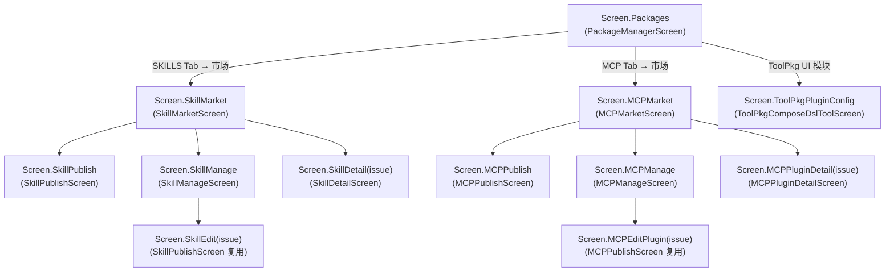
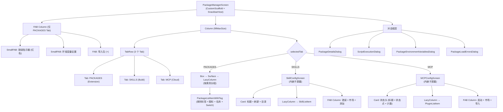

# Screen.Packages 页面结构

本文档详细描述 `Screen.Packages` 的完整 UI 组件树、布局层次和交互状态。

## 一、总体架构

`Screen.Packages` 是包管理入口页面，包含三个 Tab：**PACKAGES（工具包）**、**SKILLS（技能包）** 和 **MCP（MCP 插件）**。每个 Tab 内嵌独立的子组件/子屏幕，SKILLS 和 MCP Tab 还各自有市场、管理、发布等子页面导航。

### 入口链路

```
MainActivity (NavItem.Packages)
  → OperitApp (导航状态管理)
    → AppContent (TopAppBar + Crossfade容器)
      → Screen.Packages.Content()            [OperitScreens.kt]
        → PackageManagerScreen()             [PackageManagerScreen.kt]
```

### 导航属性

| 属性 | 值 |
|------|------|
| 路由 | `NavItem.Packages` |
| 图标 | `Icons.Default.Extension` |
| 导航组 | AI Features |
| 是否叶子节点 | 否（有多个子页面） |
| Crossfade 动画 | 参与 (默认) |

---

## 二、页面导航关系



所有子页面通过 `parentScreen` 指定返回目标，`navItem` 统一为 `NavItem.Packages` 保持侧栏高亮。

---

## 三、状态管理

### 3.1 PackageManagerScreen（无 ViewModel，全局部状态）

| 状态 | 类型 | 说明 |
|------|------|------|
| `availablePackages` | `Map<String, ToolPackage>` | 所有可用工具包 |
| `importedPackages` | `List<String>` | 已导入的包名列表 (后端真实值) |
| `visibleImportedPackages` | `List<String>` | 乐观更新的导入状态 |
| `isLoading` | `Boolean` | 加载指示器 |
| `selectedPackage` | `String?` | 当前查看详情的包名 |
| `showDetails` | `Boolean` | 详情弹窗可见 |
| `selectedTab` | `PackageTab` (rememberSaveable) | 当前 Tab (PACKAGES/SKILLS/MCP) |
| `showEnvDialog` | `Boolean` | 环境变量弹窗 |
| `envVariables` | `Map<String,String>` | 环境变量编辑值 |
| `packageLoadErrors` | `Map<String,String>` | 包加载错误集合 |
| `showScriptExecution` | `Boolean` | 脚本执行弹窗 |
| `selectedTool` | `PackageTool?` | 当前执行的工具 |
| `importErrorMessage` | `String?` | 导入错误消息 |

**注意**：PackageManagerScreen 没有 ViewModel，直接通过单例 `PackageManager` 操作数据。

### 3.2 MCPConfigScreen（双 ViewModel）

- **MCPViewModel**：安装/卸载进度、服务器操作、ZIP URI
- **MCPDeployViewModel**：部署生命周期、命令、输出、环境变量

关键 StateFlow：`serverStatusMap`, `installProgress`, `mcpConfigSnapshot`, `deploymentStatus`, `pluginToolsMap`

**插件排序策略**：先按 启用+已加载 状态排序，再按名称；首次工具加载成功后锁定排序 (`lockedPluginOrder`) 防止列表跳动。

### 3.3 SkillConfigScreen（纯局部状态）

- `skills: Map<String, SkillPackage>`, `isLoading`, `isImporting`
- 导入弹窗：`showImportDialog`, `importTabIndex`, `repoUrlInput`, `zipUri`, `manualSkillId/Description/Content`

---

## 四、组件树



---

## 五、PACKAGES Tab 详解

### 5.1 列表结构

按类别分组的包列表：

```
Surface (surfaceVariant bg) → LazyColumn
└── [forEach package, 按 category 排序]
    PackageListItemWithTag
    ├── [首个该类别项] Row: 类别标签
    │   ├── ToolPkg: 药丸形 Surface (Apps图标 + "ToolPkg" 文字)
    │   └── 其他: 3dp×12dp 竖线 + 文本标签
    └── Surface (clickable → 打开详情) → Row
        ├── Icon (20dp, 按类别不同)
        │   ├── Automatic → AutoMode
        │   ├── Experimental → Science
        │   ├── Draw → Palette
        │   ├── ToolPkg → Apps
        │   ├── Widget → Widgets
        │   └── Other → Extension
        ├── Column (weight=1f)
        │   ├── Text (displayName)
        │   └── Text (description, 2行)
        └── Switch (scale=0.8f, 导入/移除)
```

### 5.2 乐观更新机制

Switch 切换时先更新 `visibleImportedPackages` 显示即时反馈，后台异步调用 `packageManager.importPackage/removePackage`，失败时回滚 UI 状态。

### 5.3 PackageDetailsDialog

```
Dialog → Surface (maxHeight=600dp, 圆角16dp)
├── Header: Extension 图标 + 名称 + ID + builtin/external 标签
├── 描述文本
├── [ToolPkg 包]
│   ├── Card: 版本/资源数/UI模块数
│   ├── ToolPkgPluginConfigCard (UI 模块列表 → 跳转 ToolPkgPluginConfig)
│   └── LazyColumn: 子包列表 (名称 + Switch)
├── [有 States 的包]
│   ├── ScrollableTabRow (Default + 各 State 名)
│   └── LazyColumn: ToolCard 列表
├── [普通包]
│   └── LazyColumn: ToolCard 列表
└── ToolCard
    ├── PlayArrow 图标 + 工具名 + 描述 + 完整ID
    ├── "Run" FilledTonalButton
    └── FlowRow: 参数 Chip (最多3个 + "+N")
```

---

## 六、SKILLS Tab 详解

### 6.1 SkillConfigScreen 结构

```
Box
├── Column
│   ├── Card: "Skills" 标题 + Refresh 按钮 + 目录路径
│   └── LazyColumn → SkillListItem
│       └── Surface (圆角14dp) → Row
│           ├── 3dp×22dp 竖线 (primary 色)
│           ├── Build 图标 (28dp)
│           ├── Column: 名称 + 描述
│           └── Switch (scale=0.8f, AI 可见性)
└── Column (Alignment.BottomEnd)
    ├── SmallFAB: 错误指示器
    ├── FAB: Store 图标 → SkillMarket
    └── FAB: Add 图标 → 导入弹窗
```

### 6.2 导入弹窗 (3 个 Tab)

| Tab | 内容 | 导入方式 |
|-----|------|----------|
| Repo | URL 输入框 + 跳转市场链接 | `skillRepository.importSkillFromGitHubRepo(url)` |
| ZIP | 只读路径框 + 文件选择按钮 | 拷贝到 cache → `skillRepository.importSkillFromZip(file)` |
| Direct | ID + 描述 + 内容输入框 + 附件选择 | `skillRepository.importSkillFromDirectInput(...)` |

---

## 七、MCP Tab 详解

### 7.1 MCPConfigScreen 结构

```
CustomScaffold
├── FAB Column
│   ├── FAB: 启动插件服务
│   ├── FAB: MCP 市场 → MCPMarket
│   └── FAB: 导入/连接
└── LazyColumn
    ├── item: Card (状态头)
    │   ├── "MCP Plugins" 标题
    │   └── 状态点 (颜色) + 计数 "N/M"
    │       ├── 全部成功: Green
    │       ├── 部分成功: Orange
    │       ├── 全部失败: Red
    │       └── 无启用: Gray
    └── items: PluginListItem
        ├── Card (1dp elevation)
        │   ├── Row: 28dp 图标 + [可选]绿点 + 名称列 + 状态标签 + Switch
        │   │   状态标签: "Official" / "Remote" / "Deployed" / "Invalid Config"
        │   ├── Box: LazyRow 工具名 Chip (最多5个 + "+N")
        │   └── Row: Deploy/Redeploy + Edit OutlinedButton
```

### 7.2 导入弹窗 (4 个 Tab)

| Tab | 内容 | 导入方式 |
|-----|------|----------|
| Repo | GitHub URL 输入 | `viewModel.installServerWithObject(server)` |
| ZIP | 路径 + 文件选择 | `viewModel.installServerFromZip(server, zipPath)` |
| Remote | Endpoint + 连接类型下拉 + Bearer Token + 自定义 Headers | `viewModel.addRemoteServer(server)` |
| Config | JSON 多行输入 + 打开文件 | `mcpLocalServer.mergeConfigFromJson(json)` |

### 7.3 部署流程

```
Deploy 按钮 → MCPDeployConfirmDialog
  ├── "Confirm" → deployViewModel.deployPlugin(pluginId) → MCPDeployProgressDialog
  └── "Customize" → MCPCommandsEditDialog (编辑启动命令)
      → deployViewModel.deployPluginWithCommands(pluginId, commands) → MCPDeployProgressDialog
```

---

## 八、对话框清单

### PackageManagerScreen 层

| 对话框 | 触发条件 | 功能 |
|--------|----------|------|
| **PackageDetailsDialog** | 点击包列表项 | 包详情 + 工具列表 + 运行 + 子包管理 |
| **ScriptExecutionDialog** | 详情内 "Run" 按钮 | 工具脚本执行 |
| **PackageEnvironmentVariablesDialog** | FAB 设置按钮 | 环境变量编辑 (按包分组, stickyHeader) |
| **PackageLoadErrorsDialog** | FAB 错误指示器 | 包加载错误列表 |
| **ErrorDialog** | 导入失败 | 通用错误提示 |
| **SubpackageToolsDialog** | 详情内点击子包 | 嵌套弹窗：子包工具列表 |
| **删除确认 AlertDialog** | 详情内删除按钮 | 确认删除包 |

### SkillConfigScreen 层

| 对话框 | 触发条件 | 功能 |
|--------|----------|------|
| **导入弹窗** | FAB Add | 3-Tab 导入表单 (Repo/ZIP/Direct) |
| **SkillDetailDialog** | 点击技能项 | 技能详情 + 目录预览 + Markdown 内容 |
| **SkillLoadErrorsDialog** | 错误 FAB | 技能加载错误列表 |

### MCPConfigScreen 层

| 对话框 | 触发条件 | 功能 |
|--------|----------|------|
| **导入弹窗** | FAB Import | 4-Tab 导入表单 (Repo/ZIP/Remote/Config) |
| **MCPServerDetailsDialog** | 点击插件项 | 插件元数据详情 |
| **MCPPackageDetailsDialog** | 点击工具行 | 工具列表详情 |
| **MCPDeployConfirmDialog** | Deploy 按钮 | 部署确认 (Confirm/Customize) |
| **MCPCommandsEditDialog** | Customize 按钮 | 编辑部署启动命令 |
| **RemoteServerEditDialog** | Edit 按钮 (远程) | 编辑远程服务器配置 |
| **MCPDeployProgressDialog** | 部署进行中 | 部署进度 + 输出日志 |
| **MCPInstallProgressDialog** | 安装进行中 | 安装进度 |
| **FilePickerDialog** | ZIP Tab 文件选择 | 文件路径选择 |

---

## 九、数据模型

### 工具包系统

| 模型 | 关键字段 |
|------|----------|
| `ToolPackage` | name, displayName, description, category, tools, states, env, isBuiltIn |
| `PackageTool` | name, description, script, parameters |
| `EnvVar` | name, description, required, defaultValue |
| `ToolResult` | 脚本执行结果 |
| `ToolPkgContainerDetails` | displayName, version, resourceCount, uiModuleCount, subpackages |

### 技能系统

| 模型 | 关键字段 |
|------|----------|
| `SkillPackage` | name, description, directory, skillFile |
| `SkillDetailDialogData` | skillContent, directoryPath, fileCount, directoryPreview |

### MCP 系统

| 模型 | 关键字段 |
|------|----------|
| `PluginMetadata` | id, name, description, type(local/remote), endpoint, connectionType, bearerToken |
| `MCPConfig` | mcpServers, pluginMetadata |
| `InstallProgress` | sealed: Preparing, Downloading, Installing, Configuring, Finished |
| `InstallResult` | sealed: Success(pluginPath), Error(message) |
| `DeploymentStatus` | sealed: NotStarted, InProgress, Success, Error |

### 市场系统 (GitHub Issues)

| 模型 | 关键字段 |
|------|----------|
| `GitHubIssue` | id, number, title, body, state, labels, user |
| `GitHubComment` | 评论内容 |
| `GitHubReaction` | content (如 "+1"), user |

### Tab 枚举

```kotlin
enum class PackageTab { PACKAGES, SKILLS, MCP }
```

---

## 十、用户交互 → 动作映射

### PACKAGES Tab

| 交互 | 执行动作 |
|------|----------|
| 包项点击 | 打开 PackageDetailsDialog |
| Switch 切换 | 乐观更新 → `packageManager.importPackage/removePackage` |
| FAB Add | 系统文件选择器 → `packageManager.importPackageFromExternalStorage` |
| FAB Settings | 打开环境变量弹窗 |
| 详情内 Run | 打开 ScriptExecutionDialog |
| 详情内 ToolPkg UI 模块 | 跳转 `Screen.ToolPkgPluginConfig` |

### SKILLS Tab

| 交互 | 执行动作 |
|------|----------|
| 技能项点击 | 加载详情 → 打开 SkillDetailDialog |
| Switch 切换 | `skillVisibilityPreferences.setSkillVisibleToAi(name, checked)` |
| Store FAB | 跳转 `Screen.SkillMarket` |
| Add FAB | 打开 3-Tab 导入弹窗 |
| 导入 Repo | `skillRepository.importSkillFromGitHubRepo(url)` |
| 导入 ZIP | 拷贝到 cache → `skillRepository.importSkillFromZip(file)` |

### MCP Tab

| 交互 | 执行动作 |
|------|----------|
| 插件项点击 | 打开 MCPServerDetailsDialog |
| 工具行点击 | 打开 MCPPackageDetailsDialog |
| Switch 切换 | `mcpLocalServer.setServerEnabled(pluginId, checked)` |
| Deploy 按钮 | 打开部署确认 → 部署/自定义命令 |
| Edit 按钮 (远程) | 打开 RemoteServerEditDialog |
| 启动 FAB | `pluginLoadingState.initializeMCPServer(context)` |
| Market FAB | 跳转 `Screen.MCPMarket` |
| Import FAB | 打开 4-Tab 导入弹窗 |

---

## 十一、架构要点

1. **无 ViewModel 入口**：PackageManagerScreen 本身没有 ViewModel，直接使用 `PackageManager` 单例操作数据，所有状态为局部 `remember`。

2. **三 Tab 内嵌子屏幕**：SKILLS Tab 和 MCP Tab 各自内嵌独立的 Composable 子屏幕（`SkillConfigScreen`、`MCPConfigScreen`），拥有各自的状态管理和 ViewModel。

3. **乐观更新**：PACKAGES Tab 的 Switch 切换采用乐观更新策略——先更新 `visibleImportedPackages` 显示即时反馈，后台异步执行实际操作，失败时回滚。

4. **插件排序锁定**：MCP Tab 首次工具加载成功后锁定排序顺序 (`lockedPluginOrder`)，防止异步状态更新导致列表跳动。

5. **市场 ViewModel 共享模式**：SkillMarket 和 MCPMarket 的 ViewModel 结构一致——GitHub Issues 数据源 + 350ms 防抖搜索 + 分页加载 + 评论/反应缓存。

6. **发布/编辑复用**：`SkillPublishScreen` 和 `MCPPublishScreen` 各自通过传入 `editingIssue` 参数复用为编辑页面。

---

## 十二、核心文件清单

| 文件 | 路径 (相对于 `ui/features/packages/`) | 职责 |
|------|------|------|
| **PackageManagerScreen** | `screens/PackageManagerScreen.kt` | 页面入口，三 Tab 编排 |
| **SkillConfigScreen** | `screens/skill/SkillConfigScreen.kt` | SKILLS Tab 子屏幕 |
| **MCPConfigScreen** | `screens/mcp/MCPConfigScreen.kt` | MCP Tab 子屏幕 |
| **SkillMarketScreen** | `screens/SkillMarketScreen.kt` | 技能市场 |
| **MCPMarketScreen** | `screens/MCPMarketScreen.kt` | MCP 市场 |
| **SkillPublishScreen** | `screens/SkillPublishScreen.kt` | 技能发布/编辑 |
| **MCPPublishScreen** | `screens/MCPPublishScreen.kt` | MCP 发布/编辑 |
| **SkillManageScreen** | `screens/SkillManageScreen.kt` | 技能管理 |
| **MCPManageScreen** | `screens/MCPManageScreen.kt` | MCP 管理 |
| **SkillDetailScreen** | `screens/SkillDetailScreen.kt` | 技能详情 |
| **MCPPluginDetailScreen** | `screens/MCPPluginDetailScreen.kt` | MCP 插件详情 |
| **PackageDetailsDialog** | `dialogs/PackageDetailsDialog.kt` | 包详情弹窗 |
| **MCPDeployConfirmDialog** | `dialogs/MCPDeployConfirmDialog.kt` | 部署确认弹窗 |
| **MCPViewModel** | `screens/mcp/viewmodel/MCPViewModel.kt` | MCP 安装/卸载 ViewModel |
| **MCPDeployViewModel** | `screens/mcp/viewmodel/MCPDeployViewModel.kt` | MCP 部署 ViewModel |
| **SkillMarketViewModel** | `screens/skill/viewmodel/SkillMarketViewModel.kt` | 技能市场 ViewModel |
| **MCPMarketViewModel** | `screens/mcp/viewmodel/MCPMarketViewModel.kt` | MCP 市场 ViewModel |
