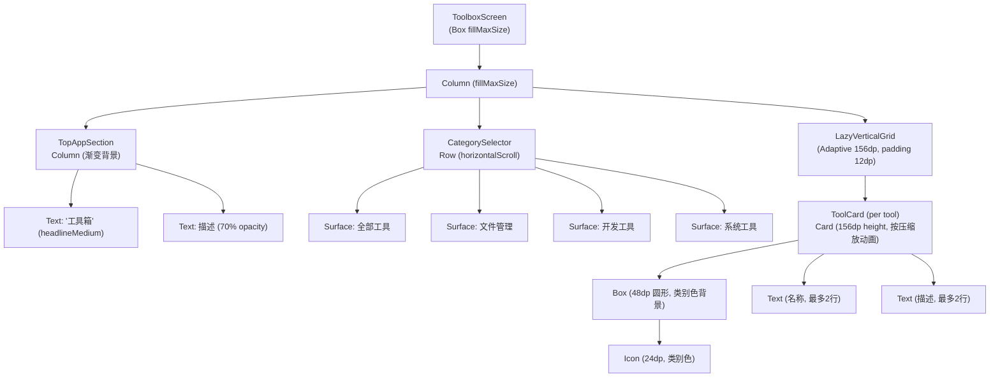

# Screen.Toolbox 页面结构

本文档详细描述 `Screen.Toolbox` 的完整 UI 组件树、布局层次和交互状态。

## 一、总体架构

`Screen.Toolbox` 是工具箱入口页面，以**自适应网格**展示所有可用工具。支持按类别筛选，包含 18 个静态工具和动态 ToolPkg 工具。每个工具卡片点击后导航到对应的子页面。

### 入口链路

```
MainActivity (NavItem.Toolbox)
  → OperitApp (导航状态管理)
    → AppContent (TopAppBar + Crossfade容器)
      → Screen.Toolbox.Content()             [OperitScreens.kt]
        → ToolboxScreen(19个 onXxxSelected 回调)  [ToolboxScreen.kt]
```

### 导航属性

| 属性 | 值 |
|------|------|
| 路由 | `NavItem.Toolbox` |
| 图标 | `Icons.Default.Build` |
| 导航组 | Tools |
| 是否叶子节点 | 否（18+ 个子页面） |
| Crossfade 动画 | 参与 (默认) |

---

## 二、状态管理

无 ViewModel，全部为局部状态：

| 状态 | 类型 | 说明 |
|------|------|------|
| `dynamicScriptDefinitions` | `List<ToolboxScriptDefinition>` | IO 线程加载的 ToolPkg 动态工具定义 |
| `selectedCategory` | `ToolCategory` | 当前选中的类别筛选 (默认 ALL) |
| `isPressed` (per ToolCard) | `Boolean` | 卡片按压缩放动画状态 |

工具列表在每次重组时内联构建：`tools`(静态) + `dynamicTools`(ToolPkg) → `allTools` → 按 `selectedCategory` 过滤 → `filteredTools`。

---

## 三、组件树



---

## 四、工具类别

| 枚举值 | 显示名 | 图标圆形背景色 | 图标着色 |
|--------|--------|---------------|----------|
| `ALL` | 全部工具 | primaryContainer | primary |
| `FILE_MANAGEMENT` | 文件管理 | primaryContainer | primary |
| `DEVELOPMENT` | 开发工具 | tertiaryContainer | tertiary |
| `SYSTEM` | 系统工具 | secondaryContainer | secondary |

**CategorySelector**：水平可滚动的药丸形 Chip 行，选中态 `primaryContainer` 背景 + 阴影，未选中态 `surface` 背景 + 70% opacity 文字。

---

## 五、完整工具列表

### 5.1 静态工具 (18个)

| # | 名称 | 图标 | 类别 | 目标页面 |
|---|------|------|------|----------|
| 1 | 工具测试中心 | BuildCircle | DEVELOPMENT | Screen.ToolTester |
| 2 | 文件管理器 | Folder | FILE_MANAGEMENT | Screen.FileManager |
| 3 | 文本转语音 | RecordVoiceOver | SYSTEM | Screen.TextToSpeech |
| 4 | 语音识别 | Mic | SYSTEM | Screen.SpeechToText |
| 5 | 应用权限管理 | Security | SYSTEM | Screen.AppPermissions |
| 6 | 用户协议 | Policy | SYSTEM | Screen.Agreement |
| 7 | 默认助手设置 | Assistant | SYSTEM | Screen.DefaultAssistantGuide |
| 8 | 命令终端 | Terminal | DEVELOPMENT | Screen.Terminal |
| 9 | UI调试工具 | DeviceHub | DEVELOPMENT | Screen.UIDebugger |
| 10 | FFmpeg工具箱 | VideoSettings | DEVELOPMENT | Screen.FFmpegToolbox |
| 11 | 命令执行器 | Code | DEVELOPMENT | Screen.ShellExecutor |
| 12 | 日志查看器 | DataObject | DEVELOPMENT | Screen.Logcat |
| 13 | SQL查看器 | TableView | DEVELOPMENT | Screen.SqlViewer |
| 14 | 获取密钥 | Token | SYSTEM | Screen.TokenConfig |
| 15 | 解除幻象进程限制 | LockOpen | SYSTEM | Screen.ProcessLimitRemover |
| 16 | HTML打包器 | Html | DEVELOPMENT | Screen.HtmlPackager |
| 17 | AutoGLM 一键配置 | AutoMode | DEVELOPMENT | Screen.AutoGlmOneClick |
| 18 | AutoGLM 执行 | AutoMode | DEVELOPMENT | Screen.AutoGlmTool |

### 5.2 动态 ToolPkg 工具

通过 `ToolboxScriptPluginRegistry` 插件系统动态加载：

```
LaunchedEffect(configuration) → IO 线程
  → ToolboxScriptPluginRegistry.createDefinitions()
    → ToolPkgToolboxScriptPlugin.createDefinitions()
      → PackageManager.getToolPkgToolboxUiModules(runtime = COMPOSE_DSL)
      → 去重 (containerPackageName:uiModuleId:runtime)
      → 按 title → containerPackageName → uiModuleId 排序
```

动态工具统一属性：
- 图标：`Icons.Default.Extension`
- 类别：`DEVELOPMENT`
- 导航：`Screen.ToolPkgComposeDsl(containerPackageName, uiModuleId, title)`

---

## 六、ToolCard 交互

```
点击 ToolCard
  → isPressed = true (scale: 1f → 0.95f, 100ms tween)
  → delay(100ms) 等待动画
  → tool.onClick() (执行导航回调)
  → isPressed = false (scale: 0.95f → 1f, 200ms tween)
```

卡片结构：
```
Card (fillMaxWidth, 156dp height, graphicsLayer scale 动画)
└── Column (12dp padding, 居中, 8dp spacing)
    ├── Box (48dp 圆形, 类别色背景, 8dp padding)
    │   └── Icon (24dp, 类别色着色)
    ├── Text (名称, bodyMedium/Bold, 最多2行, 省略号)
    └── Text (描述, bodySmall, onSurfaceVariant, 最多2行, 省略号)
```

---

## 七、子页面导航关系

所有子页面通过回调 lambda 导航，`ToolboxScreen` 不依赖 `Screen` 或 `OperitRouter`。

```mermaid
graph TD
    TOOLBOX["Screen.Toolbox<br/>(ToolboxScreen)"]

    TOOLBOX --> FM["Screen.FileManager<br/>文件管理器"]
    TOOLBOX --> TERM["Screen.Terminal<br/>命令终端"]
    TOOLBOX --> SHELL["Screen.ShellExecutor<br/>命令执行器"]
    TOOLBOX --> UID["Screen.UIDebugger<br/>UI调试工具"]
    TOOLBOX --> LOG["Screen.Logcat<br/>日志查看器"]
    TOOLBOX --> SQL["Screen.SqlViewer<br/>SQL查看器"]
    TOOLBOX --> FF["Screen.FFmpegToolbox<br/>FFmpeg工具箱"]
    TOOLBOX --> TTS["Screen.TextToSpeech<br/>文本转语音"]
    TOOLBOX --> STT["Screen.SpeechToText<br/>语音识别"]
    TOOLBOX --> TEST["Screen.ToolTester<br/>工具测试中心"]
    TOOLBOX --> GUIDE["Screen.DefaultAssistantGuide<br/>默认助手设置"]
    TOOLBOX --> PROC["Screen.ProcessLimitRemover<br/>进程限制解除"]
    TOOLBOX --> HTML["Screen.HtmlPackager<br/>HTML打包器"]
    TOOLBOX --> AUTOGLM1["Screen.AutoGlmOneClick<br/>AutoGLM一键配置"]
    TOOLBOX --> AUTOGLM2["Screen.AutoGlmTool<br/>AutoGLM执行"]
    TOOLBOX --> PERM["Screen.AppPermissions<br/>应用权限管理"]
    TOOLBOX --> TOKEN["Screen.TokenConfig<br/>获取密钥"]
    TOOLBOX --> AGREE["Screen.Agreement<br/>用户协议"]
    TOOLBOX --> DSL["Screen.ToolPkgComposeDsl<br/>(动态 ToolPkg 工具)"]
```



所有子页面设置 `parentScreen = Toolbox, navItem = NavItem.Toolbox`，返回导航指向 Toolbox，侧栏保持高亮。

**特殊情况**：
- `Screen.TokenConfig` 的 `parentScreen = AiChat`，从 Toolbox 进入后返回会到 AiChat 而非 Toolbox
- `Screen.TerminalSetup` 和 `Screen.TerminalAutoConfig` 不在工具网格中，仅可通过程序化导航访问
- `Screen.MarkdownDemo` 仅定义了 Screen 对象，无对应工具卡片

---

## 八、ToolPkgComposeDsl 动态渲染

动态 ToolPkg 工具的渲染流程：

### 8.1 渲染流程

```
ToolPkgComposeDslToolScreen
  → LaunchedEffect(containerPackageName, uiModuleId)
    → render() [获取 renderMutex]
      → PackageManager 加载脚本 (IO 线程)
      → jsEngine.executeComposeDslScript() 执行 JS/DSL
      → ToolPkgComposeDslParser.parseRenderResult() 解析节点树
      → [如果根节点有 onLoad action] → dispatchAction() 自动触发
```

### 8.2 UI 状态

| 状态 | 显示 |
|------|------|
| Loading | 居中 CircularProgressIndicator |
| Error | 居中错误文字 + "Retry" 按钮 |
| Success | 渲染 DSL 节点树 (renderComposeDslNode) |
| Dispatching | 顶部 LinearProgressIndicator 叠加层 |

### 8.3 节点渲染

- 类型标记规范化 → 查找 `composeDslGeneratedNodeRendererRegistry` (自动生成)
- `"canvas"` 类型走 `renderCanvasNode()` 特殊处理
- 未知类型降级为 `Text("Unsupported node: ${node.type}")`
- 如果根节点非 `LazyColumn`，外层添加 `verticalScroll`

支持的 DSL 节点类型包括：Column, Row, Box, Spacer, LazyColumn, LazyRow, Text, TextField, Switch, Checkbox, Button, IconButton, Card, Surface, Icon, Divider, FloatingActionButton, Scaffold, Canvas 等 50+ 种 Material3 组件。

---

## 九、对话框清单

ToolboxScreen 本身**无对话框**。所有对话框均在各子页面内部实现。

---

## 十、架构要点

1. **无 ViewModel**：所有状态为局部 `remember`，工具列表在每次重组时内联构建。

2. **导航解耦**：`ToolboxScreen` 通过 19 个回调 lambda 导航，不依赖 `Screen` 或路由系统。导航知识集中在 `Screen.Toolbox.Content()` 中。

3. **插件式动态工具**：`ToolboxScriptPluginRegistry` 支持注册任意插件注入工具定义，内置 `ToolPkgToolboxScriptPlugin` 查询已安装 ToolPkg 包的 Compose DSL UI 模块。

4. **DSL 渲染引擎**：ToolPkg 动态工具通过 JS 引擎执行 DSL 脚本，解析为节点树后用自动生成的渲染注册表映射到 Compose 组件。支持 50+ 种 Material3 组件类型。

5. **按压动画**：ToolCard 使用 `animateFloatAsState` + 协程 delay 实现 0.95x 缩放按压反馈，而非 `Indication`。

---

## 十一、核心文件清单

| 文件 | 路径 | 职责 |
|------|------|------|
| **ToolboxScreen** | `ui/features/toolbox/screens/ToolboxScreen.kt` | 页面入口 + 工具网格 + 子页面包装器 |
| **OperitScreens** | `ui/main/screens/OperitScreens.kt` | Screen 定义 + 导航回调绑定 |
| **ToolboxScriptPluginRegistry** | `plugins/toolbox/ToolboxScriptPluginRegistry.kt` | 动态工具插件注册表 |
| **ToolboxPlugin** | `plugins/toolbox/ToolboxPlugin.kt` | 内置 ToolPkg 插件注册 |
| **ToolPkgComposeDslScreen** | `ui/common/composedsl/ToolPkgComposeDslScreen.kt` | DSL 动态渲染引擎 |
| **ToolPkgComposeDslGeneratedRegistry** | `ui/common/composedsl/ToolPkgComposeDslGeneratedRegistry.kt` | 自动生成的节点渲染注册表 |
