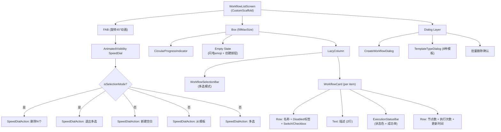

# Screen.Workflow 页面结构

本文档详细描述 `Screen.Workflow` 和 `Screen.WorkflowDetail` 的完整 UI 组件树、布局层次和交互状态。

## 一、总体架构

`Screen.Workflow` 是工作流管理入口，采用**列表-详情**两级结构。列表页展示所有工作流及其执行状态，详情页提供可视化的**网格画布（Grid Canvas）**用于编辑工作流节点和连接。支持 8 种预置模板、5 种节点类型、实时执行状态可视化。

### 入口链路

```
列表页:
MainActivity (NavItem.Workflow)
  → OperitApp → AppContent
    → Screen.Workflow.Content()           [OperitScreens.kt]
      → WorkflowListScreen()             [WorkflowListScreen.kt]

详情页:
WorkflowListScreen → 点击/创建工作流
  → navigateTo(Screen.WorkflowDetail(workflowId))
    → WorkflowDetailScreen(workflowId)   [WorkflowDetailScreen.kt]
```

### 导航属性

| 属性 | Screen.Workflow | Screen.WorkflowDetail |
|------|------|------|
| 路由 | `NavItem.Workflow` | 无独立 NavItem |
| 图标 | `Icons.Default.AccountTree` | — |
| parentScreen | null (主导航) | Workflow |
| 参数 | 无 | `workflowId: String` |

---

## 二、数据模型

### 2.1 核心模型

**Workflow**：
```
id, name, description, enabled
nodes: List<WorkflowNode>, connections: List<WorkflowNodeConnection>
createdAt, updatedAt
lastExecutionTime, lastExecutionStatus: ExecutionStatus?
totalExecutions, successfulExecutions, failedExecutions
```

**WorkflowNode** (sealed class)：

| 子类型 | type | 关键字段 | 颜色 |
|--------|------|----------|------|
| TriggerNode | "trigger" | triggerType, triggerConfig | 绿色 #4CAF50 |
| ExecuteNode | "execute" | actionType, actionConfig, jsCode? | 蓝色 #2196F3 |
| ConditionNode | "condition" | left, operator, right | 橙色 #FF9800 |
| LogicNode | "logic" | operator (AND/OR) | 紫色 #7E57C2 |
| ExtractNode | "extract" | source, mode, expression, ... | 青色 #009688 |

所有节点共有：`id, type, name, description, position: NodePosition(x, y)`

**WorkflowNodeConnection**：`id, sourceNodeId, targetNodeId, condition: String?`

连接条件语义：
- `null`/空：无条件（或 Condition/Logic 的 true 分支）
- `"false"`：false 分支
- `"on_success"` / `"on_error"`：成功/失败分支
- 其他字符串：正则匹配源节点结果

### 2.2 执行模型

**WorkflowExecutionRecord**：`runId, workflowId, workflowName, startedAt, finishedAt, success, message, logs`

**WorkflowExecutionLogEntry**：`timestamp, level(DEBUG/WARN/ERROR), message, nodeId?, nodeName?`

**ExecutionStatus**：`SUCCESS, FAILED, RUNNING`

### 2.3 节点参数

**ParameterValue** (sealed class)：
- `StaticValue(value: String)` — 静态值
- `NodeReference(nodeId: String)` — 引用另一个节点的输出

---

## 三、状态管理 (WorkflowViewModel)

`AndroidViewModel`，列表页和详情页**共享同一实例**。

### 3.1 核心状态

| 状态 | 类型 | 说明 |
|------|------|------|
| `workflows` | `List<Workflow>` (mutableStateOf) | 所有工作流列表 |
| `isLoading` | `Boolean` | 加载指示器 |
| `error` | `String?` | 错误消息 |
| `currentWorkflow` | `Workflow?` | 详情页当前工作流 |
| `latestExecutionRecord` | `WorkflowExecutionRecord?` | 最近执行记录 |
| `nodeExecutionStates` | `StateFlow<Map<String, NodeExecutionState>>` | 实时节点执行状态 |
| `runningWorkflowIds` | `StateFlow<Set<String>>` | 正在运行的工作流集合 |

### 3.2 实时更新

ViewModel init 订阅 `WorkflowRepository.workflowUpdateEvents` (SharedFlow)，每当 Repository 发出事件时自动刷新列表和当前工作流。

### 3.3 模板工厂

提供 8 种预置模板方法：
1. Intent 聊天广播 (8 节点)
2. 聊天模板 (6 节点)
3. 条件模板 (6 节点)
4. 逻辑 AND 模板 (8 节点)
5. 逻辑 OR 模板 (8 节点)
6. 提取模板 (9 节点)
7. 错误分支模板 (4 节点)
8. 语音触发模板 (2 节点)

模板节点使用 `templateNodePosition(index)` 自动布局：每列 5 个节点，列间距 720dp，行间距 420dp。

---

## 四、WorkflowListScreen 组件树



### 4.1 WorkflowCard

```
Card (outline 边框, 选中态 primaryContainer 30%)
└── Column (18dp padding)
    ├── Row: 名称 (weight=1f) + [!enabled]"Disabled"标签 + Switch/Checkbox
    ├── [有描述] Text (bodySmall, 2行, 70% alpha)
    ├── [有执行记录] ExecutionStatusBar
    │   └── Row (状态色 8% alpha 背景)
    │       ├── 图标 + 状态文本 + 相对时间
    │       └── 成功率百分比 (≥80% tertiary, ≥50% primary, <50% error)
    └── Row: 节点数 + 执行次数 + 更新日期
```

### 4.2 多选模式

```
WorkflowSelectionBar
└── Card (primaryContainer 35%)
    └── Row: "N selected" + [未全选]"Select all" + [有选中]"Clear"
```

### 4.3 模板选择弹窗

```
TemplateTypeDialog
└── Column
    └── [8个] TemplateTypeItem
        └── Card (clickable) → Row
            ├── PlayCircle Icon (primaryContainer 圆形)
            └── Column: 标题 + 副标题
```

---

## 五、WorkflowDetailScreen 组件树

```mermaid
graph TD
    DETAIL_ROOT["WorkflowDetailScreen<br/>(CustomScaffold)"]

    DETAIL_ROOT --> DETAIL_FAB["FAB + SpeedDial"]
    DETAIL_ROOT --> DETAIL_CONTENT["Box (fillMaxSize)"]
    DETAIL_ROOT --> DETAIL_DIALOGS["Dialog Layer (10+ 弹窗)"]

    DETAIL_FAB --> SD_TRIGGER["SpeedDialAction: 触发/取消"]
    DETAIL_FAB --> SD_LOGS["SpeedDialAction: 查看日志"]
    DETAIL_FAB --> SD_ADD["SpeedDialAction: 添加节点"]
    DETAIL_FAB --> SD_EDIT["SpeedDialAction: 编辑工作流"]
    DETAIL_FAB --> SD_DEL["SpeedDialAction: 删除"]

    DETAIL_CONTENT --> EMPTY_NODE["EmptyNodeCard<br/>(无节点时)"]
    DETAIL_CONTENT --> CANVAS["GridWorkflowCanvas<br/>(4000×3000dp 虚拟画布)"]

    CANVAS --> GRID_BG["点阵网格背景"]
    CANVAS --> REF_EDGES["参考边 (橙色虚线贝塞尔)<br/>节点参数引用关系"]
    CANVAS --> CONN_LINES["连接线 (彩色贝塞尔 + 箭头)<br/>执行流程"]
    CANVAS --> NODE_CARDS["DraggableNodeCard (per node)<br/>可拖拽节点卡片"]
    CANVAS --> SCALE_IND["缩放指示器 (右上角)"]

    DETAIL_DIALOGS --> DLG_EDIT_WF["EditWorkflowDialog"]
    DETAIL_DIALOGS --> DLG_DEL_WF["删除工作流确认"]
    DETAIL_DIALOGS --> DLG_RESULT["执行结果"]
    DETAIL_DIALOGS --> DLG_LOG["WorkflowExecutionLogDialog"]
    DETAIL_DIALOGS --> DLG_ERROR["错误弹窗"]
    DETAIL_DIALOGS --> DLG_ADD_NODE["NodeDialog (创建)"]
    DETAIL_DIALOGS --> DLG_EDIT_NODE["NodeDialog (编辑)"]
    DETAIL_DIALOGS --> DLG_DEL_NODE["删除节点确认"]
    DETAIL_DIALOGS --> DLG_ACTION_MENU["NodeActionMenuDialog"]
    DETAIL_DIALOGS --> DLG_CONN_MENU["ConnectionMenuDialog"]
```



---

## 六、GridWorkflowCanvas 详解

### 6.1 画布参数

| 参数 | 值 |
|------|------|
| 虚拟画布尺寸 | 4000dp × 3000dp |
| 网格单元大小 | 40dp |
| 节点尺寸 | 120dp × 80dp |
| 缩放范围 | 0.25x ~ 3.0x |

### 6.2 渲染层次 (从底到顶)

1. **点阵网格**：灰色圆点，按 cellSizePx 间隔绘制
2. **参考边**：橙色虚线贝塞尔曲线，表示节点间参数引用关系 (NodeReference)
3. **连接线**：彩色贝塞尔曲线 + 箭头，表示执行流程
   - 蓝色 = 默认/运行中
   - 绿色 = 成功
   - 红色 = 失败
   - 灰色虚线 = 未激活/跳过
   - 条件标签：中点绘制 "T"/"F"/正则前缀
4. **节点卡片**：`DraggableNodeCard` 通过 `Modifier.offset` 定位
5. **缩放指示器**：右上角 Card，scale ≠ 1f 或已平移时显示

### 6.3 手势交互

| 手势 | 效果 |
|------|------|
| 捏合/双指拖拽 | 缩放 (0.25x~3.0x) + 平移 |
| 双击 | 自动适配所有节点到视口 (fitViewportToNodes) |
| 拖拽节点 | 移动节点，释放时吸附到网格 |

### 6.4 自动适配

首次加载或节点集合变化时自动触发 `fitViewportToNodes()`：计算所有节点的边界框，选择最小缩放比使其适配视口，居中显示。

---

## 七、DraggableNodeCard 详解

### 7.1 节点类型样式

| 类型 | 主色 | 背景色 | 标签 |
|------|------|--------|------|
| Trigger | #4CAF50 (绿) | #E8F5E9 | "Trigger" |
| Execute | #2196F3 (蓝) | #E3F2FD | "Execute" |
| Condition | #FF9800 (橙) | #FFF3E0 | "Condition" |
| Logic | #7E57C2 (紫) | #F3E5F5 | "Logic" |
| Extract | #009688 (青) | #E0F2F1 | "Extract" |

### 7.2 执行状态视觉反馈

| 状态 | 边框 | 图标 | 文字 |
|------|------|------|------|
| Running | 蓝色 3dp | spinner | "Running" |
| Success | 绿色 3dp | ✓ | "Success" |
| Skipped | 灰色 3dp | ✗ | "Skipped" |
| Failed | 红色 3dp | ✗ | "Failed" |

### 7.3 手势逻辑

两个 `pointerInput` 协同工作：
- 长按检测：500ms delay → `onLongPress()` → 打开 NodeActionMenu
- 拖拽检测：标记 `hasDragged=true` → `onDrag(amount)` → 释放时 100ms 重置
- 互斥逻辑：拖拽或长按后不触发 onClick

---

## 八、NodeDialog 详解 (创建/编辑节点)

最复杂的组件，按节点类型动态切换 UI。

### 8.1 通用字段

- 节点类型选择器 (仅创建模式，编辑模式锁定)
- 名称 OutlinedTextField
- 描述 OutlinedTextField

### 8.2 Execute 节点编辑

```
actionType OutlinedTextField (工具名，带自动补全)
  → LaunchedEffect: 从 AIToolHandler/PackageManager 查询工具参数 Schema
  → 自动合并 Schema 到 actionConfigPairs

[forEach 参数]
  Row: 参数名 + 值输入框 + 🔗链接按钮(下拉选择节点引用) + 删除
  [有 Schema] Text: 类型 + required/optional + 描述 + 默认值

"Add parameter" 按钮
```

### 8.3 Trigger 节点编辑

| 触发类型 | 配置 |
|----------|------|
| manual | 无额外配置 |
| schedule | → ScheduleConfigDialog (interval/specific_time/cron) |
| tasker | `{"variable_name": "%evtprm()"}` |
| intent | `{"action": "com.example.MY_ACTION"}` |
| speech | `{"pattern": "...", "ignore_case": "true", ...}` |

### 8.4 Condition 节点编辑

```
左值: OutlinedTextField + 🔗节点引用选择
运算符: ExposedDropdownMenu (EQ/NE/GT/GTE/LT/LTE/CONTAINS/NOT_CONTAINS/IN/NOT_IN)
右值: OutlinedTextField + 🔗节点引用选择
```

### 8.5 Extract 节点编辑

| 提取模式 | 配置字段 |
|----------|----------|
| REGEX | 表达式 + 组索引 + 默认值 + 源选择 |
| JSON | JSON 路径 + 默认值 + 源选择 |
| SUB | 起始索引 + 长度 + 默认值 + 源选择 |
| CONCAT | 多项拼接列表 (静态/引用) + 源选择 |
| RANDOM_INT | useFixed 开关 + 固定值/最小最大值 |
| RANDOM_STRING | useFixed 开关 + 固定值/长度/字符集 |

---

## 九、对话框清单

### WorkflowListScreen

| 对话框 | 触发 | 功能 |
|--------|------|------|
| CreateWorkflowDialog | FAB "新建空白" | 名称 + 描述输入 |
| TemplateTypeDialog | FAB "从模板" | 8 种模板选择卡片 |
| 批量删除确认 | 多选模式 FAB "删除" | 确认删除 N 个工作流 |

### WorkflowDetailScreen

| 对话框 | 触发 | 功能 |
|--------|------|------|
| EditWorkflowDialog | FAB "编辑工作流" | 名称 + 描述 + enabled 开关 |
| 删除工作流确认 | FAB "删除" | 确认后返回列表 |
| 执行结果 | 触发/取消完成后 | 显示结果消息 |
| WorkflowExecutionLogDialog | FAB "查看日志" 或 节点日志 | 时间戳日志列表，可按节点过滤 |
| 错误弹窗 | viewModel.error | 显示错误 |
| NodeDialog (创建) | FAB "添加节点" | 5 种节点类型编辑表单 |
| NodeDialog (编辑) | 节点长按 → "编辑" | 同创建，但类型锁定 |
| 删除节点确认 | 节点长按 → "删除" | 确认删除节点及其连接 |
| NodeActionMenuDialog | 节点长按 | 编辑/查看日志/创建连接/删除 |
| ConnectionMenuDialog | 长按菜单 → "创建连接" | 现有连接管理 + 可连接目标列表 |
| ConnectionConditionDialog | 连接编辑图标 | 条件设置：默认/false/自定义正则 |
| ScheduleConfigDialog | Trigger 选择 schedule | interval/specific_time/cron 配置 |

---

## 十、用户交互 → 动作映射

### 列表页

| 交互 | 执行动作 |
|------|----------|
| 工作流卡片点击 | 导航到 `Screen.WorkflowDetail(id)` |
| Switch 切换 | `viewModel.setWorkflowEnabled(id, enabled)` (乐观更新) |
| FAB 新建 → 确认 | `viewModel.createWorkflow(name, desc)` → 导航到详情 |
| FAB 模板 → 选择 | `viewModel.createXxxTemplateWorkflow()` → 导航到详情 |
| 多选 → 删除 | `viewModel.deleteWorkflows(ids)` |

### 详情页

| 交互 | 执行动作 |
|------|----------|
| FAB 触发 | `viewModel.triggerWorkflow(id)` → 实时状态更新 |
| FAB 取消 | `viewModel.cancelWorkflow(id)` |
| 节点拖拽释放 | `viewModel.updateNodePosition(wf, nodeId, x, y)` 吸附网格 |
| 节点点击 | 打开 NodeDialog 编辑 |
| 节点长按 | 打开 NodeActionMenuDialog |
| 添加节点确认 | `viewModel.addNode(workflowId, node)` |
| 创建连接 | `viewModel.createConnection(wf, src, tgt)` |
| 编辑连接条件 | `viewModel.updateConnectionCondition(wf, connId, cond)` |
| 双击画布 | 自动适配视口 |

---

## 十一、架构要点

1. **共享 ViewModel**：列表页和详情页共享同一 `WorkflowViewModel` 实例，`currentWorkflow`、`nodeExecutionStates` 在两个页面间可见。

2. **实时执行可视化**：`triggerWorkflow` 通过回调流式更新 `nodeExecutionStates`，画布连接线和节点卡片边框实时变色反映执行状态。

3. **双类型边渲染**：画布同时渲染两种边——蓝色连接线表示执行流程，橙色虚线表示参数引用关系 (NodeReference)，互不混淆。

4. **网格吸附**：节点拖拽释放时自动吸附到 40dp 网格，保持视觉整齐。

5. **工具 Schema 自动补全**：Execute 节点编辑时从 `AIToolHandler` + `PackageManager` 实时查询工具参数 Schema，自动合并到参数列表。

6. **乐观更新**：列表页的 enabled Switch 采用乐观更新策略，失败时回滚。

7. **模板布局算法**：`templateNodePosition(index)` 按 5 行 × N 列自动排列，列距 720dp、行距 420dp。

---

## 十二、核心文件清单

| 文件 | 路径 (相对于 `ui/features/workflow/`) | 职责 |
|------|------|------|
| **WorkflowListScreen** | `screens/WorkflowListScreen.kt` | 列表页入口 + 卡片 + 多选 |
| **WorkflowDetailScreen** | `screens/WorkflowDetailScreen.kt` | 详情页 + NodeDialog |
| **WorkflowViewModel** | `viewmodel/WorkflowViewModel.kt` | 共享 ViewModel + CRUD + 执行 + 模板 |
| **GridWorkflowCanvas** | `components/GridWorkflowCanvas.kt` | 网格画布 + 节点/连接渲染 |
| **DraggableNodeCard** | `components/DraggableNodeCard.kt` | 可拖拽节点卡片 |
| **NodeActionMenu** | `components/NodeActionMenu.kt` | 节点长按上下文菜单 |
| **ConnectionMenu** | `components/ConnectionMenu.kt` | 连接管理弹窗 |
| **ScheduleConfigDialog** | `components/ScheduleConfigDialog.kt` | 定时触发配置 |
| **Workflow** | `data/model/Workflow.kt` | 数据模型 (节点/连接/参数) |
| **WorkflowExecutionLog** | `data/model/WorkflowExecutionLog.kt` | 执行记录模型 |
