# Screen.ShizukuCommands 页面结构

本文档详细描述 `Screen.ShizukuCommands` 的完整 UI 组件树、布局层次和交互状态。

## 一、总体架构

`Screen.ShizukuCommands` 是**统一权限管理与引导仪表盘**。页面提供 5 级权限等级选择器，展示各等级下的权限状态，并通过设置向导引导用户完成高级权限（无障碍服务、Shizuku、Root、OperitTerminal）的配置。

### 入口链路

```
MainActivity (NavItem.ShizukuCommands)
  → OperitApp (导航状态管理)
    → AppContent (TopAppBar + Crossfade容器)
      → Screen.ShizukuCommands.Content()     [OperitScreens.kt:431]
        → ShizukuDemoScreen(navigateTo)      [ShizukuDemoScreen.kt]
```

也可从 `UserPreferencesGuide` 引导页面跳入。

### 导航属性

| 属性 | 值 |
|------|------|
| 路由 | `NavItem.ShizukuCommands` |
| 图标 | `Icons.Default.AdminPanelSettings` |
| 导航组 | Tools |
| 是否叶子节点 | 否（可导航到 TerminalSetup） |
| Crossfade 动画 | 参与 (默认) |

---

## 二、状态管理

### 2.1 ShizukuDemoViewModel

`AndroidViewModel`，持有 `DemoStateManager(application, viewModelScope)`，暴露 `StateFlow<DemoScreenState>`。

### 2.2 DemoScreenState 核心字段

**权限状态 (12 个布尔值)：**

| 字段 | 说明 |
|------|------|
| `isShizukuInstalled` | Shizuku 是否已安装 |
| `isShizukuRunning` | Shizuku 服务是否运行 |
| `hasShizukuPermission` | 应用是否获得 Shizuku 权限 |
| `isOperitTerminalInstalled` | NodeJS+Python 环境是否就绪 |
| `hasStoragePermission` | 存储权限 |
| `hasOverlayPermission` | 悬浮窗权限 |
| `hasBatteryOptimizationExemption` | 电池优化豁免 |
| `hasAccessibilityServiceEnabled` | 无障碍服务启用 |
| `isAccessibilityProviderInstalled` | 无障碍 Provider APK 安装 |
| `hasLocationPermission` | 位置权限 |
| `isDeviceRooted` | 设备是否 Root |
| `hasRootAccess` | 应用是否获得 Root 权限 |

**UI 控制：**

| 字段 | 说明 |
|------|------|
| `isLoading` | 初始化加载 |
| `isRefreshing` | 刷新中（旋转图标） |
| `showShizukuWizard` | Shizuku 向导展开 |
| `showAccessibilityWizard` | 无障碍向导展开 |
| `showRootWizard` | Root 向导展开 |
| `showOperitTerminalWizard` | 终端向导展开 |

**环境状态（DemoStateManager 上）：**
- `isPnpmInstalled`, `isPythonInstalled`, `isNodejsPythonEnvironmentReady`

### 2.3 本地状态

| 变量 | 用途 |
|------|------|
| `currentDisplayedPermissionLevel` | 当前浏览的权限等级 Tab（可能与活跃等级不同） |
| `isInitialized` | 初始化完成标记 |
| `displayedPermissionLevel` (PermissionLevelCard 内) | 本地同步的等级，来自持久化偏好 |
| `refreshRotation` | 刷新图标旋转角度 |

### 2.4 响应式监听

- `DisposableEffect` 注册 `ShizukuAuthorizer.stateChangeListener`，Shizuku 状态外部变化时自动触发 `viewModel.refreshStatus()`
- `DemoStateManager.init` 内部也注册了 Shizuku 状态监听（双层监听）

---

## 三、组件树

```mermaid
graph TD
    ROOT["ShizukuDemoScreen<br/>(Column, verticalScroll, 16dp padding)"]

    ROOT --> LOADING["CircularProgressIndicator<br/>(isLoading 时显示)"]
    ROOT --> PLC["PermissionLevelCard<br/>(权限等级选择与状态)"]
    ROOT --> WIZARD_AREA["Setup Wizard Area<br/>(条件显示)"]

    PLC --> TAB_ROW["ScrollableTabRow (5 个等级)"]
    TAB_ROW --> TAB_STD["STANDARD"]
    TAB_ROW --> TAB_A11Y["ACCESSIBILITY"]
    TAB_ROW --> TAB_DBG["DEBUGGER"]
    TAB_ROW --> TAB_ADM["ADMIN"]
    TAB_ROW --> TAB_ROOT["ROOT"]

    PLC --> LEVEL_DESC["AnimatedContent: PermissionLevelVisualDescription"]
    LEVEL_DESC --> FEATURE_GRID["FeatureGrid (3列9项功能矩阵)"]

    PLC --> STATUS_ROW["Box: 状态行"]
    STATUS_ROW --> SET_BTN["Button: '设为当前等级'<br/>(浏览≠活跃时)"]
    STATUS_ROW --> CURRENT["CheckCircle: '当前使用等级'<br/>(浏览==活跃时)"]
    STATUS_ROW --> REFRESH["IconButton: 刷新 (旋转动画)"]

    PLC --> PERM_SECTION["AnimatedContent: 权限状态区"]
    PERM_SECTION --> SEC_STD["StandardPermissionSection"]
    PERM_SECTION --> SEC_A11Y["AccessibilityPermissionSection"]
    PERM_SECTION --> SEC_DBG["DebuggerPermissionSection<br/>(含 Shizuku 状态行)"]
    PERM_SECTION --> SEC_ADM["AdminPermissionSection<br/>(含'版本不支持'横幅)"]
    PERM_SECTION --> SEC_ROOT["RootPermissionSection<br/>(含 Root 状态行 + 信息横幅)"]

    WIZARD_AREA --> A11Y_WIZ["AccessibilityWizardCard<br/>(步骤: 安装Provider → 启用服务)"]
    WIZARD_AREA --> ROOT_WIZ["RootWizardCard<br/>(分支: 已Root/未授权/未Root)"]
    WIZARD_AREA --> SHIZUKU_WIZ["ShizukuWizardCard<br/>(3步: 安装 → 启动 → 授权)"]
    WIZARD_AREA --> TERM_WIZ["OperitTerminalWizardCard<br/>(pnpm+pip 状态 → 终端配置)"]
```



---

## 四、权限等级系统

### 4.1 AndroidPermissionLevel

| 等级 | 说明 | 特有权限 |
|------|------|----------|
| STANDARD | 基础权限 | 存储、悬浮窗、电池优化、位置、OperitTerminal |
| ACCESSIBILITY | 无障碍 | + 无障碍服务 |
| DEBUGGER | 调试级 | + Shizuku 服务 |
| ADMIN | 管理级 | 当前版本不支持（占位） |
| ROOT | Root 级 | + Root 访问权限 |

### 4.2 FeatureGrid

3 列网格，展示 9 个功能在当前等级下的支持状态：

```
FeatureGrid (3 列)
└── [9个] FeatureItem
    ├── 支持: CheckCircle (primary) + 功能名
    └── 不支持: Cancel (onSurfaceVariant 38%) + 功能名 (淡色)
```

### 4.3 权限状态行

每个 `PermissionStatusItem`：
```
Row (clickable)
├── 状态点 (12dp 圆形)
│   ├── 已授权: Green
│   ├── 未授权: Red
│   └── 需更新: Amber
├── Column: 权限名 + 描述
└── ChevronRight Icon
```

### 4.4 切换等级

点击 "Set as current level" → 持久化到 `androidPermissionPreferences` → 触发 `AIToolHandler.reset()` + `registerDefaultTools()` 重新注册所有 AI 工具。

---

## 五、设置向导详解

向导区域仅在 `needSetupGuide` 为 true 时显示，且每个向导仅在对应条件下渲染。

### 5.1 ShizukuWizardCard

线性 3 步进度条：

| 步骤 | 条件 | UI | 操作 |
|------|------|-----|------|
| 1. 安装 | !isShizukuInstalled | "Install Bundled" 按钮 | 从 assets 提取 APK → FileProvider URI → ACTION_VIEW 安装 |
| 2. 启动 | !isShizukuRunning | 方法1/2 说明 + "Open Docs" + "Open Shizuku" | 打开文档/Shizuku 应用 |
| 3. 授权 | !hasShizukuPermission | "Grant Permission" 按钮 | `ShizukuAuthorizer.requestShizukuPermission()` |
| 完成 | 全部就绪 | 成功提示 + [可选]更新区域 | 版本对比 + Update 按钮 |

进度条值：0 → 0.33 → 0.66 → 1.0

### 5.2 AccessibilityWizardCard

| 步骤 | 条件 | UI | 操作 |
|------|------|-----|------|
| 1. 安装 Provider | !isProviderInstalled | "Install" 按钮 → 风险确认弹窗 | 输入确认文字 → `UIHierarchyManager.launchProviderInstall()` |
| 2. 启用服务 | !isServiceEnabled | "Open Settings" 按钮 | 跳转无障碍设置 |
| 完成 | 全部就绪 | 成功提示 + [可选]更新信息 | — |

### 5.3 RootWizardCard

分支式（非线性）：

| 状态 | UI |
|------|-----|
| 已授权 Root | 成功提示 + "Test Command" 按钮 |
| 设备已 Root 但未授权 | 说明 + "Request" 按钮 + "Tutorial" 按钮 |
| 设备未 Root | 风险警告 (errorContainer) + "View Tutorial" 按钮 → Magisk 网站 |

### 5.4 OperitTerminalWizardCard

| 状态 | UI |
|------|-----|
| 未就绪 | 描述 + "Go to Terminal Config" 按钮 → `Screen.TerminalSetup` |
| 已就绪 | 确认文字 + "Open Terminal" 按钮 |

状态行显示 pnpm 和 pip 各自的安装状态（独立检查）。

### 5.5 向导显示条件

| 向导 | 显示条件 |
|------|----------|
| Shizuku | 浏览 DEBUGGER 等级 + (未安装/未运行/未授权/需更新) |
| Accessibility | 浏览 ACCESSIBILITY 等级 + (未安装 Provider/未启用服务) |
| Root | 浏览 ROOT 等级 + (未授权 Root) |
| OperitTerminal | 浏览任意等级 + (终端未就绪) |

---

## 六、对话框清单

| 对话框 | 触发条件 | 功能 |
|--------|----------|------|
| **风险确认 AlertDialog** | 无障碍向导 "Install" 按钮 | 用户必须输入精确确认文字才能安装 Provider APK，输入错误显示错误状态 |

注：`CommandResultDialog`、`SampleCommandsCard` 等组件在 `DialogComponents.kt` 中定义，但当前页面未使用。

---

## 七、用户交互 → 动作映射

| 交互 | 执行动作 |
|------|----------|
| 等级 Tab 切换 | 更新 `displayedPermissionLevel`，AnimatedContent 滑动过渡 |
| "Set as current level" | 持久化等级 → `AIToolHandler.reset()` + 重新注册工具 |
| 刷新按钮 | 清除版本缓存 → `viewModel.refreshStatus()` + 旋转动画 |
| 存储权限行点击 | 跳转 `ACTION_MANAGE_ALL_FILES_ACCESS_PERMISSION` (API 30+) |
| 悬浮窗权限行点击 | 跳转 `ACTION_MANAGE_OVERLAY_PERMISSION` |
| 电池优化行点击 | 跳转 `ACTION_REQUEST_IGNORE_BATTERY_OPTIMIZATIONS` |
| 位置权限行点击 | 系统权限弹窗 (FINE + COARSE) |
| Shizuku Install Bundled | 从 assets 提取 APK → FileProvider → 系统安装 |
| Shizuku Grant Permission | `ShizukuAuthorizer.requestShizukuPermission()` |
| Accessibility Install | 风险确认弹窗 → `UIHierarchyManager.launchProviderInstall()` |
| Root Request | `RootAuthorizer.requestRootPermission()` |
| Terminal Config | 导航到 `Screen.TerminalSetup` |

---

## 八、数据模型

| 模型 | 说明 |
|------|------|
| `AndroidPermissionLevel` | 枚举：STANDARD, ACCESSIBILITY, DEBUGGER, ADMIN, ROOT |
| `DemoScreenState` | 20+ 个 MutableState 字段的数据类（权限布尔值 + UI 控制） |
| `ShizukuAuthorizer` | Shizuku 集成层：安装检测、服务运行检测、权限请求、状态监听 |
| `ShizukuInstaller` | APK 提取与版本对比 |
| `UIHierarchyManager` | 无障碍 Provider 安装与版本管理 |
| `RootAuthorizer` | Root 权限请求与检测 |

---

## 九、架构要点

1. **双层状态监听**：`ShizukuAuthorizer` 的状态变化同时被 `DemoStateManager.init` 和 `ShizukuDemoScreen` 的 `DisposableEffect` 监听，存在冗余但保证了响应性。

2. **MutableState 嵌套反模式**：`DemoScreenState` 内部字段使用 `MutableState<T>` 包装，同时外层使用 `StateFlow<DemoScreenState>`。部分代码直接修改内部 `MutableState.value`，绕过了 `StateFlow.update {}`，造成不一致但功能正常（因为 Compose 可以观察两层）。

3. **权限等级切换副作用**：切换等级不仅是 UI 变更，还会触发 `AIToolHandler.reset()` + `registerDefaultTools()` 重新注册所有 AI 工具，改变应用的工具能力集。

4. **风险确认门控**：无障碍 Provider 安装通过输入精确文字确认来门控，防止用户误操作。

5. **ADMIN 等级占位**：在 Tab 中可见但显示"当前版本不支持"横幅，为未来预留。

6. **未使用的脚手架代码**：`showAdbCommandExecutor`、`showSampleCommands`、`CommandResultDialog` 等在状态和 ViewModel 中定义但未在当前 UI 中渲染，疑似早期版本残留。

---

## 十、核心文件清单

| 文件 | 路径 (相对于 `ui/features/demo/`) | 职责 |
|------|------|------|
| **ShizukuDemoScreen** | `screens/ShizukuDemoScreen.kt` | 页面入口，权限行点击处理 |
| **ShizukuDemoViewModel** | `viewmodel/ShizukuDemoViewModel.kt` | ViewModel 代理层 |
| **DemoStateManager** | `state/DemoStateManager.kt` | 状态管理 + 业务逻辑 |
| **PermissionLevelCard** | `components/PermissionLevelCard.kt` | 权限等级选择器 + 状态展示 |
| **DialogComponents** | `components/DialogComponents.kt` | 共享组件（部分未使用） |
| **ShizukuWizardCard** | `wizards/ShizukuWizardCard.kt` | Shizuku 设置向导 |
| **AccessibilityWizardCard** | `wizards/AccessibilityWizardCard.kt` | 无障碍设置向导 |
| **RootWizardCard** | `wizards/RootWizardCard.kt` | Root 设置向导 |
| **OperitTerminalWizardCard** | `wizards/OperitTerminalWizardCard.kt` | 终端环境向导 |
