# Screen.Settings 页面结构

本文档详细描述 `Screen.Settings` 入口页的完整 UI 组件树、布局层次和导航关系。各子页面的内部结构将在后续文档中逐一梳理。

## 一、总体架构

`Screen.Settings` 是设置入口页面，以**分组卡片列表**展示所有设置项，每项点击导航到对应子页面。共 6 个分组、18 个设置项，通向 22 个子页面（含子页面的子页面和交叉导航）。

### 入口链路

```
MainActivity (NavItem.Settings)
  → OperitApp (导航状态管理)
    → AppContent (TopAppBar + Crossfade容器)
      → Screen.Settings.Content()            [OperitScreens.kt:447]
        → SettingsScreen(18个导航回调)        [SettingsScreen.kt]
```

### 导航属性

| 属性 | 值 |
|------|------|
| 路由 | `NavItem.Settings` |
| 图标 | `Icons.Default.Settings` |
| 导航组 | System |
| 是否叶子节点 | 否（22 个子页面） |
| Crossfade 动画 | 参与 (默认) |

---

## 二、状态管理

无 ViewModel，全部为局部状态：

| 状态 | 类型 | 说明 |
|------|------|------|
| `SettingsScreenScrollPosition` | `mutableStateOf<Int>` (文件级) | 滚动位置持久化，进程存活期间保留 |
| `isGitHubLoggedIn` | `Boolean` (StateFlow) | GitHub 登录状态，控制登录/登出项显示 |
| `gitHubUser` | `GitHubUserInfo?` (StateFlow) | 登录用户信息，显示 `@{login}` |
| `hasBackgroundImage` | `Boolean` (StateFlow) | 控制 Card 颜色：有壁纸用 `surface`，无壁纸用 `surfaceVariant(0.3f)` |

**内联操作：**
- 登出：`scope.launch { githubAuth.logout() }`（不导航，直接执行）
- 登录：`initiateGitHubLogin()` → 获取 OAuth URL → `ACTION_VIEW` 打开浏览器

---

## 三、组件树

```mermaid
graph TD
    ROOT["SettingsScreen<br/>(Column, verticalScroll, 16dp padding)"]

    ROOT --> SEC_ACCOUNT["SettingsSection: Account<br/>(AccountCircle)"]
    ROOT --> SEC_PERSONAL["SettingsSection: Personalization<br/>(Person)"]
    ROOT --> SEC_AI["SettingsSection: AI Model<br/>(Settings)"]
    ROOT --> SEC_PROMPT["SettingsSection: Prompt<br/>(Message)"]
    ROOT --> SEC_CONTEXT["SettingsSection: Context & Summary<br/>(Analytics)"]
    ROOT --> SEC_DATA["SettingsSection: Data & Permissions<br/>(Security)"]

    SEC_ACCOUNT --> ITEM_GITHUB["CompactSettingsItem: GitHub Account"]
    SEC_ACCOUNT --> ITEM_LOGIN["CompactSettingsItem: Login/Logout<br/>(条件渲染)"]

    SEC_PERSONAL --> ITEM_PREFS["CompactSettingsItem: User Preferences"]
    SEC_PERSONAL --> ITEM_LANG["CompactSettingsItem: Language"]
    SEC_PERSONAL --> ITEM_THEME["CompactSettingsItem: Theme"]
    SEC_PERSONAL --> ITEM_DISPLAY["CompactSettingsItem: Global Display"]
    SEC_PERSONAL --> ITEM_LAYOUT["CompactSettingsItem: Layout"]

    SEC_AI --> ITEM_MODEL["CompactSettingsItem: Model Parameters"]
    SEC_AI --> ITEM_FUNC["CompactSettingsItem: Functional Model"]
    SEC_AI --> ITEM_SPEECH["CompactSettingsItem: Speech Services"]

    SEC_PROMPT --> ITEM_PROMPTS["CompactSettingsItem: System Prompts"]
    SEC_PROMPT --> ITEM_PERSONA["CompactSettingsItem: Persona Card"]
    SEC_PROMPT --> ITEM_WAIFU["CompactSettingsItem: Waifu Mode"]

    SEC_CONTEXT --> ITEM_CTX["CompactSettingsItem: Context Summary"]

    SEC_DATA --> ITEM_PERM["CompactSettingsItem: Tool Permissions"]
    SEC_DATA --> ITEM_HTTP["CompactSettingsItem: External HTTP Chat"]
    SEC_DATA --> ITEM_BACKUP["CompactSettingsItem: Data Backup"]
    SEC_DATA --> ITEM_HISTORY["CompactSettingsItem: Chat History"]
    SEC_DATA --> ITEM_TOKEN["CompactSettingsItem: Token Usage"]
```



### 组件结构

**SettingsSection**：
```
Row (Icon + Text(title, Bold)) → 分组标题
Card (cardContainerColor, 圆角) → 分组容器
└── Column → 设置项列表
```

**CompactSettingsItem**：
```
Row (clickable, padding 12dp h / 10dp v)
├── Icon (20dp, 40% alpha)
├── Column (weight=1f)
│   ├── Text (title, bodyMedium)
│   └── Text (subtitle, bodySmall, 60% alpha, 最多2行)
└── Icon (ChevronRight, 16dp, 30% alpha)
```

---

## 四、完整设置项列表

### 4.1 Account (账户)

| 设置项 | 图标 | 目标页面 | 说明 |
|--------|------|----------|------|
| GitHub Account | Person | Screen.GitHubAccount | 显示 `@{login}` 或"未登录" |
| Logout | Logout | 内联操作 | 仅已登录时显示 |
| Login with GitHub | Login | 内联操作 | 仅未登录时显示 |

### 4.2 Personalization (个性化)

| 设置项 | 图标 | 目标页面 |
|--------|------|----------|
| User Preferences | Face | Screen.UserPreferencesSettings |
| Language Settings | Language | Screen.LanguageSettings |
| Theme & Appearance | Palette | Screen.ThemeSettings |
| Global Display | Visibility | Screen.GlobalDisplaySettings |
| Layout Adjustment | AspectRatio | Screen.LayoutAdjustmentSettings |

### 4.3 AI Model Configuration (AI 模型配置)

| 设置项 | 图标 | 目标页面 |
|--------|------|----------|
| Model Parameters | Api | Screen.ModelConfig |
| Functional Model | Tune | Screen.FunctionalConfig |
| Speech Services | RecordVoiceOver | Screen.SpeechServicesSettings |

### 4.4 Prompt Configuration (提示词配置)

| 设置项 | 图标 | 目标页面 |
|--------|------|----------|
| System Prompts | ChatBubble | Screen.ModelPromptsSettings |
| Persona Card Generation | Face | Screen.PersonaCardGeneration |
| Waifu Mode Settings | EmojiEmotions | Screen.WaifuModeSettings |

### 4.5 Context & Summary Settings (上下文与总结)

| 设置项 | 图标 | 目标页面 |
|--------|------|----------|
| Context Summary | Tune | Screen.ContextSummarySettings |

### 4.6 Data & Permissions (数据与权限)

| 设置项 | 图标 | 目标页面 |
|--------|------|----------|
| Tool Permissions | AdminPanelSettings | Screen.ToolPermission |
| External HTTP Chat | SettingsEthernet | Screen.ExternalHttpChatSettings |
| Data Backup | CloudUpload | Screen.ChatBackupSettings |
| Chat History Management | ManageHistory | Screen.ChatHistorySettings |
| Token Usage Statistics | Analytics | Screen.TokenUsageStatistics |

---

## 五、子页面导航关系

```mermaid
graph TD
    SETTINGS["Screen.Settings<br/>(入口页)"]

    %% Account
    SETTINGS --> GITHUB["Screen.GitHubAccount"]

    %% Personalization
    SETTINGS --> USER_PREFS["Screen.UserPreferencesSettings"]
    USER_PREFS --> USER_GUIDE["Screen.UserPreferencesGuide<br/>(profileName, profileId)"]
    USER_GUIDE -.-> SHIZUKU["Screen.ShizukuCommands<br/>(跨导航树)"]
    SETTINGS --> LANG["Screen.LanguageSettings"]
    SETTINGS --> THEME["Screen.ThemeSettings"]
    SETTINGS --> GLOBAL_DISP["Screen.GlobalDisplaySettings"]
    SETTINGS --> LAYOUT["Screen.LayoutAdjustmentSettings"]

    %% AI Model
    SETTINGS --> MODEL_CFG["Screen.ModelConfig"]
    MODEL_CFG --> MNN["Screen.MnnModelDownload"]
    SETTINGS --> FUNC_CFG["Screen.FunctionalConfig"]
    FUNC_CFG -.-> MODEL_CFG
    SETTINGS --> SPEECH["Screen.SpeechServicesSettings"]
    SPEECH -.-> TTS["Screen.TextToSpeech<br/>(parentScreen=Toolbox)"]

    %% Prompt
    SETTINGS --> PROMPTS["Screen.ModelPromptsSettings"]
    PROMPTS --> TAG_MKT["Screen.TagMarket"]
    PROMPTS -.-> PERSONA["Screen.PersonaCardGeneration"]
    PROMPTS -.-> CHAT_HIST["Screen.ChatHistorySettings"]
    SETTINGS --> PERSONA
    PERSONA -.-> SETTINGS
    PERSONA -.-> USER_PREFS
    PERSONA -.-> MODEL_CFG
    PERSONA -.-> PROMPTS
    SETTINGS --> WAIFU["Screen.WaifuModeSettings"]
    WAIFU --> EMOJI["Screen.CustomEmojiManagement"]

    %% Context
    SETTINGS --> CTX_SUM["Screen.ContextSummarySettings"]

    %% Data
    SETTINGS --> TOOL_PERM["Screen.ToolPermission"]
    SETTINGS --> EXT_HTTP["Screen.ExternalHttpChatSettings"]
    SETTINGS --> BACKUP["Screen.ChatBackupSettings"]
    SETTINGS --> CHAT_HIST
    SETTINGS --> TOKEN_USAGE["Screen.TokenUsageStatistics"]
```



**图例**：实线 = 标准父子导航 (parentScreen 关系)，虚线 = 交叉导航 (跨分支或跨导航树)

### 5.1 非直达子页面（从入口页无法直接到达）

| 子页面 | 需经过 |
|--------|--------|
| Screen.UserPreferencesGuide | UserPreferencesSettings |
| Screen.TagMarket | ModelPromptsSettings |
| Screen.MnnModelDownload | ModelConfig |
| Screen.CustomEmojiManagement | WaifuModeSettings |

### 5.2 交叉导航（跨分支或跨导航树）

| 源页面 | 目标页面 | 说明 |
|--------|----------|------|
| FunctionalConfig | ModelConfig | 同级跨链接 |
| SpeechServicesSettings | TextToSpeech | 跨到 Toolbox 导航树 (parentScreen=Toolbox) |
| PersonaCardGeneration | Settings / UserPreferences / ModelConfig / ModelPrompts | 多向交叉 |
| ModelPromptsSettings | PersonaCardGeneration / ChatHistorySettings | 同级跨链接 |
| UserPreferencesGuide | ShizukuCommands | 跨到 ShizukuCommands 导航树 |

### 5.3 返回导航规则

大部分子页面 `parentScreen = Settings`，返回键直接回入口页。例外：
- `TagMarket` → 返回 `ModelPromptsSettings`
- `CustomEmojiManagement` → 返回 `WaifuModeSettings`
- `UserPreferencesGuide` → 返回 `Settings`（跳过 UserPreferencesSettings）

---

## 六、对话框清单

Settings 入口页**无任何对话框**。所有确认和复杂交互均委托给子页面。

---

## 七、架构要点

1. **无 ViewModel**：入口页仅作导航枢纽，所有状态为局部 `remember` 或 DataStore Flow。

2. **文件级滚动持久化**：`SettingsScreenScrollPosition` 定义为文件级 `mutableStateOf`，在进程存活期间跨导航保留滚动位置（比 `rememberSaveable` 更持久但不跨进程）。

3. **导航解耦**：`SettingsScreen` 通过 18 个回调 lambda 导航，不依赖 `Screen` 或路由系统。

4. **Card 透明度自适应**：根据 `hasBackgroundImage` 切换 Card 颜色——有壁纸时不透明 (`surface`)，无壁纸时半透明 (`surfaceVariant 0.3f`)。

5. **GitHub OAuth 内联**：登录/登出操作直接在入口页执行（OAuth URL → 浏览器 / `githubAuth.logout()`），不需要导航到子页面。

6. **交叉导航网络**：子页面之间存在大量交叉链接（PersonaCardGeneration 可到 4 个不同页面），导航图不是简单的树形结构而是有向图。

---

## 八、核心文件清单

| 文件 | 路径 | 职责 |
|------|------|------|
| **SettingsScreen** | `ui/features/settings/screens/SettingsScreen.kt` | 入口页 + CompactSettingsItem/SettingsSection 组件 |
| **OperitScreens** | `ui/main/screens/OperitScreens.kt` | 22 个 Settings 子 Screen 定义 + 导航回调绑定 |

### 子页面文件索引

| 子页面 | 文件路径 (相对于 `ui/features/settings/screens/`) |
|--------|------|
| GitHubAccountScreen | `GitHubAccountScreen.kt` |
| UserPreferencesSettingsScreen | `UserPreferencesSettingsScreen.kt` |
| UserPreferencesGuideScreen | `UserPreferencesGuideScreen.kt` |
| LanguageSettingsScreen | `LanguageSettingsScreen.kt` |
| ThemeSettingsScreen | `ThemeSettingsScreen.kt` |
| GlobalDisplaySettingsScreen | `GlobalDisplaySettingsScreen.kt` |
| LayoutAdjustmentSettingsScreen | `LayoutAdjustmentSettingsScreen.kt` |
| ModelConfigScreen | `ModelConfigScreen.kt` |
| FunctionalConfigScreen | `FunctionalConfigScreen.kt` |
| SpeechServicesSettingsScreen | `SpeechServicesSettingsScreen.kt` |
| ModelPromptsSettingsScreen | `ModelPromptsSettingsScreen.kt` |
| TagMarketScreen | `TagMarketScreen.kt` |
| PersonaCardGenerationScreen | `PersonaCardGenerationScreen.kt` |
| WaifuModeSettingsScreen | `WaifuModeSettingsScreen.kt` |
| CustomEmojiManagementScreen | `CustomEmojiManagementScreen.kt` |
| ContextSummarySettingsScreen | `ContextSummarySettingsScreen.kt` |
| ToolPermissionSettingsScreen | `ToolPermissionSettingsScreen.kt` |
| ExternalHttpChatSettingsScreen | `ExternalHttpChatSettingsScreen.kt` |
| ChatBackupSettingsScreen | `ChatBackupSettingsScreen.kt` |
| ChatHistorySettingsScreen | `ChatHistorySettingsScreen.kt` |
| TokenUsageStatisticsScreen | `TokenUsageStatisticsScreen.kt` |
| MnnModelDownloadScreen | `MnnModelDownloadScreen.kt` |
