# Screen.Help / About / UpdateHistory 页面结构

本文档合并描述三个信息类主导航页面的 UI 组件树、布局层次和交互状态。

---

## 一、Screen.Help (帮助)

### 1.1 总体架构

`Screen.Help` 是内嵌 WebView 的帮助页面，加载远程 URL `https://operit.app`。

**入口链路：**

```
NavItem.Help → Screen.Help.Content() → HelpScreen()
```

**导航属性：** 主导航页面，无 parentScreen，无子页面导航。

### 1.2 组件树

```
HelpScreen
└── Box (fillMaxSize)
    ├── AndroidView (WebView, 通过 WebViewConfig.createWebView 创建)
    └── [isLoading] Box (白色遮罩 80% alpha, 居中)
        └── Column
            ├── CircularProgressIndicator (48dp)
            └── Text (加载提示)
```

### 1.3 状态管理

| 状态 | 类型 | 说明 |
|------|------|------|
| `isLoading` | `mutableStateOf(true)` | WebView 页面加载状态 |
| `webView` | `remember` | 跨重组保留的 WebView 实例 |
| `focusRequester` | `remember` | 确保 WebView 获得焦点处理触摸滚动 |

### 1.4 关键特点

- 使用 `WebViewConfig.createWebView()` 共享工具创建 WebView（统一配置）
- `DisposableEffect` + `LaunchedEffect` 双重焦点管理，防止父容器拦截触摸事件
- `shouldOverrideUrlLoading` 返回 `false`，所有链接在 WebView 内部处理
- 无对话框，无导航，无 ViewModel

---

## 二、Screen.About (关于)

### 2.1 总体架构

`Screen.About` 是应用信息与更新管理页面，功能密度较高。包含应用信息展示、版本检查、多源镜像下载、增量/全量更新安装器、开源许可证列表。

**入口链路：**

```
NavItem.About → Screen.About.Content() → AboutScreen(navigateToUpdateHistory)
```

**导航属性：** 主导航页面，可导航到 `Screen.UpdateHistory`。

### 2.2 组件树

```mermaid
graph TD
    ABOUT_ROOT["AboutScreen<br/>(CustomScaffold)"]

    ABOUT_ROOT --> DIALOGS["Dialog Chain (8个弹窗)"]
    ABOUT_ROOT --> CONTENT["LazyColumn (16dp padding, 12dp spacing)"]

    CONTENT --> LOGO["App Logo Header<br/>80dp 圆形图标 + 应用名 + 版本号"]
    CONTENT --> UPDATES_GROUP["SettingsGroup: Updates"]
    UPDATES_GROUP --> CHECK_UPDATE["SettingsRow: Check for Updates<br/>(trailing: Loading/Arrow)"]
    UPDATES_GROUP --> BETA_TOGGLE["SettingsRow: Beta Plan<br/>(trailing: Switch)"]

    CONTENT --> PROJECT_GROUP["SettingsGroup: Project"]
    PROJECT_GROUP --> PROJECT_URL["SettingsRow: Project URL → 浏览器"]
    PROJECT_GROUP --> STAR["SettingsRow: Star on GitHub → 浏览器"]
    PROJECT_GROUP --> UPDATE_LOG["SettingsRow: Update Log → UpdateHistory"]
    PROJECT_GROUP --> LICENSE["SettingsRow: Open Source Licenses → 弹窗"]

    CONTENT --> CONTACT_GROUP["SettingsGroup: Contact"]
    CONTACT_GROUP --> EMAIL["SettingsRow: Email"]
    CONTACT_GROUP --> DEV["SettingsRow: Developer (HtmlText)"]

    CONTENT --> COPYRIGHT["Text: Copyright"]

    DIALOGS --> DLG_UPDATE["UpdateDialog"]
    DIALOGS --> DLG_PATCH_PROG["PatchUpdateProgressDialog"]
    DIALOGS --> DLG_FULL_PROG["FullUpdateProgressDialog"]
    DIALOGS --> DLG_METHOD["FullUpdateMethodDialog"]
    DIALOGS --> DLG_DL_SRC["DownloadSourceDialog (浏览器路径)"]
    DIALOGS --> DLG_DL_SRC_APP["DownloadSourceDialog (应用内路径)"]
    DIALOGS --> DLG_PATCH_SRC["PatchDownloadSourceDialog"]
    DIALOGS --> DLG_LICENSE["LicenseDialog"]
```



### 2.3 状态管理

| 状态 | 类型 | 说明 |
|------|------|------|
| `updateStatus` | `UpdateStatus` (LiveData 观察) | 更新检查结果状态 |
| `showUpdateDialog` | `Boolean` | 更新弹窗 |
| `patchUpdateStateFlow` | `MutableStateFlow<PatchUpdateDialogState?>` | 增量更新进度 |
| `patchUpdateJob` | `Job?` | 增量下载协程 |
| `fullUpdateStateFlow` | `MutableStateFlow<FullUpdateDialogState?>` | 全量更新进度 |
| `fullUpdateJob` | `Job?` | 全量下载协程 |
| `pendingFullUpdateMethod` | `UpdateStatus.Available?` | 等待选择更新方式 |
| `pendingFullUpdate` | `UpdateStatus.Available?` | 浏览器下载源选择 |
| `pendingFullUpdateInApp` | `UpdateStatus.Available?` | 应用内下载源选择 |
| `pendingPatchUpdate` | `UpdateStatus.PatchAvailable?` | 增量更新源选择 |
| `showLicenseDialog` | `Boolean` | 开源许可证弹窗 |
| `betaEnabled` | `Boolean` (Flow) | Beta 计划开关 |

### 2.4 更新安装流程

```
检查更新 → UpdateDialog
  ├── [PatchAvailable] → PatchDownloadSourceDialog (镜像源选择)
  │     → 自动/手动选镜像 → startPatchUpdateWithMirror()
  │       → PatchUpdateProgressDialog (7 阶段)
  │         SELECTING_MIRROR → DOWNLOADING_META → DOWNLOADING_PATCH
  │         → APPLYING_PATCH → VERIFYING_APK → READY_TO_INSTALL → [ERROR]
  │
  └── [Available] → FullUpdateMethodDialog (更新方式选择)
        ├── "In App" → DownloadSourceDialog → startFullUpdateInApp()
        │     → FullUpdateProgressDialog (3 阶段)
        │       DOWNLOADING_APK → READY_TO_INSTALL → [ERROR]
        └── "Browser" → DownloadSourceDialog → 浏览器打开下载链接
```

### 2.5 镜像源选择

`DownloadSourceDialog` 和 `PatchDownloadSourceDialog` 通过 `LaunchedEffect` 并发探测所有镜像：

```
LaunchedEffect → GithubReleaseUtil.probeMirrorUrls(urls)
  → 每个镜像返回 MirrorProbeSummary (latency, speed, status)
  → 按速度排序，OK 状态优先
  → "Auto Select" 按钮自动选最快镜像
```

每个镜像行实时显示探测结果：延迟 + 速度，探测中显示 16dp 加载指示器。

### 2.6 对话框清单 (8个)

| 对话框 | 触发 | 功能 |
|--------|------|------|
| UpdateDialog | 检查更新完成 | 显示更新状态 + 下载/更新按钮 |
| PatchUpdateProgressDialog | 开始增量更新 | 7 阶段进度（不可关闭，仅 Cancel/Close） |
| FullUpdateProgressDialog | 开始全量更新 | 3 阶段进度 |
| FullUpdateMethodDialog | 全量更新可用 | 选择"应用内更新"或"浏览器下载" |
| DownloadSourceDialog (浏览器) | 选择浏览器路径 | 镜像源探测 + 选择 |
| DownloadSourceDialog (应用内) | 选择应用内路径 | 镜像源探测 + 选择 |
| PatchDownloadSourceDialog | 增量更新选源 | 增量镜像源探测 (probe patchUrl + metaUrl) |
| LicenseDialog | 点击"开源许可证" | ~55 个开源库列表 (名称+描述+许可类型+链接) |

### 2.7 私有组件

| 组件 | 说明 |
|------|------|
| `SettingsGroup` | Surface(圆角18dp, surfaceContainerLow) 包裹 Column |
| `SettingsRow` | 可点击行：38dp 圆形图标 + 标题 + 副标题 + trailing 内容 |
| `HtmlText` | AndroidView 包裹 TextView，支持 HTML 渲染 + 可点击链接 |

---

## 三、Screen.UpdateHistory (更新历史)

### 3.1 总体架构

`Screen.UpdateHistory` 展示 GitHub Release 历史列表，通过 GitHub REST API 获取数据。

**入口链路：**

```
NavItem.UpdateHistory → Screen.UpdateHistory.Content() → UpdateScreen()
也可从 AboutScreen "Update Log" 导航到达
```

**导航属性：** 主导航页面，无 parentScreen，无子页面导航。

### 3.2 组件树

```
UpdateScreen
├── [Loading] CircularProgressIndicator (居中)
├── [Error] ErrorState
│   └── Column: Error图标(64dp) + 标题 + 错误信息 + Retry按钮
└── [Success] UpdateList
    └── LazyColumn (16dp padding, 16dp spacing)
        └── [forEach] UpdateCard
            └── Card (latest: primaryContainer/4dp, 其他: surfaceVariant/2dp)
                └── Column (20dp padding)
                    ├── Row: 版本标签 Chip + [isLatest]"LATEST" 绿色徽章 + 日期
                    ├── Text (标题, titleLarge, Bold)
                    ├── Text (描述, maxLines=5/无限, 可展开)
                    ├── [可截断] TextButton ("Expand More"/"Collapse")
                    └── [有 releaseUrl] HorizontalDivider + Row
                        ├── OutlinedButton ("View Release" → 浏览器)
                        └── [有 downloadUrl] Button ("Download" → 浏览器)
```

### 3.3 状态管理

**UpdateViewModel** (`ViewModel`, `viewModelFactory` 构建)：

| 状态 | 类型 | 说明 |
|------|------|------|
| `uiState` | `StateFlow<UpdateUiState>` | Loading / Success(updates) / Error(message) |

ViewModel init 自动调用 `loadUpdates()`：
- `GitHubApiService.getRepositoryReleases("AAswordman", "Operit", page=1, perPage=20)`
- 过滤 draft 和 prerelease
- 解析 ISO-8601 日期为 `yyyy-MM-dd`
- 首条标记 `isLatest = true`
- 无分页（仅取第 1 页 20 条）

**本地状态：**
- `isDescriptionExpanded` (per UpdateCard)：描述展开/折叠

### 3.4 数据模型

```kotlin
data class UpdateInfo(
    val version: String,        // "v1.2.3"
    val date: String,           // "yyyy-MM-dd"
    val title: String,          // Release 名称
    val description: String,    // Release body markdown
    val highlights: List<String>,  // 未使用 (always emptyList)
    val allChanges: List<String>,  // 未使用 (always emptyList)
    val isLatest: Boolean,
    val downloadUrl: String,    // GitHub Release 页面 URL
    val releaseUrl: String      // 同上
)

sealed class UpdateUiState {
    object Loading
    data class Success(val updates: List<UpdateInfo>)
    data class Error(val message: String)
}
```

### 3.5 用户交互

| 交互 | 执行动作 |
|------|----------|
| Error → Retry | `viewModel.loadUpdates()` |
| 展开/折叠描述 | 切换 `isDescriptionExpanded`（阈值：>5行 或 >200字符） |
| View Release | `Intent(ACTION_VIEW, releaseUrl)` → 浏览器 |
| Download | `Intent(ACTION_VIEW, downloadUrl)` → 浏览器 (GitHub Release 页面) |

### 3.6 关键特点

- 最新版本卡片使用 `primaryContainer` 背景 + 4dp elevation，旧版本用 `surfaceVariant` + 2dp
- "LATEST" 徽章使用硬编码 `Color(0xFF4CAF50)` (Material Green 500)，非主题色
- 无对话框，无导航输出
- `onNavigateToThemeSettings` 参数传入但未被任何按钮调用（死代码）
- `highlights` 和 `allChanges` 字段始终为空列表（早期设计残留）

---

## 四、三页面对比总结

| 维度 | Help | About | UpdateHistory |
|------|------|-------|---------------|
| 核心功能 | 内嵌 Web 帮助 | 应用信息 + 更新管理 | Release 历史 |
| 代码量 | ~113 行 | ~1872 行 | ~350+103 行 |
| 对话框 | 0 (仅加载遮罩) | 8 个 | 0 |
| ViewModel | 无 | 无 (协程 scope) | UpdateViewModel |
| 外部数据 | 远程 URL | PackageManager + UpdateManager | GitHub REST API |
| 导航输出 | 无 | → UpdateHistory | 无 |
| 特殊关注 | WebView 焦点管理 | 多阶段更新安装器 + 镜像测速 | Draft/Prerelease 过滤 |

---

## 五、核心文件清单

| 文件 | 路径 | 职责 |
|------|------|------|
| **HelpScreen** | `ui/features/help/screens/HelpScreen.kt` | WebView 帮助页 |
| **AboutScreen** | `ui/features/about/screens/AboutScreen.kt` | 关于页 + 更新管理 + 8 个弹窗 |
| **OpenSourceLicenses** | `ui/features/about/screens/OpenSourceLicenses.kt` | LicenseDialog + 许可证数据 |
| **UpdateScreen** | `ui/features/update/screens/UpdateScreen.kt` | 更新历史列表 |
| **UpdateViewModel** | `ui/features/update/screens/UpdateViewModel.kt` | GitHub Release 数据加载 |
| **UpdateInfo** | `ui/features/update/screens/UpdateInfo.kt` | UpdateInfo 数据类 + 解析 |
