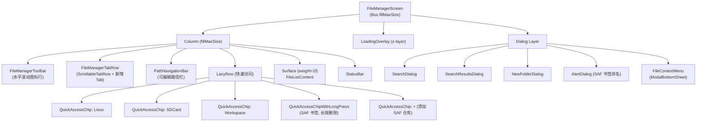

# Screen.FileManager 页面结构

本文档详细描述 `Screen.FileManager` 的完整 UI 组件树、布局层次和交互状态。

## 一、总体架构

`Screen.FileManager` 是功能完整的文件管理器，支持**多环境文件浏览**（Android 文件系统、Linux Shell 环境、SAF 存储仓库）、多 Tab 标签页、多选模式、剪贴板操作、文件搜索、压缩/解压、批量重命名等。通过 AI 工具接口（`AIToolHandler`）执行所有文件系统操作。

**源码规模：** 13 个文件，共 ~3533 行。

### 入口链路

```
NavItem.Toolbox → Screen.Toolbox → onFileManagerSelected
  → Screen.FileManager
    → FileManagerToolScreen (CustomScaffold 包装)
      → FileManagerScreen()
```

### 导航属性

| 属性 | 值 |
|------|------|
| parentScreen | Toolbox |
| navItem | NavItem.Toolbox |
| 参数 | 无 |
| 子页面 | 无 |

---

## 二、组件树



---

## 三、状态管理

### 3.1 FileManagerViewModel

手动 `remember { FileManagerViewModel(context) }` 创建，非 Hilt/ViewModelProvider 注入。生命周期绑定到 Composable 的 remembered 状态。

| 状态 | 类型 | 说明 |
|------|------|------|
| `currentPath` | `String` (mutableStateOf) | 当前浏览路径，默认 `/sdcard` |
| `currentEnvironment` | `String?` | 执行环境：`null`=Android FS, `"linux"`=Linux, `"repo:<name>"`=SAF |
| `files` | `mutableStateListOf<FileItem>` | 当前目录文件列表（含 `..` 返回项） |
| `isLoading` | `Boolean` | 加载指示器 |
| `error` | `String?` | 错误消息 |
| `selectedFile` | `FileItem?` | 单选模式选中文件 |
| `selectedFiles` | `mutableStateListOf<FileItem>` | 多选模式选中文件集 |
| `isMultiSelectMode` | `Boolean` | 是否多选模式 |
| `clipboardFiles` | `mutableStateListOf<FileItem>` | 剪贴板文件列表 |
| `isCutOperation` | `Boolean` | 剪贴板是剪切还是复制 |
| `clipboardSourcePath` | `String?` | 剪贴板来源路径 |
| `itemSize` | `Float` (0.5f~1.3f) | 列表项缩放因子 |
| `displayMode` | `DisplayMode` | 单列/双列/三列 |
| `scrollPositions` | `mutableStateMapOf<String, Int>` | 每个路径的滚动位置缓存 |
| `pendingScrollPosition` | `Pair<String, Int>?` | 待恢复的滚动位置 |
| `tabs` | `mutableStateListOf<TabItem>` | 浏览器标签页列表 |
| `activeTabIndex` | `Int` | 当前活动标签页索引 |
| `showBottomActionMenu` | `Boolean` | 文件操作菜单显示 |
| `contextMenuFile` | `FileItem?` | 单选模式右键菜单目标文件 |
| `searchQuery` | `String` | 搜索关键词 |
| `isSearching` | `Boolean` | 是否处于搜索结果视图 |
| `searchResults` | `mutableStateListOf<FileItem>` | 搜索结果列表 |
| `showSearchDialog` | `Boolean` | 搜索对话框 |
| `showSearchResultsDialog` | `Boolean` | 搜索结果对话框 |
| `isCaseSensitive` | `Boolean` | 搜索区分大小写 |
| `useWildcard` | `Boolean` (默认 true) | 自动包裹 `*query*` 通配符 |
| `showNewFolderDialog` | `Boolean` | 新建文件夹对话框 |
| `newFolderName` | `String` | 新文件夹名称输入 |

### 3.2 Screen 级局部状态

| 状态 | 说明 |
|------|------|
| `pendingRepoBookmarkUri` | SAF 待命名的 URI |
| `repoBookmarkNameInput` | SAF 书签名称输入 |
| `showRepoBookmarkNameDialog` | SAF 书签命名对话框 |
| `repoBookmarkNameError` | 书签名称验证错误 |
| `listState` | LazyColumn 滚动状态 |
| `safBookmarks` | SAF 书签列表（DataStore Flow 收集） |

---

## 四、多环境系统

FileManager 通过 `currentEnvironment` 字符串路由到不同的文件系统后端：

| 环境 | `currentEnvironment` 值 | 说明 |
|------|--------------------------|------|
| Android FS | `null` | 标准 Android 文件系统访问 |
| Linux Shell | `"linux"` | 通过 Linux Shell 环境执行文件操作 |
| SAF 仓库 | `"repo:<name>"` | Storage Access Framework 提供的外部存储 |

所有 AI 工具调用在环境非 `null` 时自动追加 `environment` 参数。

**快速访问切换**：
- Linux Chip → `navigateToPath("/", "linux")`
- SDCard Chip → `navigateToPath("/sdcard", null)`
- Workspace Chip → `navigateToPath(workspacePath, null)`
- SAF 书签 Chip → `navigateToPath("/", "repo:<name>")`

---

## 五、工具栏与导航

### 5.1 FileManagerToolbar

水平可滚动的 `IconButton` 行：

| 按钮 | 图标 | 动作 |
|------|------|------|
| 返回 | ArrowBack | `navigateUp()` |
| 前进 | ArrowForward | 无操作（预留） |
| 上级 | ArrowUpward | `navigateUp()` |
| 刷新 | Refresh | `loadCurrentDirectory()` |
| 缩小 | ZoomOut | `itemSize -= 0.1f` (min 0.5f) |
| 放大 | ZoomIn | `itemSize += 0.1f` (max 1.3f) |
| 多选 | CheckBox | 切换 `isMultiSelectMode` |
| 粘贴 | ContentPaste | `pasteFiles()` (剪贴板空时禁用) |
| 显示模式 | ViewModule/Column/Grid | 循环 SINGLE → TWO → THREE |
| 搜索 | Search | 打开 `SearchDialog` |
| 退出搜索 | SearchOff | 清除搜索状态（仅搜索中可见） |
| 新建文件夹 | CreateNewFolder | 打开 `NewFolderDialog` |

### 5.2 PathNavigationBar

双模式路径栏：
- **显示模式**：点击 `Text` 显示 `currentPath` → 切换到编辑模式
- **编辑模式**：`TextField` + 确认按钮，支持 IME Done 键 → `navigateToPath(editablePath)`

### 5.3 FileManagerTabRow

`ScrollableTabRow` + 右侧新增 Tab 按钮：
- 每个 Tab 显示文件夹图标 + 标题
- Tab 数量 > 1 时显示关闭按钮
- 新增 Tab 默认打开 `/sdcard`

### 5.4 StatusBar

| 模式 | 显示内容 |
|------|----------|
| 普通 | 文件数量 + 选中文件 Chip（图标 + 名称） |
| 多选 | 已选数量 + 退出多选按钮 |

---

## 六、文件列表

### 6.1 FileListContent

根据 `DisplayMode` 切换布局：

| 模式 | 布局 |
|------|------|
| `SINGLE_COLUMN` | LazyColumn 每行一个 FileListItem |
| `TWO_COLUMNS` | 文件按 2 个分组，每行 `Row { Box(weight=1f) × 2 }` |
| `THREE_COLUMNS` | 文件按 3 个分组，每行 `Row { Box(weight=1f) × 3 }` |

搜索中显示 `searchResults`，正常显示 `files`。

### 6.2 FileListItem

```
Row (combinedClickable)
├── Surface (图标容器, 选中态 primaryContainer)
│   └── Icon (getFileIcon 按扩展名映射)
└── Column
    ├── Text (文件名)
    └── Row: Text(大小/类型) + Text(修改日期)
```

所有尺寸（图标、间距、字号）基于 `displayMode` 计算后再乘以 `itemSize` 缩放因子。

### 6.3 文件图标映射

| 扩展名 | 图标 |
|--------|------|
| pdf | PictureAsPdf |
| jpg/jpeg/png/gif/bmp | Image |
| mp3/wav/ogg | AudioFile |
| mp4/avi/mkv/mov | VideoFile |
| zip/rar/7z/tar | FolderZip |
| txt | TextSnippet |
| doc/docx | Description |
| xls/xlsx | TableChart |
| ppt/pptx | PictureAsPdf |
| 目录 | Folder |
| 其他 | InsertDriveFile |

---

## 七、文件操作菜单 (FileContextMenu)

最复杂的组件，814 行。`ModalBottomSheet` 包含所有文件操作逻辑。

### 7.1 菜单项

| 操作 | 单选 | 多选 | AI 工具 |
|------|:----:|:----:|---------|
| 打开 | ✓ | — | `open_file` |
| 复制 | ✓ | ✓ | — (写入剪贴板) |
| 剪切 | ✓ | ✓ | — (写入剪贴板) |
| 粘贴 | ✓ | ✓ | `copy_file` + `delete_file`(剪切) |
| 分享 | ✓ | — | `share_file` |
| 重命名 | ✓ | — | `move_file` |
| 批量重命名 | — | ✓ | `move_file` × N |
| 压缩 | — | ✓ | `zip_files` |
| 解压 | ✓(.zip) | — | `unzip_files` |
| 删除 | ✓ | ✓ | `delete_file` |

### 7.2 菜单内对话框

| 对话框 | 触发 | 字段 |
|--------|------|------|
| 重命名 | 单选 → Rename | 新文件名 OutlinedTextField |
| 批量重命名 | 多选 → Rename | 前缀 + 保留原名开关 + 起始编号 + 后缀 + 预览 |
| 压缩 | 多选 → Compress | 压缩文件名（自动补 `.zip`） |
| 删除确认 | Delete | 确认文字（单个/批量） |
| 解压确认 | 单选(.zip) → Extract | 确认解压到当前目录 |

### 7.3 批量重命名逻辑

```
输入: prefix="photo_", useOriginalName=false, startNumber=1, suffix="_final"
文件: a.jpg, b.png, c.jpg
输出: photo_1_final.jpg, photo_2_final.png, photo_3_final.jpg
```

保留原名时：`prefix + 原文件名(无扩展名) + suffix + .ext`
使用编号时：`prefix + 递增数字 + suffix + .ext`

---

## 八、搜索功能

### 8.1 SearchDialog

| 字段 | 说明 |
|------|------|
| 搜索关键词 | `OutlinedTextField` |
| 区分大小写 | `Checkbox`，默认关闭 |
| 通配符模式 | `Checkbox`，默认开启（自动包裹 `*query*`） |

### 8.2 搜索流程

```
SearchDialog → viewModel.searchFiles(query)
  → AITool "find_files" (path, pattern, case_sensitive)
  → [forEach result] AITool "file_info" (判断文件/目录)
  → 填充 searchResults
  → 打开 SearchResultsDialog
```

### 8.3 SearchResultsDialog

- 标题行：结果数量 + 关闭按钮
- 空结果：居中占位文字
- `LazyColumn` (300dp 高度)：每项显示图标 + 文件名 + 完整路径
- 点击结果 → `navigateToFileDirectory(fullPath)` → 导航到文件所在目录

---

## 九、SAF 书签系统

通过 Storage Access Framework 访问外部存储提供者。

### 9.1 添加流程

```
点击 "+" QuickAccessChip
  → rememberLauncherForActivityResult(OpenDocumentTree)
  → 获取目录 URI → 获取持久化权限
  → 查询 ContentProvider 获取默认名称
  → 弹出书签命名对话框
  → 保存到 ApiPreferences.safBookmarksFlow (DataStore)
```

### 9.2 书签 Chip 交互

- **点击**：`navigateToPath("/", "repo:<name>")` 切换到 SAF 环境
- **长按**：显示 `DropdownMenu` → 删除书签选项

---

## 十、AI 工具接口

FileManager 通过 `AIToolHandler.executeTool()` 执行所有文件系统操作：

| 工具名 | 触发 | 参数 |
|--------|------|------|
| `list_files` | 加载目录 | `path`, `environment?` |
| `find_files` | 搜索文件 | `path`, `pattern`, `case_sensitive`, `environment?` |
| `file_info` | 搜索结果类型判断 | `path`, `environment?` |
| `make_directory` | 新建文件夹 | `path`, `environment?` |
| `copy_file` | 粘贴(复制) | `source`, `destination`, `environment?` |
| `delete_file` | 删除 / 粘贴(剪切清理) | `path`, `recursive?`, `environment?` |
| `move_file` | 重命名 / 批量重命名 | `source`, `destination`, `environment?` |
| `open_file` | 打开文件 | `path`, `environment?` |
| `share_file` | 分享文件 | `path`, `environment?` |
| `zip_files` | 压缩 | `source`(逗号分隔), `destination`, `environment?` |
| `unzip_files` | 解压 | `source`, `destination`, `environment?` |

---

## 十一、数据模型

```kotlin
data class FileItem(
    val name: String,
    val isDirectory: Boolean,
    val size: Long = 0,
    val lastModified: Long = 0,
    val fullPath: String? = null   // 仅搜索结果填充
)

data class TabItem(
    val path: String,
    val title: String,
    val environment: String? = null
)

enum class DisplayMode { SINGLE_COLUMN, TWO_COLUMNS, THREE_COLUMNS }

// 外部模型
data class DirectoryListingData(
    val path: String,
    val entries: List<FileEntry>,
    val env: String = "android"
)
```

---

## 十二、用户交互 → 动作映射

| 交互 | 执行动作 |
|------|----------|
| 文件点击（普通模式） | 目录：`navigateToDirectory()`，文件：`selectedFile = file` |
| 文件点击（多选模式） | 切换选中状态 |
| 文件长按（普通模式） | 设置 `contextMenuFile` → 打开 `FileContextMenu` |
| 文件长按（多选模式） | 添加到选中集 → 打开 `FileContextMenu` |
| `..` 项点击 | `navigateUp()` |
| 路径栏编辑提交 | `navigateToPath(editablePath)` |
| Tab 切换 | `switchTab(index)` 恢复该 Tab 的路径和环境 |
| Tab 关闭 | `closeTab(index)` 切换到相邻 Tab |
| 缩放 +/- | `itemSize ± 0.1f` (范围 0.5f~1.3f) |
| 显示模式切换 | 循环 SINGLE → TWO → THREE |
| QuickAccess Chip 点击 | 切换环境并导航到对应根路径 |
| SAF 书签长按 | 显示删除菜单 |

---

## 十三、架构要点

1. **手动 ViewModel 创建**：`remember { FileManagerViewModel(context) }` 而非 `viewModel()` 或 Hilt 注入，生命周期绑定 Composable 而非 Navigation BackStack。离开 Composition 后 ViewModel 会被回收。

2. **AI 工具统一接口**：所有文件操作通过 `AIToolHandler.executeTool(AITool(...))` 执行，不直接访问 `java.io.File`。工具层自动处理环境路由。

3. **多环境路由**：`currentEnvironment` 字符串作为路由键，`null` / `"linux"` / `"repo:<name>"` 三种值对应不同后端。所有工具调用通过 `withEnvParams()` 自动附加环境参数。

4. **FileContextMenu 自包含**：文件操作的业务逻辑（删除、重命名、压缩等）在 `FileContextMenu` 组件内以 local 函数形式实现，不在 ViewModel 中。这使得菜单组件高达 814 行。

5. **双份文件列表组件**：`FileListContent`（当前使用）和 `FileListPane`（独立的双面板组件，有自己的 AIToolHandler，未接入主界面）共存，`FileListPane` 疑似未完成的双面板文件管理器功能。

6. **滚动位置持久化**：`scrollPositions` Map 按路径缓存，目录切换时保存当前位置、恢复目标位置。通过 `LaunchedEffect` 监听 `firstVisibleItemIndex` 变化实时保存。

7. **`formatDate` 重复实现**：`FileUtils.formatDate(String)` 解析 `"MMM dd HH:mm"` 字符串格式，`FileListItem` 内部有独立的 `formatDate(Long)` 处理 Unix 时间戳，两套逻辑共存。

---

## 十四、对话框清单

| 对话框 | 来源组件 | 触发 | 功能 |
|--------|----------|------|------|
| SearchDialog | SearchDialogs.kt | 工具栏搜索按钮 | 搜索关键词 + 选项 |
| SearchResultsDialog | SearchDialogs.kt | 搜索完成 | 结果列表，点击导航 |
| NewFolderDialog | NewFolderDialog.kt | 工具栏新建文件夹 | 文件夹名称输入 |
| SAF 书签命名 | FileManagerScreen | SAF 目录选择完成 | 书签名称 + 验证 |
| 重命名 | FileContextMenu | 单选 → Rename | 新文件名 |
| 批量重命名 | FileContextMenu | 多选 → Rename | 前缀/后缀/编号/预览 |
| 压缩 | FileContextMenu | 多选 → Compress | 压缩文件名 |
| 删除确认 | FileContextMenu | Delete | 确认删除 |
| 解压确认 | FileContextMenu | 单选(.zip) → Extract | 确认解压 |

---

## 十五、核心文件清单

| 文件 | 路径 (相对于 `ui/features/toolbox/screens/filemanager/`) | 行数 | 职责 |
|------|------|------|------|
| **FileManagerScreen** | `FileManagerScreen.kt` | 609 | 页面入口，SAF 集成，滚动管理 |
| **FileManagerViewModel** | `viewmodel/FileManagerViewModel.kt` | 491 | 状态管理，目录加载，搜索，剪贴板 |
| **FileContextMenu** | `components/FileContextMenu.kt` | 814 | ModalBottomSheet + 全部文件操作逻辑 + 5 个对话框 |
| **ToolbarComponents** | `components/ToolbarComponents.kt` | 526 | 工具栏 + 路径栏 + Tab 栏 + 状态栏 |
| **FileListItem** | `components/FileListItem.kt` | 254 | 文件列表项 + DisplayMode 枚举 |
| **FileListContent** | `components/FileListContent.kt` | 155 | 文件列表容器（单列/双列/三列） |
| **FileListPane** | `components/FileListPane.kt` | 193 | 独立文件面板（未使用） |
| **SearchDialogs** | `components/SearchDialogs.kt` | 179 | 搜索对话框 + 结果对话框 |
| **FileUtils** | `utils/FileUtils.kt` | 134 | 文件图标/类型/格式化工具 |
| **LoadingOverlay** | `components/LoadingOverlay.kt` | 44 | 加载遮罩 |
| **NewFolderDialog** | `components/NewFolderDialog.kt` | 57 | 新建文件夹对话框 |
| **FileActionButton** | `components/FileActionButton.kt` | 61 | 操作按钮复用组件 |
| **FileModels** | `models/FileModels.kt` | 16 | TabItem + FileItem 数据类 |
