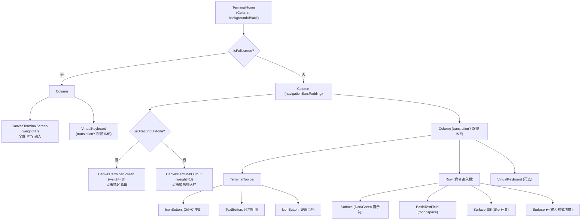
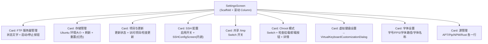

# Screen.Terminal 页面结构

本文档详细描述 `Screen.Terminal` 及其子路由（Setup、Settings）的完整 UI 组件树、布局层次和交互状态。Terminal 是独立 Gradle 模块（`terminal/`），拥有自己的内置 NavHost 路由系统。

## 一、总体架构

`Screen.Terminal` 是内置 Linux 终端模拟器，基于 PRoot + Ubuntu rootfs 实现完整的 Linux shell 环境。支持多会话、PTY 交互、虚拟键盘、SSH 远程连接、FTP 服务器、环境包管理器、自定义字体和键盘布局。

**源码规模：** 独立 `terminal/` Gradle 模块，UI 层 ~4500 行，TerminalManager ~1250 行。

### 入口链路

```
NavItem.Toolbox → Screen.Toolbox → onTerminalSelected
  → Screen.Terminal
    → TerminalToolScreen(forceShowSetup=false)
      → rememberTerminalEnv(TerminalManager.getInstance())
        → TerminalScreen(env) [内置 NavHost]
          ├── terminal_home → TerminalHome
          ├── setup → SetupScreen
          └── settings → SettingsScreen
```

### 导航属性

| Screen | parentScreen | 说明 |
|--------|-------------|------|
| Screen.Terminal | Toolbox | 正常入口 |
| Screen.TerminalSetup | Toolbox | 强制显示 Setup (`forceShowSetup=true`) |
| Screen.TerminalAutoConfig | Toolbox | 占位（TODO，显示"施工中"文字） |

### 内置路由系统

Terminal 模块有独立的 `NavHost`，不使用外层 `OperitRouter`：

| 路由 | Composable | 进入条件 |
|------|------------|----------|
| `terminal_home` | TerminalHome | 非首次启动 |
| `setup` | SetupScreen | 首次启动 或 `forceShowSetup` |
| `settings` | SettingsScreen | 工具栏齿轮图标 |

首次启动通过 `terminal_prefs` SharedPreferences 的 `is_first_launch` 判定。

---

## 二、TerminalHome (主终端界面)

### 2.1 组件树



### 2.2 双输入模式

| 模式 | 渲染组件 | 交互方式 |
|------|----------|----------|
| 命令栏模式 (默认) | `CanvasTerminalOutput` + 底部 `BasicTextField` | 输入栏编辑 → 发送完整命令 |
| 直接输入模式 | `CanvasTerminalScreen` | 点击画布唤起 IME → 字符直接写入 PTY |

切换时隐藏系统键盘、清空命令缓冲区。

### 2.3 状态管理

| 状态 | 类型 | 说明 |
|------|------|------|
| `fontConfig` | `RenderConfig` | 字体配置，通过 `SharedPreferences.OnSharedPreferenceChangeListener` 监听变化 |
| `virtualKeyboardLayout` | `VirtualKeyboardLayoutConfig` | 虚拟键盘布局配置 |
| `scaleFactor` | `Float` | 字体/间距缩放因子 |
| `showVirtualKeyboard` | `Boolean` | 虚拟键盘面板显示 |
| `isDirectInputMode` | `Boolean` | 直接输入模式开关 |
| `ctrlActive` / `altActive` | `Boolean` | 修饰键状态 |
| `showDeleteConfirmDialog` | `Boolean` | 关闭会话确认弹窗 |
| `sessionToDelete` | `String?` | 待删除的会话 ID |

**从 TerminalEnv 收集的状态**：`sessions`, `currentSessionId`, `currentDirectory`, `isFullscreen`, `terminalEmulator`（均通过 StateFlow → collectAsState）。

### 2.4 虚拟键盘

```
VirtualKeyboard
└── Column (DarkGray 背景)
    └── [forEach row] Row
        └── [forEach button] KeyButton
            ├── 普通键: Surface(0xFF3A3A3A) → sendDirectInput(value)
            ├── Ctrl 键: Surface(active 蓝/inactive 灰) → toggle ctrlActive
            └── Alt 键: Surface(active 蓝/inactive 灰) → toggle altActive
```

支持转义序列解码：`\e`(ESC)、`\t`(Tab)、`\n`(LF)、`\r`(CR)、`\\`(反斜杠)。

Ctrl 修饰映射：字母 `a-z` → `-`，`[` → ESC，`]` → GS 等。

### 2.5 IME 处理

`rememberSettledImeBottomPx`：160ms 去抖 IME 高度变化，键盘收起时立即重置为 0。底部栏通过 `translationY = -imeBottomPx` 跟随键盘移动。

---

## 三、SetupScreen (环境安装向导)

### 3.1 组件树

```
Column (background=0xFF1A1A1A)
├── Text (标题: 环境配置)
├── Text (副标题说明)
├── [if isSSHEnabled] Card (橙色 SSH 警告)
├── LazyColumn (weight=1f)
│   └── [6个] CategoryCard
│       ├── Header Row (Checkbox 全选 + 分类名 + 展开图标)
│       ├── [if "Operit required"] Text (橙色标签)
│       └── [if expanded] PackageItem 行
│           ├── Checkbox + 包名 + 描述
│           └── [if INSTALLED] Badge (绿色)
└── Row (底部按钮)
    ├── Button "跳过" → onBack
    └── Button "开始配置" → showSetupDialog
```

### 3.2 包分类

| 分类 | 包列表 | 备注 |
|------|--------|------|
| NodeJS | nodejs (v24), pnpm | Operit required |
| Python | python-is-python3, venv, pip, uv | Operit required |
| SSH | ssh, sshpass, openssh-server | — |
| Java | openjdk-17, gradle | — |
| Rust | rust/rustup | — |
| Go | golang-go | — |

### 3.3 包状态检测

通过临时 `setup-check` 终端会话并发执行检测命令（每个 15s 超时）：

| 包 | 检测方式 |
|------|----------|
| rust | `command -v rustc` |
| uv | `command -v uv` |
| nodejs | `node -v` 检查大版本 ≥ 24 |
| pnpm | `test -f "$(npm prefix -g)/bin/pnpm"` |
| 其他 | `dpkg -s <pkg>` 检查 `Status: install ok installed` |

### 3.4 安装命令生成

点击"开始配置"后按顺序生成命令列表：
1. `dpkg --configure -a` → `apt install -f -y` → `apt update -y` → `apt upgrade -y`
2. pip/uv 镜像源配置文件写入
3. `apt install -y <所有选中的 apt 包>`（批量）
4. 特殊安装：Rust (镜像 env var + rustup)、NodeJS (nodesource)、uv (pipx)
5. NPM 镜像切换 + `npm install -g pnpm`

所有命令通过 `&&` 连接后发送到终端执行。

---

## 四、SettingsScreen (终端设置)

### 4.1 组件树



### 4.2 SettingsViewModel

`AndroidViewModel`，管理终端配置的所有状态。

| 状态 | 类型 | 说明 |
|------|------|------|
| `cacheSize` | `String` | Ubuntu 环境磁盘大小 |
| `updateStatus` / `hasUpdateAvailable` | `String` / `Boolean` | 更新检查结果 |
| `ftpServerStatus` / `isFtpServerRunning` | `String` / `Boolean` | FTP 服务器状态 |
| `sourceConfigs` | `Map<PackageManagerType, SourceConfig>` | APT/Pip/NPM/Rust 镜像源配置 |
| `sshConfig` / `sshEnabled` | `SSHConfig?` / `Boolean` | SSH 配置与启用状态 |
| `sharedTmpEnabled` | `Boolean` | 共享 /tmp 开关 |
| `chrootEnabled` | `Boolean` | Chroot 模式 |
| `virtualKeyboardLayout` | `VirtualKeyboardLayoutConfig` | 键盘布局 |

### 4.3 SSH 配置 (SSHConfigScreen)

内嵌在 SettingsScreen 中的 SSH 管理组件（674 行）。

**SSHConfigEditDialog 字段**：

| 分组 | 字段 |
|------|------|
| 连接 | host, port (默认 22), username |
| 认证 | authType (PASSWORD / PUBLIC_KEY 切换) |
| 密码认证 | password (密码遮罩) |
| 密钥认证 | privateKeyPath, passphrase |
| 保活 | enableKeepAlive (默认 true), keepAliveInterval (默认 30s) |
| 反向隧道 | enableReverseTunnel, remoteTunnelPort (8881), localSshPort (2223), localSshUsername, localSshPassword |

SSH 启用前校验：检查 Ubuntu rootfs 中 `usr/bin/ssh` 和 `sshpass` 是否存在。

### 4.4 虚拟键盘自定义 (VirtualKeyboardCustomizationDialog)

`AlertDialog` + 滚动列表，每个按键位一行编辑器：
- Label: `OutlinedTextField`
- Action: `OutlinedButton` 循环切换 (SEND_TEXT → TOGGLE_CTRL → TOGGLE_ALT)
- Value: `OutlinedTextField`（仅 SEND_TEXT 时可编辑）
- 顶部"恢复默认"按钮

---

## 五、TerminalEnv (状态桥接层)

`@Stable` 类，桥接 `TerminalManager` 到 Compose：

| 属性 | 来源 |
|------|------|
| `sessions` | `TerminalManager.sessions` (StateFlow → collectAsState) |
| `currentSessionId` | `TerminalManager.currentSessionId` |
| `currentDirectory` | `TerminalManager.currentDirectory` |
| `isFullscreen` | `TerminalManager.isFullscreen` |
| `terminalEmulator` | `TerminalManager.terminalEmulator` |
| `command` | 本地 `mutableStateOf("")` |

**方法**：`onSendInput()`, `onSetup()`, `onInterrupt()`, `onNewSession()`, `onSwitchSession()`, `onCloseSession()`, `saveScrollOffset()`, `getScrollOffset()`。

---

## 六、TerminalManager (核心管理器)

单例（双重检查锁），1249 行。管理终端会话生命周期和环境初始化。

### 6.1 环境初始化流程

```
initializeEnvironment()
  → 创建目录 (files/usr/bin, files/tmp)
  → 链接 native .so 库 (busybox, proot, loader, libtalloc, bash, sudo)
  → 解压 ubuntu-noble-aarch64-pd-v4.18.0.tar.xz (assets)
  → 生成 common.sh 启动脚本
    → install_ubuntu(), configure_sources(), fix_permissions()
    → login_ubuntu(), ssh_shell(), start_shell()
```

### 6.2 会话管理

- `createNewSession(title?)` → 检测 TerminalType → `sessionManager.createNewSession()` → `initializeSession()` → 等待 30s 直到 `SessionInitState.READY`
- `sendCommand(command)` → 交互模式下直接写入 PTY 带 `\r`
- `sendInput(input)` → 绕过命令历史，直接写 PTY stdin
- `sendInterruptSignal()` → 写入 `` (Ctrl+C)

### 6.3 终端提供者抽象

| 提供者 | 条件 | 说明 |
|--------|------|------|
| `SSHTerminalProvider` | SSHConfigManager 有配置 | 通过 SSH 连接远程 shell |
| `LocalTerminalProvider` | 默认 | 本地 PRoot + Ubuntu rootfs |

---

## 七、对话框清单

| 对话框 | 所在页面 | 触发 | 功能 |
|--------|----------|------|------|
| 关闭会话确认 | TerminalHome | Tab 关闭按钮 (>1 会话) | 确认删除终端会话 |
| 环境配置确认 | SetupScreen | "开始配置"按钮 | 确认执行安装命令 |
| SSH 工具缺失 | SettingsScreen | 启用 SSH 但工具不存在 | 提示去环境配置安装 |
| OpenSSH 缺失 | SettingsScreen | SSH 反向隧道但缺 sshd | 安装说明 |
| 字体大小 | SettingsScreen | 字号设置项 | 数字输入 (12~100) |
| 目标 FPS | SettingsScreen | FPS 设置项 | 数字输入 (15~120) |
| 字体路径 | SettingsScreen | 字体路径设置项 | 文件路径输入 |
| 字体名称 | SettingsScreen | 字体名称设置项 | 系统字体名输入 |
| 重置环境 | SettingsScreen | "重置环境"红色按钮 | 危险确认（列出将删除内容） |
| 虚拟键盘自定义 | SettingsScreen | 虚拟键盘设置项 | 按键布局编辑器 |
| 镜像源选择 | SettingsScreen | 源管理各行 | RadioButton 列表 + 添加自定义源 |
| 添加自定义源 | SettingsScreen | 源选择对话框 "Add" | 源名称 + URL 输入 |
| SSH 配置编辑 | SSHConfigScreen | 编辑按钮 | 完整 SSH 连接表单 |
| SSH 配置删除 | SSHConfigScreen | 删除按钮 | 确认删除 |

---

## 八、数据模型

```kotlin
// 终端会话
data class TerminalSessionData(
    val sessionId: String,
    val title: String,
    val ptyProcess: ...,
    val sessionWriter: ...,
    val ansiTerminalEmulator: AnsiTerminalEmulator,
    val commandQueue: ...,
    val scrollOffset: Int
)

data class TerminalState(
    val sessions: List<TerminalSessionData>,
    val currentSessionId: String?,
    val isLoading: Boolean,
    val error: String?
)

enum class SessionInitState { INITIALIZING, LOGGED_IN, AWAITING_FIRST_PROMPT, READY }

// SSH
data class SSHConfig(host, port, username, authType, password, privateKeyPath,
    passphrase, enableReverseTunnel, remoteTunnelPort, localSshPort,
    localSshUsername, localSshPassword, enableKeepAlive, keepAliveInterval)
enum class SSHAuthType { PASSWORD, PUBLIC_KEY }

// 包管理
enum class PackageManagerType { APT, PIP, NPM, RUST }
data class MirrorSource(val id: String, val name: String, val url: String, val isHttps: Boolean)
data class SourceConfig(val packageManager: PackageManagerType, val selectedSourceId: String, val sources: List<MirrorSource>)

// 虚拟键盘
data class VirtualKeyboardLayoutConfig(val rows: List<List<VirtualKeyboardButtonConfig>>)
data class VirtualKeyboardButtonConfig(val label: String, val action: KeyAction, val value: String)
enum class KeyAction { SEND_TEXT, TOGGLE_CTRL, TOGGLE_ALT }
```

---

## 九、架构要点

1. **独立 Gradle 模块**：Terminal 是 `terminal/` 模块，有自己的 NavHost 路由系统，不使用外层 `OperitRouter`。通过 `TerminalEnv` 桥接层与 Compose 集成。

2. **TerminalManager 单例**：双重检查锁实现，持有 `CoroutineScope(Dispatchers.IO + SupervisorJob())`，生命周期与进程一致。所有会话状态通过 `StateFlow` 暴露。

3. **PRoot + Ubuntu rootfs**：环境初始化从 assets 解压 Ubuntu Noble rootfs，通过 PRoot 模拟 Linux 环境。native `.so` 库（busybox, proot 等）通过符号链接部署。

4. **双输入模式**：命令栏模式适合编辑长命令，直接输入模式适合交互式程序（vim、top 等），通过 `⇄` 按钮切换。

5. **SSH 终端提供者抽象**：`TerminalProvider` 接口实现本地和 SSH 两种后端，用户可通过配置无缝切换。SSH 启用前校验工具链存在性。

6. **虚拟键盘完全可自定义**：按键的标签、值、动作类型（发送文本/切换 Ctrl/切换 Alt）均可编辑，布局持久化到 SharedPreferences。

7. **TerminalAutoConfig 占位**：`Screen.TerminalAutoConfig` 当前为 TODO stub，显示"施工中"文字。

---

## 十、核心文件清单

| 文件 | 路径 (相对于 `terminal/src/main/java/.../terminal/`) | 行数 | 职责 |
|------|------|------|------|
| **TerminalScreen** | `main/TerminalScreen.kt` | 171 | NavHost 路由入口 |
| **TerminalHome** | `ui/TerminalHome.kt` | 811 | 主终端界面 + 虚拟键盘 |
| **SetupScreen** | `ui/SetupScreen.kt` | 708 | 环境安装向导 |
| **SettingsScreen** | `ui/SettingsScreen.kt` | 1385 | 终端设置页 |
| **SSHConfigScreen** | `ui/SSHConfigScreen.kt` | 674 | SSH 配置组件 |
| **SettingsViewModel** | `ui/SettingsViewModel.kt` | 519 | 设置状态管理 |
| **VirtualKeyboardDialog** | `ui/VirtualKeyboardCustomizationDialog.kt` | 229 | 键盘自定义对话框 |
| **TerminalEnv** | `TerminalEnv.kt` | 100 | Compose 状态桥接层 |
| **TerminalManager** | `TerminalManager.kt` | 1249 | 单例会话管理器 |
| **TerminalModels** | `data/TerminalModels.kt` | 153 | 数据模型 |
| **SSHConfig** | `data/SSHConfig.kt` | ~30 | SSH 配置数据类 |
| **TerminalRoutes** | `main/TerminalRoutes.kt` | 7 | 路由常量 |
