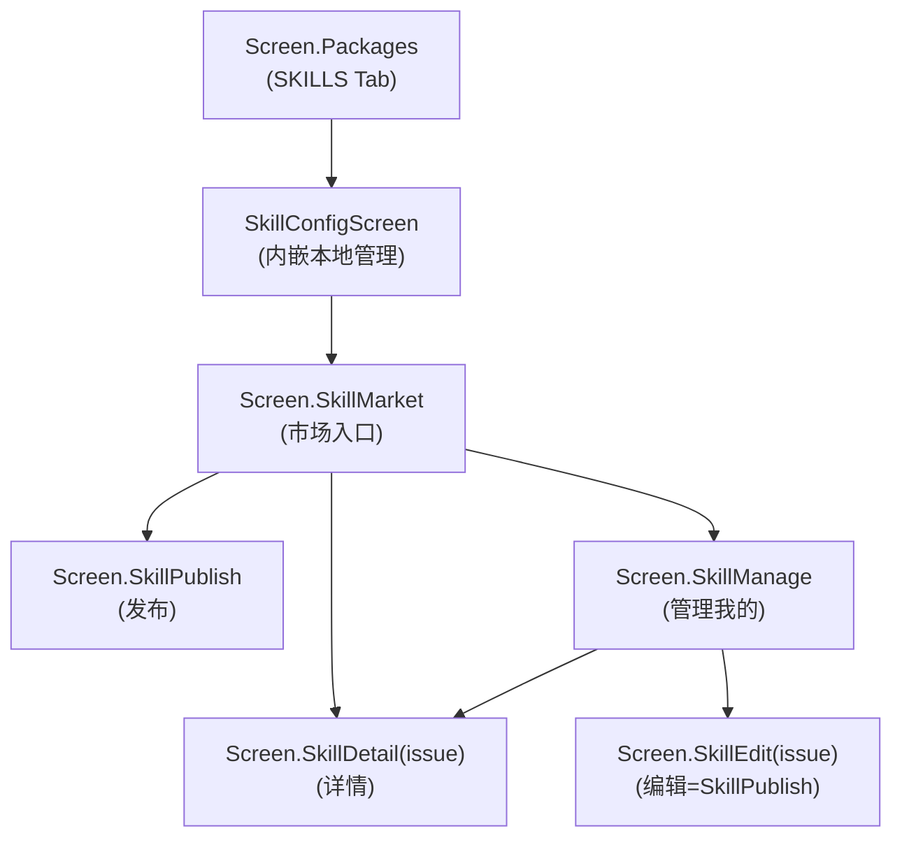
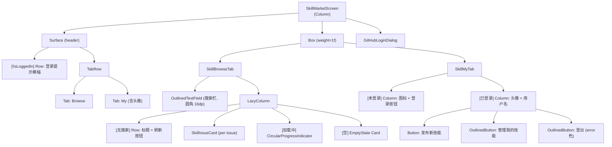

# Screen.SkillMarket 页面族结构

本文档描述 Skill 市场相关的 4 个页面：SkillMarket（浏览/我的）、SkillDetail（详情）、SkillManage（管理）、SkillPublish（发布/编辑）。另含 SkillConfigScreen（本地技能管理，内嵌于 Packages SKILLS Tab）。

## 一、总体架构

Skill 市场以 **GitHub Issues** 作为数据源（仓库 `AAswordman/OperitSkillMarket`，标签 `skill-plugin`），提供 AI 技能插件的浏览、安装、发布和管理功能。

**源码规模：** 5 个页面文件 ~3221 行 + ViewModel 922 行 + Parser 183 行。

### 导航关系



所有子页面 `parentScreen = SkillMarket`，返回键回到市场。

---

## 二、SkillMarketViewModel

### 2.1 实例化

通过自定义 `Factory(context, skillRepository)` 创建，各页面独立调用 `viewModel(factory = ...)`。

### 2.2 数据源

- **浏览**：`GitHubApiService.getRepositoryIssues()` 分页 50 条/页
- **搜索**：GitHub Search API，350ms 去抖，查询格式 `<rawQuery> repo:AAswordman/OperitSkillMarket is:issue is:open label:skill-plugin`
- **合并输出**：`combine(_skillIssues, _searchQuery, _searchResultIssues)` → 搜索为空时输出浏览列表，否则输出搜索结果

### 2.3 核心 StateFlow

| StateFlow | 类型 | 说明 |
|-----------|------|------|
| `skillIssues` | `List<GitHubIssue>` | 派生：浏览或搜索结果 |
| `isLoading` / `isLoadingMore` / `hasMore` | `Boolean` | 加载/分页状态 |
| `errorMessage` | `String?` | Toast 错误 |
| `searchQuery` | `String` | 搜索关键词 |
| `installingSkills` | `Set<String>` | 安装中的 repoUrl 集合 |
| `installedSkillRepoUrls` | `Set<String>` | 已安装（通过 `.operit_repo_url` 标记文件） |
| `installedSkillNames` | `Set<String>` | 已安装（通过目录名，兼容旧版） |
| `userPublishedSkills` | `List<GitHubIssue>` | 当前用户发布的 Issues |
| `issueComments` | `Map<Int, List<GitHubComment>>` | 评论缓存 |
| `issueReactions` | `Map<Int, List<GitHubReaction>>` | 反应缓存 |
| `userAvatarCache` | `Map<String, String>` | 头像 URL 缓存（仅内存） |
| `repositoryCache` | `Map<String, GitHubRepository>` | 仓库信息缓存（stars 等） |

### 2.4 安装流程

```
installSkillFromRepoUrl(repoUrl)
  → skillRepository.importSkillFromGitHubRepo(repoUrl)
  → 乐观更新 installedSkillRepoUrls
  → refreshInstalledSkills() 从磁盘同步
```

### 2.5 Issue Body 格式

Issue 正文嵌入 HTML 注释 JSON 块：
```html
<!-- operit-skill-json: {"description":"...","repositoryUrl":"...","category":"...","tags":"...","version":"..."} -->
```

---

## 三、SkillMarketScreen (浏览 + 我的)

### 3.1 组件树



### 3.2 SkillIssueCard

```
Card (clickable → onViewDetails)
└── Row
    ├── Column (weight=1f)
    │   ├── Text (标题, bold, 1行)
    │   ├── Text (描述, 2行, ≤100字符)
    │   └── Row (仓库作者头像 + 发布者头像 + 👍数 + ❤️数)
    └── Surface (34dp 圆形安装按钮)
        ├── [安装中] CircularProgressIndicator
        ├── [已安装] Icon(Check)
        ├── [可用] Icon(Download)
        └── [已关闭] Icon(Info)
```

### 3.3 无限滚动

`LaunchedEffect` 监听 `snapshotFlow { lastVisibleIndex }`，距离末尾 2 项时触发 `loadMoreSkillMarketData()`。分页结果通过 `distinctBy { it.id }` 去重追加。

---

## 四、SkillDetailScreen (技能详情)

### 4.1 组件树

```
CustomScaffold
├── FAB: [已登录] AddComment → 评论对话框
└── LazyColumn
    ├── SkillHeader (标题 + 仓库作者 + 分享者)
    ├── SkillActions (安装/已安装按钮 + 仓库链接)
    ├── SkillDescription (完整描述)
    ├── SkillMetadata (FlowRow: 状态/已安装/Stars/创建时间/更新时间)
    ├── SkillReactions (👍/❤️ ReactionButton)
    ├── HorizontalDivider
    ├── CommentsHeader (评论数 + 刷新)
    └── CommentCard (头像 + 用户名 + 时间 + 内容)
```

### 4.2 反应系统

- 通过 `viewModel.loadIssueReactions()` 加载
- `ReactionButton` 使用 `FilledTonalButton`，已反应时容器着色 + 禁用
- 单向操作：只能添加反应，不能取消

### 4.3 对话框

| 对话框 | 触发 | 功能 |
|--------|------|------|
| CommentInputDialog | FAB 点击 (需登录) | 150dp 高度文本框 + 发布按钮 |

---

## 五、SkillManageScreen (管理我的技能)

### 5.1 组件树

```
CustomScaffold
├── FAB: [已登录] Add → 跳转发布页
└── Column
    ├── [未登录] Card (errorContainer): 警告 + 登录按钮
    ├── [有错误] Card (errorContainer): 错误信息
    ├── [加载中] CircularProgressIndicator
    └── [已登录]
        ├── [空] Card: 提示 + 发布按钮
        └── LazyColumn
            └── Surface (per issue)
                ├── Text (标题)
                ├── Text (描述, 2行)
                └── Row: 编辑按钮 + 删除按钮
```

### 5.2 删除逻辑

删除 = GitHub API `PATCH` issue `state="closed"`（关闭 Issue，非真删除）。

---

## 六、SkillPublishScreen (发布 / 编辑)

### 6.1 双模式

| 模式 | 条件 | 行为 |
|------|------|------|
| 发布 | `editingIssue == null` | 草稿自动保存到 SharedPreferences |
| 编辑 | `editingIssue != null` | 从 Issue body 解析预填充 |

### 6.2 表单字段

- 技能名称 * (`OutlinedTextField`, 必填)
- 描述 * (`OutlinedTextField`, 3-6行)
- 仓库地址 * (`OutlinedTextField`)

### 6.3 对话框

| 对话框 | 触发 | 功能 |
|--------|------|------|
| 发布确认 | 发布/更新按钮 | 显示名称+描述+仓库+警告 |
| 成功提示 | 发布/更新成功 | 确认后返回 |

### 6.4 发布流程

`publishSkill()` → 创建 GitHub Issue（POST），body 含结构化 markdown + 嵌入 JSON 元数据注释。标签分配失败（422 非协作者）时静默重试。

---

## 七、SkillConfigScreen (本地技能管理)

内嵌于 `PackageManagerScreen` 的 SKILLS Tab，管理本地已安装的技能。

### 7.1 导入方式 (3 Tab)

| Tab | 输入 | 调用 |
|-----|------|------|
| Repo URL | GitHub 仓库地址 | `importSkillFromGitHubRepo(url)` |
| ZIP File | 本地 zip 文件选择 | `importSkillFromZip(tempFile)` |
| Direct Input | 技能 ID + 描述 + 内容 + 附件 | `importSkillFromDirectInput(...)` |

### 7.2 技能列表项

```
Surface (clickable → 详情弹窗)
└── Row
    ├── Surface (3dp 宽彩色条)
    ├── Icon (Build)
    ├── Column (名称 + 描述)
    └── Switch (AI 可见性开关)
```

### 7.3 详情弹窗

- 描述 + 目录路径 + 入口文件
- 文件/文件夹数量 + 目录树预览 (≤18 项)
- 展开/收起 skill.md (Markdown 渲染)
- 删除按钮

---

## 八、数据模型

```kotlin
// Issue 解析结果
data class ParsedSkillInfo(
    val title: String, val description: String,
    val repositoryUrl: String, val category: String,
    val tags: String, val version: String,
    val repositoryOwner: String
)

// 嵌入 JSON 元数据
data class SkillMetadata(
    val description: String, val repositoryUrl: String,
    val category: String, val tags: String, val version: String
)

// GitHub API 模型
data class GitHubIssue(id, number, title, body, html_url, state, labels, user, created_at, updated_at, reactions)
data class GitHubComment(id, body, user, created_at, updated_at)
data class GitHubReaction(id, content, user)
data class GitHubRepository(stargazers_count, forks_count, ...)
```

---

## 九、对话框清单

| 对话框 | 所在页面 | 触发 |
|--------|----------|------|
| GitHubLoginDialog | SkillMarketScreen | 登录横幅/登录按钮 |
| CommentInputDialog | SkillDetailScreen | FAB 点击 |
| 删除确认 | SkillManageScreen | 删除按钮 |
| 发布确认 | SkillPublishScreen | 发布/更新按钮 |
| 发布成功 | SkillPublishScreen | 发布成功后 |
| 技能详情 | SkillConfigScreen | 列表项点击 |
| 导入对话框 (3 Tab) | SkillConfigScreen | FAB 点击 |
| 加载错误 | SkillConfigScreen | 错误 FAB 点击 |

---

## 十、架构要点

1. **GitHub Issues 即数据库**：所有技能插件元数据存储为 GitHub Issue，安装/删除/搜索均通过 GitHub API。Issue body 内嵌 HTML 注释 JSON 块传递结构化数据。

2. **350ms 去抖搜索**：搜索输入通过 `searchJob` 取消 + `delay(350)` 实现去抖，使用 GitHub Search API 而非 Issues API。

3. **双重安装检测**：`installedSkillRepoUrls`（`.operit_repo_url` 标记文件）和 `installedSkillNames`（目录名匹配）并存，兼容旧版安装。

4. **头像缓存仅内存**：与 MCP 市场不同，Skill 市场的头像缓存不持久化到 SharedPreferences。

5. **反应单向性**：GitHub Reactions API 的 POST 不去重，ViewModel 只追加不删除，已反应按钮直接禁用。

6. **草稿自动保存**：发布页每次按键触发 `saveDraft()` 到 SharedPreferences（仅新建模式，编辑模式不保存草稿）。

---

## 十一、核心文件清单

| 文件 | 路径 (相对于 `ui/features/packages/screens/`) | 行数 | 职责 |
|------|------|------|------|
| **SkillMarketScreen** | `SkillMarketScreen.kt` | 800 | 市场入口 (Browse + My Tab) |
| **SkillDetailScreen** | `SkillDetailScreen.kt` | 764 | 技能详情 + 反应 + 评论 |
| **SkillManageScreen** | `SkillManageScreen.kt` | 307 | 管理已发布技能 |
| **SkillPublishScreen** | `SkillPublishScreen.kt` | 298 | 发布/编辑表单 |
| **SkillConfigScreen** | `SkillConfigScreen.kt` | 1052 | 本地技能管理 + 导入 |
| **SkillMarketViewModel** | `skill/viewmodel/SkillMarketViewModel.kt` | 922 | 市场 ViewModel |
| **SkillIssueParser** | `skill/utils/SkillIssueParser.kt` | 183 | Issue body 解析器 |
