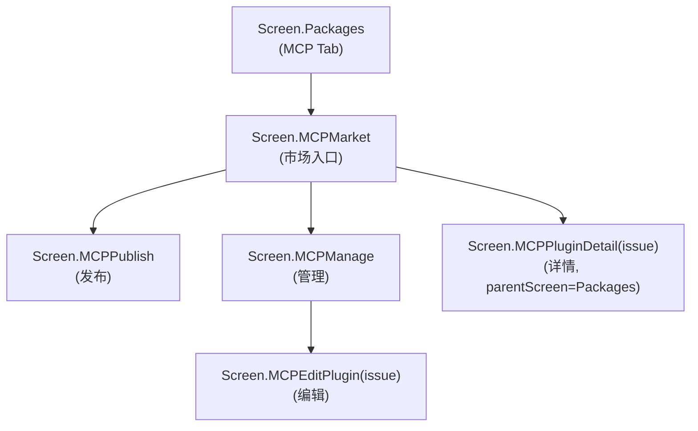
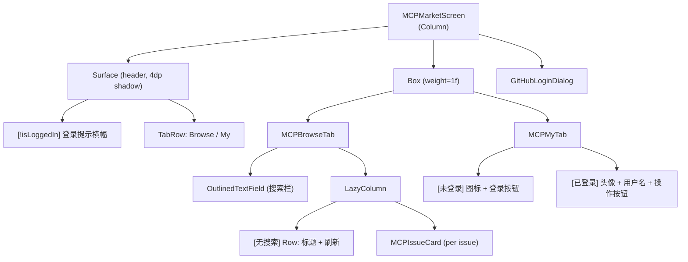
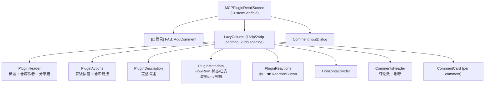

# Screen.MCPMarket 与 MCPPluginDetail 页面结构

本文档描述 MCP 市场相关页面：MCPMarket（浏览/我的）和 MCPPluginDetail（插件详情）。另含部署相关的 4 个对话框组件。

## 一、总体架构

MCP (Model Context Protocol) 市场与 Skill 市场结构高度相似，同样以 **GitHub Issues** 作为数据源（仓库 `AAswordman/OperitMCPMarket`，标签 `mcp-plugin`）。核心差异在于**双路径安装流程**（配置合并 vs 物理安装）和**安装进度追踪**。

**源码规模：** MCPMarketScreen 832 行 + MCPPluginDetailScreen 724 行 + MCPMarketViewModel 1574 行 + 部署组件 ~1046 行。

### 导航关系



注：`MCPPluginDetail` 的 `parentScreen = Packages`（非 MCPMarket），返回键直接回 Packages。

---

## 二、MCPMarketViewModel

### 2.1 核心参数

| 参数 | 值 |
|------|------|
| 市场仓库 | `AAswordman/OperitMCPMarket` |
| Issue 标签 | `mcp-plugin` |
| 分页大小 | 50 |
| 搜索去抖 | 350ms |
| 头像缓存上限 | 500 条（超过清理一半） |

### 2.2 与 SkillMarketViewModel 对比

| 维度 | MCPMarketViewModel | SkillMarketViewModel |
|------|-------------------|---------------------|
| 行数 | 1574 | 922 |
| 安装进度 | `installProgress: Map<String, InstallProgress>` | 无（仅 installing Set） |
| 安装路径 | 双路径（配置合并 / 物理安装） | 单路径 |
| 头像持久化 | SharedPreferences `github_avatar_cache` | 仅内存 |
| 草稿字段 | 6 个（含 installConfig, tags, category） | 3 个 |
| JSON 前缀 | `<!-- operit-mcp-json: ... -->` | `<!-- operit-skill-json: ... -->` |

### 2.3 StateFlow 清单

| StateFlow | 类型 | 说明 |
|-----------|------|------|
| `mcpIssues` | `List<GitHubIssue>` | 派生：浏览或搜索结果 |
| `isLoading` / `isLoadingMore` / `hasMore` | `Boolean` | 加载/分页 |
| `errorMessage` | `String?` | Toast 错误 |
| `searchQuery` | `String` | 搜索词 |
| `installingPlugins` | `Set<String>` | 安装中的 pluginId 集合 |
| `installProgress` | `Map<String, InstallProgress>` | 安装进度（Downloading%/Extracting/Other） |
| `installedPluginIds` | `Set<String>` | 已安装（MCPRepository Flow） |
| `userPublishedPlugins` | `List<GitHubIssue>` | 用户发布的 Issues |
| `issueComments` | `Map<Int, List<GitHubComment>>` | 评论缓存 |
| `issueReactions` | `Map<Int, List<GitHubReaction>>` | 反应缓存 |
| `userAvatarCache` | `Map<String, String>` | 头像 URL (内存 + SharedPreferences) |
| `repositoryCache` | `Map<String, GitHubRepository>` | 仓库 stars 等缓存 |

### 2.4 双路径安装流程

```
installMCPFromIssue(issue)
  → 解析 InstallationInfo (repoUrl, installConfig)
  → checkConfigNeedsPhysicalInstallation()
    ├── [false: npx/uvx 等] → MCPLocalServer.mergeConfigFromJson()
    │     直接合并配置，无需下载
    └── [true: 需物理安装]
          → 构建 PluginMetadata
          → mcpRepository.installMCPServerWithObject(server) { progress → }
            → 实时更新 installProgress (Downloading X% / Extracting / ...)
```

---

## 三、MCPMarketScreen (浏览 + 我的)

### 3.1 组件树



### 3.2 MCPIssueCard

与 SkillIssueCard 几乎相同，唯一差异：安装中状态区分 `Downloading` / `Extracting` / 其他（SkillIssueCard 只有不确定进度条）。

```
Card (clickable)
└── Row
    ├── Column (weight=1f)
    │   ├── Text (标题, bold, 1行)
    │   ├── Text (描述, 2行)
    │   └── Row (作者头像 + 发布者头像 + 👍 + ❤️)
    └── Surface (34dp 圆形)
        ├── [安装中 Downloading] CircularProgressIndicator(确定进度)
        ├── [安装中 其他] CircularProgressIndicator(不确定)
        ├── [已安装] Icon(Check)
        ├── [可用] Icon(Download)
        └── [已关闭] Icon(Info)
```

安装按钮颜色：已安装=`secondaryContainer`，安装中=`primaryContainer`，可用=`primary`，关闭=`surfaceVariant`。

### 3.3 无限滚动

与 SkillMarket 相同：`snapshotFlow { lastVisibleIndex }` 距末尾 2 项触发加载，仅在非搜索模式下分页。

---

## 四、MCPPluginDetailScreen (插件详情)

### 4.1 组件树



### 4.2 PluginHeader

```
Column
├── Text (标题, headlineMedium, bold)
├── Row: 仓库作者头像(24dp) + "Author: {owner}"
└── Row: 发布者头像(20dp) + "Shared by: {login}"
```

### 4.3 PluginActions

```
Row
├── [state=open]
│   ├── [已安装] Button(disabled, Check, "Installed")
│   ├── [安装中 Downloading] Button(disabled, "Downloading X%")
│   ├── [安装中 Extracting] Button(disabled, "Extracting...")
│   ├── [安装中 其他] Button(disabled, "Installing...")
│   └── [可安装] Button(Download, "Install")
└── [有仓库URL] OutlinedButton(Code, "Repository" → 浏览器)
```

### 4.4 PluginMetadata

`Card` + `FlowRow` 展示 `MetadataChip`：

| Chip | 图标 | 内容 | 条件 |
|------|------|------|------|
| 状态 | Info | "Available"(绿) / "Closed" | 始终 |
| 已安装 | CheckCircle | "Installed"(绿) | 已安装时 |
| Stars | Star | "{count} stars" | 仓库信息加载后 |
| 创建时间 | CalendarToday | 日期 | 始终 |
| 更新时间 | Update | 日期 | 始终 |

### 4.5 PluginReactions

```
Column
├── Text ("Community Feedback")
├── [未登录] Text (登录提示)
└── Row
    ├── ReactionButton (👍, count, 已反应时着色+禁用)
    └── ReactionButton (❤️, count, 颜色#E91E63)
```

`ReactionButton` 使用 `FilledTonalButton` + `AnimatedContent` 动画计数。已反应时容器 alpha=0.12f 着色。

### 4.6 CommentCard

```
Card (surfaceColorAtElevation 2dp)
└── Row
    ├── Image (头像 40dp 圆形)
    └── Column
        ├── Row: 用户名(bold) + 时间
        └── Text (评论内容)
```

---

## 五、部署相关组件

以下 4 个组件用于 MCPManageScreen 的部署流程（由 `MCPDeployViewModel` 驱动）。

### 5.1 MCPDeployViewModel (255 行)

| StateFlow | 类型 | 说明 |
|-----------|------|------|
| `deploymentStatus` | `DeploymentStatus` | NotStarted / InProgress / Success / Error |
| `currentDeployingPlugin` | `String?` | 当前部署的插件名 |
| `outputMessages` | `List<String>` | 过滤后的 stdout 日志 |
| `generatedCommands` | `List<String>` | 自动生成的部署命令 |
| `environmentVariables` | `Map<String, String>` | 用户自定义环境变量 |

双插件类型处理：
- `virtual://` 路径 → 直接部署（空命令，npx/uvx 等）
- 常规路径 → `MCPDeployer.getDeployCommands()` → `deployPluginWithCommands()`

### 5.2 MCPDeployConfirmDialog (115 行)

三按钮 `Dialog`：Cancel / Custom Command / Direct Deploy。

### 5.3 MCPDeployProgressDialog (290 行)

不可中途关闭的进度对话框：
- 标题动态变化：Deploying... / Deploy Success / Deploy Failed
- `LinearProgressIndicator` + 状态消息
- 日志区域：`LazyColumn` (≤180dp) 等宽字体，自动滚动到底
- 内嵌 `MCPEnvironmentVariablesDialog`（通过设置图标触发）
- 操作按钮：重试（仅失败时）/ 关闭

### 5.4 MCPCommandsEditDialog (246 行)

可编辑命令对话框：`BasicTextField` (Monospace 13sp, 160-240dp) + 确认部署。

### 5.5 MCPEnvironmentVariablesDialog (144 行)

环境变量管理：现有变量列表（可删除）+ 新增输入（Name + Value）。

---

## 六、数据模型

```kotlin
// Issue 解析结果
data class ParsedPluginInfo(
    val title: String, val description: String,
    val repositoryUrl: String, val installConfig: String,
    val category: String, val tags: String,
    val version: String, val repositoryOwner: String,
    val repositoryOwnerAvatarUrl: String
)

// 嵌入 JSON 元数据
data class MCPMetadata(
    val description: String, val repositoryUrl: String,
    @JsonNames("installCommand") val installConfig: String,
    val category: String, val tags: String, val version: String
)

// 安装信息
data class InstallationInfo(
    val repoUrl: String?, val installConfig: String?,
    val installationType: String
)

// 安装进度
sealed class InstallProgress {
    data class Downloading(val percent: Int) : InstallProgress()
    object Extracting : InstallProgress()
    data class Other(val message: String) : InstallProgress()
}

// 发布草稿
data class PublishDraft(
    val title: String, val description: String,
    val repositoryUrl: String, val tags: String,
    val installConfig: String, val category: String
)

// 部署状态
sealed class DeploymentStatus {
    object NotStarted
    data class InProgress(val message: String)
    data class Success(val message: String)
    data class Error(val message: String)
}
```

---

## 七、对话框清单

| 对话框 | 所在组件 | 触发 |
|--------|----------|------|
| GitHubLoginDialog | MCPMarketScreen | 登录横幅/按钮 |
| CommentInputDialog | MCPPluginDetailScreen | FAB 点击 |
| MCPDeployConfirmDialog | MCPManageScreen | 部署按钮 |
| MCPDeployProgressDialog | MCPManageScreen | 确认部署后 |
| MCPCommandsEditDialog | MCPManageScreen | "Custom Command"按钮 |
| MCPEnvironmentVariablesDialog | MCPDeployProgressDialog | 设置图标 |

---

## 八、用户交互 → 动作映射

| 交互 | 执行动作 |
|------|----------|
| 搜索输入 | `onSearchQueryChanged()` → 350ms 去抖 → GitHub Search API |
| 卡片点击 | 导航到 `MCPPluginDetail(issue)` |
| 安装按钮 | `installMCPFromIssue(issue)` → 双路径安装 |
| 仓库按钮 | `ACTION_VIEW` 打开浏览器 |
| 👍/❤️ 按钮 | `addReactionToIssue(issueNumber, content)` |
| 评论发布 | `postComment(issueNumber, text)` |
| 发布新插件 | 跳转 MCPPublish 页面 |
| 管理我的 | 跳转 MCPManage 页面 |
| 登出 | `logoutFromGitHub()` |

---

## 九、架构要点

1. **双路径安装**：npx/uvx 类插件只需合并 JSON 配置（`mergeConfigFromJson`），无需下载文件；其他插件走物理安装流程（下载→解压→部署），有确定性进度追踪。

2. **InstallProgress 精细追踪**：相比 Skill 市场的二态（安装中/已完成），MCP 市场追踪下载百分比、解压状态等，卡片和详情页实时显示不同阶段文案。

3. **头像持久化缓存**：`SharedPreferences("github_avatar_cache")` 持久化头像 URL，超过 500 条自动清理一半（LRU 策略缺失，直接删半）。

4. **部署流程分离**：`MCPDeployViewModel` 独立于 `MCPMarketViewModel`，专门处理已安装插件的部署命令生成和执行，支持自定义命令和环境变量。

5. **MCPRecommendedTab 死代码**：Browse/My 两个 Tab 之外存在一个 "Recommended" Tab 组件（仅显示"Coming Soon"），未接入 TabRow。

---

## 十、核心文件清单

| 文件 | 路径 (相对于 `ui/features/packages/screens/`) | 行数 | 职责 |
|------|------|------|------|
| **MCPMarketScreen** | `MCPMarketScreen.kt` | 832 | 市场入口 (Browse + My) |
| **MCPPluginDetailScreen** | `MCPPluginDetailScreen.kt` | 724 | 插件详情 + 反应 + 评论 |
| **MCPMarketViewModel** | `mcp/viewmodel/MCPMarketViewModel.kt` | 1574 | 市场 ViewModel |
| **MCPDeployViewModel** | `mcp/viewmodel/MCPDeployViewModel.kt` | 255 | 部署流程 ViewModel |
| **MCPPluginParser** | `mcp/utils/MCPPluginParser.kt` | 196 | Issue body 解析 |
| **MCPDeployConfirmDialog** | `mcp/components/MCPDeployConfirmDialog.kt` | 115 | 部署确认 |
| **MCPDeployProgressDialog** | `mcp/components/MCPDeployProgressDialog.kt` | 290 | 部署进度 + 日志 |
| **MCPCommandsEditDialog** | `mcp/components/MCPCommandsEditDialog.kt` | 246 | 命令编辑 |
| **MCPEnvironmentVariablesDialog** | `mcp/components/MCPEnvironmentVariablesDialog.kt` | 144 | 环境变量管理 |
