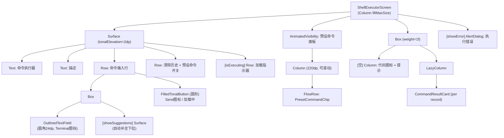

# Screen.ShellExecutor 页面结构

本文档描述 `Screen.ShellExecutor` 命令执行器的 UI 组件树和交互。

## 一、总体架构

`Screen.ShellExecutor` 是独立的 Shell 命令执行器，提供命令输入、历史自动补全、预设命令集、结果展示（stdout/stderr/exitCode）。根据当前权限等级（STANDARD/ACCESSIBILITY/DEBUGGER/ADMIN/ROOT）自动选择执行后端。

**源码规模：** ShellExecutorScreen 725 行 + ShellCommandManager 239 行。

### 导航属性

| 属性 | 值 |
|------|------|
| parentScreen | Toolbox |
| navItem | NavItem.Toolbox |
| 子页面 | 无 |

---

## 二、组件树



---

## 三、状态管理

无 ViewModel，全部局部状态：

| 状态 | 类型 | 说明 |
|------|------|------|
| `commandInput` | `String` | 命令输入框 |
| `isExecuting` | `Boolean` | 执行中标记 |
| `commandHistory` | `List<CommandRecord>` | 内存中的执行历史 |
| `showPresets` | `Boolean` | 预设命令面板显示 |
| `showSuggestions` | `Boolean` | 自动补全下拉 |
| `suggestionsList` | `List<String>` | 补全候选列表 |
| `errorMessage` / `showError` | `String?` / `Boolean` | 错误对话框 |

---

## 四、命令执行流程

```
executeCommand(command)
  → ShellCommandManager.executeCommand(command) [Dispatchers.IO]
    → AndroidShellExecutor.executeShellCommand(command)
      → 读取 androidPermissionPreferences 当前权限等级
      → ShellExecutorFactory 选择执行器
        ├── STANDARD → 标准 Shell
        ├── DEBUGGER → Shizuku Shell
        ├── ROOT → Root Shell
        └── 其他等级 → 对应执行器
      → CommandResult(success, stdout, stderr, exitCode)
    → 包装为 CommandRecord(command, result, timestamp)
  → 前插到 commandHistory
```

权限不足时不降级，直接返回失败结果。

---

## 五、预设命令 (16 个)

| 分类 | 命令 |
|------|------|
| 系统 (SYSTEM) | echo 测试、uname -a、df -h、ps、getprop |
| 硬件 (HARDWARE) | /proc/meminfo、/proc/cpuinfo |
| 网络 (NETWORK) | ip addr、ip route、/proc/net/tcp |
| 应用 (PACKAGE) | pm list packages、-s 系统应用、-3 第三方 |
| 文件 (FILE) | ls -la、ls -la /、ls -lh /sdcard |

---

## 六、CommandResultCard

```
Card (圆角 16dp, elevation 2dp)
├── Row (header, primaryContainer 0.7f 背景)
│   ├── Box (40dp 圆形) → Terminal 图标
│   ├── Column: 命令(monospace, 1行) + 时间戳
│   ├── Box (10dp 圆点): 绿=成功, 红=失败
│   └── IconButton: 展开/收起
└── AnimatedVisibility (expanded)
    └── Column
        ├── [有 stdout] Text "标准输出:" + Surface(monospace 12sp)
        ├── [有 stderr] Text "标准错误:" + Surface(errorContainer, monospace)
        └── Row: 退出代码(红色 if ≠0) + "重新执行"按钮
```

---

## 七、架构要点

1. **无持久化**：`ShellCommandManager.saveCommandToHistory()` 和 `getCommandHistory()` 的 JSON 序列化代码被注释掉，始终返回 `emptyList()`。历史仅内存保留。

2. **权限等级路由**：通过 `androidPermissionPreferences` 读取当前等级，`ShellExecutorFactory` 自动选择 Shell 执行后端，不需要用户手动选择。

3. **自动补全**：`LaunchedEffect(commandInput)` 每次输入变化时从历史记录中匹配建议，下拉显示在输入框正下方。

---

## 八、核心文件清单

| 文件 | 路径 | 行数 | 职责 |
|------|------|------|------|
| **ShellExecutorScreen** | `ui/features/toolbox/screens/shellexecutor/ShellExecutorScreen.kt` | 725 | 页面 UI + 命令执行 |
| **ShellCommandManager** | `ui/features/toolbox/screens/shellexecutor/ShellCommandManager.kt` | 239 | 预设命令 + 历史管理 |
| **AndroidShellExecutor** | `core/tools/system/AndroidShellExecutor.kt` | 123 | 权限路由 + Shell 调用 |
