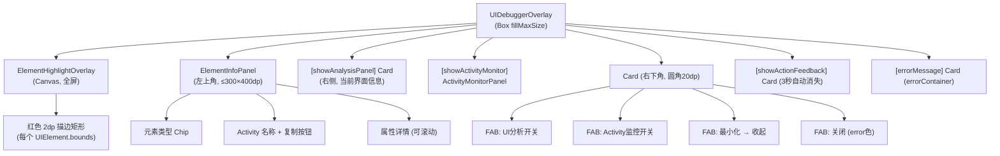

# Screen.UIDebugger 页面结构

本文档描述 `Screen.UIDebugger` 的 UI 组件树和交互。该工具的实际调试界面通过**浮动窗口服务**运行，不在 Compose 导航图内。

## 一、总体架构

`Screen.UIDebugger` 是 UI 调试工具，提供无障碍树可视化（元素高亮 + 属性检查）和 Activity 监控（实时事件捕获）。应用内页面仅为启动入口，调试功能通过 `UIDebuggerService` 前台服务 + `WindowManager` 浮动窗口实现。

**源码规模：** 7 个文件，共 ~2100 行。

### 架构分层

```
应用内 (Compose Navigation)
  Screen.UIDebugger → UIDebuggerScreen (启动入口)

浮动窗口 (WindowManager, 独立于 Navigation)
  UIDebuggerService (前台服务)
    → UIDebuggerWindowManager (窗口管理)
      → UIDebuggerFloatingContent
        ├── [收起] DraggableFloatingBall (56dp 蓝色圆球)
        └── [展开] UIDebuggerOverlay (全屏调试界面)

共享状态
  UIDebuggerViewModel (手动单例, companion object INSTANCE)
```

### 导航属性

| 属性 | 值 |
|------|------|
| parentScreen | Toolbox |
| navItem | NavItem.Toolbox |
| 子页面 | 无（调试界面通过浮动窗口） |

---

## 二、UIDebuggerScreen (应用内入口)

极简启动页面：

```
CustomScaffold
├── FAB: OpenInNew 图标
│   ├── [有悬浮窗权限] → 启动 UIDebuggerService
│   └── [无权限] → 跳转系统悬浮窗权限设置
└── Column (居中)
    ├── Icon (OpenInNew, 64dp)
    ├── Text (标题)
    └── Text (描述)
```

---

## 三、浮动窗口双模式

### 3.1 收起模式 (DraggableFloatingBall)

```
Surface (56dp 圆形, 蓝色 0.8 alpha)
└── Icon (Build, 白色)
```
- 可拖拽（更新 `WindowManager.LayoutParams.x/y`）
- 点击 → 展开为全屏调试界面

### 3.2 展开模式 (UIDebuggerOverlay)



---

## 四、状态管理

### 4.1 UIDebuggerViewModel (手动单例)

通过 `companion object { var INSTANCE }` 实现单例，确保应用内页面和浮动窗口服务共享同一状态。

### 4.2 UIDebuggerState

| 字段 | 类型 | 说明 |
|------|------|------|
| `elements` | `List<UIElement>` | 无障碍树解析的 UI 元素列表 |
| `selectedElementId` | `String?` | 高亮选中的元素 ID |
| `showActionFeedback` | `Boolean` | 操作反馈 Toast 显示 |
| `actionFeedbackMessage` | `String` | 反馈消息文本 |
| `errorMessage` | `String?` | 错误消息 |
| `currentAnalyzedActivityName` | `String?` | 扫描时的 Activity 名 |
| `currentAnalyzedPackageName` | `String?` | 扫描时的包名 |
| `isActivityListening` | `Boolean` | Activity 监控是否运行 |
| `activityEvents` | `List<ActionEvent>` | 事件缓冲区 (≤100 条) |
| `showActivityMonitor` | `Boolean` | 监控面板显示 |
| `currentActivityName` | `String?` | 最新 Activity 名（实时事件） |

### 4.3 浮动窗口本地状态

| 状态 | 说明 |
|------|------|
| `isUIAnalysisActive` | UI 分析模式开关 |
| `selectedElement` | 当前点击选中的元素 |
| `showAnalysisPanel` | "当前界面"信息卡显示 |
| `isExpanded` | 展开/收起模式切换 |

---

## 五、UI 分析功能

### 5.1 元素扫描

点击 UI 分析 FAB → `viewModel.refreshUI()` → 调用 AI 工具 `get_page_info` → 解析无障碍树 → 生成 `UIElement` 列表。

### 5.2 元素高亮

`Canvas` 全屏绘制，每个 `UIElement.bounds` 画红色 2dp 描边矩形。

### 5.3 元素选择

`detectTapGestures` 检测点击位置，选中包含该点的**最小边界框**元素 → 打开 `ElementInfoPanel`。

### 5.4 ElementInfoPanel

| 信息 | 说明 |
|------|------|
| 元素类型 | `primaryContainer` Chip |
| Activity 名 | 可复制到剪贴板 |
| 包名 | 文本显示 |
| 属性详情 | class/resourceId/contentDesc/text/bounds/clickable |
| 尺寸 | 像素值（bounds 非空时） |

### 5.5 元素操作

通过 `viewModel.performElementAction()`：

| 动作 | 效果 |
|------|------|
| CLICK | AI 工具 `click_element`（按 resourceId 或 text 选择器） |
| HIGHLIGHT | 选中元素 + 反馈 Toast |
| INSPECT | 同 HIGHLIGHT |

---

## 六、Activity 监控

### 6.1 启动流程

```
Start Monitoring 按钮
  → viewModel.startActivityListening()
    → ActionListenerFactory.getHighestAvailableListener(context)
    → listener.startListening { event → }
      → 过滤自身包名
      → 追加到 activityEvents (≤100 条缓冲)
      → 更新 currentActivityName
```

### 6.2 ActivityMonitorPanel

```
Surface (300-400dp 宽, ≤500dp 高, elevation 8dp)
├── 标题栏: 图标 + "Activity Monitor" + 关闭
├── 状态卡: 监听中(errorContainer) / 已停止(surfaceVariant)
├── 控制行: 开始/停止按钮 + 清除按钮
├── [有 currentActivityName] Card: 当前 Activity 名
└── [有事件] LazyColumn (倒序)
    └── ActivityEventItem (per event)
        └── Card (颜色按 ActionType 区分)
            ├── Row: 事件类型 + HH:mm:ss 时间戳
            ├── [有 className] Text: Activity 类名
            ├── Text: text/resourceId/packageName
            └── [有附加数据] Text: additionalData
```

---

## 七、数据模型

```kotlin
data class UIElement(
    val id: String,
    val className: String?,
    val resourceId: String?,
    val contentDescription: String?,
    val text: String?,
    val bounds: Rect?,
    val isClickable: Boolean,
    val children: List<UIElement>
)

data class UIDebuggerState(
    val elements: List<UIElement>,
    val selectedElementId: String?,
    val showActionFeedback: Boolean,
    val actionFeedbackMessage: String,
    val errorMessage: String?,
    val currentAnalyzedActivityName: String?,
    val currentAnalyzedPackageName: String?,
    val isActivityListening: Boolean,
    val activityEvents: List<ActionEvent>,
    val showActivityMonitor: Boolean,
    val currentActivityName: String?
)
```

---

## 八、架构要点

1. **应用外调试**：实际调试 UI 通过 `UIDebuggerService` 前台服务 + `WindowManager` 浮动窗口渲染，独立于 Compose Navigation 图。这使得可以在任何应用上叠加调试界面。

2. **ViewModel 手动单例**：`companion object { var INSTANCE }` 而非 Hilt/ViewModelProvider，确保应用内入口页面和浮动窗口服务共享完全相同的状态实例。

3. **双模式浮动窗口**：收起为可拖拽 56dp 蓝色圆球，展开为全屏透明叠加层 + 控制栏。`isExpanded` 切换 `WindowManager.LayoutParams` 的尺寸。

4. **事件缓冲区限制**：Activity 监控事件最多 100 条，超出后旧事件被丢弃。面板关闭不停止监听。

5. **CreatePackageDialog 死代码**：`UIDebuggerComponents.kt` 中定义了一个 `CreatePackageDialog`（应用名+包名+描述），但无任何调用点，为残留代码。

---

## 九、核心文件清单

| 文件 | 路径 | 行数 | 职责 |
|------|------|------|------|
| **UIDebuggerScreen** | `ui/features/toolbox/screens/uidebugger/UIDebuggerScreen.kt` | 102 | 应用内启动入口 |
| **UIDebuggerComponents** | `ui/features/toolbox/screens/uidebugger/UIDebuggerComponents.kt` | 690 | 浮动窗口全部 UI 组件 |
| **UIDebuggerViewModel** | `ui/features/toolbox/screens/uidebugger/UIDebuggerViewModel.kt` | 448 | 单例 ViewModel |
| **UIDebuggerState** | `ui/features/toolbox/screens/uidebugger/UIDebuggerState.kt` | 88 | 状态数据类 + UIElement |
| **ActivityMonitorPanel** | `ui/features/toolbox/screens/uidebugger/components/ActivityMonitorPanel.kt` | 439 | Activity 监控面板 |
| **UIDebuggerService** | `services/UIDebuggerService.kt` | 138 | 前台服务 |
| **UIDebuggerWindowManager** | `services/floating/UIDebuggerWindowManager.kt` | 195 | 浮动窗口管理 |
