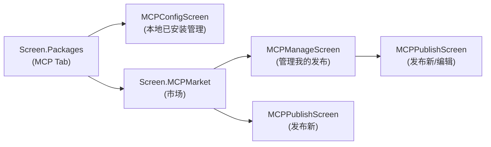
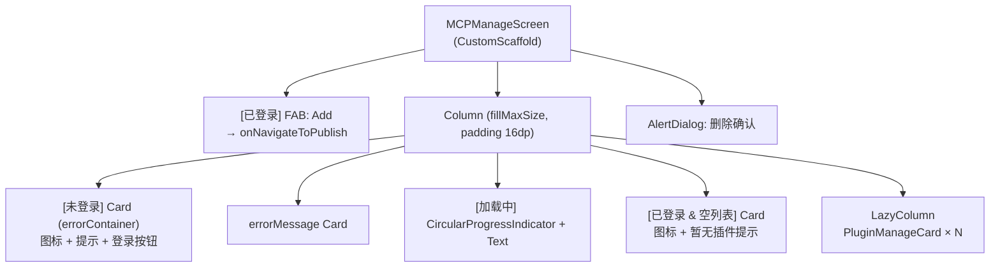
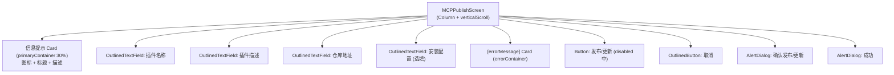
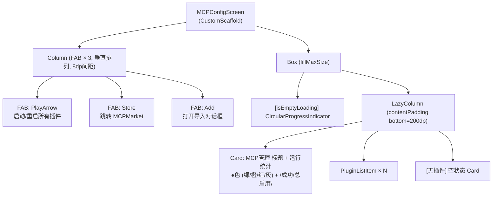
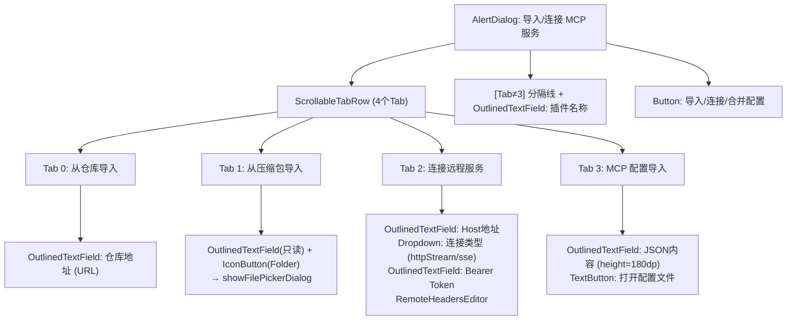

# Screen.MCPManage / MCPPublish / MCPConfig 页面结构

本文档描述 MCP 插件管理相关的 3 个页面：MCPManageScreen（管理已发布插件）、MCPPublishScreen（发布/编辑插件）、MCPConfigScreen（本地 MCP 插件配置管理）。

## 一、总体架构

三个页面分别承担 MCP 生命周期的不同阶段：



| 页面 | 主要关注点 | 数据源 |
|------|-----------|--------|
| MCPConfigScreen | 本地已安装/已配置的 MCP 服务器 | `MCPLocalServer` + `MCPRepository` |
| MCPManageScreen | 自己发布在 GitHub 的 MCP 插件 | `MCPMarketViewModel.userPublishedPlugins` |
| MCPPublishScreen | 提交/更新 GitHub Issue | `MCPMarketViewModel.publishMCP/updatePublishedPlugin` |

**源码规模：**
- `MCPConfigScreen.kt` 1904 行
- `MCPManageScreen.kt` 424 行（含 PluginManageCard）
- `MCPPublishScreen.kt` 347 行

---

## 二、MCPManageScreen（管理已发布插件）

### 2.1 入口与参数

```kotlin
fun MCPManageScreen(
    onNavigateBack: () -> Unit,
    onNavigateToEdit: (GitHubIssue) -> Unit,
    onNavigateToPublish: () -> Unit,
    viewModel: MCPMarketViewModel
)
```

进入页面时 `LaunchedEffect` 检测登录状态：已登录则调用 `viewModel.loadUserPublishedPlugins()`，否则直接弹出登录对话框。

### 2.2 组件树



### 2.3 PluginManageCard 结构

```
Card (fillMaxWidth, 颜色随 state 变化)
└── Column (padding 16dp)
    ├── Row (SpaceBetween)
    │   ├── Column (weight=1f)
    │   │   ├── Text (title, bold, maxLines=2)
    │   │   └── Row
    │   │       ├── Icon (CheckCircle/Cancel)
    │   │       └── Text ("已发布"/"已下架", color=primary/outline)
    │   └── Surface (secondaryContainer)
    │       └── Text ("#${issue.number}")
    ├── [描述非空] Text (前150字符)
    ├── [有标签] LazyRow (取前3个 label)
    └── Row (按钮区)
        ├── OutlinedButton "编辑" → onEdit
        └── [isOpen] OutlinedButton "移除" → showDeleteDialog
            或 [closed] Button "重新发布" → viewModel.reopenPublishedPlugin
```

卡片背景色：`isOpen=true` → `surface`，`false` → `surfaceVariant.copy(alpha=0.5f)`。

### 2.4 删除确认对话框

触发：点击"移除"按钮 → `showDeleteDialog = plugin`。

```
AlertDialog
├── title: "确认删除"
├── text: "确认从市场移除 ${plugin.title}？"
├── confirm → viewModel.deletePublishedPlugin(number, title) + close
└── dismiss → close
```

### 2.5 交互流程

```
加载：LaunchedEffect → isLoggedIn? → loadUserPublishedPlugins()
编辑：card.onEdit → onNavigateToEdit(plugin) → MCPPublishScreen(editingIssue)
发布新：FAB → onNavigateToPublish() → MCPPublishScreen()
移除：confirm → deletePublishedPlugin (关闭 Issue)
重新发布：Button → reopenPublishedPlugin (重新打开 Issue)
```

---

## 三、MCPPublishScreen（发布/编辑插件）

### 3.1 双模式设计

```kotlin
fun MCPPublishScreen(
    onNavigateBack: () -> Unit,
    editingIssue: GitHubIssue? = null,  // null = 新建, 非null = 编辑
    viewModel: MCPMarketViewModel
)
```

`isEditMode = editingIssue != null`，影响：
- 表单初始值来源（编辑模式从 `parsePluginInfoFromIssue(issue)` 填充，新建从 `publishDraft`）
- 草稿自动保存（仅新建模式有 `LaunchedEffect` 实时保存到 `viewModel.publishDraft`）
- 按钮文字："发布到市场" / "更新插件"
- 成功后行为：编辑不清草稿，新建调用 `viewModel.clearDraft()`

### 3.2 表单字段

| 字段 | 类型 | 验证规则 |
|------|------|---------|
| title（插件名称） | OutlinedTextField, singleLine | 仅字母/数字/下划线（实时过滤），不能为空 |
| description（描述） | OutlinedTextField, minLines=3 | 不能为空 |
| repositoryUrl（GitHub 仓库地址） | OutlinedTextField, singleLine | 不能为空，placeholder 示例 |
| installConfig（安装配置） | OutlinedTextField, minLines=3, leadingIcon=Terminal | 选填，用于 MCP JSON 安装命令 |

版本字段固定为 `v1`，不暴露给用户。

### 3.3 组件树



### 3.4 确认对话框内容

```
AlertDialog
├── title: "确认发布" / "确认更新"
├── text:
│   ├── "请检查提交信息"
│   ├── "名称: ${title}"
│   ├── "描述: ${description}"
│   ├── "仓库: ${repositoryUrl}"
│   ├── [installConfig非空] "安装配置: ..."
│   └── Text(红色) "确认后将通过 Git 导入部署..."
├── confirm → 执行 publishMCP / updatePublishedPlugin
└── dismiss → 关闭
```

### 3.5 提交逻辑

```
Button.onClick
  → 校验 title/description/repositoryUrl 非空
  → showConfirmationDialog = true
    → confirm:
        isPublishing = true
        if (isEditMode)
          viewModel.updatePublishedPlugin(issueNumber, title, description, repositoryUrl, installConfig, "v1")
        else
          viewModel.publishMCP(title, description, repositoryUrl, installConfig, "v1")
        → success: showSuccessDialog = true (新建则 clearDraft)
        → failure: errorMessage = "发布失败..."
        isPublishing = false
```

---

## 四、MCPConfigScreen（本地 MCP 插件配置管理）

这是 `Screen.Packages` MCP Tab 内嵌的主管理界面，负责**本地已安装/已配置 MCP 服务器**的查看、启用/禁用、部署、导入和删除。

### 4.1 关键依赖

| 组件 | 职责 |
|------|------|
| `MCPLocalServer` | MCP 配置读写（`mcpConfig` Flow）、服务器启停状态 |
| `MCPRepository` | 已安装插件列表（`installedPluginIds`）、插件元数据 |
| `MCPViewModel` | 安装/卸载/添加远程服务 |
| `MCPDeployViewModel` | 部署命令生成与执行 |
| `MCPBridgeClient` | 运行时查询每个插件已加载的工具列表 |
| `LocalPluginLoadingState` | 全局插件加载进度（Composition Local） |

### 4.2 插件可见集合逻辑

```
configuredPluginIds  (mcpConfig.mcpServers.keys)
remotePluginIds      (mcpConfig.pluginMetadata where type=="remote")
discoveredInstalledPluginIds  (MCPRepository.installedPluginIds)

visiblePluginIds = configuredPluginIds ∪ remotePluginIds ∪ discoveredInstalledPluginIds
```

### 4.3 列表排序（初次加载后锁定）

```
sortedWith(
  compareBy { enabled && toolsLoaded → 0 | enabled → 1 | else → 2 }
  .thenBy { displayName.lowercase }
)
// 首次工具加载完成后 lockedPluginOrder 冻结顺序，避免跳动
```

### 4.4 组件树



### 4.5 PluginListItem 结构

```
Card (clickable → 打开 MCPServerDetailsDialog)
└── Column (padding 12dp)
    ├── Row (主信息行)
    │   ├── Box 28dp (圆角6dp, primaryContainer 背景)
    │   │   ├── Icon.Extension (16dp, onPrimaryContainer)
    │   │   └── [isRunning] 绿点 (6dp, TopEnd)
    │   ├── Column (weight=1f)
    │   │   ├── Text (displayName, bodyMedium, bold, maxLines=1)
    │   │   └── [标签] Surface × N (official/remote/deployed/config_invalid)
    │   └── Switch (0.8f scale, 启用/禁用)
    ├── [toolNames非空] Box (LazyRow工具标签 + ArrowForward, clickable→工具详情)
    │   └── Surface × min(5, n) + [n>5] "+N" chip
    └── Row (操作按钮)
        ├── [非远程] OutlinedButton "部署"/"重新部署"
        └── OutlinedButton "编辑"
```

状态指示点颜色：
- 绿色：`isRunning = true`
- 无点：未运行

### 4.6 导入对话框（4 Tab）

触发：FAB Import → `showImportDialog = true`



| Tab | 后端操作 |
|-----|---------|
| 0 (仓库) | `viewModel.installServerWithObject(server)` |
| 1 (压缩包) | `viewModel.installServerFromZip(server, zipPath)` |
| 2 (远程) | `viewModel.addRemoteServer(server)` |
| 3 (配置JSON) | `mcpLocalServer.mergeConfigFromJson(json)` |

导入后调用 `awaitPluginVisible(importId)` 等待插件出现在列表中（最多 20s）。

### 4.7 对话框汇总

| 对话框 | 触发条件 | 组件 |
|--------|---------|------|
| 插件详情 | 点击插件卡片 | `MCPServerDetailsDialog`（含配置编辑） |
| 工具详情 | 点击工具标签区域 | `MCPPackageDetailsDialog` |
| 部署确认 | 点击"部署"按钮 | `MCPDeployConfirmDialog` |
| 命令编辑 | 选择"自定义"后 | `MCPCommandsEditDialog` |
| 部署进度 | 部署执行中 | `MCPDeployProgressDialog` |
| 安装进度 | 安装/卸载中 | `MCPInstallProgressDialog` |
| 导入插件 | FAB Import | `AlertDialog`（4 Tab 内联） |
| 文件选择 | Tab1 Folder 按钮 | `AlertDialog` + 系统文件选择器 |
| 远程服务编辑 | 列表项"编辑"按钮 | `RemoteServerEditDialog` |

### 4.8 FAB 三按钮行为

| FAB 图标 | 颜色 | 点击行为 |
|---------|------|---------|
| PlayArrow | secondaryContainer | `pluginLoadingState.initializeMCPServer()` 批量启动所有插件 |
| Store | tertiaryContainer | `onNavigateToMCPMarket()` |
| Add | primaryContainer | `showImportDialog = true` |

加载中时 PlayArrow 替换为不确定 `CircularProgressIndicator`。

### 4.9 运行状态统计卡片

```
Card (surfaceVariant 30% alpha)
└── Row
    ├── Text "MCP 管理" (weight=1f, titleMedium)
    └── Row
        ├── Box 8dp 圆点 (颜色判断)
        └── Text "${successfulToolRequests}/${totalEnabledPlugins}"
```

颜色判断：
- 灰：`totalEnabledPlugins == 0`
- 绿：`successfulToolRequests == totalEnabledPlugins`
- 橙：`successfulToolRequests > 0`
- 红：其他

---

## 五、RemoteServerEditDialog（远程服务编辑弹窗）

```kotlin
fun RemoteServerEditDialog(
    server: MCPLocalServer.PluginMetadata,
    onDismiss: () -> Unit,
    onSave: (MCPLocalServer.PluginMetadata) -> Unit
)
```

字段：name、description，若 `server.type == "remote"` 还有：endpoint、connectionType (dropdown)、bearerToken、headers (RemoteHeadersEditor)。

**RemoteHeadersEditor**：Key-Value 对列表，支持增删，通过 `onHeadersChange` 回调驱动外层状态。

---

## 六、页面状态汇总

### MCPManageScreen

| State | 类型 | 说明 |
|-------|------|------|
| `isLoading` | Boolean | 从 ViewModel 收集 |
| `userPublishedPlugins` | `List<GitHubIssue>` | 用户发布的插件 |
| `isLoggedIn` | Boolean | GitHub 登录状态 |
| `showDeleteDialog` | `GitHubIssue?` | 删除确认目标 |

### MCPPublishScreen

| State | 类型 | 说明 |
|-------|------|------|
| `title`, `description`, `repositoryUrl`, `installConfig` | String | 表单字段 |
| `isPublishing` | Boolean | 提交中 |
| `showConfirmationDialog` | Boolean | 确认弹窗 |
| `showSuccessDialog` | Boolean | 成功弹窗 |
| `errorMessage` | `String?` | 错误提示 |

### MCPConfigScreen（主要状态）

| State | 类型 | 说明 |
|-------|------|------|
| `visiblePluginIds` | `Set<String>` | 所有可见插件 |
| `sortedPluginIds` / `lockedPluginOrder` | `List<String>` | 排序并冻结后的列表 |
| `pluginToolsMap` | `Map<String, List<String>>` | 插件→工具名列表 |
| `serverStatusMap` | Map | 服务器运行状态 |
| `isRefreshing`, `isToolsLoading`, `isImporting`, `isPluginLoading` | Boolean | 加载状态合并 |
| `showImportDialog` | Boolean | 导入弹窗 |
| `importTabIndex` | Int (0-3) | 当前导入 Tab |
| `selectedPluginForDetails` | `PluginMetadata?` | 详情对话框 |
| `pluginToDeploy` | `String?` | 部署中的插件ID |
