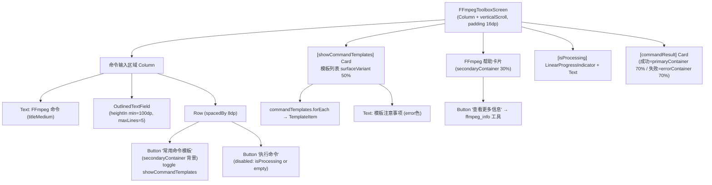
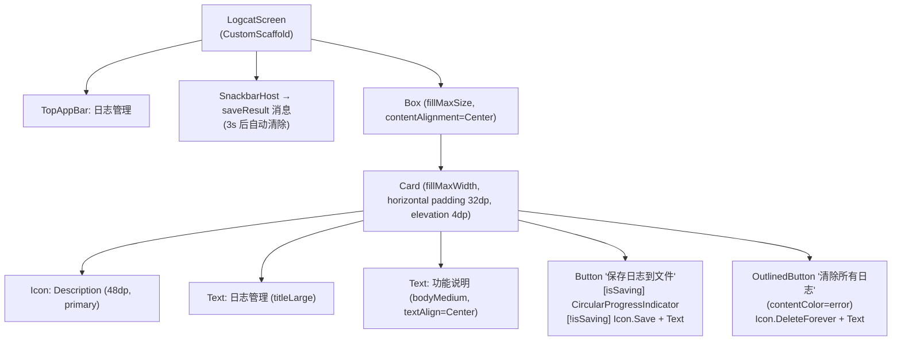

# Screen.FFmpegToolbox 与 Screen.Logcat 页面结构

本文档描述工具箱中两个媒体/系统工具页面：FFmpegToolboxScreen（FFmpeg 命令工具箱）和 LogcatScreen（日志导出工具）。

## 一、FFmpegToolboxScreen

### 1.1 定位

FFmpeg 工具箱页面提供直接输入并执行 FFmpeg 命令的能力，以及 5 个内置命令模板。底层通过 `AIToolHandler.executeTool("ffmpeg_execute")` 调用内置 FFmpeg 工具。

**源码规模：** `FFmpegToolboxScreen.kt` 419 行（含 `TemplateItem`、`CommandTemplate` 数据类）

### 1.2 组件树



### 1.3 命令模板列表

| 模板名称 | 命令示例 |
|---------|---------|
| 视频格式转换 | `-i input.mp4 -c:v h264 -c:a aac output.mp4` |
| 视频压缩 | `-i input.mp4 -vf scale=1280:-1 -c:v h264 -crf 23 -preset medium -c:a aac -b:a 128k output.mp4` |
| 视频裁剪 | `-i input.mp4 -ss 00:00:30 -t 00:00:10 -c:v copy -c:a copy output.mp4` |
| 提取音频 | `-i input.mp4 -vn -acodec copy output.aac` |
| 创建 GIF | `-i input.mp4 -vf "fps=10,scale=320:-1:flags=lanczos" -c:v gif output.gif` |

### 1.4 TemplateItem 结构

```
Card (clickable → onSelect: 将 template.command 填入 ffmpegCommand)
└── Row (fillMaxWidth, padding 12dp)
    ├── Column (weight=1f)
    │   ├── Text (name, bold)
    │   ├── Text (description, bodySmall, onSurfaceVariant)
    │   └── Text (command, bodySmall, primary 80%, maxLines=1)
    └── IconButton (ContentCopy 图标) → onSelect
```

### 1.5 结果展示（commandResult Card）

```
Card (圆角12dp)
└── Column (padding 16dp)
    ├── Row
    │   ├── Icon (CheckCircle/Error, 28dp)
    │   └── Text ("命令执行成功"/"命令执行失败")
    └── [失败] Text (result.error)
        或 [成功，FFmpegResultData]
            Text: "命令: ${ffmpegResult.command}"
            Text: "返回码: ${ffmpegResult.returnCode}"
            Text: "处理时间: ${ffmpegResult.duration}"
            [output非空] Text 标题 + Surface(Monospace 输出内容)
```

### 1.6 执行流程

```
Button "执行命令"
  → isProcessing = true, commandResult = null
  → scope.launch
      → AITool("ffmpeg_execute", [ToolParameter("command", ffmpegCommand)])
      → aiToolHandler.executeTool(tool)
      → commandResult = result
      → isProcessing = false
```

### 1.7 状态汇总

| State | 类型 | 说明 |
|-------|------|------|
| `ffmpegCommand` | String | 当前命令文本 |
| `isProcessing` | Boolean | 执行中 |
| `commandResult` | `ToolResult?` | 执行结果（含 FFmpegResultData） |
| `showCommandTemplates` | Boolean | 模板面板可见性 |

---

## 二、LogcatScreen

### 2.1 定位

应用日志导出工具，允许将 `AppLogger` 写入的日志文件导出保存或清除。UI 设计极简，以单张居中卡片呈现核心操作。

**源码规模：** `LogcatScreen.kt` 99 行 + `LogcatViewModel.kt` 72 行 + `LogcatManager.kt` 90 行 + `LogcatComponents.kt` 215 行（组件库，当前未在主屏幕使用）

### 2.2 组件树



### 2.3 LogcatViewModel

```kotlin
class LogcatViewModel(context: Context) : ViewModel() {
    val isSaving: StateFlow<Boolean>
    val saveResult: StateFlow<String?>   // 3s 后自动清除

    fun saveLogsToFile()  // → LogcatExportHelper.exportLogs(context)
    fun clearLogs()       // → LogcatManager.clearLogs() → AppLogger.resetLogFile()
}
```

### 2.4 LogcatManager

从 `AppLogger.getLogFile()` 读取日志文件，解析格式：

```
正则：^\d{4}-\d{2}-\d{2} \d{2}:\d{2}:\d{2}\.\d{3}\s+([VDIWEAF])/(.*?): (.*)
```

日志级别映射：V/D/I/W/E/A → VERBOSE/DEBUG/INFO/WARNING/ERROR/FATAL，无法解析的行降级为 UNKNOWN 保留显示。

### 2.5 LogcatComponents（组件库）

`LogcatComponents.kt` 提供两个通用组件（当前主屏幕未使用，预留供日志列表视图扩展）：

| 组件 | 说明 |
|------|------|
| `LogRecordItem` | 日志条目卡片，级别圆点 + tag 高亮（按字符串哈希生成色相）+ 时间戳 + Monospace 内容 |
| `CompactSearchField` | 自定义搜索框（36dp 高，胶囊形，BasicTextField 实现）|

`generateColorFromString(tag)` 算法：哈希取色相（0-360），固定饱和度 0.75 + 亮度 0.65 → HSL 颜色。

### 2.6 交互流程

```
Button "保存日志" → viewModel.saveLogsToFile()
    → LogcatExportHelper.exportLogs(context)
    → 成功/失败信息写入 saveResult → Snackbar 显示 3s

Button "清除所有日志" → viewModel.clearLogs()
    → AppLogger.resetLogFile() (清空日志文件)
```
