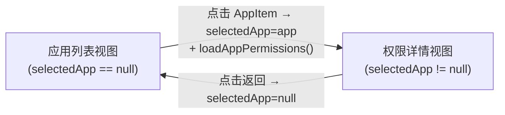
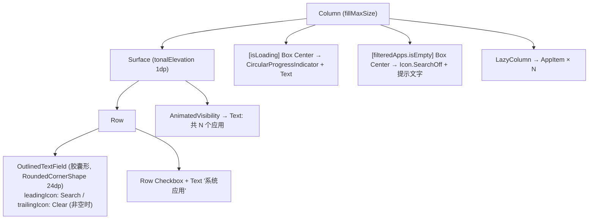
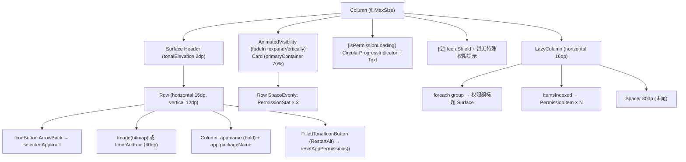

# Screen.AppPermissions 页面结构

本文档描述工具箱中的**应用权限管理器**（AppPermissionsScreen），支持浏览已安装应用的权限列表、动态授予/撤销危险权限（需要 Shizuku/ADB 权限）以及重置应用权限。

## 一、定位与权限要求

- 通过 `AndroidShellExecutor.executeShellCommand("pm grant/revoke/reset-permissions ...")` 操作权限
- 需要 Shizuku 或 ADB 级别系统权限
- **源码规模：** `AppPermissionsScreen.kt` 1517 行（含所有子组件）

## 二、双视图架构



切换动画：`AnimatedContent` 双向水平滑动（进入从右/退出向左，返回时反向）。

## 三、应用列表视图

### 3.1 组件树



### 3.2 过滤逻辑

```
filteredApps = installedApps
    .filter { app →
        (searchQuery.isEmpty || app.name.contains(query, ignoreCase=true) || app.packageName.contains(...))
        && (showSystemApps || !app.isSystemApp)
    }
    .sortedBy { it.name }
```

### 3.3 AppItem 结构

```
Card (clickable, RoundedCornerShape 12dp, elevation 1dp)
└── Row (padding 16dp)
    ├── Box 52dp (CircleShape 背景)
    │   └── Image (app.icon.toBitmap()) 或 Icon.Android
    ├── Column (weight=1f, padding horizontal 8dp)
    │   ├── Text (app.name, bold, maxLines=1)
    │   ├── Text (app.packageName, bodySmall, onSurfaceVariant)
    │   └── [isSystemApp] Row (红点 8dp + "系统应用" label, error 色)
    └── FilledIconButton (Security 图标 18dp, primaryContainer)
```

## 四、权限详情视图

### 4.1 组件树



### 4.2 权限概览统计卡片

```
Card (primaryContainer 70%, RoundedCornerShape 16dp)
└── Column (padding 16dp)
    ├── Text "权限概览" titleMedium
    └── Row SpaceEvenly
        ├── PermissionStat (总权限数, List 图标, onPrimaryContainer)
        ├── PermissionStat (已授权数, Check 图标, 绿色 #4CAF50)
        └── PermissionStat (危险权限数, Warning 图标, 橙色 #FF9800)
```

`PermissionStat`：48dp 圆形背景 + 数字(titleLarge, bold) + 标签(bodySmall)。

### 4.3 权限组分组

| 权限组 | 颜色 | 图标 |
|--------|------|------|
| ACTIVITY_RECOGNITION | 棕色 8D6E63 | DirectionsRun |
| CALENDAR | 靛蓝 7986CB | DateRange |
| CALL_LOG | 红色 E57373 | Call |
| CAMERA | 紫色 BA68C8 | PhotoCamera |
| CONTACTS | 蓝绿 4DB6AC | Contacts |
| LOCATION | 橙色 FFB74D | LocationOn |
| MICROPHONE | 天蓝 4FC3F7 | Mic |
| PHONE | 橙色 FF8A65 | Phone |
| SENSORS | 浅绿 9CCC65 | Sensors |
| SMS | 橙色 FF8A65 | Sms |
| STORAGE | 深紫 7E57C2 | Folder |
| OTHER_GRANTED | 绿色 66BB6A | Check |
| OTHER_DENIED | 蓝灰 78909C | Block |
| undefined | 灰色 9E9E9E | Info |

权限组标题：Surface (tonalElevation 1dp) + Row [36dp 彩色圆形图标 + 组名(bold) + N 个权限]

### 4.4 PermissionItem 结构

```
Card (RoundedCornerShape 12dp, elevation 动画: granted=2dp/denied=0dp)
└── Column
    ├── Box (fillMaxWidth, height 4dp, 彩色顶部条 — 组色，granted=0.9f/denied=0.4f)
    └── Row (padding 16dp)
        ├── Box 40dp (CircleShape)
        │   └── [dangerous] Icon.Warning (橙色 #FF9800)
        │       或 [!dangerous] Icon.Check(primary) / Icon.Lock(outline)
        ├── Column (weight=1f, horizontal padding 16dp)
        │   ├── Text (permission.name, titleSmall, medium)
        │   └── Text (permission.description, bodySmall, lineHeight=16sp)
        └── Switch
            ├── [granted] thumbContent = Icon.Check
            └── checked = permission.granted
                → onCheckedChange → onToggle()
```

## 五、权限操作（Shell 命令）

```
授予权限:  pm grant   <packageName> <android.permission.XXX>
撤销权限:  pm revoke  <packageName> <android.permission.XXX>
重置权限:  pm reset-permissions <packageName>
```

成功后**就地更新**单条权限状态（避免刷新整个列表），失败则弹出 AlertDialog 错误提示。

## 六、数据模型

```kotlin
data class AppInfo(
    val name: String,
    val packageName: String,
    val icon: Drawable?,
    val installTime: Long,
    val isSystemApp: Boolean  // FLAG_SYSTEM 判断
)

data class PermissionInfo(
    val name: String,          // 本地化名称
    val description: String,   // 本地化描述
    val granted: Boolean,
    val dangerous: Boolean,    // PROTECTION_DANGEROUS
    val group: String,         // 权限组 key
    val rawName: String        // android.permission.XXX，用于 pm 命令
)
```

## 七、状态汇总

| State | 类型 | 说明 |
|-------|------|------|
| `selectedApp` | `AppInfo?` | 控制双视图切换 |
| `searchQuery` | String | 搜索词 |
| `showSystemApps` | Boolean | 是否显示系统应用 |
| `isLoading` | Boolean | 应用列表加载中 |
| `installedApps` | `List<AppInfo>` | 全量应用列表 |
| `selectedAppPermissions` | `List<PermissionInfo>` | 当前应用的权限列表 |
| `isPermissionLoading` | Boolean | 权限加载中 |
| `groupedPermissions` | `Map<String, List<PermissionInfo>>` | 按组分组的权限（derived） |
| `showError` / `errorMessage` | Boolean/String? | 错误对话框 |
