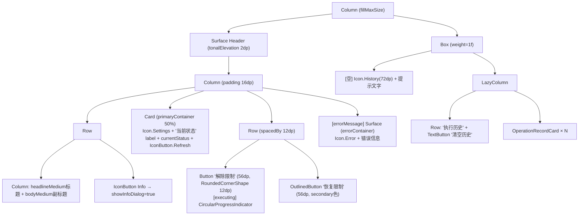

# Screen.ProcessLimitRemover 页面结构

本文档描述工具箱中的**进程限制解除工具**（ProcessLimitRemoverScreen），用于通过 `device_config` 命令修改 Android 幻象进程限制（phantom process limit），需要 Shizuku/ADB 权限。

## 一、定位与背景

Android 12+ 引入了幻象进程（Phantom Process）上限（默认 32 个），会导致后台子进程被系统杀死。此工具通过设置 `max_phantom_processes = 2147483647` 来解除该限制。

**源码规模：** `ProcessLimitRemoverScreen.kt` 684 行（含 `OperationRecordCard`、`ProcessLimitRecord`、`ProcessLimitAction`）

## 二、组件树



## 三、Shell 命令

| 操作 | 命令 1 | 命令 2 |
|------|--------|--------|
| 解除限制 | `device_config put activity_manager max_phantom_processes 2147483647` | `device_config set_sync_disabled_for_tests persistent` |
| 恢复限制 | `device_config delete activity_manager max_phantom_processes` | `device_config set_sync_disabled_for_tests none` |
| 查询状态 | `device_config get activity_manager max_phantom_processes` | — |

两个命令串行执行，结果合并（success = result1.success && result2.success）。

## 四、状态解析逻辑

```
stdout.trim() =
  "2147483647"           → "已解除限制 (2147483647)"
  int > 100              → "已解除限制 (N)"
  "null" 或 empty        → "系统默认"
  int ≤ 100              → "受限 (N 个)"
  其他                   → "未知状态"
```

初始化时 `LaunchedEffect(Unit)` 自动查询，刷新按钮可手动重查。

## 五、OperationRecordCard 结构

```
Card (RoundedCornerShape 12dp, elevation 2dp)
└── Row (padding 16dp)
    ├── Box 40dp CircleShape
    │   ├── [REMOVE] background=primary 20% + Icon.LockOpen (primary)
    │   └── [RESTORE] background=secondary 20% + Icon.Lock (secondary)
    ├── Column (weight=1f)
    │   ├── Text (操作名称, titleSmall, bold)
    │   └── Text (yyyy-MM-dd HH:mm:ss, bodySmall, onSurfaceVariant)
    └── Box 10dp CircleShape
        ├── [success] 绿色 #4CAF50
        └── [failure] 红色 #FF5252
```

## 六、对话框

| 对话框 | 触发 | 内容 |
|--------|------|------|
| 帮助信息 | Info 按钮 | 滚动内容：什么是幻象进程/优点/警告 |
| 操作结果 | 操作成功后 | CheckCircle/Error + 成功/失败信息 + [失败时] stderr |

## 七、状态汇总

| State | 类型 | 说明 |
|-------|------|------|
| `isExecuting` | Boolean | 命令执行中（禁用按钮） |
| `currentStatus` | `String?` | 当前进程限制状态文字 |
| `operationHistory` | `List<ProcessLimitRecord>` | 本次会话操作记录（最新在前） |
| `showInfoDialog` | Boolean | 帮助对话框 |
| `showResultDialog` | Boolean | 操作结果对话框 |
| `lastResult` | `ProcessLimitRecord?` | 最近一次操作结果 |
| `errorMessage` | `String?` | 执行错误信息（嵌入 Header 内展示） |
