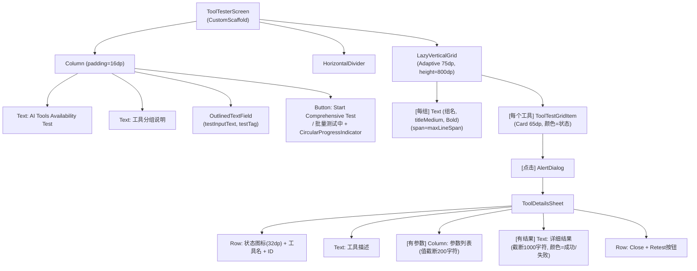

# Screen.ToolTester 页面结构

本文档描述 `Screen.ToolTester` AI 工具测试器的 UI 组件树和交互。

## 一、总体架构

`Screen.ToolTester` 提供对应用内 AI 工具集的可视化测试能力，将 ~28 个工具按 7 个分组展示为网格卡片，支持单个测试和批量测试，结果通过颜色编码实时反馈。

**源码规模：** 单文件，366 行。

### 导航属性

| 属性 | 值 |
|------|------|
| parentScreen | Toolbox |
| navItem | NavItem.Toolbox |
| 子页面 | 无 |

---

## 二、组件树



---

## 三、状态管理

无 ViewModel，全部局部状态：

| 状态 | 类型 | 说明 |
|------|------|------|
| `testResults` | `Map<String, ToolTestResult>` | 按工具 ID 存储测试结果 |
| `isTestingAll` | `Boolean` | 批量测试进行中 |
| `selectedTestForDetails` | `ToolTest?` | 当前点击查看的工具 |
| `showDialog` | `Boolean` | 详情对话框显示 |
| `testInputText` | `String` | 输入框内容（供 `set_input_text` 工具使用） |
| `toolGroups` | `List<ToolGroup>` | `getFinalToolTestGroups(context)` 一次性计算 |

---

## 四、工具测试分组 (7 组, 28 个工具)

### 4.1 Environment Setup (顺序执行)

| 工具 ID | 显示名 | 测试参数 |
|---------|--------|---------|
| `make_directory` | Create Test Directory | `path=.../test`, `create_parents=true` |
| `download_file` | Download Test Image | `url=https://picsum.photos/100`, `destination=.../test_image.png` |
| `write_file` | Create Text File | `path=.../test_file.txt`, `content=测试文本` |

### 4.2 Basic & HTTP (并行执行)

| 工具 ID | 显示名 | 测试参数 |
|---------|--------|---------|
| `sleep` | Delay | `duration_ms=1000` |
| `device_info` | Device Info | (无) |
| `http_request` | HTTP GET | `url=httpbin.org/get` |
| `multipart_request` | File Upload | `url=httpbin.org/post`, `files=...` |
| `manage_cookies` | Manage Cookies | `action=get`, `domain=google.com` |
| `visit_web` | Visit Web | `url=www.baidu.com` |
| `use_package` | Use Package | `package_name=non_existent_package` |
| `query_memory` | Query Knowledge | `query=test` |

### 4.3 File Read-only (并行执行)

| 工具 ID | 显示名 | 测试参数 |
|---------|--------|---------|
| `list_files` | List Files | `path=.../test` |
| `file_exists` | File Exists | `path=.../test_file.txt` |
| `read_file` | OCR Read | `path=.../test_image.png` |
| `read_file_part` | Chunk Read | `path=..., partIndex=0` |
| `file_info` | File Info | `path=.../test_file.txt` |
| `find_files` | Find Files | `path=..., pattern=*.txt` |

### 4.4 File Write (顺序执行)

| 工具 ID | 显示名 | 测试参数 |
|---------|--------|---------|
| `write_file` | Write Large File | `content=repeat(12000)` ≈ 312KB |
| `copy_file` | Copy File | `source→destination` |
| `move_file` | Move File | `source→destination` |
| `zip_files` | Zip Files | `source=.../test → .../test.zip` |
| `unzip_files` | Unzip Files | `source=.../test.zip → .../unzipped` |

### 4.5 System (并行执行)

| 工具 ID | 显示名 | 测试参数 |
|---------|--------|---------|
| `list_installed_apps` | List Apps | `include_system_apps=false` |
| `get_notifications` | Get Notifications | `limit=5` |
| `get_device_location` | Device Location | `high_accuracy=false` |
| `get_system_setting` | Read System Setting | `setting=screen_off_timeout` |
| `modify_system_setting` | Write System Setting | `setting=test_setting, value=1` |

### 4.6 UI Automation (并行执行)

| 工具 ID | 显示名 | 测试参数 |
|---------|--------|---------|
| `get_page_info` | Page Info | (无) |
| `press_key` | Simulate Key | `key_code=KEYCODE_VOLUME_UP` |
| `set_input_text` | Text Input | `text=Hello from Operit!` |
| `tap` | Simulate Tap | `x=1, y=1` |
| `swipe` | Simulate Swipe | `start→end 坐标` |

### 4.7 Cleanup (手动触发, 批量测试跳过)

| 工具 ID | 显示名 | 测试参数 |
|---------|--------|---------|
| `delete_file` | Cleanup Test Directory | `path=.../test, recursive=true` |

测试基础路径：`/sdcard/Download/Operit/test`（`OperitPaths.testPathSdcard()`）。

---

## 五、测试执行流程

```
runTest(toolTest)
  → [set_input_text 特殊处理] 关闭对话框 → delay(300) → requestFocus → delay(100)
  → testResults[id] = ToolTestResult(RUNNING, null)
  → Dispatchers.IO: aiToolHandler.executeTool(AITool(id, parameters))
  → testResults[id] = ToolTestResult(SUCCESS/FAILED, result)

批量测试 (Start Comprehensive Test)
  → 清空 testResults, isTestingAll = true
  → 按组顺序执行 (跳过 isManual=true 的 Cleanup 组)
    ├── sequential 组: for 循环逐个执行
    └── parallel 组: 每个工具 launch 协程, join 等待全部完成
  → isTestingAll = false
```

---

## 六、卡片颜色编码

| 状态 | 容器色 | 内容色 |
|------|--------|--------|
| 未测试 (null) | `surfaceVariant` | `onSurfaceVariant` |
| 测试中 (RUNNING) | `tertiaryContainer` | `onTertiaryContainer` |
| 成功 (SUCCESS) | `primaryContainer` | `onPrimaryContainer` |
| 失败 (FAILED) | `errorContainer` | `onErrorContainer` |

---

## 七、数据模型

```kotlin
data class ToolTest(
    val id: String,           // AIToolHandler 工具名
    val name: String,         // 卡片显示名
    val description: String,  // 详情对话框描述
    val parameters: List<ToolParameter>
)

data class ToolTestResult(
    val status: TestStatus,
    val result: ToolResult?
)

enum class TestStatus { SUCCESS, FAILED, RUNNING }

data class ToolGroup(
    val name: String,         // 网格分组标题
    val sequential: Boolean,  // true=顺序执行, false=并行
    val isManual: Boolean,    // true=批量测试跳过
    val tests: List<ToolTest>
)
```

---

## 八、架构要点

1. **单文件实现**：页面 UI、数据模型、测试逻辑全部在一个 366 行文件中，无 ViewModel。

2. **混合执行策略**：通过 `ToolGroup.sequential` 标志，Environment Setup 和 File Write 组顺序执行（有依赖关系），其余组并行执行。

3. **`set_input_text` 特殊流程**：测试前先关闭对话框、聚焦输入框，等待 UI 就绪后再执行工具调用，是唯一需要预处理 UI 状态的测试。

4. **Cleanup 组隔离**：`isManual=true` 使其不参与批量测试，避免测试过程中删除其他测试的依赖文件。

---

## 九、核心文件清单

| 文件 | 路径 (相对于 `ui/features/toolbox/screens/tooltester/`) | 行数 | 职责 |
|------|------|------|------|
| **ToolTesterScreen** | `ToolTesterScreen.kt` | 366 | 页面 UI + 测试逻辑 + 数据模型 |
