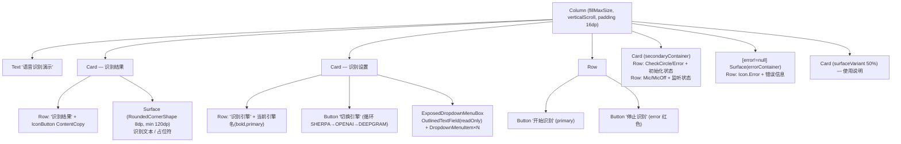
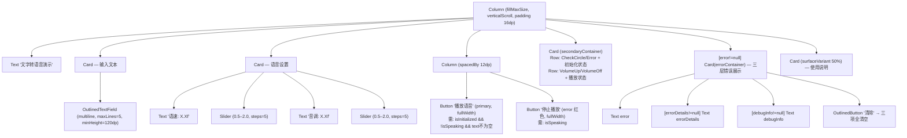

# Screen.SpeechToText & Screen.TextToSpeech 页面结构

本文档描述工具箱中的两个语音相关工具页面：**语音识别**（SpeechToTextScreen）与**文字转语音**（TextToSpeechScreen）。

## 一、SpeechToTextScreen（语音转文字）

**源码规模：** `SpeechToTextScreen.kt` 580 行

### 1.1 定位与背景

支持三种识别引擎，可在运行时热切换：

| 引擎 | 类型 | 特性 |
|------|------|------|
| Sherpa-NCNN | 本地推理 | 连续识别 + 部分结果（partial results） |
| OpenAI STT | 云端 | 单次识别模式 |
| Deepgram STT | 云端 | 单次识别模式 |

需要 `RECORD_AUDIO` 权限；未授权时屏幕整体替换为权限申请 UI。

### 1.2 权限门控

```
if (!hasAudioPermission):
    Column (fillMaxSize, centered)
    ├── Icon.Mic (72dp)
    ├── Text 说明
    └── Button "请求麦克风权限" → permissionLauncher.launch(RECORD_AUDIO)
    [early return — 主 UI 不渲染]
```

### 1.3 组件树（已授权路径）



### 1.4 状态汇总

| State | 类型 | 说明 |
|-------|------|------|
| `hasAudioPermission` | Boolean | RECORD_AUDIO 权限状态 |
| `recognizedText` | String | 累积识别文本 |
| `selectedLanguage` | String | 当前语言代码（默认 "zh-CN"） |
| `error` | String? | 错误信息 |
| `availableLanguages` | List\<String\> | 当前引擎支持的语言列表 |
| `recognitionMode` | SpeechServiceType | 当前引擎（SHERPA_NCNN / OPENAI_STT / DEEPGRAM_STT） |
| `speechService` | SpeechService | 活跃服务实例 |
| `isInitialized` | Boolean (collectAsState) | 服务已初始化 |
| `recognitionState` | RecognitionState (collectAsState) | 识别状态流 |
| `isListening` | Boolean (derived) | RECOGNIZING 或 PROCESSING 中 |

### 1.5 生命周期与 Effect

```
LaunchedEffect(recognitionMode)
  → shutdown() 旧服务
  → createSpeechService(context, recognitionMode) 创建新服务

LaunchedEffect(speechService) [1]
  → initialize() → getSupportedLanguages() → 更新 availableLanguages

LaunchedEffect(speechService) [2]
  → collect recognitionResultFlow → 追加 recognizedText
  → collect recognitionErrorFlow  → 更新 error

DisposableEffect(Unit)
  onDispose → speechService.shutdown()
```

### 1.6 服务接口调用

| 调用 | 时机 |
|------|------|
| `SpeechServiceFactory.createSpeechService(ctx, mode)` | 引擎切换时 |
| `speechService.initialize()` | 服务创建后 |
| `speechService.getSupportedLanguages()` | 初始化成功后 |
| `speechService.startRecognition(lang, continuous, partial)` | 点击开始识别 |
| `speechService.stopRecognition()` | 点击停止识别 |
| `speechService.shutdown()` | 引擎切换 / 页面销毁 |

---

## 二、TextToSpeechScreen（文字转语音）

**源码规模：** `TextToSpeechScreen.kt` 501 行（含 `handleTtsError` 私有函数）

### 2.1 定位与背景

文字转语音演示页面，通过 `VoiceService` 单例（`VoiceServiceFactory.getInstance`）播放语音，支持调节语速与音调。

### 2.2 组件树



### 2.3 三层错误展示（特色功能）

错误信息分三层分别记录和显示：

| 层级 | 变量 | 内容 |
|------|------|------|
| 主错误 | `error` | 人类可读的错误描述 |
| 详情 | `errorDetails` | 诊断细节（HTTP 状态码、响应体等） |
| 调试 | `debugInfo` | 服务类名 + 调用参数 |

`handleTtsError()` 函数按异常类型（TtsException / UnknownHostException / SocketTimeoutException / ConnectException / ProtocolException / IOException）分派，生成不同级别的错误文本。

### 2.4 状态汇总

| State | 类型 | 说明 |
|-------|------|------|
| `voiceService` | VoiceService | 通过 `VoiceServiceFactory.getInstance` 获取的单例 |
| `inputText` | String | 待合成文本 |
| `speechRate` | Float (1.0f) | 语速，范围 0.5–2.0 |
| `speechPitch` | Float (1.0f) | 音调，范围 0.5–2.0 |
| `isInitialized` | Boolean | 服务初始化成功 |
| `isSpeaking` | Boolean | 播放中（由 speakingStateFlow 收集） |
| `error` | String? | 主错误信息 |
| `errorDetails` | String? | 次级诊断信息 |
| `debugInfo` | String? | 调试上下文（服务类+参数） |

### 2.5 生命周期与 Effect

```
LaunchedEffect(Unit)
  → voiceService.initialize() → isInitialized=true (或设置 error)
  → collect voiceService.speakingStateFlow → 更新 isSpeaking
```

无 `DisposableEffect`：VoiceService 为单例，随 context 生命周期管理。

### 2.6 服务接口调用

| 调用 | 时机 |
|------|------|
| `VoiceServiceFactory.getInstance(context)` | 页面组合时（remember）|
| `voiceService.initialize()` | LaunchedEffect(Unit) |
| `voiceService.speakingStateFlow.collect` | LaunchedEffect(Unit) |
| `voiceService.speak(text, true, rate, pitch)` | 点击播放 |
| `voiceService.stop()` | 点击停止 |
