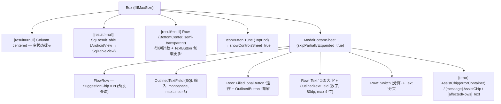
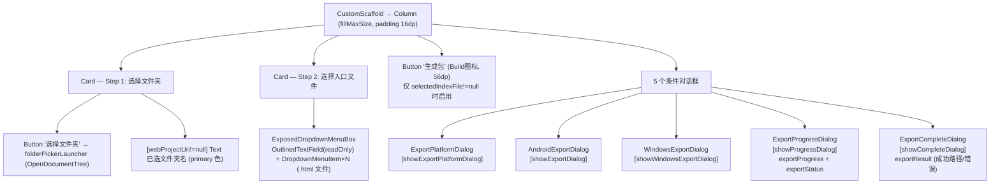

# Screen.SqlViewer & Screen.HtmlPackager 页面结构

本文档描述工具箱中的两个高级工具页面：**SQL 查看器**（SqlViewerScreen）与**HTML 应用打包器**（HtmlPackagerScreen）。

## 一、SqlViewerScreen（SQL 数据库查看器）

**源码规模：** `SqlViewerScreen.kt` 443 行（含 `SqlResultTable`、`SqlTableView`、`SqlTableGestureHandler`）

### 1.1 定位与背景

直接访问 App 的 Room 数据库（`AppDatabase`），通过 `SupportSQLiteDatabase` 执行任意 SQL 并以可缩放表格渲染结果。

### 1.2 组件树



### 1.3 SqlResultTable（自定义 Canvas 渲染）

`SqlResultTable` 通过 `AndroidView` 包装自定义 `SqlTableView`（`android.view.View`），全部内容通过 `Canvas.onDraw` 手动绘制：

- **表头**：`TextPaint`（粗体）绘制列名，背景为 Material3 `surfaceVariant` 色
- **单元格**：文字超出自动截断（ellipsize），仅绘制可视列/行范围（虚拟化渲染）
- **Compose 主题桥接**：`SqlResultTable` 每次重组时将 Material3 颜色/字体 token 以 `ARGB Int` 传入 `SqlTableView.updateStyle(...)`

手势系统：`SqlTableGestureHandler` 封装双探测器
- `ScaleGestureDetector` → 捏合缩放（0.6× ~ 2.2×），锚点为捏合焦点
- `GestureDetector` → 拖拽滚动 + `OverScroller.fling()` 惯性滚动
- `ACTION_DOWN` 时调用 `parent.requestDisallowInterceptTouchEvent(true)` 防止 Compose 劫持触摸事件

### 1.4 数据库访问

```
SELECT / WITH / PRAGMA → database.query(sql) → Cursor → QueryResult
其他语句              → database.execSQL(sql) → SELECT changes() → affectedRows
分页注入              → "LIMIT $pageSize OFFSET $offset" 追加到基础查询
加载更多（append）     → 新行追加到现有 result，offset 累加
```

所有数据库操作在 `Dispatchers.IO` 上执行（`SqlViewerViewModel`）。

### 1.5 预设查询

| Chip 标签 | SQL |
|-----------|-----|
| chats | SELECT * FROM chats |
| messages | SELECT * FROM messages |
| problem_records | SELECT * FROM problem_records |
| Show Tables | SELECT name FROM sqlite_master WHERE type='table' |
| Schema / PRAGMA | PRAGMA table_info('...') |

### 1.6 状态汇总

| State | 类型 | 说明 |
|-------|------|------|
| `showControlsSheet` | Boolean | ModalBottomSheet 显隐 |
| `sqlText` | String | SQL 输入框绑定 |
| `pageSizeText` | String | 页面大小输入框绑定 |
| `enablePaging` | Boolean | 分页开关 |
| `lastExecutedSql` | String | 最后执行的 SQL（用于"加载更多"） |
| `result` (VM) | QueryResult? | 查询结果（列名 + 行数据） |
| `isRunning` (VM) | Boolean | 执行中 |
| `error / message / affectedRows` (VM) | String? / Int? | 执行反馈 |

---

## 二、HtmlPackagerScreen（HTML 应用打包器）

**源码规模：** `HtmlPackagerScreen.kt` 354 行（含 `copyDocumentTreeTo` 递归辅助函数）

### 2.1 定位与背景

将本地 Web 项目（通过 SAF 选择文件夹）打包为 Android APK 或 Windows 应用。整个流程分 5 个对话框阶段完成。

### 2.2 组件树



### 2.3 导出流程（5 阶段）

```
1. ExportPlatformDialog     → 用户选择目标平台 (Android / Windows)
2. AndroidExportDialog
   / WindowsExportDialog    → 填写应用名/包名/图标等配置
3. ExportProgressDialog     → 显示实时进度 (0.0–1.0) + 状态文字
     内部流程:
       a. SAF 遍历 → copyDocumentTreeTo() 复制到临时目录
       b. 若入口文件名 != index.html → renameTo(index.html)
       c. exportAndroidApp() / exportWindowsApp()  [Dispatchers.IO]
       d. finally: tempWorkDir.deleteRecursively()  (无论成败)
4. ExportCompleteDialog     → 成功显示输出路径 / 失败显示错误信息
5. [完成] "打开文件" → AIToolHandler.executeTool("open_file", path)
```

### 2.4 SAF → 文件系统桥接

`copyDocumentTreeTo()` 递归遍历 `DocumentFile` 树：
- 文件夹 → `File.mkdirs()`
- 文件 → `ContentResolver.openInputStream(uri)` + `FileOutputStream(destFile)` 流式复制

使之后的打包工具（需要 `java.io.File` 路径）能访问 SAF 来源的内容。

### 2.5 状态汇总

| State | 类型 | 说明 |
|-------|------|------|
| `webProjectUri` | Uri? | SAF 选择的文件夹 URI |
| `htmlFiles` | List\<DocumentFile\> | 文件夹中的 .html 文件列表 |
| `selectedIndexFile` | DocumentFile? | 选定的入口文件 |
| `isIndexFileDropdownExpanded` | Boolean | 下拉菜单状态 |
| `showExportPlatformDialog` | Boolean | 平台选择对话框 |
| `showExportDialog` | Boolean | Android 配置对话框 |
| `showWindowsExportDialog` | Boolean | Windows 配置对话框 |
| `showProgressDialog` | Boolean | 进度对话框 |
| `showCompleteDialog` | Boolean | 完成对话框 |
| `exportProgress` | Float | 导出进度（0.0–1.0） |
| `exportStatus` | String | 实时状态文字 |
| `exportResult` | Result\<String\>? | 最终结果（路径或异常） |
