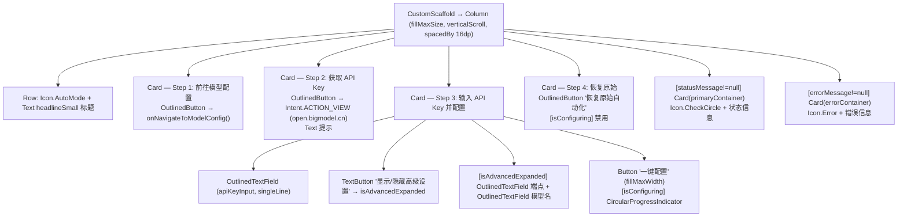
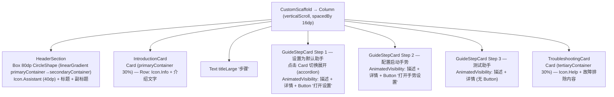

# Screen.AutoGlm 族 & Screen.DefaultAssistantGuide 页面结构

本文档描述工具箱中三个相关页面：**AutoGLM 一键配置**（AutoGlmOneClickToolScreen）、**AutoGLM 工具**（AutoGlmToolScreen）与**默认助手设置引导**（DefaultAssistantGuideScreen）。

## 一、AutoGlmOneClickToolScreen（AutoGLM 一键配置）

**源码规模：** `AutoGlmOneClickToolScreen.kt` 461 行（含 `AutoGlmOneClickScreen` 私有 composable）

### 1.1 定位与背景

4 步向导页面，帮助用户一键配置 ZhipuAI AutoGLM 手机操作功能：
- 绑定模型配置到 `FunctionType.UI_CONTROLLER`
- 交换工具包（`Automatic_ui_base` ↔ `Automatic_ui_subagent`）
- 注入推荐采样参数（temperature=0, top_p=0.85, frequency_penalty=0.2）

### 1.2 组件树



### 1.3 一键配置流程（startConfigure）

```
scope.launch {
  isConfiguring = true
  1. modelConfigManager.initializeIfNeeded()
  2. functionalConfigManager.initializeIfNeeded()
  3. 检查是否已存在 "AutoGLM" 配置 → createConfig 或复用
  4. updateModelConfig(
       endpoint = "https://open.bigmodel.cn/api/paas/v4/chat/completions"  (或自定义)
       model    = "autoglm-phone"  (或自定义)
       provider = ZHIPU (高级模式: OPENAI_GENERIC)
     )
  5. updateDirectImageProcessing(configId, true)
  6. setConfigForFunction(FunctionType.UI_CONTROLLER, configId, 0)
  7. EnhancedAIService.refreshServiceForFunction(ctx, FunctionType.UI_CONTROLLER)
  8. updateParameters(configId, temperature=0, top_p=0.85, frequency_penalty=0.2)
  9. packageManager.removePackage("Automatic_ui_base")
 10. packageManager.importPackage("Automatic_ui_subagent")
  → statusMessage = 成功提示
}
```

### 1.4 恢复流程（restoreOriginalAutomation）

```
packageManager.importPackage("Automatic_ui_base")   // 若缺失则重新导入
packageManager.removePackage("Automatic_ui_subagent")
```

### 1.5 状态汇总

| State | 类型 | 说明 |
|-------|------|------|
| `apiKeyInput` | String | API Key 输入框绑定 |
| `isConfiguring` | Boolean | 异步配置中（禁用按钮） |
| `statusMessage` | String? | 成功消息（绿色 Card 内联展示） |
| `errorMessage` | String? | 错误消息（红色 Card 内联展示） |
| `isAdvancedExpanded` | Boolean | 高级设置展开状态 |
| `advancedEndpoint` | String | 自定义 API 端点 |
| `advancedModelName` | String | 自定义模型名 |

**Managers（通过 `remember` 保持）：**
- `modelConfigManager` — `ModelConfigManager(context)`
- `functionalConfigManager` — `FunctionalConfigManager(context)`
- `packageManager` — `PackageManager.getInstance(context, AIToolHandler.getInstance(context))`

---

## 二、AutoGlmToolScreen（AutoGLM UI 自动化工具）

**源码规模：** `AutoGlmToolScreen.kt` 122 行 + `AutoGlmViewModel.kt`

### 2.1 定位与背景

AutoGLM 的实际执行界面。用户输入自然语言任务描述，可选启用虚拟屏幕，然后启动 `PhoneAgent` 通过 AI 服务逐步执行 UI 自动化操作。执行日志面板实时流式展示进度。

### 2.2 组件树

```
AutoGlmToolScreen
└── AutoGlmToolContent (stateless)
    └── Column (fillMaxSize)
        ├── Column (padding 16dp)
        │   ├── OutlinedTextField (task, maxLines=5)
        │   ├── Row (SpaceBetween)
        │   │   ├── Text (虚拟屏幕标签)
        │   │   └── Switch (useVirtualScreen, 执行中禁用)
        │   ├── Button (双模式: 执行/取消, 颜色切换)
        │   ├── Text "Execution Log" (titleMedium)
        └── Box (weight=1f, surfaceVariant 背景)
            └── Text (uiState.log, verticalScroll, 自动滚动到底部)
```

### 2.3 状态管理

**AutoGlmViewModel**（通过 `AutoGlmViewModelFactory(context)` 创建）：

| StateFlow 字段 | 类型 | 说明 |
|---------------|------|------|
| `isLoading` | `Boolean` | Agent 协程执行中 |
| `log` | `String` | 完整的带时间戳执行日志 |

**局部状态**：

| 状态 | 类型 | 说明 |
|------|------|------|
| `task` | `String` | 任务输入 |
| `useVirtualScreen` | `Boolean` | 虚拟屏幕开关 |

### 2.4 执行流程

```
executeTask(task, useVirtualScreen)
  → 取消之前的 executionJob
  → isLoading = true, log = "Initializing agent..."
  → [useVirtualScreen] ShowerServerManager.ensureServerStarted()
    → ShowerController.ensureDisplay(agentId, width, height, dpi)
  → 获取 EnhancedAIService (FunctionType.UI_CONTROLLER)
  → 构建本地化系统提示 (FunctionalPrompts.buildUiAutomationAgentPrompt)
  → ActionHandler + ToolGetter.getUITools() (Tap/Swipe/PressKey/Screenshot)
  → PhoneAgent(maxSteps=25).run(task, systemPrompt, onStep)
    → 每步回调追加日志: 💭思考过程 + 🎯执行动作 (JSON)
  → isLoading = false

cancelTask()
  → 取消 executionJob
  → 追加 "[Execution Cancelled by User]"
  → isLoading = false
```

### 2.5 与 AutoGlmOneClick 的关系

| 对比 | AutoGlmOneClick | AutoGlmTool |
|------|----------------|-------------|
| 用途 | 配置向导（设置 API Key + 模型绑定） | 实际任务执行界面 |
| 状态 | 纯局部状态，无 ViewModel | 有 AutoGlmViewModel |
| 复杂度 | 461 行，4 步 Card 表单 | 122 行，输入+日志 |
| AI 交互 | 无（仅配置 Manager） | PhoneAgent 逐步执行 |

---

## 三、DefaultAssistantGuideScreen（默认助手设置引导）

**源码规模：** `DefaultAssistantGuideScreen.kt` 465 行（含 `DefaultAssistantGuideContent`、`HeaderSection`、`IntroductionCard`、`GuideStepCard`、`TroubleshootingCard` 共 5 个私有 composable）

### 2.1 定位与背景

纯信息型向导页面，引导用户将 Operit 设置为系统默认助手，并配置手势唤起方式。无 API 调用，无对话框。

### 2.2 组件树



### 2.3 手风琴展开逻辑

```
expandedStepIndex: Int?  (初始值 = 0，表示第 1 步默认展开)

点击 Card:
  当前已展开 → expandedStepIndex = null  (折叠)
  当前未展开 → expandedStepIndex = stepIndex (展开，其余隐式折叠)

AnimatedVisibility 动画:
  进入: fadeIn() + expandVertically()
  退出: fadeOut() + shrinkVertically()
```

### 2.4 系统 Settings 深链接

| 步骤 | Intent Action | 回退 |
|------|---------------|------|
| Step 1 "打开设置" | `Settings.ACTION_VOICE_INPUT_SETTINGS` | `Settings.ACTION_SETTINGS` |
| Step 2 "打开手势设置" | `"android.settings.GESTURE_NAVIGATION_SETTINGS"` (API >= Q) | `Settings.ACTION_SETTINGS` |
| Step 3 | — | 无按钮 |

### 2.5 Android 版本条件内容

Step 1 展开内容中：
```kotlin
if (Build.VERSION.SDK_INT >= Build.VERSION_CODES.S) {
    // 显示 Android 12+ 专属提示 (primary 色, Medium 字重)
}
```

### 2.6 GuideStepCard 参数

| 参数 | 类型 | 说明 |
|------|------|------|
| `stepNumber` | Int | 步骤编号（圆形背景内显示） |
| `title` | String | 步骤标题 |
| `icon` | ImageVector | 步骤图标 |
| `description` | String | 折叠后不可见，展开后显示 |
| `isExpanded` | Boolean | 当前展开状态 |
| `onToggleExpanded` | () -> Unit | 切换展开 |
| `actionButtonText` | String? | 可选按钮文字（Step 3 为 null） |
| `onActionClick` | (() -> Unit)? | 按钮点击回调 |
| `detailsContent` | (@Composable () -> Unit)? | 额外详情内容插槽 |

### 2.7 状态汇总

| State | 类型 | 说明 |
|-------|------|------|
| `expandedStepIndex` | Int? | 当前展开的步骤索引（手风琴单展开，null=全折叠） |
| `scrollState` | ScrollState | 滚动位置 |
