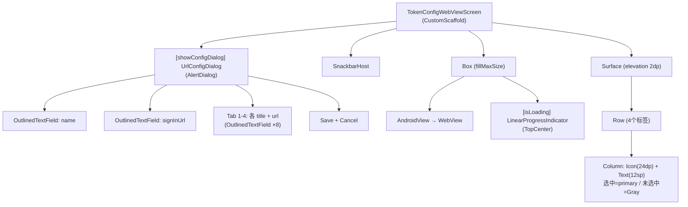

# Screen.Agreement & Screen.TokenConfig 页面结构

本文档描述两个简单单页面：**用户协议**（AgreementScreen）与 **Token 配置**（TokenConfigWebViewScreen）。

## 一、AgreementScreen（用户协议）

**源码规模：** `AgreementScreen.kt` 174 行。

### 1.1 定位与背景

首次启动时的用户协议页面，用户必须等待 5 秒后才能点击接受。协议内容包含"人话版"和"正式版"两部分，正式版通过 HTML 渲染。

### 1.2 组件树

```
AgreementScreen(onAgreementAccepted)
└── Column (fillMaxSize, padding 16dp, background)
    ├── Text (agreement_title, headlineMedium, primary, Bold)
    ├── Text (agreement_subtitle, bodyLarge)
    ├── Box (weight=1f, surfaceVariant 背景, shapes.medium, padding 16dp)
    │   └── Column (verticalScroll)
    │       ├── Text (agreement_human_readable_title, titleLarge, Bold)
    │       ├── Text (agreement_human_readable_content, bodyMedium)
    │       ├── HorizontalDivider (outline alpha 0.2)
    │       ├── Text (agreement_serious_title, titleLarge, Bold)
    │       ├── AndroidView → TextView (HTML渲染 agreement_serious_content)
    │       ├── HorizontalDivider
    │       └── Text (agreement_disclaimer, bodySmall, alpha 0.7)
    └── Button (fillMaxWidth, 56dp高, enabled=isButtonEnabled)
        └── Text: "接受" / "请等待 N 秒..."
```

### 1.3 状态管理

无 ViewModel，全部局部状态：

| 状态 | 类型 | 说明 |
|------|------|------|
| `scrollState` | `ScrollState` | 协议内容滚动 |
| `isButtonEnabled` | `Boolean` | 5 秒后启用 |
| `remainingSeconds` | `Int` | 倒计时剩余秒数（初始 5） |

### 1.4 强制阅读计时器

```
LaunchedEffect(Unit) {
  repeat(5) {
    delay(1000)
    remainingSeconds--
  }
  isButtonEnabled = true
}
```

5 秒内按钮禁用且显示倒计时，防止用户未阅读直接跳过。

### 1.5 架构要点

1. **混合渲染**：人话版用 Compose `Text`，正式版用 `AndroidView` + `TextView` + `HtmlCompat.fromHtml()` 支持 HTML 标签（`<b>`、`<br>` 等）。

2. **无 Scaffold**：直接使用 `Column`，不包含 TopBar。由调用方控制导航。

3. **API 版本分支**：`lineHeight` 在 API 28+ 使用 `TextView.lineHeight` 属性，低版本回退到 `setLineSpacing`。

4. **单向门**：接受后通过 `onAgreementAccepted` 回调通知调用方，页面本身不持有导航控制。

---

## 二、TokenConfigWebViewScreen（Token 配置）

**源码规模：** `TokenConfigWebViewScreen.kt` 285 行。

### 2.1 定位与背景

内嵌 WebView 的 Token 管理页面，默认加载 DeepSeek 平台登录页。底部 4 标签导航栏切换不同功能页面（API Keys / Usage / Top-Up / Profile）。支持自定义 URL 配置。

### 2.2 组件树



### 2.3 状态管理

无 ViewModel，局部状态 + DataStore 持久化：

| 状态 | 类型 | 说明 |
|------|------|------|
| `isLoading` | `Boolean` | WebView 加载中 |
| `selectedTabIndex` | `Int` | 当前选中标签 |
| `showConfigDialog` | `Boolean` | URL 配置对话框 |

**外部响应式状态**：

| 来源 | 类型 | 说明 |
|------|------|------|
| `urlConfigManager.urlConfigFlow` | `Flow<UrlConfig>` | DataStore 持久化的 URL 配置 |

### 2.4 数据模型

```kotlin
@Serializable
data class UrlConfig(
    val name: String = "DeepSeek",
    val signInUrl: String = "https://platform.deepseek.com/sign_in",
    val tabs: List<TabConfig>  // 4 个标签
)

@Serializable
data class TabConfig(
    val title: String,
    val url: String
)

data class NavDestination(
    val title: String,
    val url: String,
    val icon: ImageVector  // Key / Dashboard / CreditCard / Person
)
```

### 2.5 UrlConfigManager

| 方法 | 说明 |
|------|------|
| `urlConfigFlow` | DataStore `"url_config"` 的 Flow，默认 DeepSeek 配置 |
| `saveUrlConfig()` | 保存自定义配置 |
| `resetToDefault()` | 重置为本地化默认值 |
| `PRESET_CONFIGS` | 预置配置列表：DeepSeek / Claude / ChatGPT / Gemini / Poe |

### 2.6 WebView 配置 (WebViewConfig 单例)

- JS 启用，DOM Storage，混合内容允许
- 自定义 User-Agent（Chrome 124 Mobile）
- 缩放控件隐藏但可用
- 第三方 Cookie 接受
- `WebContentsDebuggingEnabled = true`
- 嵌套滚动启用（`isNestedScrollingEnabled = true`）

### 2.7 URL 拦截

`WebViewClient.shouldOverrideUrlLoading` 拦截以下 scheme 跳转外部应用：
- `alipays:` / `alipay:` → 支付宝
- `weixin:` / `weixins:` → 微信

### 2.8 标签页同步

`onPageFinished` 通过双向 `contains` 模糊匹配当前 URL 与标签 URL，自动同步选中标签索引。兼容 URL 重定向和路径追加。

### 2.9 TopBar 动作注入

通过 `LocalTopBarActions` CompositionLocal 注入 Settings 图标按钮到共享 TopBar，仅在当前页面激活时注入（`LocalIsCurrentScreen.current == true`）。

### 2.10 架构要点

1. **无 ViewModel**：`UrlConfigManager` 直接通过 `remember` 创建，使用 DataStore 持久化。生命周期绑定到 Composition，非进程级。

2. **4 标签硬限制**：`urlConfig.tabs.take(4)` 固定最多 4 个标签。

3. **WebView 单例生命周期**：通过 `remember` 创建一次，`DisposableEffect` 在 onDispose 时 `stopLoading()` + `destroy()`。

4. **`onNavigateBack` 未使用**：声明了回调但未调用，返回由宿主导航框架处理。

---

## 三、核心文件清单

| 文件 | 路径 | 行数 | 职责 |
|------|------|------|------|
| **AgreementScreen** | `ui/features/agreement/screens/AgreementScreen.kt` | 174 | 用户协议 UI |
| **TokenConfigWebViewScreen** | `ui/features/token/TokenConfigWebViewScreen.kt` | 285 | WebView Token 配置 |
| **UrlConfigManager** | `ui/features/token/UrlConfigManager.kt` | ~100 | URL 配置持久化 |
| **WebViewConfig** | `ui/features/token/WebViewConfig.kt` | ~150 | WebView 工厂配置 |
| **UrlConfigDialog** | `ui/features/token/UrlConfigDialog.kt` | ~80 | URL 配置对话框 |
