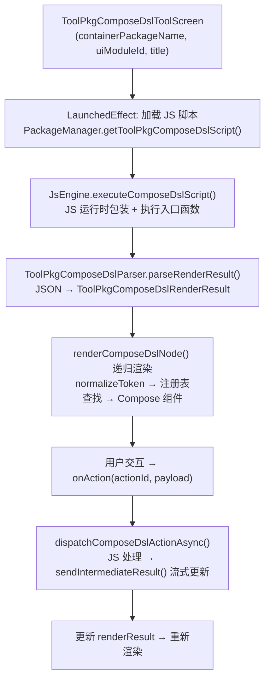

# Screen.ToolPkgPluginConfig 页面结构（Compose DSL 渲染引擎）

本文档描述 `Screen.ToolPkgPluginConfig` 的动态 UI 渲染机制。与其他静态页面不同，此页面没有固定组件树——它通过 JavaScript 插件脚本生成 JSON UI 描述，由 Compose DSL 引擎动态渲染。

## 一、总体架构

`ToolPkgComposeDslToolScreen` 是工具包插件的通用 UI 宿主。它从插件包中加载 JS 脚本，在独立 JS 引擎中执行脚本生成 UI 树描述（JSON），然后将 JSON 节点递归映射为 Compose 组件渲染到屏幕上。

**源码规模：** 主屏幕 1375 行 + 渲染器注册表 ~2000 行（自动生成）+ 解析器 + JS 运行时。

### 导航属性

| 属性 | 值 |
|------|------|
| parentScreen | Packages |
| navItem | NavItem.Packages |
| Screen 类型 | `data class`（非 `data object`，携带参数） |

### Screen 参数

```kotlin
data class ToolPkgPluginConfig(
    val containerPackageName: String,  // 插件包标识
    val uiModuleId: String,           // UI 模块 ID
    val title: String                 // 显示标题
) : Screen(parentScreen = Packages, navItem = NavItem.Packages)
```

---

## 二、渲染流程



### 执行上下文隔离

每个 `(containerPackageName, uiModuleId)` 对获得独立的 JS 引擎实例：
```
contextKey = "toolpkg_compose_dsl:<packageName>:<moduleId>"
```

---

## 三、DSL JSON Schema

JS 插件脚本返回的 JSON 结构：

```json
{
  "tree": {
    "type": "Column",
    "props": {
      "spacing": 8,
      "fillMaxWidth": true,
      "padding": 16,
      "onLoad": { "__actionId": "onLoad" }
    },
    "children": [
      {
        "type": "Text",
        "props": { "text": "Hello", "style": "titleMedium", "color": "primary" },
        "children": []
      },
      {
        "type": "Button",
        "props": { "text": "Click me", "onClick": { "__actionId": "handleClick" } },
        "children": []
      }
    ]
  },
  "state": { "counter": 0 },
  "memo": {}
}
```

### 节点结构

| 字段 | 类型 | 说明 |
|------|------|------|
| `type` | `String` | 组件类型名（大小写不敏感，忽略 `-`/`_`） |
| `props` | `Map<String, Any?>` | 属性包（基本类型、Map、List） |
| `children` | `List<Node>` | 子节点列表 |

### 事件处理器

Props 中的事件回调通过以下格式标识：
- `{ "__actionId": "handleClick" }` — 对象格式
- `"__action:handleClick"` — 前缀格式
- 纯字符串 — 直接作为 action name

### 特殊 Props

| Prop | 说明 |
|------|------|
| `onLoad` | 根节点专属，首次渲染后自动触发 |
| `__no_render` | 动作 payload 中设置，跳过重新渲染（用于高频手势事件） |

---

## 四、支持的组件类型清单

组件注册表由 `generate_compose_dsl_artifacts.py` 自动生成。

### 布局容器

| 类型 | 说明 |
|------|------|
| `Column` | 垂直布局 |
| `Row` | 水平布局 |
| `Box` | 自由叠加 |
| `Spacer` | 间距 |
| `BoxWithConstraints` | 约束感知布局 |
| `LazyColumn` | 懒加载列表（支持 `reverseLayout`, `autoScrollToEnd`） |
| `LazyRow` | 水平懒加载列表 |

### 文本

| 类型 | 说明 |
|------|------|
| `Text` | 文本（`style` 对应 MaterialTheme.typography） |
| `BasicText` | 基础文本 |
| `SelectionContainer` | 可选择文本容器 |

### 输入

| 类型 | 说明 |
|------|------|
| `TextField` | 输入框（支持 `label`, `placeholder`, `isPassword`, `onValueChange`） |
| `Switch` | 开关 |
| `Checkbox` | 复选框 |

### 按钮（16 种变体）

`Button`, `ElevatedButton`, `FilledTonalButton`, `OutlinedButton`, `TextButton`,
`IconButton`, `FilledIconButton`, `FilledTonalIconButton`, `OutlinedIconButton`,
`IconToggleButton`, `FilledIconToggleButton`, `FilledTonalIconToggleButton`, `OutlinedIconToggleButton`,
`FloatingActionButton`, `ExtendedFloatingActionButton`, `LargeFloatingActionButton`, `SmallFloatingActionButton`

### 卡片和表面

| 类型 | 说明 |
|------|------|
| `Card` | 支持 `containerColor`, `elevation`, `shape`, `border` |
| `ElevatedCard`, `OutlinedCard` | 变体 |
| `Surface` | 表面 |
| `Scaffold` | 脚手架 |

### 导航

`NavigationBar`, `NavigationRail`, `WideNavigationRail`, `ModalWideNavigationRail`, `ShortNavigationBar`, `Tab`

### 指示器和反馈

`LinearProgressIndicator`, `CircularProgressIndicator`, `Snackbar`, `Badge`

### 分隔线

`Divider`, `HorizontalDivider`, `VerticalDivider`, `VerticalDragHandle`

### 媒体

| 类型 | 说明 |
|------|------|
| `Icon` | 名称映射到 `Icons.Filled.*`（反射加载） |
| `Image` | 同 Icon 的图标映射 |

### 自定义绘制

| 类型 | 说明 |
|------|------|
| `Canvas` | 特殊处理，支持 draw commands 数组 |

---

## 五、通用 Modifier 系统

所有组件支持以下通用 Props：

| Prop | 类型 | 效果 |
|------|------|------|
| `width` | Float (dp) | 固定宽度 |
| `height` | Float (dp) | 固定高度 |
| `fillMaxSize` | Boolean | 填满父容器 |
| `fillMaxWidth` | Boolean | 填满宽度 |
| `padding` | Float 或 `{horizontal, vertical}` | 内边距 |
| `backgroundBrush` | Brush 对象 | 背景画刷 |

### Proxy Modifier Ops

通过 `modifier` prop 表达任意 Modifier 链：

```json
{
  "modifier": {
    "__modifierOps": [
      { "name": "fillMaxWidth" },
      { "name": "padding", "args": [{ "horizontal": 16, "vertical": 8 }] },
      { "name": "background", "args": ["primary", { "cornerRadius": 8 }] },
      { "name": "border", "args": [1, "outline", { "cornerRadius": 8 }] },
      { "name": "clip", "args": [{ "cornerRadius": 8 }] },
      { "name": "alpha", "args": [0.5] },
      { "name": "rotate", "args": [45] },
      { "name": "scale", "args": [1.2] },
      { "name": "offset", "args": [{ "x": 10, "y": 20 }] }
    ]
  }
}
```

---

## 六、样式和颜色解析

### 颜色解析 (`resolveColorValue`)

| 输入格式 | 解析方式 |
|---------|---------|
| `Color` 实例 | 直接使用 |
| 数字 | 作为 ARGB Long |
| `{ "__colorToken": "primary", "alpha": 0.8 }` | MaterialTheme.colorScheme 反射 + alpha |
| 字符串 | 先查 colorScheme 字段，再 `Color.parseColor()` |

### 文本样式

字符串 token（如 `"titleMedium"`）通过反射映射到 `MaterialTheme.typography` 对应属性。

### 图标

驼峰或分隔符名称转 PascalCase，反射加载 `Icons.Filled.*`。

### 对齐/排列

字符串 token（`"center"`, `"spacebetween"` 等）通过反射映射，结果懒缓存。

---

## 七、Canvas 绘制系统

`Canvas` 节点通过 `commands` 数组定义绘制操作：

| 命令类型 | 说明 |
|---------|------|
| `rect` | 矩形 |
| `roundrect` | 圆角矩形 |
| `circle` | 圆形 |
| `line` | 线段 |
| `text` / `drawtext` | 文本 |
| `drawpath` | 路径（moveTo/lineTo/cubicTo/quadTo/close） |

### 坐标单位

| `unit` 值 | 说明 |
|-----------|------|
| `"fraction"` | 0~1 相对于 Canvas 尺寸 |
| `"dp"` | 密度无关像素 |
| (默认) | 原始像素 |

Canvas 支持 `transform` prop（scale, offset, pivot）和 `onTransform` 手势事件。

---

## 八、状态管理

### 8.1 Compose 侧

无 ViewModel，全部局部状态：

| 状态 | 类型 | 说明 |
|------|------|------|
| `script` | `String?` | 缓存的 JS 脚本文本 |
| `renderResult` | `ToolPkgComposeDslRenderResult?` | 解析后的 UI 树 + state + memo |
| `errorMessage` | `String?` | 错误信息（显示 Retry 按钮） |
| `isLoading` | `Boolean` | 初始脚本执行中 |
| `dispatchingCount` | `Int` | 并发异步动作引用计数 |

### 8.2 JS 侧

插件脚本通过 `state` 和 `memo` 维护自己的状态。每次渲染结果返回当前 state/memo 快照，下次调用时回传给 JS 引擎：

```kotlin
"state" to (renderResult?.state ?: emptyMap()),
"memo"  to (renderResult?.memo  ?: emptyMap())
```

### 8.3 流式更新

异步动作执行期间，JS 运行时可调用 `sendIntermediateResult(value)` 发送中间结果，Compose 侧立即解析并更新 `renderResult`，实现实时 UI 刷新。

---

## 九、数据模型

```kotlin
data class ToolPkgComposeDslNode(
    val type: String,
    val props: Map<String, Any?>,
    val children: List<ToolPkgComposeDslNode>
)

data class ToolPkgComposeDslRenderResult(
    val tree: ToolPkgComposeDslNode,
    val state: Map<String, Any?>,
    val memo: Map<String, Any?>
)
```

---

## 十、架构要点

1. **动态 DSL 而非静态 UI**：组件树由 JS 脚本在运行时生成，不是编译时确定的 Composable 结构。渲染引擎是通用的，同一引擎服务所有插件的 UI。

2. **自动生成的注册表**：`ToolPkgComposeDslGeneratedRenderers.kt` 和 `ToolPkgComposeDslGeneratedRegistry.kt` 由 `tools/compose_dsl/generate_compose_dsl_artifacts.py` 脚本生成，确保组件类型覆盖完整。

3. **反射驱动的样式解析**：颜色、字体、对齐方式等全部通过反射从 MaterialTheme 获取，使 JSON 可以直接引用 Material Design token 名。

4. **JS 引擎隔离**：每个 `(packageName, moduleId)` 对获得独立 JS VM 实例，插件间状态不互通。

5. **外层滚动优化**：当根节点为 `LazyColumn` 时自动移除外层 `verticalScroll`，避免嵌套滚动冲突。

6. **`__no_render` 优化**：高频事件（如 Canvas transform 手势）可标记跳过重新渲染，仅更新 JS 侧状态。

---

## 十一、核心文件清单

| 文件 | 路径 | 行数 | 职责 |
|------|------|------|------|
| **ToolPkgComposeDslScreen** | `ui/common/composedsl/ToolPkgComposeDslScreen.kt` | 1375 | 主屏幕 + 渲染调度 + Modifier/色彩工具 |
| **GeneratedRenderers** | `ui/common/composedsl/ToolPkgComposeDslGeneratedRenderers.kt` | ~1500 | 各组件渲染函数（自动生成） |
| **GeneratedRegistry** | `ui/common/composedsl/ToolPkgComposeDslGeneratedRegistry.kt` | ~500 | 类型→渲染器映射表（自动生成） |
| **DslParser** | `core/tools/packTool/ToolPkgComposeDslParser.kt` | ~200 | JSON 解析 + 数据模型 |
| **JsComposeDslRuntimeScript** | `core/tools/javascript/JsComposeDslRuntimeScript.kt` | ~300 | JS 运行时包装脚本 |
| **JsEngine** | `core/tools/javascript/JsEngine.kt` (部分) | ~100 | executeComposeDslScript + dispatchAction |
| **PackageManagerFacade** | `core/tools/packTool/PackageManagerToolPkgFacade.kt` (部分) | ~110 | 脚本加载 + 路径解析 |
