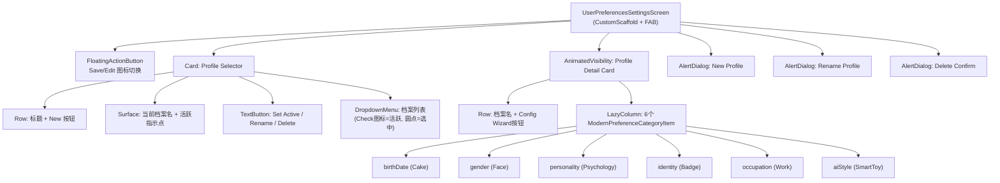

# Settings 子页面：用户偏好设置（UserPreferences + Guide）

本文档描述 Settings 中用户偏好相关的两个子页面：**偏好设置管理**（UserPreferencesSettingsScreen）与**偏好配置向导**（UserPreferencesGuideScreen）。

## 一、UserPreferencesSettingsScreen（偏好设置管理）

**源码规模：** `UserPreferencesSettingsScreen.kt` 1256 行。

### 1.1 总体架构

多档案用户偏好管理页面，支持创建/切换/重命名/删除档案。每个档案包含 6 个分类字段（生日、性别、性格、身份、职业、AI 风格），支持编辑/查看模式切换和字段级锁定。

### 1.2 组件树



### 1.3 ModernPreferenceCategoryItem

每个字段行的通用结构：

```
Surface (animated shadow 0-2dp)
├── Row: 图标 + 标题 + Lock Switch (缩放0.8x)
└── AnimatedContent (editMode 切换, fade+scale 动画)
    ├── [编辑+生日] Card: 日期显示 → DatePickerDialog
    ├── [编辑+其他] OutlinedTextField (锁定时禁用)
    └── [查看] Text (值或"未设置"占位)
```

字段锁定通过全局 `categoryLockStatusFlow` 控制，锁定后编辑时输入框灰显禁用。

### 1.4 状态管理

| 状态来源 | 说明 |
|---------|------|
| `profileListFlow` | 档案 ID 列表 |
| `activeProfileIdFlow` | 当前活跃档案 |
| `categoryLockStatusFlow` | 字段锁定状态 Map |
| `getUserPreferencesFlow(id)` | 特定档案的 Flow |

**编辑缓冲区**：6 个 `edit*` 局部变量（editBirthDate, editGender, editPersonality, editIdentity, editOccupation, editAiStyle），切换档案时通过 LaunchedEffect 重新填充。

### 1.5 档案操作

| 操作 | 流程 |
|------|------|
| 创建 | New按钮 → AddDialog → `createProfile(name)` → 自动导航到 Guide |
| 切换 | Dropdown选择 → `selectedProfileId` 更新 → 重置编辑模式 |
| 设为活跃 | "Set Active" → `setActiveProfile(id)` |
| 重命名 | RenameDialog → `updateProfile(profile.copy(name=...))` |
| 删除 | DeleteDialog → `deleteProfile(id)` → 回退到活跃档案 |

默认档案 (`id="default"`) 不可重命名或删除。

---

## 二、UserPreferencesGuideScreen（偏好配置向导）

**源码规模：** `UserPreferencesGuideScreen.kt` 844 行。

### 2.1 总体架构

单页滚动式向导（非分步），6 个字段全部平铺展示。支持预置标签选择和自定义标签添加。所有字段均为可选。

### 2.2 组件树

```
UserPreferencesGuideScreen (CustomScaffold)
├── AlertDialog: 添加自定义标签 (10字符限制)
├── DatePickerDialog (Material3, 初始1990-01-01)
└── Column (verticalScroll, spacedBy 16dp)
    ├── Header (标题 + 档案ID调试标签)
    ├── Info Banner: "所有选项均为可选"
    ├── Gender: FlowRow 3个 FilterChip (单选)
    ├── Occupation: FlowRow 12个 FilterChip (单选)
    ├── Birth Date: OutlinedCard → DatePickerDialog
    ├── Personality: FlowRow 16标准 + N自定义 FilterChip (多选)
    │   └── 自定义标签带 Close 图标可删除
    ├── Identity: FlowRow 12标准 + N自定义 FilterChip (多选)
    ├── AI Style: FlowRow 8标准 + N自定义 FilterChip (多选)
    └── Button "Complete" (fillMaxWidth)
```

### 2.3 预置标签

| 分类 | 数量 | 选择模式 |
|------|------|---------|
| 性别 | 3 (Male/Female/Other) | 单选 |
| 职业 | 12 (Student/Teacher/Engineer...) | 单选 |
| 性格 | 16 (Extroverted/Introverted/Rational...) | 多选 |
| 身份 | 12 (Student/Parent/Gamer/Traveler...) | 多选 |
| AI 风格 | 8 (Professional/Humorous/Direct...) | 多选 |

### 2.4 自定义标签

- "Add Custom" 按钮 → 共享对话框（`currentTagCategory` 路由到 personality/identity/aiStyle）
- 10 字符限制
- 添加后同时加入 `custom*Tags` 和 `selected*` Set
- 自定义标签的 FilterChip 带 `trailingIcon: Close`，点击可删除

### 2.5 默认值注入

首次打开时，如果 AI Style 和 Personality 都为空，自动预选：
- AI Style: `["Professional", "Direct"]`
- Personality: `["Rational", "Patient"]`

并立即持久化。

### 2.6 双路径导航

| 参数 | 来源 | Complete 按钮行为 |
|------|------|------------------|
| `profileName` 非空 | Settings 页面启动 | `onComplete()` → 返回 Settings |
| `profileName` 为空 | 首次启动引导流程 | `navigateToPermissions()` → 继续引导 |

---

## 三、数据模型

```kotlin
@Serializable
data class PreferenceProfile(
    val id: String,
    val name: String,
    val birthDate: Long = 0L,
    val gender: String = "",
    val personality: String = "",   // 逗号分隔标签
    val identity: String = "",
    val occupation: String = "",
    val aiStyle: String = "",
    val isInitialized: Boolean = false
)
```

**DataStore 存储结构**：
- `"active_profile_id"` — 活跃档案 ID
- `"profile_list"` — JSON 数组
- `"profile_<id>"` — JSON 序列化的 PreferenceProfile
- `"<category>_locked"` — 字段锁定状态

---

## 四、架构要点

1. **编辑缓冲区模式**：Settings 页面用 6 个 `edit*` 变量做缓冲，切换档案自动覆写，取消编辑不需要显式回滚。

2. **字段锁定全局生效**：锁定状态不是每个档案独立的，而是全局的。锁定某字段后，所有档案的该字段都禁止编辑。

3. **向导非分步**：Guide 页面虽名为"向导"但实际是单页滚动，所有 6 个字段同时展示，无分步/进度条。

4. **标签集合不可变+复制**：使用 Kotlin `Set<String>` 的 `+`/`-` 运算符产生新集合，正确触发 Compose 重组。

5. **`generatePreferencesDescription` 死代码**：Guide 文件中定义了一个从选中标签生成自然语言描述的函数（100 字符内），但未被调用。

6. **删除档案联动**：`deleteProfile()` 会同时调用 `ObjectBoxManager.delete(context, profileId)` 清理关联的记忆数据库。

---

## 五、核心文件清单

| 文件 | 路径 (相对于 `ui/features/settings/screens/`) | 行数 | 职责 |
|------|------|------|------|
| **UserPreferencesSettingsScreen** | `UserPreferencesSettingsScreen.kt` | 1256 | 多档案管理 + 编辑/查看 |
| **UserPreferencesGuideScreen** | `UserPreferencesGuideScreen.kt` | 844 | 标签选择向导 |
