# Settings 子页面：外观与显示（Language + GlobalDisplay + Layout）

本文档描述 Settings 中外观显示相关的三个子页面：**语言设置**（LanguageSettingsScreen）、**全局显示设置**（GlobalDisplaySettingsScreen）与**布局调整**（LayoutAdjustmentSettingsScreen）。

## 一、LanguageSettingsScreen（语言设置）

**源码规模：** `LanguageSettingsScreen.kt` 205 行。

### 1.1 组件树

```
LanguageSettingsScreen (CustomScaffold)
├── Text (section header)
├── [isChangingLanguage] CircularProgressIndicator + Text
├── [else] LazyColumn
│   └── items(supportedLanguages)
│       └── LanguageItem
│           ├── Row: Language图标 + Column(displayName + nativeName)
│           └── [isSelected] Check 图标
└── Card (surfaceVariant): 语言说明
```

### 1.2 支持语言

| code | 显示名 | 原生名 |
|------|--------|--------|
| `system` | Follow system | 跟随系统 |
| `zh` | Chinese | 中文 |
| `en` | English | English |
| `pt-BR` | Portuguese (Brazil) | Português (Brasil) |

### 1.3 语言切换流程

```
点击语言行 → isChangingLanguage = true
  → LocaleUtils.setAppLanguage(context, code)
    → preferencesManager.saveAppLanguage() [阻塞 IO]
    → AppCompatDelegate.setApplicationLocales() [API 33+]
    → Resources.updateConfiguration() [旧版]
  → Toast
  → delay(600ms)
  → Intent(MainActivity) + FLAG_ACTIVITY_CLEAR_TASK → 重启应用
```

---

## 二、GlobalDisplaySettingsScreen（全局显示设置）

**源码规模：** `GlobalDisplaySettingsScreen.kt` 929 行。

### 2.1 总体架构

覆盖消息显示、系统行为、自动化设置三大分区，共 ~20 个配置项。包含开关、滑块、芯片选择器、文本输入等多种控件。

### 2.2 组件树

```mermaid
graph TD
    ROOT["GlobalDisplaySettingsScreen<br/>(CustomScaffold → Column verticalScroll)"]

    ROOT --> SEC_MSG["SectionTitle: 消息显示设置"]
    SEC_MSG --> T1["Switch: 显示模型提供商"]
    SEC_MSG --> T2["Switch: 显示模型名称"]
    SEC_MSG --> T3["Switch: 显示角色名"]
    SEC_MSG --> T4["Switch: 显示用户名"]
    SEC_MSG --> COLLAPSE["Slider: 工具折叠模式<br/>(READ_ONLY / ALL / FULL)"]
    SEC_MSG --> USERNAME["[showUserName] OutlinedTextField<br/>全局用户名 + Save 按钮"]

    ROOT --> SEC_SYS["SectionTitle: 系统显示设置"]
    SEC_SYS --> T5["Switch: FPS 计数器"]
    SEC_SYS --> T6["Switch: 回复通知"]
    SEC_SYS --> T7["Switch: 通知声音"]
    SEC_SYS --> T8["Switch: 通知振动"]
    SEC_SYS --> T9["Switch: 回车发送"]
    SEC_SYS --> T10["Switch: 保持屏幕常亮"]
    SEC_SYS --> WAIT["Slider: Visit-web 等待时间 (0-10s)"]
    SEC_SYS --> ICON["FlowRow FilterChip: 应用图标<br/>(DEFAULT / SIMPLE)"]

    ROOT --> SEC_AUTO["SectionTitle: 自动化行为"]
    SEC_AUTO --> T11["Switch: 无障碍模式"]
    SEC_AUTO --> T12["Switch: 实验性虚拟显示"]
    SEC_AUTO --> T13["Switch: 隐藏运行时任务视图"]
    SEC_AUTO --> BITRATE["FlowRow FilterChip: 虚拟显示码率<br/>(1.5/3/5/10/20 Mbps)"]
    SEC_AUTO --> STATUS["FlowRow FilterChip: 状态指示器样式<br/>(彩虹边框 / 顶部提示)"]
    SEC_AUTO --> SCREENSHOT["截图设置<br/>格式(PNG/JPG) + 质量 + 分辨率"]
    SEC_AUTO --> ROOT_SEC["[ROOT权限] Root执行模式<br/>(AUTO/FORCE_LIBSU/FORCE_EXEC)<br/>+ 自定义su命令"]

    ROOT --> RESET["Button: 重置所有显示设置"]
```



### 2.3 状态管理

3 个 Manager + 1 个全局偏好：

| Manager | 职责 |
|---------|------|
| `DisplayPreferencesManager` | 19 个显示偏好 (DataStore) |
| `ApiPreferences` | keepScreenOn |
| `UserPreferencesManager` | uiAccessibilityMode, hasBackgroundImage |
| `androidPermissionPreferences` | ROOT 执行模式 |

**滑块防抖**：4 个滑块值通过 `LaunchedEffect` + `delay(300ms)` 防抖后写入 DataStore。

### 2.4 特殊设置

| 设置 | 说明 |
|------|------|
| 工具折叠模式 | 3 档滑块 (READ_ONLY/ALL/FULL)，底部标签可直接点击跳转 |
| 应用图标 | `AppIconManager.switchIcon()` 通过 PackageManager 别名切换 |
| 状态指示器 | 唯一使用 SharedPreferences 而非 DataStore 的设置（与 FloatingWindowManager 同步） |
| Root 执行模式 | 仅当 `preferredPermissionLevel == ROOT` 时显示 |
| 截图设置 | 格式(PNG/JPG) + 质量(50-100%) + 分辨率缩放(50-100%) |

### 2.5 壁纸自适应

`componentBackgroundColor` 根据 `hasBackgroundImage` 切换：有壁纸用不透明 `surface`，无壁纸用半透明 `surface(0.5f)`。

---

## 三、LayoutAdjustmentSettingsScreen（布局调整）

**源码规模：** `LayoutAdjustmentSettingsScreen.kt` 391 行。

### 3.1 组件树

```
LayoutAdjustmentSettingsScreen (CustomScaffold)
└── Column (verticalScroll, spacedBy 12dp)
    ├── Text (描述)
    ├── SectionTitle "布局调整设置"
    ├── SettingsSectionCard
    │   ├── CompactEditableFloatSettingItem: 聊天按钮右边距 (dp)
    │   ├── CompactEditableFloatSettingItem: 聊天区水平内边距 (dp)
    │   ├── HorizontalDivider
    │   ├── CompactEditableFloatSettingItem: Markdown 行高倍数 (x)
    │   └── CompactEditableFloatSettingItem: Markdown 字间距 (sp)
    ├── SectionTitle "实时预览"
    └── LayoutAdjustmentPreviewCard
        └── ProvideAiMarkdownTextLayoutSettings
            └── MarkdownTextComposable (预览文本)
```

### 3.2 4 个可调参数

| 参数 | 默认值 | 范围 | 单位 |
|------|--------|------|------|
| 聊天按钮右边距 | 2 | 0~50 | dp |
| 聊天区水平内边距 | 16 | 0~50 | dp |
| Markdown 行高倍数 | 1.0 | 0.8~2.0 | x |
| Markdown 字间距 | 0 | -1~8 | sp |

### 3.3 CompactEditableFloatSettingItem

每个参数行：
```
Column (圆角背景)
├── Row: 标题+描述 | BasicTextField(64dp宽) + 单位标签
├── [isError] Text: 无效值范围提示
└── Row: Reset to Default + Save
```

输入验证：实时检查 Float 解析 + 范围，IME Done 或 Save 按钮触发持久化。

### 3.4 实时预览

`LayoutAdjustmentPreviewCard` 通过 `ProvideAiMarkdownTextLayoutSettings` 注入当前的行高和字间距设置到 `MarkdownTextComposable`。保存后立即反映在预览中（Flow 驱动）。

---

## 四、架构要点

1. **三种持久化策略**：DataStore（大多数设置）、SharedPreferences（状态指示器样式）、PackageManager 别名（应用图标）。

2. **语言切换需重启**：通过 Intent + `FLAG_ACTIVITY_CLEAR_TASK` 重启 Activity，不是就地重组。

3. **实时预览联动**：布局调整页面的预览 Card 读取相同的 DataStore Flow，保存即可见。

4. **无 ViewModel**：三个页面都通过 Manager 单例 + 局部状态管理，无 ViewModel 层。

5. **`DisplayPreferencesManager.saveDisplaySettings`**：单一 suspend 函数接受 19 个可空参数，仅写入非 null 字段。

---

## 五、核心文件清单

| 文件 | 路径 (相对于 `ui/features/settings/screens/`) | 行数 | 职责 |
|------|------|------|------|
| **LanguageSettingsScreen** | `LanguageSettingsScreen.kt` | 205 | 语言选择 + 重启 |
| **GlobalDisplaySettingsScreen** | `GlobalDisplaySettingsScreen.kt` | 929 | ~20 个显示配置项 |
| **LayoutAdjustmentSettingsScreen** | `LayoutAdjustmentSettingsScreen.kt` | 391 | 4 个布局参数 + 实时预览 |
