# Settings 子页面：主题与外观（ThemeSettings）

本文档描述 Settings 中主题外观设置页面 **ThemeSettingsScreen** 的完整 UI 组件树、状态管理和交互流程。

**源码规模：** `ThemeSettingsScreen.kt` 2132 行 + 5 个 Section/Component 文件（合计 ~3500 行）。

## 一、总体架构

全量主题自定义中心，覆盖 ~60 个主题偏好项，涵盖配色、状态栏、工具栏、聊天气泡、字体、头像、背景等维度。所有设置实时持久化（无显式保存按钮），并可与角色卡/角色组绑定。

### 文件分拆

| 文件 | 路径 (相对于 `ui/features/settings/`) | 职责 |
|------|------|------|
| ThemeSettingsScreen | `screens/ThemeSettingsScreen.kt` | 顶层组合 + 保存协调 + ColorPickerDialog 宿主 |
| ThemeSettingsCoreSections | `sections/ThemeSettingsCoreSections.kt` | 角色绑定卡、主题模式、聊天风格、显示选项 |
| ThemeSettingsColorSection | `sections/ThemeSettingsColorSection.kt` | 状态栏/工具栏/输入栏/自定义色 |
| ThemeSettingsBackgroundSection | `sections/ThemeSettingsBackgroundSection.kt` | 背景图/视频 + 模糊 |
| ThemeSettingsFontAvatarSections | `sections/ThemeSettingsFontAvatarSections.kt` | 全局字体 + 头像 |
| ThemeSettingsComponents | `components/ThemeSettingsComponents.kt` | ThemeModeOption / ChatStyleOption 等小组件 |
| ColorPickerDialog | `components/ColorPickerDialog.kt` | HSV 色轮 + HEX/RGB/HSV 手动输入 + 预设/最近颜色 |

---

## 二、组件树

```mermaid
graph TD
    ROOT["ThemeSettingsScreen<br/>(Column verticalScroll)"]

    ROOT --> BIND["ThemeSettingsCharacterBindingInfoCard<br/>角色卡/角色组头像 + 绑定说明"]

    ROOT --> MODE["ThemeSettingsThemeModeSection"]
    MODE --> MODE_SYS["Switch: 跟随系统主题"]
    MODE --> MODE_SEL["[非跟随] ThemeModeOption: Light / Dark"]

    ROOT --> COLOR["ThemeSettingsColorCustomizationSection"]
    COLOR --> C_STATUS["Card: 状态栏<br/>Hidden / Transparent / 自定义色"]
    COLOR --> C_TOOLBAR["Card: 工具栏<br/>Transparent / 自定义色"]
    COLOR --> C_HEADER["Card: 聊天头部<br/>Transparent / OverlayMode"]
    COLOR --> C_INPUT["Card: 聊天输入栏<br/>Transparent / Floating / LiquidGlass / WaterGlass"]
    COLOR --> C_APPBAR["Card: AppBar 内容色<br/>强制 Light/Dark"]
    COLOR --> C_ICONS["Card: 聊天头部图标色<br/>History图标 / PiP图标"]
    COLOR --> C_CUSTOM["Card: 自定义主题色<br/>Primary + Secondary + OnColor模式"]

    ROOT --> STYLE["ThemeSettingsChatStyleSection"]
    STYLE --> S_MODE["ChatStyleOption: Cursor / Bubble"]
    STYLE --> S_INPUT["ChatStyleOption: Classic / Agent 输入风格"]
    STYLE --> S_CURSOR["[Cursor] 跟随主题 / LiquidGlass / WaterGlass / 自定义色"]
    STYLE --> S_BUBBLE_LAYOUT["[Bubble] 头像显示 / 宽布局"]
    STYLE --> S_USER_BUBBLE["[Bubble] 用户气泡: Glass效果 / 颜色 / 文字色 / 圆角 / 内边距 / 字体 / 九宫格图"]
    STYLE --> S_AI_BUBBLE["[Bubble] AI气泡: (同用户气泡结构)"]

    ROOT --> AVATAR["ThemeSettingsAvatarSection"]
    AVATAR --> A_USER["AvatarPicker: 用户头像 (角色绑定)"]
    AVATAR --> A_GLOBAL["AvatarPicker: 全局用户头像"]
    AVATAR --> A_NAME["OutlinedTextField: 全局用户名"]
    AVATAR --> A_SHAPE["FilterChip: Circle / Square"]
    AVATAR --> A_RADIUS["[Square] Slider: 圆角半径"]

    ROOT --> DISPLAY["ThemeSettingsDisplayOptionsSection"]
    DISPLAY --> D1["Switch: 显示思考过程"]
    DISPLAY --> D2["Switch: 显示状态标签"]
    DISPLAY --> D3["Switch: 显示输入处理状态"]
    DISPLAY --> D4["Switch: 显示浮动圆点动画"]

    ROOT --> FONT["ThemeSettingsFontSection"]
    FONT --> F_ENABLE["Switch: 启用自定义字体"]
    FONT --> F_TYPE["[启用] FilterChip: System / File"]
    FONT --> F_SYS["[System] Radio: Default/Serif/Sans-Serif/Monospace/Cursive"]
    FONT --> F_FILE["[File] 选择字体文件 (TTF/OTF/TTC)"]
    FONT --> F_SCALE["Slider: 字体缩放 (0.8x~1.5x)"]

    ROOT --> BG["ThemeSettingsBackgroundSection"]
    BG --> BG_ENABLE["Switch: 启用背景"]
    BG --> BG_TYPE["[启用] MediaTypeOption: Image / Video"]
    BG --> BG_IMG["[Image] 裁剪选择 + 透明度滑块"]
    BG --> BG_VID["[Video] 选择视频 (30MB限制) + ExoPlayer预览 + 静音/循环"]
    BG --> BG_BLUR["[Image] 模糊开关 + 模糊半径滑块"]

    ROOT --> FOOTER["重置所有主题设置 (OutlinedButton)"]
    ROOT --> PICKER["ColorPickerDialog (全局共享)"]
```



---

## 三、状态管理

### 3.1 Manager 依赖

| Manager | 职责 |
|---------|------|
| `UserPreferencesManager` | ~60 个主题偏好 (DataStore) |
| `DisplayPreferencesManager` | 全局用户头像 URI + 用户名 |
| `CharacterCardManager` | 活跃角色卡 Flow |
| `CharacterGroupCardManager` | 活跃角色组 Flow |
| `ActivePromptManager` | 当前活跃 Prompt 类型 (角色卡 or 角色组) |

### 3.2 ~60 个偏好 Flow

所有偏好通过 `collectAsState` 收集后**复制到局部 `*Input` 变量**，UI 直接读写局部变量实现即时响应，DataStore 写入通过 `saveThemeSettingsWithCharacterCard` 异步完成。

**主要分组：**

| 分组 | 偏好数量 | 关键项 |
|------|---------|--------|
| 主题模式 | 2 | themeMode (light/dark), useSystemTheme |
| 全局配色 | 4 | customPrimaryColor, customSecondaryColor, useCustomColors, onColorMode |
| 状态栏 | 4 | useCustomStatusBarColor, statusBarTransparent, statusBarHidden, customStatusBarColor |
| 工具栏/AppBar | 5 | toolbarTransparent, useCustomAppBarColor, forceAppBarContentColor, appBarContentColorMode, customAppBarColor |
| 聊天头部 | 4 | chatHeaderTransparent, chatHeaderOverlayMode, chatHeaderHistoryIconColor, chatHeaderPipIconColor |
| 聊天输入栏 | 4 | chatInputTransparent, chatInputFloating, chatInputLiquidGlass, chatInputWaterGlass |
| 聊天风格 | 2 | chatStyle (cursor/bubble), inputStyle (classic/agent) |
| Cursor 气泡 | 4 | cursorUserBubbleFollowTheme, cursorUserBubbleLiquidGlass, cursorUserBubbleWaterGlass, cursorUserBubbleColor |
| Bubble 布局 | 2 | bubbleShowAvatar, bubbleWideLayoutEnabled |
| 用户气泡 | ~12 | glass效果, 颜色, 文字色, 圆角, 内边距, 字体, 九宫格图 |
| AI 气泡 | ~12 | (同用户气泡结构) |
| 字体 | 5 | useCustomFont, fontType, systemFontName, customFontPath, fontScale |
| 头像 | 5 | customUserAvatarUri, customAiAvatarUri, globalUserAvatarUri, avatarShape, avatarCornerRadius |
| 背景 | 7 | useBackgroundImage, backgroundImageUri, backgroundMediaType, backgroundImageOpacity, videoBackgroundMuted, videoBackgroundLoop, backgroundBlurRadius |
| 显示选项 | 4 | showThinkingProcess, showStatusTags, showInputProcessingStatus, showChatFloatingDotsAnimation |
| 最近颜色 | 1 | recentColors (List<Int>, 最多14个) |

### 3.3 角色卡主题绑定

每次保存偏好时，通过 `saveThemeSettingsWithCharacterCard` 包装器额外调用：

```
saveThemeSettings(具体参数)
  → saveCurrentThemeToCharacterCard(cardId)  // 或 saveCurrentThemeToCharacterGroup(groupId)
```

切换角色卡时自动加载该角色的主题快照。重置主题时同步调用 `deleteCharacterCardTheme()` / `deleteCharacterGroupTheme()`。

---

## 四、ColorPickerDialog

全局共享的颜色选择对话框，通过 `showColorPicker` + `currentColorPickerMode` 路由到 11 种目标：

| mode | 目标偏好 |
|------|---------|
| `"primary"` | customPrimaryColor |
| `"secondary"` | customSecondaryColor |
| `"statusBar"` | customStatusBarColor |
| `"appBar"` | customAppBarColor |
| `"historyIcon"` | chatHeaderHistoryIconColor |
| `"pipIcon"` | chatHeaderPipIconColor |
| `"cursorUserBubble"` | cursorUserBubbleColor |
| `"bubbleUserBubble"` | bubbleUserBubbleColor |
| `"bubbleAiBubble"` | bubbleAiBubbleColor |
| `"bubbleUserText"` | bubbleUserTextColor |
| `"bubbleAiText"` | bubbleAiTextColor |

### Dialog 内部结构

```
ColorPickerDialog (AlertDialog)
├── 实时颜色预览 + 对比度评级 (High/Low Contrast)
├── 手动输入 Card
│   ├── Tab: HEX (含剪贴板粘贴按钮) / RGB (3字段) / HSV (3字段)
│   └── Apply 按钮 → 同步到色轮
├── AlphaTile: 透明度预览条
├── HsvColorPicker (220dp, skydoves/colorpicker-compose)
├── BrightnessSlider (30dp)
├── AlphaSlider (30dp)
├── 最近使用颜色 (最多14个, 2行×7)
├── Material 预设颜色 (14个, 2行×7)
└── Confirm / Cancel
```

确认时调用 `handleThemeColorSelected(mode, color)`：更新局部变量 → 追加到最近颜色列表 → 保存到 DataStore + 角色卡绑定。

---

## 五、特殊机制

### 5.1 九宫格气泡图 (Nine-Patch)

用户选择 `.9.png` 文件时跳过裁剪，自动解析：

```
parseNinePatchBubbleParams()
  → Dispatchers.IO 解码 Bitmap
  → 扫描顶边像素 → repeatXStart/End
  → 扫描左边像素 → repeatYStart/End
  → 计算 cropLeft/Top/Right/Bottom
  → 保存 bubbleImageRenderMode = "nine_patch"
```

非 `.9.png` 图片走 `CropImageContract` (canhub) 裁剪，PNG 输出保留透明度。

### 5.2 视频背景 (ExoPlayer)

```
remember {} 创建 ExoPlayer (maxBuffer 5MB, 10s)
  → DisposableEffect 管理生命周期
  → LaunchedEffect 监听 URI/静音/循环变化
  → AndroidView(StyledPlayerView) 渲染预览
  → 30MB 文件大小限制检查
```

### 5.3 背景图迁移

首次加载时检测 `content://` 格式的旧 URI，自动复制到内部存储并更新引用。迁移失败则禁用背景。

### 5.4 Liquid Glass / Water Glass 互斥

同一组件位置的 LiquidGlass 和 WaterGlass 互斥：开启一个时，同一 `saveThemeSettings()` 调用中显式将另一个设为 `false`。影响 3 组：chatInput、cursorUserBubble、bubbleUser/AiBubble。

### 5.5 文字色自动推导

`bubbleUserTextColor` / `bubbleAiTextColor` 为 null 时（用户未自定义），通过 `getTextColorForBackground(bubbleColor)` 动态计算。ColorPickerDialog 接收计算后的 effective 值，非原始 null。

### 5.6 图片裁剪器

3 个独立的 `CropImageContract` Launcher：

| Launcher | 用途 | 输出格式 | 比例 |
|----------|------|---------|------|
| `cropImageLauncher` | 背景图 | JPEG | 自由 |
| `bubbleImageCropLauncher` | 气泡背景图 | PNG (保留透明) | 自由 |
| `cropAvatarLauncher` | 头像 | — | 1:1 强制 |

---

## 六、聊天风格对比

| 维度 | Cursor 风格 | Bubble 风格 |
|------|------------|------------|
| 布局 | 左对齐连续排列 | 左右分列气泡 |
| 用户气泡配色 | 跟随主题 or 自定义色 | 独立自定义色 + 文字色 |
| AI 气泡配色 | 无独立设置 | 独立自定义色 + 文字色 |
| 头像 | 无 | 可选显示 |
| 宽布局 | 无 | 可选 |
| 九宫格图 | 不支持 | 用户/AI 各可设 |
| 自定义字体 | 不支持 | 用户/AI 各可设 |
| Glass 效果 | Liquid / Water (1组) | Liquid / Water (用户+AI 各1组) |

---

## 七、数据模型

```kotlin
sealed interface ActivePrompt {
    data class CharacterCard(val id: String) : ActivePrompt
    data class CharacterGroup(val id: String) : ActivePrompt
}

// 九宫格解析结果（文件级 private）
data class NinePatchBubbleAutoParams(
    val cropLeft: Float, val cropTop: Float,
    val cropRight: Float, val cropBottom: Float,
    val repeatXStart: Float, val repeatXEnd: Float,
    val repeatYStart: Float, val repeatYEnd: Float
)
```

---

## 八、架构要点

1. **无 ViewModel**：所有 ~60 个偏好直接 `collectAsState` + 局部 `*Input` 缓冲变量，Manager 单例通过 `remember { getInstance(context) }` 获取。

2. **即时持久化**：每个开关/滑块/颜色选择立即触发 `saveThemeSettings()`，无整体保存按钮。仅底部有"重置所有"按钮。

3. **角色卡绑定传播**：每次偏好写入后额外序列化当前主题快照到角色卡/角色组，实现"每角色一套主题"。

4. **LaunchedEffect 同步**：~60 个 DataStore 值作为 key 的 `LaunchedEffect` 确保外部变更（如角色卡切换）能回写到局部 `*Input` 变量。

5. **Section 文件分拆**：2132 行主文件 + 5 个 Section 文件，避免单文件过大，但状态仍由主文件统一管理并通过参数传入 Section。

6. **`saveThemeSettings` 大参数函数**：单一 `suspend` 函数接受 ~130 个可空参数，仅写入非 null 字段。与 `DisplayPreferencesManager.saveDisplaySettings` (19 参数) 模式相同。

---

## 九、核心文件清单

| 文件 | 路径 (相对于 `ui/features/settings/`) | 行数 | 职责 |
|------|------|------|------|
| **ThemeSettingsScreen** | `screens/ThemeSettingsScreen.kt` | 2132 | 顶层组合 + 保存 + Dialog |
| ThemeSettingsCoreSections | `sections/ThemeSettingsCoreSections.kt` | ~350 | 绑定卡/模式/风格/显示 |
| ThemeSettingsColorSection | `sections/ThemeSettingsColorSection.kt` | ~400 | 颜色自定义 7 卡 |
| ThemeSettingsBackgroundSection | `sections/ThemeSettingsBackgroundSection.kt` | ~250 | 背景图/视频 |
| ThemeSettingsFontAvatarSections | `sections/ThemeSettingsFontAvatarSections.kt` | ~300 | 字体 + 头像 |
| ColorPickerDialog | `components/ColorPickerDialog.kt` | ~350 | 色轮 + 手动输入 |
| ThemeSettingsComponents | `components/ThemeSettingsComponents.kt` | ~100 | ThemeModeOption / ChatStyleOption |
