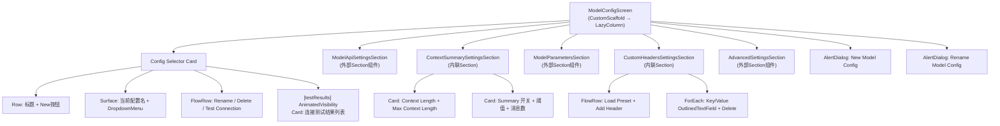

# Settings 子页面：AI 模型配置（ModelConfig + FunctionalConfig）

本文档描述 Settings 中 AI 模型配置相关的两个子页面：**模型参数配置**（ModelConfigScreen）与**功能模型绑定**（FunctionalConfigScreen）。

## 一、ModelConfigScreen（模型参数配置）

**源码规模：** `ModelConfigScreen.kt` 1433 行。

### 1.1 总体架构

多配置档案管理系统，每个配置档包含 API 端点、密钥、模型名、采样参数、自定义头、上下文设置等完整的模型接入参数。支持 37 种 API 提供商类型。

### 1.2 组件树



### 1.3 状态管理

无 ViewModel，状态通过 Manager + 局部状态 + SaveCoordinator 管理。

**Manager 类**：
- `ModelConfigManager(context)` — 配置档 CRUD、Flow
- `FunctionalConfigManager(context)` — 读取 CHAT 功能绑定确定默认选中配置
- `ModelConfigSaveCoordinator` — 各 Section 注册保存动作的协调器

**保存机制**：
- 700ms 防抖自动保存（`DebouncedModelConfigAutoSaveEffect`）
- Section 注册命名保存动作（`RegisterModelConfigSaveAction`）
- `ON_STOP` 生命周期事件触发 `flushAllInBackground()`
- 连接测试前先 `flushAll()` 确保最新值生效

### 1.4 配置档生命周期

| 操作 | 入口 | 流程 |
|------|------|------|
| 创建 | New 按钮 → AddConfigDialog | `configManager.createConfig(name)` → 自动切换 |
| 切换 | DropdownMenu 选择 | `selectedConfigId` 更新 → LaunchedEffect 收集新配置 Flow |
| 重命名 | Rename 按钮 → RenameDialog | `configManager.updateConfigBase(id, newName)` |
| 删除 | Delete 按钮（非默认配置） | `configManager.deleteConfig(id)` → 回退到首个配置 |
| 连接测试 | Test Connection 按钮 | flush → 获取配置 → `ModelConfigConnectionTester.run()` 多类型测试 |

### 1.5 对话框清单

| 对话框 | 触发 | 说明 |
|--------|------|------|
| New Config | "New" OutlinedButton | 输入名称创建新配置 |
| Rename Config | "Rename" TextButton | 修改配置名 |
| API Provider 选择 | ModelApiSettingsSection 内 | 37 种 ApiProviderType 选择器 |
| Endpoint Options | ModelApiSettingsSection 内 | 预设端点选择 |
| Model List | ModelApiSettingsSection 内 | `ModelListFetcher` 获取模型列表，多选 |
| MNN Forward Type | MnnSettingsBlock 内 | MNN 推理前向类型选择 |
| Add/Edit Custom Parameter | ModelParametersSection 内 | 自定义采样参数编辑 |
| Delete Custom Parameter | ParameterItem 内 | 删除确认 |
| Add/Edit API Key | AdvancedSettingsSection 内 | API Key Pool 密钥编辑 |
| Clear API Key Pool | AdvancedSettingsSection 内 | 清空确认 |

### 1.6 ModelApiSettingsSection 关键功能

- **API 提供商切换**：37 种类型（OPENAI / ANTHROPIC / GOOGLE / DEEPSEEK / OLLAMA / MNN / LLAMA_CPP 等），切换时重置端点和模型名到默认值
- **地区检测**：海外提供商触发 `LocationUtils.isDeviceInMainlandChina` 警告
- **模型列表获取**：`ModelListFetcher.getModelsList()` / `getMnnLocalModels()` / `getLlamaLocalModels()`
- **MNN/Llama 本地模型**：线程数、上下文大小、GPU 层数等本地推理参数
- **功能开关**：直接图像/音频/视频处理、Google 搜索、工具调用

### 1.7 ModelParametersSection

4 个标签页：

| 标签 | 参数 |
|------|------|
| Generation | maxTokens |
| Creativity | temperature, topP, topK |
| Repetition | presencePenalty, frequencyPenalty, repetitionPenalty |
| Custom | 自定义参数（JSON 序列化） |

每个参数有独立的启用开关和值编辑器。温度标签显示 "Recommended: 1.3" 提示。

### 1.8 AdvancedSettingsSection

- **请求队列**：`requestLimitPerMinute`、`maxConcurrentRequests`
- **API Key Pool**：多密钥轮换，最多显示 20 个单独条目，超出显示数量+批量操作
- **批量导入/导出**：文件选择器导入换行分隔密钥、导出到 `api_keys.txt`
- **可用性测试**：`ApiKeyPoolAvailabilityTester`，并发 5，支持暂停/恢复

---

## 二、FunctionalConfigScreen（功能模型绑定）

**源码规模：** `FunctionalConfigScreen.kt` 946 行。

### 2.1 总体架构

将 10 种功能类型绑定到不同的模型配置档。每种功能（聊天/摘要/翻译/UI 控制等）可独立选择使用哪个模型配置和具体哪个模型（多模型配置支持）。

### 2.2 组件树

```
FunctionalConfigScreen (CustomScaffold)
├── [isLoading] CircularProgressIndicator
└── LazyColumn
    ├── Card (导航 + 描述)
    │   └── Row: "Manage All Model Configs →" (→ onNavigateToModelConfig)
    ├── [每个 FunctionType] FunctionConfigCard
    │   ├── 标题 + 描述
    │   ├── Surface: 当前配置摘要 + Test 按钮
    │   │   ├── [mediaSupportWarning] Row: 媒体支持警告
    │   │   └── [testResult] Row: 测试结果
    │   └── AnimatedVisibility: 配置选择列表
    │       └── forEach(availableConfigs)
    │           ├── Surface: 配置名 (单模型直选)
    │           └── [多模型] AnimatedVisibility: 模型子列表
    └── OutlinedButton "Reset All Functions to Default"
```

### 2.3 10 种功能类型 (FunctionType)

| 类型 | 说明 |
|------|------|
| `CHAT` | 主聊天 |
| `SUMMARY` | 上下文摘要 |
| `PROBLEM_LIBRARY` | 知识图谱提取 |
| `UI_CONTROLLER` | UI 自动化 |
| `TRANSLATION` | 翻译 |
| `GREP` | 上下文选择 |
| `ROLE_RESPONSE_PLANNER` | 角色回复规划 |
| `IMAGE_RECOGNITION` | 图像识别 |
| `AUDIO_RECOGNITION` | 音频识别 |
| `VIDEO_RECOGNITION` | 视频识别 |

### 2.4 多模型选择

`ModelConfigData.modelName` 为逗号分隔列表。当模型数 > 1 时，配置选择器显示二级列表：

```
配置 A (3 models)
  ├── model-1  ← 可选
  ├── model-2
  └── model-3

配置 B (1 model) ← 直接选择
```

绑定存储为 `FunctionConfigMapping(configId, modelIndex)`。

### 2.5 连接测试（10 种功能各异）

| 功能类型 | 测试方式 |
|---------|---------|
| CHAT | 发送 "Hi" 消息 |
| SUMMARY | `generateSummary(sampleMessages)` |
| TRANSLATION | `translateText()` |
| IMAGE_RECOGNITION | 从 assets 加载 `test/1.jpg` + 图像池 |
| AUDIO_RECOGNITION | 从 assets 加载 `test/1.mp3` + 媒体池 |
| VIDEO_RECOGNITION | 从 assets 加载 `test/1.mp4` + 媒体池 |
| GREP | 构建 `grepContextSelectPrompt` |
| UI_CONTROLLER | 构建 `uiControllerPrompt` |
| PROBLEM_LIBRARY | 构建 `knowledgeGraphExtractionPrompt` |
| ROLE_RESPONSE_PLANNER | JSON 格式请求 |

媒体测试使用 cleanup 注册模式（`mutableListOf<() -> Unit>`），`finally` 块统一清理。

### 2.6 AutoGLM 保护

UI 层硬编码限制：当 `functionType == CHAT` 且模型名包含 "autoglm" 时，显示 Toast 阻止选择。

### 2.7 交叉导航

| 方向 | 说明 |
|------|------|
| Functional → ModelConfig | "Manage All Model Configs →" 链接 |
| ModelConfig → MnnModelDownload | MNN 设置块中 "Download MNN Model" 按钮 |

---

## 三、数据模型

### ModelConfigData（核心配置实体）

```kotlin
@Serializable
data class ModelConfigData(
    // 基础
    val id: String, val name: String,
    val apiKey: String, val apiEndpoint: String,
    val modelName: String, val apiProviderType: ApiProviderType,
    // 多密钥
    val useMultipleApiKeys: Boolean, val apiKeyPool: List<ApiKeyInfo>,
    val currentKeyIndex: Int, val keyRotationMode: KeyRotationMode,
    // 采样参数（各有 enabled 标志 + 值）
    val maxTokens: Int, val temperature: Double, val topP: Double,
    val topK: Int, val presencePenalty: Double, val frequencyPenalty: Double,
    val repetitionPenalty: Double,
    // 自定义
    val customParameters: String,  // JSON 数组
    val customHeaders: String,     // JSON 对象
    // 上下文
    val contextLength: Double, val maxContextLength: Double,
    val enableSummary: Boolean, val summaryTokenThreshold: Double,
    // 功能开关
    val enableDirectImageProcessing: Boolean,
    val enableDirectAudioProcessing: Boolean,
    val enableDirectVideoProcessing: Boolean,
    val enableGoogleSearch: Boolean, val enableToolCall: Boolean,
    // 本地推理
    val mnnForwardType: Int, val mnnThreadCount: Int,
    val llamaThreadCount: Int, val llamaContextSize: Int, ...
    // 限流
    val requestLimitPerMinute: Int, val maxConcurrentRequests: Int
)
```

### ApiProviderType（37 种）

OPENAI, OPENAI_RESPONSES, OPENAI_GENERIC, ANTHROPIC, ANTHROPIC_GENERIC, GOOGLE, GEMINI_GENERIC, BAIDU, ALIYUN, XUNFEI, ZHIPU, BAICHUAN, MOONSHOT, DEEPSEEK, MISTRAL, SILICONFLOW, IFLOW, OPENROUTER, INFINIAI, ALIPAY_BAILING, DOUBAO, NVIDIA, LMSTUDIO, OLLAMA, MNN, LLAMA_CPP, PPINFRA, NOVITA, OTHER...

---

## 四、架构要点

1. **SaveCoordinator 模式**：各 Section 注册命名保存动作，协调器提供单一 `flushAll` 入口。解决多 Section 独立防抖保存时的一致性问题。

2. **双路保存**：每个 Section 同时注册响应式防抖保存（700ms `snapshotFlow`）和命令式保存（`RegisterModelConfigSaveAction`），确保数据不丢失。

3. **配置切换重置**：`remember(config.id)` 确保切换配置时所有 Section 状态干净重建。

4. **连接测试取消**：持有 `activeConnectionTestService` 引用，Cancel 时调用 `cancelStreaming()` 中断活跃的 AI 服务调用。

5. **内联服务创建**：`FunctionConfigCard` 的连接测试直接通过 `AIServiceFactory.createService()` 创建临时服务实例，测试完丢弃。

---

## 五、核心文件清单

| 文件 | 路径 (相对于 `ui/features/settings/`) | 行数 | 职责 |
|------|------|------|------|
| **ModelConfigScreen** | `screens/ModelConfigScreen.kt` | 1433 | 配置档管理 + 选择器 + 连接测试 |
| **FunctionalConfigScreen** | `screens/FunctionalConfigScreen.kt` | 946 | 功能→配置绑定 + 连接测试 |
| ModelApiSettingsSection | `sections/ModelApiSettingsSection.kt` | ~400 | API 端点/密钥/提供商 |
| ModelParametersSection | `sections/ModelParametersSection.kt` | ~350 | 采样参数 4 标签 |
| AdvancedSettingsSection | `sections/AdvancedSettingsSection.kt` | ~300 | Key Pool + 限流 |
