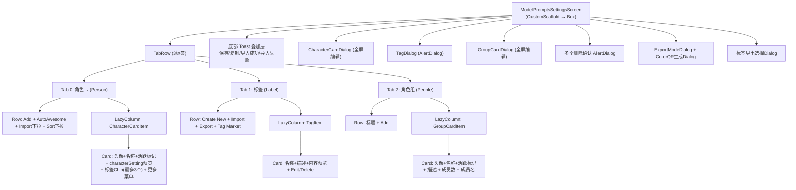

# Settings 子页面：提示词配置（ModelPrompts + TagMarket）

本文档描述 Settings 中提示词配置相关的两个子页面：**系统提示词管理**（ModelPromptsSettingsScreen）与**标签市场**（TagMarketScreen）。

**源码规模：** `ModelPromptsSettingsScreen.kt` 3490 行 + `TagMarketScreen.kt` 221 行。

## 一、ModelPromptsSettingsScreen（系统提示词管理）

### 1.1 总体架构

三标签页管理中心：角色卡（Character Cards）、标签（Tags）、角色组（Character Groups）。支持角色卡的 CRUD、Tavern 格式导入导出、Color QR 编码、标签系统和角色组编排。

### 1.2 组件树



### 1.3 角色卡管理 (Tab 0)

**操作菜单（DropdownMenu 三点图标）：**

| 操作 | 条件 | 流程 |
|------|------|------|
| Set Active | 非当前活跃 | `activePromptManager.setActivePrompt()` |
| Edit | 始终 | 打开 `CharacterCardDialog` |
| Duplicate | 始终 | `createCharacterCard(card.copy(newId))` + `cloneBindingsFromCharacterCard()` |
| Export | 始终 | → ExportModeDialog (JSON/PNG/ColorQR) |
| Reset | 仅默认卡 | 重置为出厂默认值 |
| Delete | 仅非默认卡 | 删除确认 → 触发聊天管理提示 |

**排序选项：**
- `DEFAULT` — 原始列表顺序
- `NAME_ASC` — 按名称字母排序
- `CREATED_DESC` — 按更新时间倒序

**导入方式（DropdownMenu）：**
- Import Tavern Card (JSON 或 PNG)
- Import Color QR (图片文件)
- Scan Color QR (摄像头)

### 1.4 CharacterCardDialog

95% 宽度全屏 Dialog，所有文本字段使用 `CompactTextFieldWithExpand`（点击展开图标进入全屏编辑）。

```
CharacterCardDialog
├── Header: CompactAvatarPicker(40dp) + Name + Description
├── Character Setting (主系统提示词)
├── Opening Statement (开场白, 含翻译按钮)
├── Other Content (Chat) (聊天模式注入)
├── Other Content (Voice) (语音模式注入)
├── Tags (FlowRow FilterChip, 多选附加)
└── Advanced Options (可折叠)
    ├── Chat Model Binding (FOLLOW_GLOBAL / FIXED_CONFIG)
    │   └── [FIXED] CharacterCardFixedModelPickerDialog
    ├── Tool Access (白名单配置)
    │   └── CharacterCardToolAccessDialog
    ├── Advanced Custom Prompt (自由提示词)
    └── Marks/Notes (内部笔记, 不注入提示词)
```

### 1.5 标签系统 (Tab 1)

**数据模型：**

```kotlin
data class PromptTag(
    val id: String,
    val name: String,
    val description: String = "",
    val promptContent: String = "",    // 注入系统提示词的内容
    val tagType: TagType = TagType.CUSTOM,
    val createdAt: Long,
    val updatedAt: Long
)

enum class TagType { TONE, CHARACTER, FUNCTION, CUSTOM }
```

**工作机制：** 标签通过 `CharacterCard.attachedTagIds` 绑定到角色卡。活跃角色卡的所有附加标签的 `promptContent` 拼接后注入系统提示词。

**导入/导出格式：**
```json
{
  "format": "operit_prompt_tags",
  "version": 1,
  "exportedAt": 1234567890,
  "tags": [{ "name": "...", "promptContent": "...", "tagType": "TONE" }]
}
```

导入按名称去重：已存在则更新，不存在则创建。

### 1.6 角色组 (Tab 2)

**GroupCardDialog：**
- Header: CompactAvatarPicker + Name + Description
- 成员管理：下拉添加角色卡 + 拖排列表 + 单独删除
- 成员存储为 `List<GroupMemberConfig>`（`characterCardId` + `orderIndex`）

### 1.7 导出流程

**Tavern PNG 导出：**
```
Export → ExportModeDialog → 选择 PNG
  → exportCharacterCardToTavernJson(id)
  → insertTavernTextChunk() 嵌入 tEXt chunk
  → 保存到 Downloads/Operit/
```

**Color QR 导出：**
```
Export → ExportModeDialog → 选择 Color QR
  → showExportDialog 打开
  → 颜色数选择器 (2/4/8/16)
  → ColorQrCodeUtil.generate()
  → 显示生成的 QR 图片 + 保存按钮
```

### 1.8 状态管理

| Manager | 职责 |
|---------|------|
| `CharacterCardManager` | 角色卡 CRUD + Tavern 导入导出 |
| `CharacterGroupCardManager` | 角色组 CRUD |
| `ActivePromptManager` | 活跃 Prompt 追踪 |
| `PromptTagManager` | 标签 CRUD |
| `UserPreferencesManager` | 头像 URI + 自定义聊天标题 |

无 ViewModel。排序选项通过 `rememberLocal` (keyed `rememberSaveable`) 持久化。

---

## 二、TagMarketScreen（标签市场）

### 2.1 总体架构

纯静态预置标签展示页面，无网络请求。提供 14 个预置标签，分 4 个分类，支持一键安装到用户标签库。

### 2.2 组件树

```
TagMarketScreen (CustomScaffold)
├── LazyColumn
│   └── [按分类分组]
│       ├── Text: 分类标题
│       └── PresetTagCard (每个标签)
│           ├── Row: 图标 + 名称 + TagType徽章
│           ├── Text: 描述
│           ├── HorizontalDivider
│           ├── Text: 标签内容预览 (最多6行)
│           └── Button "Add" → 打开安装对话框
│
├── AlertDialog (安装确认)
│   ├── 确认提示文本
│   ├── OutlinedTextField: 可编辑标签名 (预填预置名)
│   └── Add / Cancel 按钮
│
└── 底部成功提示 (1.5秒自动消失)
```

### 2.3 预置标签目录

| 分类 | 标签数 | TagType | 标签名 |
|------|--------|---------|--------|
| 破甲限制 | 3 | TONE | Armor Break, Unrestricted Mode, Super Priority |
| 语气风格 | 4 | TONE | Sharp Tone, Gentle Tone, Sunny Cheerful, Natural Dialogue |
| 角色设定 | 4 | CHARACTER | Obey Master, Feminine, Guardian, Caring Sister |
| 特殊功能 | 3+ | FUNCTION | Psychological Analysis, Emotional Support, Action Oriented, AI Status Card, HTML Wrapper, Word Count Control, Story Creation |

### 2.4 双语支持

`PresetTagBilingual` 为每个文本字段（name、description、promptContent、category）持有中英两版。运行时通过 `Locale.language == "zh"` 选择。

### 2.5 安装流程

```
点击 "Add" → selectedPreset + newTagName 预填
  → AlertDialog 打开 → 用户可改名
  → 确认 → promptTagManager.createPromptTag(name, desc, content, type)
  → 关闭对话框 → 显示成功提示
```

安装后标签出现在 `ModelPromptsSettingsScreen` 的 Tag 标签页中。

---

## 三、数据模型

### CharacterCard（角色卡）

```kotlin
data class CharacterCard(
    val id: String,
    val name: String,
    val description: String = "",
    val characterSetting: String = "",     // 主系统提示词
    val openingStatement: String = "",     // 开场白
    val otherContentChat: String = "",     // 聊天模式注入
    val otherContentVoice: String = "",    // 语音模式注入
    val advancedCustomPrompt: String = "", // 高级自定义提示词
    val marks: String = "",               // 笔记 (不注入)
    val attachedTagIds: List<String> = emptyList(),
    val chatModelBinding: ChatModelBinding = FOLLOW_GLOBAL,
    val fixedModelConfigId: String? = null,
    val fixedModelIndex: Int = 0,
    val toolAccessEnabled: Boolean = false,
    val allowedTools: List<String> = emptyList(),
    val updatedAt: Long = 0L
)
```

### CharacterGroupCard（角色组）

```kotlin
data class CharacterGroupCard(
    val id: String,
    val name: String,
    val description: String = "",
    val members: List<GroupMemberConfig> = emptyList(),
    val updatedAt: Long = 0L
)

data class GroupMemberConfig(
    val characterCardId: String,
    val orderIndex: Int
)
```

---

## 四、架构要点

1. **3490 行单文件**：`ModelPromptsSettingsScreen` 包含 3 个标签页、6+ 个对话框、导入/导出逻辑、Color QR 生成，全部内联在 Composable 中。

2. **Tavern 格式兼容**：支持 V1/V2 Tavern 角色卡 JSON，PNG 通过 `tEXt` chunk 嵌入。Operit 特有字段存入 `extensions.operit` 块。

3. **Color QR 编码**：`ColorQrCodeUtil` 将角色卡 JSON 编码为彩色像素矩阵（2/4/8/16 色），支持图片文件或摄像头扫描解码。

4. **标签注入机制**：活跃角色卡的 `attachedTagIds` 对应的标签 `promptContent` 在 AI 请求时拼接到系统提示词中。

5. **TagMarket 纯静态**：14 个预置标签编译时写死在 `TagMarketBilingualData.kt`，无网络依赖。

6. **删除联动提示**：删除角色卡后弹出 `showChatManagementPrompt`，引导用户跳转到 `ChatHistorySettings` 清理残留聊天记录。

---

## 五、核心文件清单

| 文件 | 路径 (相对于 `ui/features/settings/`) | 行数 | 职责 |
|------|------|------|------|
| **ModelPromptsSettingsScreen** | `screens/ModelPromptsSettingsScreen.kt` | 3490 | 三标签页管理 + 导入导出 |
| **TagMarketScreen** | `screens/TagMarketScreen.kt` | 221 | 预置标签展示 + 安装 |
| TagMarketBilingualData | `screens/TagMarketBilingualData.kt` | ~300 | 14个预置标签双语数据 |
| CharacterCardDialog | `components/CharacterCardDialog.kt` | ~500 | 角色卡编辑全屏 Dialog |
