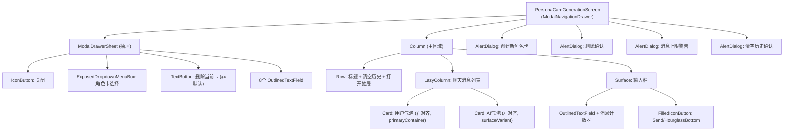

# Settings 子页面：角色扮演（PersonaCard + WaifuMode + CustomEmoji）

本文档描述 Settings 中角色扮演相关的三个子页面：**角色卡生成**（PersonaCardGenerationScreen）、**Waifu 模式设置**（WaifuModeSettingsScreen）与**自定义表情管理**（CustomEmojiManagementScreen）。

## 一、PersonaCardGenerationScreen（角色卡生成）

**源码规模：** `PersonaCardGenerationScreen.kt` 1062 行。

### 1.1 总体架构

AI 对话式角色卡生成器。左侧抽屉管理角色卡字段，主区域为聊天界面，AI 通过工具调用自动填充角色卡字段。

### 1.2 组件树



### 1.3 AI 对话流程

```
用户输入 → sendMessage()
  → 追加用户气泡 + 保存历史
  → isGenerating = true
  → 检查 isCharacterCardComplete() (8字段全非空 → 短路回复)
  → requestFromDefaultService()
    → EnhancedAIService.getAIServiceForFunction(CHAT)
    → 发送完整历史 + personaCardGenerationSystemPrompt
    → 流式接收 → 清理工具标签/状态标签
  → processToolInvocations()
    → 解析 <tool name="save_character_info"> XML
    → LocalCharacterToolExecutor 更新 CharacterCard
  → 更新 token 统计
  → 保存聊天历史
```

**消息上限：** 40 条。达到后弹出警告，引导用户清空历史。

### 1.4 抽屉编辑器

8 个 `OutlinedTextField` 对应角色卡字段：

| 字段 | 变量 |
|------|------|
| Name | editName |
| Description | editDescription |
| Character Setting | editCharacterSetting |
| Opening Statement | editOpeningStatement |
| Other Content (Chat) | editOtherContentChat |
| Other Content (Voice) | editOtherContentVoice |
| Advanced Custom Prompt | editAdvancedCustomPrompt |
| Marks/Notes | editMarks |

每个字段的 `onValueChange` 立即调用 `characterCardManager.updateCharacterCard(card.copy(...))`，无保存按钮。

### 1.5 状态管理

无 ViewModel。核心状态：

| 状态 | 说明 |
|------|------|
| `chatMessages` | `SnapshotStateList<CharacterChatMessage>` |
| `isGenerating` | 发送中锁定 |
| `activeCardId` | 当前编辑的角色卡 ID |
| `activeCard` | 当前角色卡对象 |
| `drawerState` | 抽屉开关 |
| `MESSAGE_LIMIT` | 40 (const) |

聊天历史通过 `PersonaCardChatHistoryManager` (DataStore + Gson) 按角色卡 ID 独立持久化。

---

## 二、WaifuModeSettingsScreen（Waifu 模式设置）

**源码规模：** `WaifuModeSettingsScreen.kt` 627 行。

### 2.1 总体架构

Waifu 模式全量配置，覆盖打字速度、标点清理、自定义提示词、表情、自拍功能。所有设置与当前活跃角色卡/角色组绑定。

### 2.2 组件树

```
WaifuModeSettingsScreen (CustomScaffold)
└── Column (verticalScroll, spacing 24dp)
    ├── Card (secondaryContainer): 页面标题 + 描述
    ├── Card (primaryContainer): 角色卡绑定信息
    ├── Card: 启用开关 (Switch)
    │
    ├── [启用后显示]
    │   ├── Card: 打字速度
    │   │   ├── Text: 当前速度 (chars/sec = 1000/delay)
    │   │   └── Slider: charDelay (200~1000ms, 步进20ms)
    │   ├── Card: 移除标点 (Switch)
    │   ├── Card: 自定义 Waifu 提示词
    │   │   └── OutlinedTextField (4~8行)
    │   ├── Card: 启用表情 (Switch)
    │   ├── Card: 管理自定义表情 (→ CustomEmojiManagement)
    │   └── Card: 启用自拍功能 (Switch)
    │       └── [启用后] OutlinedTextField: 外貌描述提示词
    │
    ├── Card (tertiaryContainer): 功能说明
    └── [保存成功] Card: 绿色成功提示 (2秒自动消失)
```

### 2.3 状态管理

无 ViewModel。通过 `WaifuPreferences` (DataStore `waifu_settings`) 管理 7 个设置项：

| 设置项 | 默认值 | 说明 |
|--------|--------|------|
| `enableWaifuMode` | false | 主开关 |
| `waifuCharDelay` | 500ms | 打字延迟 |
| `waifuRemovePunctuation` | false | 移除标点 |
| `waifuEnableEmoticons` | false | 启用表情 |
| `waifuEnableSelfie` | false | 启用自拍 |
| `waifuCustomPrompt` | DEFAULT_CUSTOM_PROMPT | 自定义提示词 |
| `waifuSelfiePrompt` | DEFAULT_SELFIE_PROMPT | 外貌描述 |

### 2.4 保存与角色绑定

所有控件共享 `saveSettings` 包装器：

```
saveSettings { waifuPreferences.saveXxx(...) }
  → 执行保存
  → saveCurrentWaifuSettingsToCharacterCard(id)
     或 saveCurrentWaifuSettingsToCharacterGroup(id)
  → showSaveSuccess = true (2秒后自动消失)
```

切换角色卡时，`switchToCharacterCardWaifuSettings()` 从角色特定前缀键复制到扁平命名空间。

---

## 三、CustomEmojiManagementScreen（自定义表情管理）

**源码规模：** `CustomEmojiManagementScreen.kt` 556 行。

### 3.1 总体架构

按分类管理自定义表情图片。支持创建/删除分类、批量添加/单独删除表情、预览大图。所有数据按活跃角色卡/角色组独立存储。

### 3.2 组件树

```
CustomEmojiManagementScreen (Scaffold + FAB)
├── FAB: 添加表情图片 (多选)
├── Card: 角色卡绑定信息
├── CategorySelector (ExposedDropdownMenuBox)
│   └── DropdownMenuItem: 分类列表 (自定义分类带★标记)
├── Row: Create Group / Delete Group / Reset to Default
├── [空] 添加提示文本
├── [非空] EmojiGrid
│   └── LazyVerticalGrid (3列)
│       └── EmojiCard
│           ├── AsyncImage (Coil, Crop)
│           └── Delete图标覆盖 (右上)
├── [加载中] LinearProgressIndicator
│
├── AlertDialog: 创建分类 (名称校验: a-z0-9_)
├── AlertDialog: 删除分类确认
├── AlertDialog: 删除表情确认
├── AlertDialog: 重置确认
├── Dialog: 表情大图预览
├── Snackbar: 错误/成功消息
```

### 3.3 状态管理

**唯一使用 ViewModel 的页面**：`CustomEmojiViewModel`（通过 `remember { CustomEmojiViewModel(context) }` 创建，非标准 `viewModel()` 工厂）。

| StateFlow | 说明 |
|-----------|------|
| `activePrompt` | 活跃角色卡/组 |
| `activeTargetName` | 绑定目标显示名 |
| `selectedCategory` | 当前选中分类 |
| `categories` | 所有分类列表 |
| `emojisInCategory` | 当前分类的表情列表 |
| `isLoading` | 加载状态 |
| `errorMessage` / `successMessage` | 反馈消息 |

### 3.4 内置分类

9 个内置情绪分类：`happy`, `sad`, `angry`, `surprised`, `confused`, `crying`, `like_you`, `miss_you`, `speechless`。

### 3.5 文件存储

```
filesDir/custom_emoji/<target-prefix>/<category>/<uuid>.jpg
```

元数据存储在 DataStore `custom_emoji_settings`，键按角色卡/组 ID 分隔：`character_card_custom_emoji_<id>_*`。

### 3.6 交互流程

| 操作 | 流程 |
|------|------|
| 添加表情 | FAB → imagePickerLauncher (多选) → repository.addCustomEmoji() 复制文件 + 写元数据 |
| 查看表情 | 点击 → Dialog 大图预览 |
| 删除表情 | 长按 → 确认 → viewModel.deleteEmoji() |
| 创建分类 | 按钮 → Dialog → 名称校验 (a-z0-9_) → 自动切换 |
| 删除分类 | 按钮 → 确认 → 删除文件+元数据 → 自动切换到首个分类 |
| 重置 | 按钮 → 确认 → 删除所有自定义数据 → 重初始化内置表情 |

---

## 四、导航关系

```
Settings
├── PersonaCardGeneration (parentScreen = Settings)
│   └── 抽屉内可创建/切换/删除角色卡
└── WaifuModeSettings (parentScreen = Settings)
    └── CustomEmojiManagement (parentScreen = WaifuModeSettings)
```

| 方向 | 说明 |
|------|------|
| Settings → PersonaCardGeneration | 入口页 "Persona Card Generation" 项 |
| Settings → WaifuModeSettings | 入口页 "Waifu Mode Settings" 项 |
| WaifuModeSettings → CustomEmojiManagement | "管理自定义表情" 卡片 |
| ModelPromptsSettings → PersonaCardGeneration | Tab 0 头部 AutoAwesome 按钮 |

PersonaCardGeneration 声明了 4 个交叉导航回调（Settings / UserPreferences / ModelConfig / ModelPrompts），但当前 UI 中无对应按钮。

---

## 五、共享实体

| 实体 | PersonaCard | WaifuMode | CustomEmoji |
|------|:-----------:|:---------:|:-----------:|
| `ActivePromptManager` | 读+写 | 只读 | 只读 (ViewModel内) |
| `CharacterCardManager` | CRUD | 只读 (名称) | 只读 (ViewModel内) |
| `ActivePrompt` 绑定 | 创建/切换角色卡 | 按卡保存设置 | 按卡存储表情 |

---

## 六、架构要点

1. **PersonaCard 内嵌 AI 服务**：直接通过 `EnhancedAIService.getAIServiceForFunction(CHAT)` 创建临时 AI 服务，流式处理响应并解析 XML 工具调用。

2. **LocalCharacterToolExecutor**：`private object`，在屏幕内处理 `save_character_info` 工具调用，直接更新 CharacterCard。

3. **WaifuMode 双层 DataStore**：扁平命名空间（当前生效值）+ 角色前缀命名空间（快照），角色切换时复制快照到扁平。

4. **CustomEmoji 唯一 ViewModel**：22 个 Settings 子页面中唯一使用 ViewModel 的页面，但通过 `remember {}` 创建（不走标准 `viewModel()` 工厂，不跨进程存活）。

5. **渐进式展示**：WaifuMode 的 6 张配置卡仅在主开关启用后渲染，自拍描述仅在自拍开关启用后渲染。

---

## 七、核心文件清单

| 文件 | 路径 (相对于 `ui/features/settings/`) | 行数 | 职责 |
|------|------|------|------|
| **PersonaCardGenerationScreen** | `screens/PersonaCardGenerationScreen.kt` | 1062 | AI 对话式角色卡生成 |
| **WaifuModeSettingsScreen** | `screens/WaifuModeSettingsScreen.kt` | 627 | Waifu 模式配置 |
| **CustomEmojiManagementScreen** | `screens/CustomEmojiManagementScreen.kt` | 556 | 表情分类管理 |
