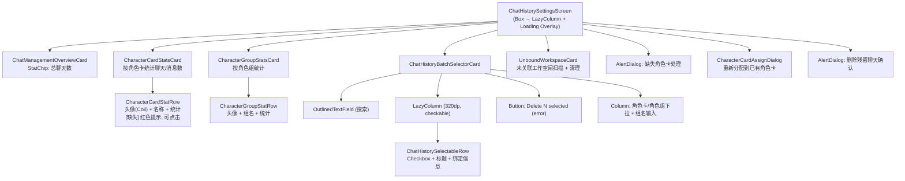

# Settings 子页面：数据管理（ChatBackup + ChatHistory）

本文档描述 Settings 中数据管理相关的两个子页面：**数据备份与恢复**（ChatBackupSettingsScreen）与**聊天历史管理**（ChatHistorySettingsScreen）。

## 一、ChatBackupSettingsScreen（数据备份与恢复）

**源码规模：** `ChatBackupSettingsScreen.kt` 1627 行。

### 1.1 总体架构

全域数据备份管理中心，覆盖 6 种数据域（聊天记录、角色卡、记忆、模型配置、Room 数据库、原始快照），每个域独立提供导出/导入/删除操作，带进度反馈和多步对话框流程。

### 1.2 组件树

```mermaid
graph TD
    ROOT["ChatBackupSettingsScreen<br/>(LazyColumn, 8个区块)"]

    ROOT --> OVERVIEW["OverviewCard<br/>FlowRow: 聊天数/角色卡数/记忆数/关联数"]
    ROOT --> STATS["BackupFilesStatisticsCard<br/>FlowRow: 5种备份文件计数 + Refresh"]
    ROOT --> CHAT["DataManagementCard (聊天)<br/>Export / Import / Delete All"]
    ROOT --> CHAR["CharacterCardManagementCard<br/>Export / Import"]
    ROOT --> MEM["MemoryManagementCard<br/>Export / Import (多档案+策略)"]
    ROOT --> MODEL["ModelConfigManagementCard<br/>Export / Import"]
    ROOT --> FAQ["FaqCard (3个常见问题)"]
    ROOT --> ROOMDB["Room DB Backup Card<br/>每日自动备份 + 手动备份/恢复"]
    ROOT --> RAW["Raw Snapshot Card<br/>全量快照备份/恢复"]

    CHAT --> DLG_DEL["DeleteConfirmationDialog"]
    CHAT --> DLG_EXPORT_FMT["ExportFormatDialog<br/>(JSON/MD/HTML/TXT)"]
    CHAT --> DLG_IMPORT_FMT["ImportFormatDialog<br/>(OPERIT/CHATGPT/CHATBOX/MD/JSON)"]
    MEM --> DLG_PROFILE_E["ProfileSelectionDialog (导出)"]
    MEM --> DLG_PROFILE_I["ProfileSelectionDialog (导入)"]
    MEM --> DLG_STRATEGY["MemoryImportStrategyDialog<br/>(SKIP/UPDATE/CREATE_NEW)"]
    MODEL --> DLG_WARNING["ModelConfigExportWarningDialog<br/>(API Key 安全警告)"]
    ROOMDB --> DLG_RESTORE["AlertDialog: 恢复确认"]
    ROOMDB --> DLG_RESTART["AlertDialog: 重启应用"]
```



### 1.3 6 种数据域操作矩阵

| 数据域 | 导出 | 导入 | 删除 | 特殊 |
|--------|------|------|------|------|
| 聊天记录 | 4 格式 (JSON/MD/HTML/TXT) | 5 格式 (OPERIT/CHATGPT/CHATBOX/MD/JSON) | 全部删除（跳过锁定） | — |
| 角色卡 | JSON | JSON | — | — |
| 记忆 | 需选档案 | 需选档案+合并策略 | — | 3 种策略 |
| 模型配置 | JSON + 安全警告 | JSON | — | 导出后警告含 API Key |
| Room DB | 手动/每日自动 | ZIP 文件 | — | 恢复后需重启 |
| 原始快照 | 7 阶段进度 | 8 阶段进度 | — | 恢复后需重启 |

### 1.4 状态管理

无 ViewModel。每个数据域有独立的操作状态枚举：

```kotlin
enum class ChatHistoryOperation    { IDLE, EXPORTING, EXPORTED, IMPORTING, IMPORTED, DELETING, DELETED, FAILED }
enum class CharacterCardOperation  { IDLE, EXPORTING, EXPORTED, IMPORTING, IMPORTED, FAILED }
enum class MemoryOperation         { IDLE, EXPORTING, EXPORTED, IMPORTING, IMPORTED, FAILED }
enum class ModelConfigOperation    { IDLE, EXPORTING, EXPORTED, IMPORTING, IMPORTED, FAILED }
enum class RoomDatabaseBackupOperation  { IDLE, BACKING_UP, SUCCESS, FAILED }
enum class RoomDatabaseRestoreOperation { IDLE, RESTORING, SUCCESS, FAILED }
enum class RawSnapshotOperation    { IDLE, BACKING_UP, BACKUP_SUCCESS, RESTORING, RESTORE_SUCCESS, FAILED }
```

**响应式 Flow**：
- `activeProfileIdFlow` → 当前用户档案
- `enableDailyBackupFlow` → Room DB 每日备份开关
- `lastSuccessTimeFlow` / `lastErrorFlow` → 上次备份结果

### 1.5 多步对话框流程

**记忆导入**（3 步）：
```
Import 按钮 → 文件选择器 → pendingMemoryImportUri
  → ProfileSelectionDialog (选目标档案)
    → MemoryImportStrategyDialog (选合并策略: SKIP/UPDATE/CREATE_NEW)
      → importMemoriesFromUri()
```

**聊天导入**（2 步）：
```
Import 按钮 → 文件选择器 → pendingImportUri
  → ImportFormatDialog (选格式)
    → chatHistoryManager.importChatHistoriesFromUri()
```

**URI 暂存模式**：文件选择器结果存入 `pendingXxxUri`，后续对话框消费。

### 1.6 Room DB 备份

- **每日自动备份**：Switch 控制 + `RoomDatabaseBackupScheduler.ensureScheduled()`
- **最大备份数**：步进器 (1-100)，减小时调用 `pruneExcessBackups()`
- **最近备份列表**：`RoomDbBackupListItem` 显示文件名 + 单独恢复按钮
- **恢复后重启**：`FLAG_ACTIVITY_CLEAR_TASK` + `exitProcess(0)`

### 1.7 Raw Snapshot 进度阶段

| 导出 (7 阶段) | 恢复 (8 阶段) |
|---------------|---------------|
| PREPARING | PREPARING |
| SCANNING_FILES | READING_ZIP |
| ZIPPING_FILES | EXTRACTING |
| ZIPPING_SHARED_PREFS | REPLACING_FILES |
| ZIPPING_DATASTORE | REPLACING_SHARED_PREFS |
| ZIPPING_DATABASES | REPLACING_DATASTORE |
| FINALIZING | REPLACING_DATABASES |
| — | FINALIZING |

---

## 二、ChatHistorySettingsScreen（聊天历史管理）

**源码规模：** `ChatHistorySettingsScreen.kt` 1992 行。

### 2.1 总体架构

聊天历史的浏览、统计、批量操作和数据清理工具。提供按角色卡/角色组的使用统计、批量绑定/解绑、缺失引用修复、未绑定工作空间清理。

### 2.2 组件树



### 2.3 状态管理

无 ViewModel。响应式数据：

| Flow | 来源 | 说明 |
|------|------|------|
| `characterCardStatsFlow` | ChatHistoryManager | 按角色卡聊天统计 |
| `characterGroupStatsFlow` | ChatHistoryManager | 按角色组聊天统计 |
| `chatHistoriesFlow` | ChatHistoryManager | 全部聊天记录 |
| `characterCardListFlow` | CharacterCardManager | 已有角色卡列表 |
| `allCharacterGroupCardsFlow` | CharacterGroupCardManager | 已有角色组列表 |

**加载闸门**：4 个异步标志全部完成后隐藏全屏加载遮罩。

### 2.4 角色卡统计与缺失修复

排序规则：缺失引用排最前（红色高亮），然后按名称字母排序。

**缺失角色卡修复流程**：
```
点击缺失行 → MissingActionDialog
  ├── "Assign to card" → CharacterCardAssignDialog
  │   └── 选择已有卡 → reassignChatsToCharacterCard(source, target)
  └── "Delete residual chats" → DeleteMissingDialog
      └── 确认 → deleteChatsByCharacterCardBinding(cardName)
```

### 2.5 批量选择器 (ChatHistoryBatchSelectorCard)

**搜索**：按标题、组名、角色卡名、角色组名过滤。

**批量操作**（可组合）：
- 角色卡绑定/解绑（ExposedDropdownMenuBox）
- 角色组绑定/解绑（ExposedDropdownMenuBox）
- 组名修改（自由文本输入）
- 批量删除（跳过锁定聊天）

Apply 按钮标签根据选中的操作组合动态生成。

**排序**：多键排序——组绑定 → 组名 → 卡绑定 → 卡名 → 组字段 → 时间倒序。

### 2.6 未绑定工作空间清理

扫描两个目录：
- 内部：`context.filesDir/workspace/`
- 外部：`Downloads/Operit/workspace/`

过滤掉被任何 `ChatHistory.workspace` 引用的路径，剩余显示为可勾选列表。

| 显示 | 内部存储 | 外部存储 |
|------|---------|---------|
| 图标 | `Folder` | `FolderOpen` |
| 标签 | "internal storage" | "external storage" |

### 2.7 头像渲染

每行独立收集 `getAiAvatarForCharacterCardFlow(card.id)` / `getAiAvatarForCharacterGroupFlow(group.id)`：
- 有 URI → Coil `AsyncImagePainter` + `ContentScale.Crop`
- 无 URI → 名称首字符 + `secondaryContainer` 背景

---

## 三、数据模型

```kotlin
data class CharacterCardChatStats(
    val characterCardName: String?,   // null = 未绑定
    val chatCount: Int,
    val messageCount: Int
)

data class CharacterGroupChatStats(
    val characterGroupId: String?,
    val chatCount: Int,
    val messageCount: Int
)

data class UnboundWorkspaceInfo(
    val name: String,
    val fullPath: String,
    val location: String   // 已本地化
)
```

---

## 四、架构要点

1. **"神级 Composable" 模式**：ChatBackup 1627 行、ChatHistory 1992 行，全部业务逻辑内联在 Composable 中，无 ViewModel。Manager 通过 `getInstance(context)` 单例获取。

2. **URI 暂存模式**：多步对话框流程通过 `pendingXxxUri` 变量在文件选择器和后续对话框之间传递数据。

3. **子组件自治**：`ChatHistoryBatchSelectorCard` 和 `UnboundWorkspaceCard` 各自持有独立的对话框状态和删除进度，相当于内嵌的子页面。

4. **每行独立订阅**：`CharacterCardStatRow` 各自 `collectAsState` 头像 Flow，每个可见行维持独立的响应式订阅。

5. **恢复后重启**：Room DB 和 Raw Snapshot 恢复成功后，通过 `FLAG_ACTIVITY_CLEAR_TASK` + `exitProcess(0)` 强制重启应用。

6. **操作结果反馈**：所有操作通过 `OperationProgressView`（加载中）和 `OperationResultCard`（结果）两个共享组件显示反馈。

---

## 五、核心文件清单

| 文件 | 路径 (相对于 `ui/features/settings/`) | 行数 | 职责 |
|------|------|------|------|
| **ChatBackupSettingsScreen** | `screens/ChatBackupSettingsScreen.kt` | 1627 | 6 域备份管理 |
| **ChatHistorySettingsScreen** | `screens/ChatHistorySettingsScreen.kt` | 1992 | 聊天历史统计与管理 |
| BackupCards | `components/BackupCards.kt` | ~200 | OverviewCard + StatisticsCard |
| BackupManagementCards | `components/BackupManagementCards.kt` | ~300 | 4 域管理卡 + FAQ + 共享组件 |
| BackupOperationTypes | `components/BackupOperationTypes.kt` | ~50 | 操作状态枚举 |
| RoomDbBackupComponents | `components/RoomDbBackupComponents.kt` | ~100 | Room DB 备份列表项 |
