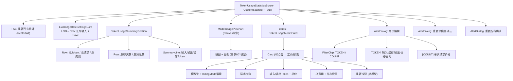

# Settings 子页面：系统资源与账户（TokenUsage + MnnModel + GitHubAccount）

本文档描述 Settings 中系统资源管理与账户相关的三个子页面：**Token 用量统计**（TokenUsageStatisticsScreen）、**MNN 模型下载**（MnnModelDownloadScreen）与**GitHub 账户**（GitHubAccountScreen）。

## 一、TokenUsageStatisticsScreen（Token 用量统计）

**源码规模：** `TokenUsageStatisticsScreen.kt` 831 行。

### 1.1 总体架构

按模型追踪 API Token 消耗、请求次数和估算费用。支持逐模型定价编辑（TOKEN/COUNT 两种计费模式）和汇率设置。

### 1.2 组件树



### 1.3 计费模型

| 模式 | 计算公式 |
|------|---------|
| TOKEN | `(非缓存输入/1M × inputPrice) + (输出/1M × outputPrice) + (缓存/1M × cachedPrice)` |
| COUNT | `请求次数 × pricePerRequest` |

**默认定价来源：** `DefaultModelPricingCollect` — 从 `ScrapedModelPricingRowsCollect.rows`（编译时管道分隔数据集）按提供商+模型名匹配默认价格。

**货币：** 自动从提供商检测 (CNY/USD)。USD 模型费用通过汇率转换后统一以 CNY 汇总。

### 1.4 饼图

Canvas 绘制，最多 8 个模型（按总 Token 降序）。右侧图例显示颜色色块 + 模型名 + 百分比。

### 1.5 状态管理

无 ViewModel。核心数据通过 4 个 `LaunchedEffect` 加载：

| LaunchedEffect | 数据 |
|----------------|------|
| `allProviderModelTokensFlow` | Token 三元组 (input, output, cached) per model |
| `providerModelTokenUsage.keys` | 加载持久化定价覆盖 |
| 一次性 (请求计数) | `getAllProviderModelRequestCounts()` |
| 一次性 (聊天统计) | 总聊天数/消息数 + 汇率 |

**派生状态 (`derivedStateOf`)：**
- `providerModelCosts` — 每模型费用 `ModelCost(amount, currency)`
- `modelUsageDistribution` — 饼图数据

---

## 二、MnnModelDownloadScreen（MNN 模型下载）

**源码规模：** `MnnModelDownloadScreen.kt` 648 行。

### 2.1 总体架构

MNN 本地推理模型的在线目录 + 下载管理器。支持搜索、下载/暂停/恢复/重试/删除，带实时进度和多文件支持。

### 2.2 组件树

```
MnnModelDownloadScreen (CustomScaffold)
└── Box
    ├── [加载中] CircularProgressIndicator + 文本
    ├── [错误] 错误图标 + 错误信息 + Retry按钮
    ├── [空列表] 空状态文本
    └── [有数据] Column
        ├── Surface: 搜索栏 (Search图标 + Clear)
        ├── [无结果] 搜索无结果图标+文本
        └── LazyColumn: ModelCard
            └── Surface
                ├── Row: 模型名 + 标签(最多2个)
                ├── Text: 大小 (GB)
                ├── Text: 描述 (1行省略)
                └── [状态区域]
                    ├── [Idle/未下载] Button "Download"
                    ├── [Idle/已下载] CheckCircle + Delete
                    ├── [Connecting] 进度圈 + "Connecting..."
                    ├── [Downloading] 进度条 + 百分比/速度 + Pause
                    ├── [Paused] 进度条 + Resume + Delete
                    ├── [Completed] CheckCircle + Delete
                    └── [Failed] 错误信息 + Retry

├── AlertDialog: 删除模型确认
```

### 2.3 下载状态机

```
Idle → Connecting → Downloading → Completed
                 ↘              → Failed
                  Downloading → Paused → Connecting → Downloading
                  Failed ────────────→ Connecting → Downloading
```

状态字段：
- `Downloading(progress, speed, downloadedBytes, totalBytes, currentFile, currentFileIndex, totalFiles)`
- `Paused(progress, downloadedBytes)`
- `Failed(error: String)`

### 2.4 下载机制

| 特性 | 说明 |
|------|------|
| 源优先级 | ModelScope > HuggingFace > 首个可用 |
| 单文件 | HEAD 检查已有大小 → GET with `Range: bytes=N-` 断点续传 |
| 多文件 | ModelScope API 列目录 → 逐文件下载 + 续传 |
| 临时文件 | `.tmp` 后缀，完成后 rename |
| 进度更新 | 每 500ms 刷新 |
| 暂停 | `pauseFlags[modelName] = true`，循环检查 |
| 存储目录 | `Downloads/Operit/models/mnn/<folderName>/` |
| 持久化 | `mnn_download_states.json` 存储暂停状态，跨重启恢复 |

### 2.5 模型目录

从 `https://meta.alicdn.com/data/mnn/apis/model_market.json` 获取，失败回退到本地缓存 `mnn_model_market_cache.json`。

```kotlin
@Serializable
data class MnnModel(
    val modelName: String,
    val size_gb: Double,
    val tags: List<String> = emptyList(),
    val sources: Map<String, String> = emptyMap(),
    val description: String = ""
)
```

### 2.6 状态管理

无 ViewModel。模型列表为局部状态。下载状态由 `MnnModelDownloadManager` (单例) 管理，每模型一个 `MutableStateFlow<DownloadState>`，通过 `ConcurrentHashMap` 存储，跨页面存活。

---

## 三、GitHubAccountScreen（GitHub 账户）

**源码规模：** `GitHubAccountScreen.kt` 197 行。

### 3.1 组件树

```
GitHubAccountScreen (CustomScaffold)
└── Column
    ├── Card (surfaceVariant): 身份信息
    │   ├── [已登录]
    │   │   ├── Image: 头像 (72dp, 圆形, Coil)
    │   │   ├── Text: 显示名 (name ?: login)
    │   │   ├── Text: @login
    │   │   ├── Text: email (可选)
    │   │   ├── Text: bio (可选)
    │   │   └── OutlinedButton: Logout
    │   └── [未登录]
    │       ├── Icon: Person (72dp)
    │       ├── Text: "Not logged in"
    │       └── Button: "Login with GitHub"
    │
    └── Card (surface): 账户统计
        ├── Text: "Account Info"
        ├── [已登录]
        │   ├── Row: ID
        │   ├── Row: Public Repos
        │   ├── Row: Followers
        │   └── Row: Following
        └── [未登录] Text: "Info not available"
```

### 3.2 状态管理

纯响应式页面，无本地可变状态。两个 Flow 驱动全部 UI：

| Flow | 类型 | 说明 |
|------|------|------|
| `githubAuth.isLoggedInFlow` | `Flow<Boolean>` | 登录状态 |
| `githubAuth.userInfoFlow` | `Flow<GitHubUser?>` | 用户信息 (JSON 反序列化) |

### 3.3 OAuth 配置

| 参数 | 值 |
|------|------|
| Scope | `public_repo,user:email,read:user` |
| Redirect URI | `operit://github-oauth-callback` |
| CSRF | 32 字符随机 state 参数 |

### 3.4 数据模型

```kotlin
@Serializable
data class GitHubUser(
    val id: Long,
    val login: String,
    val name: String? = null,
    val email: String? = null,
    @SerialName("avatar_url") val avatarUrl: String,
    val bio: String? = null,
    @SerialName("public_repos") val publicRepos: Int? = null,
    val followers: Int? = null,
    val following: Int? = null
)
```

### 3.5 操作

| 操作 | 触发 | 流程 |
|------|------|------|
| Login | Button → `onLogin()` | 委托给外部 (OAuth WebView/Custom Tab) |
| Logout | OutlinedButton | `githubAuth.logout()` → DataStore.clear() → Flow 重发 |

---

## 四、架构要点

1. **TokenUsage 纯计算 UI**：无写入操作（除定价编辑和重置），费用通过 `derivedStateOf` 纯函数计算。

2. **MnnModelDownload 单例管理器**：`MnnModelDownloadManager` 在应用作用域内存活，下载任务跨页面跳转不中断。

3. **GitHub 零业务逻辑**：最简页面 (197 行)，仅显示 2 个 Flow + 1 个登出操作，Login 完全委托外部。

4. **均无 ViewModel**：三个页面继续沿用 Manager 单例 + 局部状态模式。

5. **下载持久化**：暂停状态写入 JSON 文件，应用重启后自动恢复为 `Paused` 状态。

---

## 五、核心文件清单

| 文件 | 路径 | 行数 | 职责 |
|------|------|------|------|
| **TokenUsageStatisticsScreen** | `ui/features/settings/screens/TokenUsageStatisticsScreen.kt` | 831 | 用量统计 + 定价编辑 |
| TokenUsageStatisticsComponents | `ui/features/settings/screens/TokenUsageStatisticsComponents.kt` | ~100 | SummarySection + SummaryLine |
| **MnnModelDownloadScreen** | `ui/features/settings/screens/MnnModelDownloadScreen.kt` | 648 | 模型目录 + 下载管理 |
| MnnModelDownloadManager | `data/mnn/MnnModelDownloadManager.kt` | ~500 | 下载状态机 + 持久化 |
| **GitHubAccountScreen** | `ui/features/settings/screens/GitHubAccountScreen.kt` | 197 | GitHub OAuth 显示 |
| GitHubAuthPreferences | `data/preferences/GitHubAuthPreferences.kt` | ~200 | OAuth DataStore + GitHubUser |
