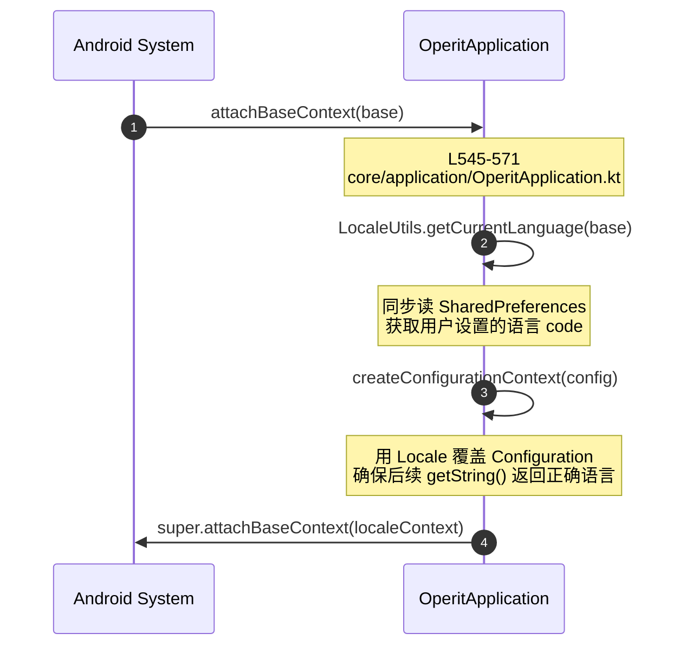
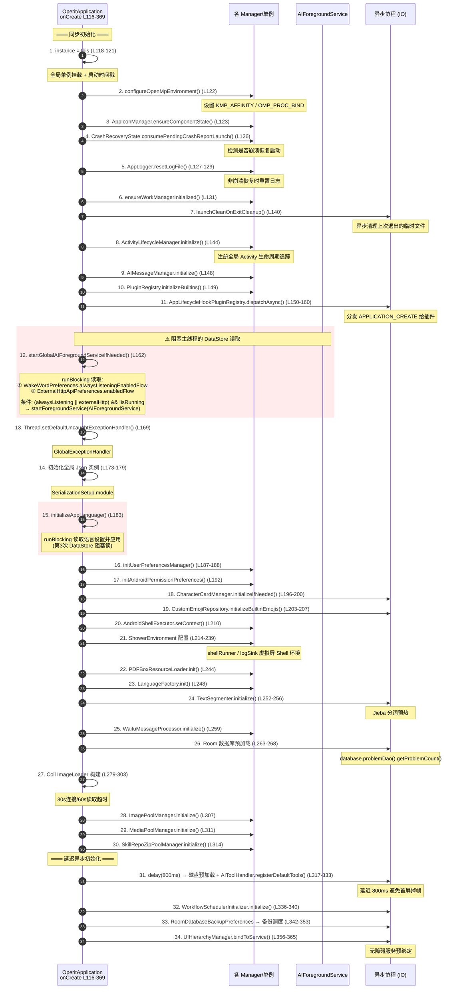
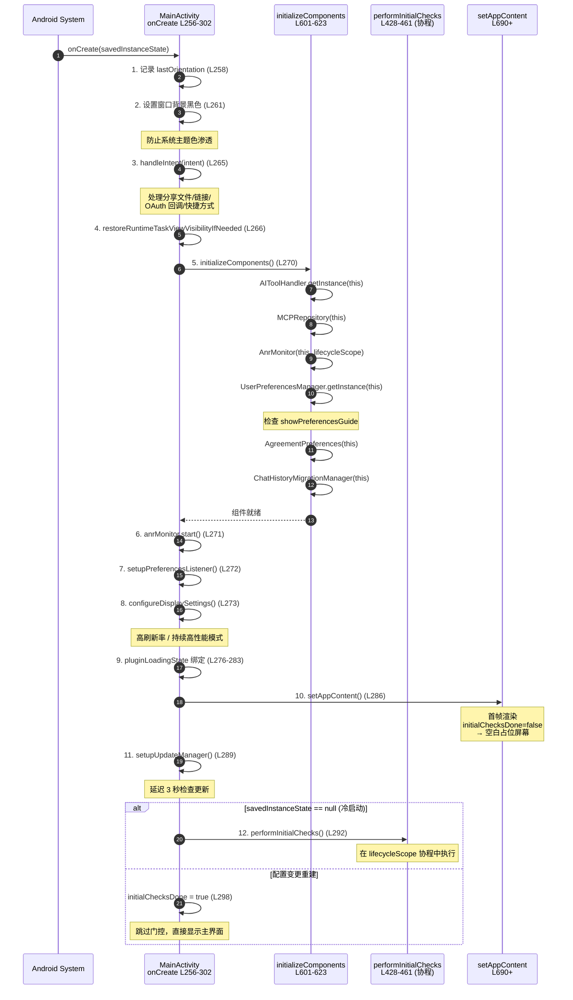
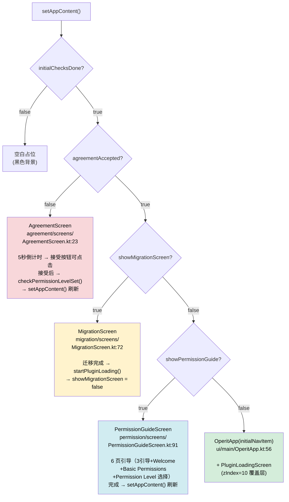
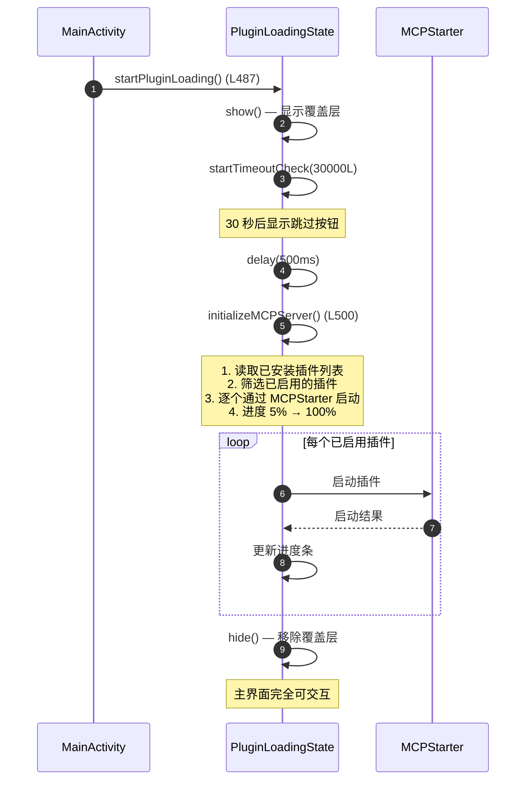
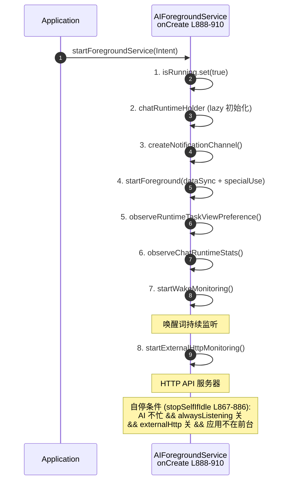

# 冷启动全链路（Application → 主界面可交互）

本文档描述 Operit 从进程创建到用户看到可交互主界面的完整初始化链路。每一步标注源文件路径和行号，可直接跳到源码对照。

## 总览

冷启动分 4 个阶段，耗时从上到下递增：

| 阶段 | 入口 | 产出 | 关键耗时点 |
|------|------|------|-----------|
| **Phase 0** | `attachBaseContext` | 语言配置注入 | 同步读取 SharedPreferences |
| **Phase 1** | `Application.onCreate` | 全局单例就位、异步预热启动 | 3 次 `runBlocking` DataStore 读取 |
| **Phase 2** | `MainActivity.onCreate` | 首帧渲染（空白占位） | `performInitialChecks()` 协程 |
| **Phase 3** | `setAppContent` 门控 | 用户看到可交互界面 | 协议/迁移/权限门 + 插件加载 |

## Phase 0: attachBaseContext（语言注入）



**关键文件：**
- `core/application/OperitApplication.kt:545-571` — `attachBaseContext` 实现

## Phase 1: Application.onCreate（34 步初始化）



**关键文件：**
- `core/application/OperitApplication.kt:116-369` — `onCreate` 主体
- `core/application/OperitApplication.kt:471-493` — `startGlobalAIForegroundServiceIfNeeded`
- `data/preferences/WakeWordPreferences.kt` — 唤醒词偏好
- `data/preferences/ExternalHttpApiPreferences.kt` — 外部 HTTP 偏好

### ⚠️ 主线程阻塞点

Application.onCreate 中有 **3 次 `runBlocking`** 同步读取 DataStore：

| 位置 | 读取内容 | 用途 |
|------|---------|------|
| L162 `startGlobalAIForegroundServiceIfNeeded` | `alwaysListeningEnabledFlow.first()` | 判断是否启动前台服务 |
| L162 同上 | `ExternalHttpApiPreferences.enabledFlow.first()` | 同上 |
| L183 `initializeAppLanguage` | 语言配置 Flow | 应用界面语言 |

这些阻塞读取会增加冷启动耗时，但因为需要在主线程完成语言设置和服务启动判断，无法简单异步化。

## Phase 2: MainActivity.onCreate（首帧渲染 + 门控检查）



**关键文件：**
- `ui/main/MainActivity.kt:256-302` — `onCreate`
- `ui/main/MainActivity.kt:601-623` — `initializeComponents`
- `ui/main/MainActivity.kt:428-461` — `performInitialChecks`

## Phase 3: 门控序列 + 主界面渲染

### 3.1 门控检查流程

```mermaid
flowchart TD
    START["performInitialChecks()<br/>MainActivity.kt:428"] --> NOTIF["① checkNotificationPermission()<br/>Android 13+ 请求 POST_NOTIFICATIONS"]
    NOTIF --> PERM["② checkPermissionLevelSet()<br/>读取 getPreferredPermissionLevel()"]
    PERM --> PERM_CHK{permissionLevel == null?}
    PERM_CHK -->|是| SHOW_PERM["showPermissionGuide = true<br/>→ 权限引导门"]
    PERM_CHK -->|否| AGREE_CHK{agreementPreferences<br/>.isAgreementAccepted()?}
    SHOW_PERM --> DONE["initialChecksDone = true<br/>→ setAppContent()"]
    AGREE_CHK -->|否| DONE
    AGREE_CHK -->|是| MIGRATE_CHK{"migrationManager<br/>.needsMigration()?"}
    MIGRATE_CHK -->|是| SHOW_MIG["showMigrationScreen = true<br/>→ 迁移门"]
    MIGRATE_CHK -->|否| PLUGIN["startPluginLoading()<br/>→ 插件加载"]
    SHOW_MIG --> DONE
    PLUGIN --> DONE
```

### 3.2 setAppContent 渲染决策树

`setAppContent`（`MainActivity.kt:690+`）根据状态变量选择渲染内容：



### 3.3 门控详情

| 门 | 检测条件 | Screen | 完成后行为 |
|---|---------|--------|-----------|
| **协议门** | `agreement_accepted == false` (SharedPreferences) | `AgreementScreen` — 5 秒倒计时才可接受 | 回调 → `checkPermissionLevelSet()` → `setAppContent()` |
| **迁移门** | `migration_version` 版本号过旧 + 旧 DataStore 数据存在 | `MigrationScreen` — 自动迁移聊天历史到 Room | 完成 → `startPluginLoading()` |
| **权限门** | `getPreferredPermissionLevel() == null` | `PermissionGuideScreen` — 6 页引导 | 完成 → `showPermissionGuide = false` → `setAppContent()` |
| **插件加载** | 前三门通过后自动触发 | `PluginLoadingScreen` — **覆盖层** (zIndex=10) | 30 秒超时显示跳过按钮 |

**关键文件：**
- `data/preferences/AgreementPreferences.kt` — 31 行，`agreement_preferences` SharedPreferences
- `data/repository/ChatHistoryMigrationManager.kt:52-67` — `needsMigration()`
- `data/preferences/AndroidPermissionPreferences.kt` — 权限级别检测

### 3.4 插件加载流程



## AIForegroundService 生命周期

当 Phase 1 步骤 12 判定需要启动时：



**关键文件：**
- `api/chat/AIForegroundService.kt:888-910` — `onCreate`
- `api/chat/AIForegroundService.kt:867-886` — `stopSelfIfIdle`
- `api/chat/AIForegroundService.kt:471-493` — 启动条件判断

## OperitApp 初始化（主界面就绪后）

进入 `OperitApp` 后，还有一组 `LaunchedEffect` 异步任务：

| LaunchedEffect | 触发条件 | 任务 | 文件位置 |
|---------------|---------|------|---------|
| `LaunchedEffect(Unit)` | 首次组合 | 网络状态轮询（每 10 秒） | OperitApp.kt:240-245 |
| `LaunchedEffect(isNetworkAvailable)` | 网络状态变化 | 拉取远程公告 | OperitApp.kt:249-256 |
| `LaunchedEffect(Unit)` | 首次组合 | `mcpRepository.syncInstalledStatus()` | OperitApp.kt:266-271 |
| `LaunchedEffect(shortcutNavRequest)` | 快捷方式 Intent | 导航到目标页面 | OperitApp.kt 内 |

默认初始屏幕：`AiChat`（通过 `OperitRouter.getScreenForNavItem(NavItem.AiChat)` 路由）。

**关键文件：**
- `ui/main/OperitApp.kt:56-62` — 函数签名
- `ui/main/OperitApp.kt:73-75` — 导航栈初始化

## 完整时间线总结

```
进程创建
  │
  ├─ attachBaseContext()          ← 语言配置注入（同步 SharedPreferences 读取）
  │
  ├─ Application.onCreate()      ← 34 步初始化
  │    ├── 步骤 1-11: 同步初始化（单例、Manager、插件注册）
  │    ├── 步骤 12: ⚠️ runBlocking 判断前台服务（2 次 DataStore 读取）
  │    ├── 步骤 13-17: 崩溃处理、JSON、语言（⚠️ 第 3 次阻塞读取）、偏好
  │    ├── 步骤 18-26: 混合异步初始化（角色卡、Emoji、分词、数据库）
  │    ├── 步骤 27-30: 同步构建图片/媒体加载器
  │    └── 步骤 31-34: 延迟 800ms 异步（工具注册、工作流、备份、无障碍）
  │
  ├─ MainActivity.onCreate()
  │    ├── handleIntent() → initializeComponents() → ANR 监控
  │    ├── setAppContent()  ← ⭐ 首帧渲染（空白占位）
  │    ├── setupUpdateManager()
  │    └── performInitialChecks() (协程)
  │         ├── 通知权限检查
  │         ├── 权限级别检查 → 权限引导门?
  │         ├── 协议检查 → 协议门?
  │         ├── 迁移检查 → 迁移门?
  │         └── initialChecksDone = true → setAppContent()
  │
  └─ setAppContent() 门控渲染
       ├── 协议门: AgreementScreen (5 秒倒计时)
       ├── 迁移门: MigrationScreen (自动迁移)
       ├── 权限门: PermissionGuideScreen (6 页引导)
       └── 主界面: OperitApp + PluginLoadingScreen (覆盖层)
            ├── 网络状态轮询
            ├── 远程公告拉取
            ├── MCP 插件同步
            └── ⭐ 用户看到 AiChat 页面，可交互
```

## 核心文件清单

| 文件 | 路径 | 行数 | 职责 |
|------|------|------|------|
| **OperitApplication** | `core/application/OperitApplication.kt` | ~570 | Application.onCreate 34 步初始化 |
| **MainActivity** | `ui/main/MainActivity.kt` | ~800 | Activity 生命周期 + 门控序列 |
| **OperitApp** | `ui/main/OperitApp.kt` | ~280 | 根 Composable + 导航 + LaunchedEffect |
| **AIForegroundService** | `api/chat/AIForegroundService.kt` | ~1000 | 前台服务生命周期 |
| **AgreementScreen** | `ui/features/agreement/screens/AgreementScreen.kt` | ~100 | 协议门 |
| **MigrationScreen** | `ui/features/migration/screens/MigrationScreen.kt` | ~100 | 迁移门 |
| **PermissionGuideScreen** | `ui/features/permission/screens/PermissionGuideScreen.kt` | ~200 | 权限门（6 页引导） |
| **AgreementPreferences** | `data/preferences/AgreementPreferences.kt` | 31 | 协议接受状态 |
| **ChatHistoryMigrationManager** | `data/repository/ChatHistoryMigrationManager.kt` | ~100 | 迁移检测 + 执行 |
