# 一次对话完整生命周期（用户发送 → AI 回复 → 持久化）

本文档描述从用户点击发送按钮到 AI 回复渲染完毕、消息写入数据库的 **全部 11 个阶段**。每一步标注源文件路径和行号，可直接跳到源码对照。

> **与 `01_请求调用链时序图.md` 的关系：** 01 是 9 个参与者的高层时序图；本文档展开每个参与者内部的方法调用、分支判断和状态变迁。

## 总览

一次对话生命周期分 11 个阶段：

| 阶段 | 核心类 | 做什么 |
|------|--------|--------|
| **1. 入口** | ChatViewModel | 薄壳转发 |
| **2. 协调** | MessageCoordinationDelegate | 对话创建、角色卡解析、群组编排判断 |
| **3. 构建 Prompt** | AIMessageManager | 拼接附件/工作区/引用/代理标签 |
| **4. 用户消息持久化** | ChatHistoryDelegate | 写入 Room |
| **5. Provider 路由** | EnhancedAIService | 按 FunctionType 选择 AI 提供商 |
| **6. System Prompt 注入** | EnhancedAIService | 工具 Schema + 角色设定 + 记忆 + 工作区 |
| **7. 流式请求** | AIService (Provider) | 调用 LLM API，逐 chunk 返回 |
| **8. 流式渲染** | RevisableTextStream + UI | SAVEPOINT/ROLLBACK + 逐字渲染 |
| **9. ReAct 循环** | ToolExecutionManager | 解析工具调用 → 执行 → 结果回注 → 再次请求 |
| **10. 消息持久化** | MessageProcessingDelegate | 每秒快照 + 最终写入 |
| **11. 收尾** | MessageProcessingDelegate | Token 统计、Waifu 处理、状态重置 |

## 委托架构

`ChatViewModel` 本身不持有业务逻辑，通过 `ChatServiceCore` 获取 7 个委托：

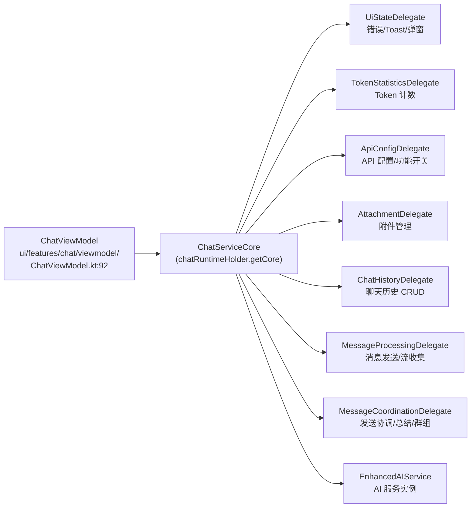

**初始化：** `initializeDelegates()`（ChatViewModel.kt:443-483）中从 `ChatServiceCore` 逐个获取。

## 阶段 1: 入口 — ChatViewModel

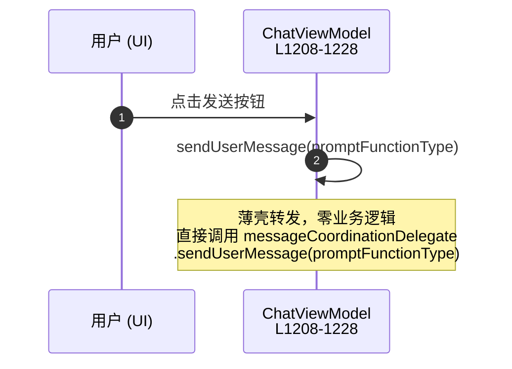

其他入口方法：
- `cancelCurrentMessage()` (L1219) — 先取消总结再取消消息
- `rewindAndResendMessage(index, editedContent)` (L983) — 回档 + 重发

**关键文件：** `ui/features/chat/viewmodel/ChatViewModel.kt:1208`

## 阶段 2: 协调 — MessageCoordinationDelegate

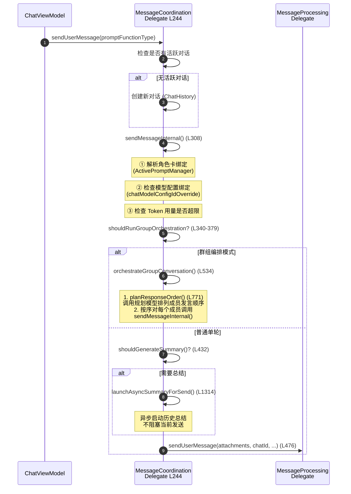

**关键分支：**
- **群组编排**：当前活跃 Prompt 是角色组 (CharacterGroup) 时触发，调用规划模型排列成员发言顺序
- **自动总结**：`shouldGenerateSummary()` 检查 Token 总量是否接近上限
- **Token 超限**：`handleTokenLimitExceeded()` 触发 `summarizeHistory(autoContinue=true)` (L1190)

**关键文件：** `services/core/MessageCoordinationDelegate.kt:244-534`

## 阶段 3: 构建 Prompt — AIMessageManager

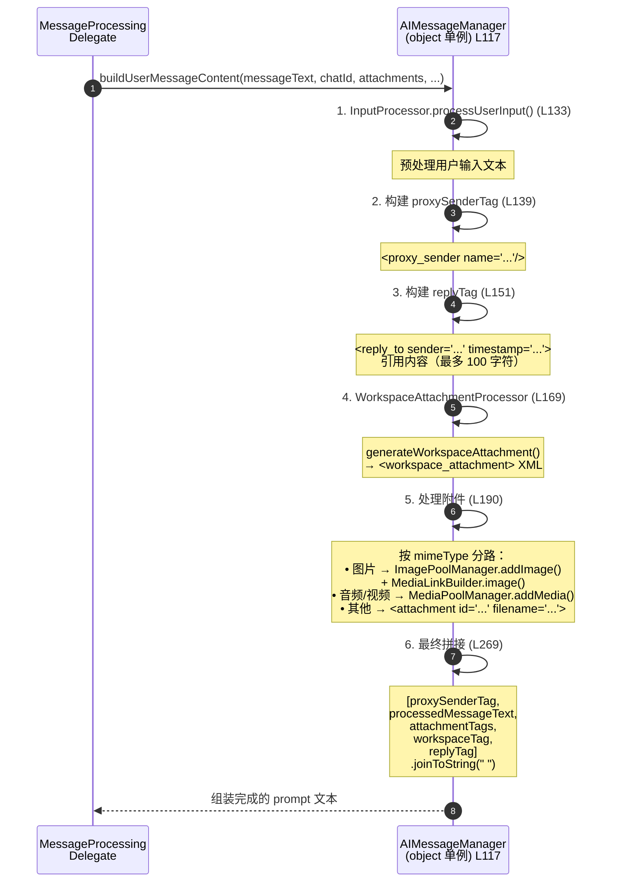

**关键文件：** `core/chat/AIMessageManager.kt:117-277`

## 阶段 4: 用户消息持久化

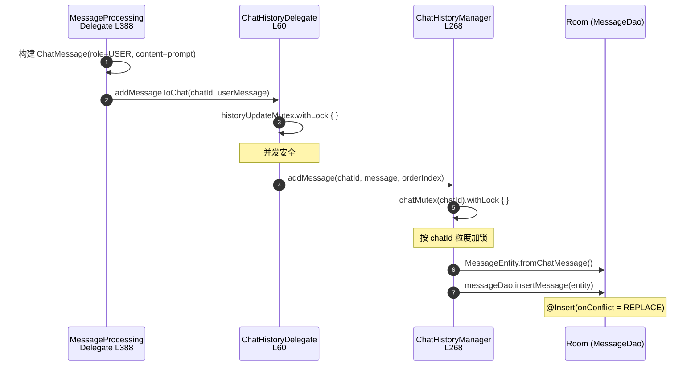

**关键文件：**
- `services/core/ChatHistoryDelegate.kt:60` — `_chatHistory`
- `data/repository/ChatHistoryManager.kt:268` — `addMessage()`
- `data/dao/MessageDao.kt:31` — `insertMessage()`

## 阶段 5: Provider 路由 — EnhancedAIService

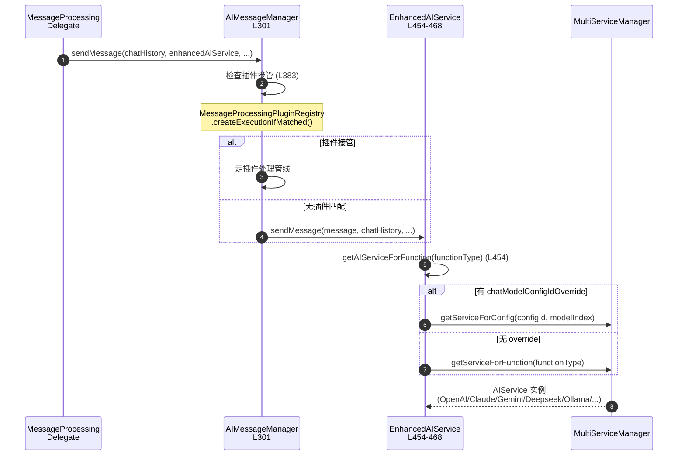

**Provider 实例管理：**
- 全局默认：`INSTANCE`（单例）
- 按 chatId 独立：`CHAT_INSTANCES: ConcurrentHashMap<String, EnhancedAIService>` (L94)

**关键文件：** `api/chat/EnhancedAIService.kt:454-468`

## 阶段 6: System Prompt 注入

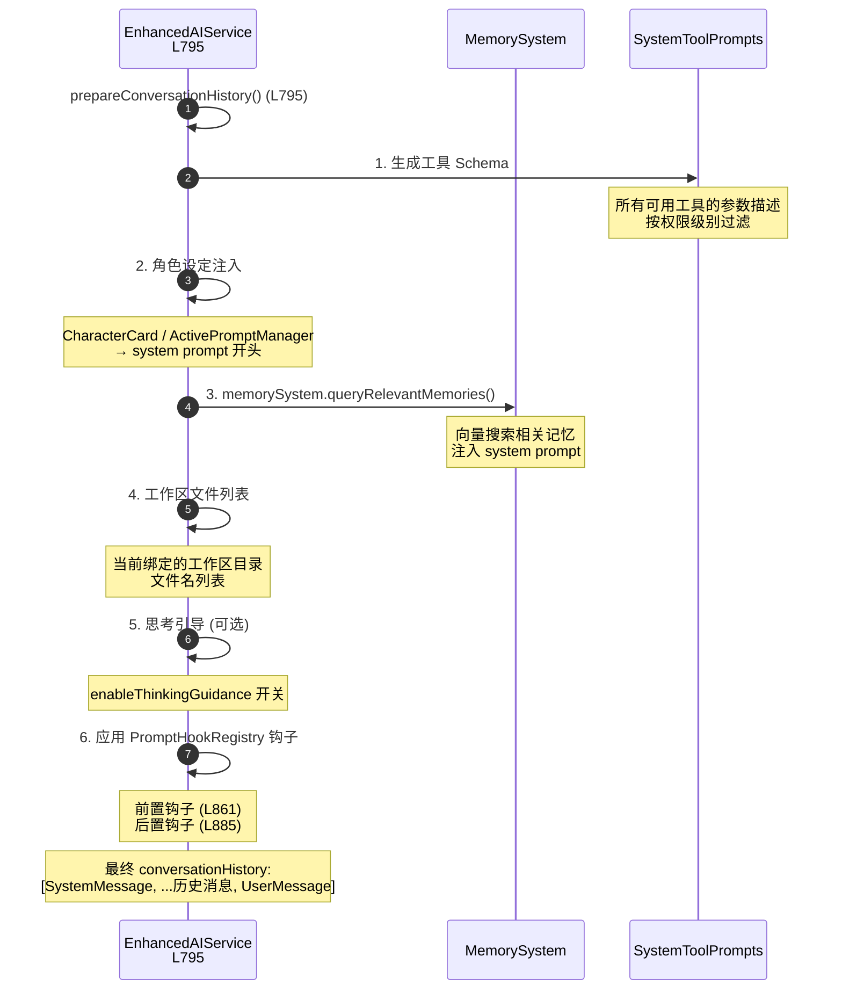

**关键文件：** `api/chat/EnhancedAIService.kt:795-885`

## 阶段 7: 流式请求 — 调用 LLM

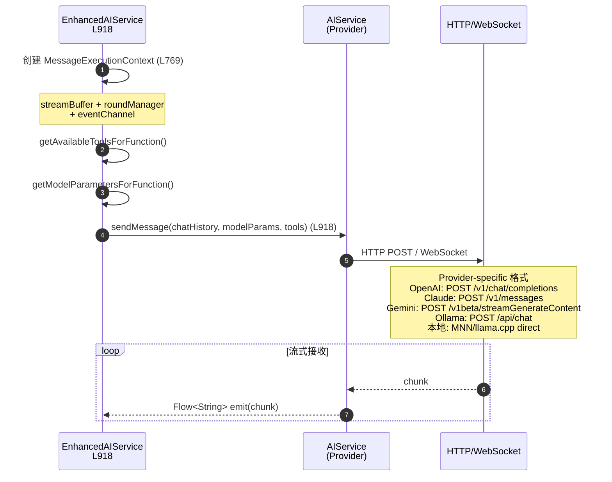

## 阶段 8: 流式渲染 — SAVEPOINT/ROLLBACK 机制

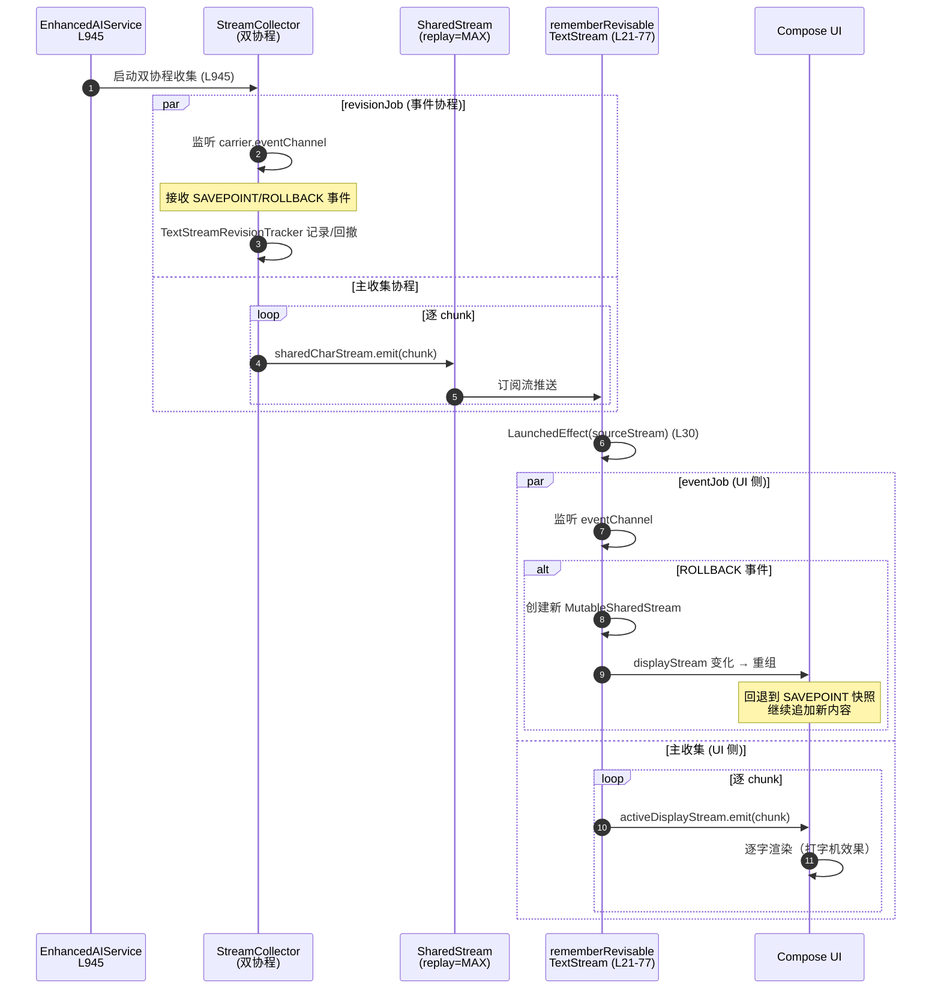

**SAVEPOINT/ROLLBACK 用途：**
某些 LLM Provider（如 Gemini 思考模式）在流式输出中可能修正已发出内容。ROLLBACK 让 UI 回退到快照点再续写，避免闪烁。

**关键文件：**
- `util/stream/RevisableTextStream.kt:10` — 事件定义
- `util/stream/TextStreamRevisionTracker.kt` — 快照管理
- `ui/features/chat/components/RevisableTextStreamRemember.kt:21-77` — UI 侧流处理

## 阶段 9: ReAct 循环 — 工具调用

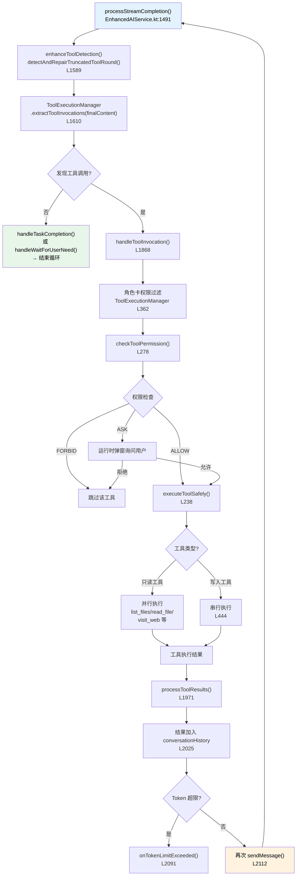

**工具执行管线详细步骤：**

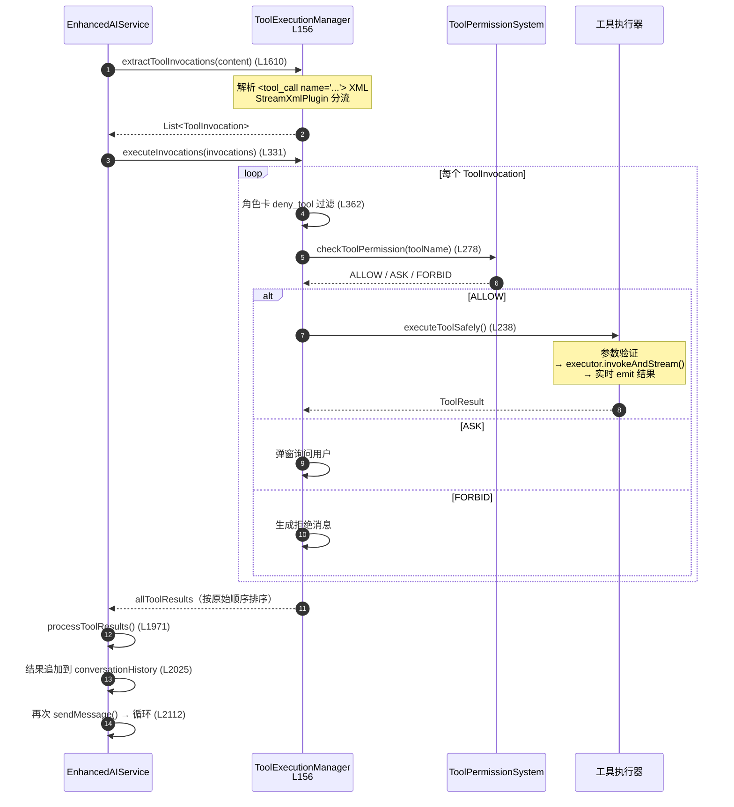

**关键文件：**
- `api/chat/EnhancedAIService.kt:1491-2112` — ReAct 循环
- `api/chat/enhance/ToolExecutionManager.kt:156-444` — 工具执行管线

## 阶段 10: 消息持久化 — 实时快照 + 最终写入

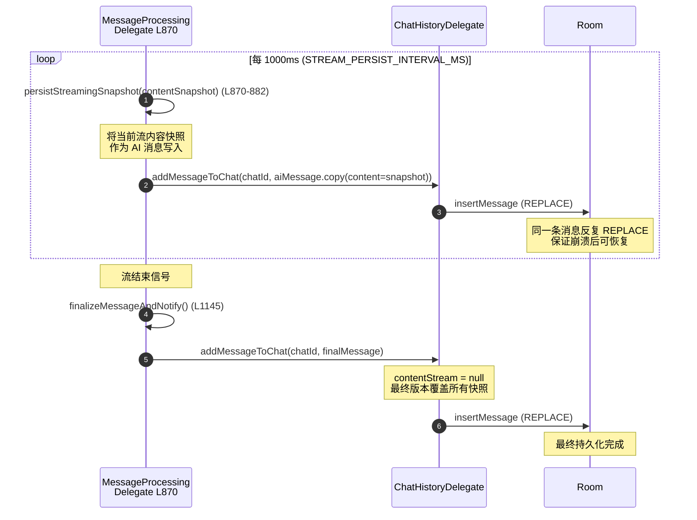

**关键文件：** `services/core/MessageProcessingDelegate.kt:870-882, 1145`

## 阶段 11: 收尾

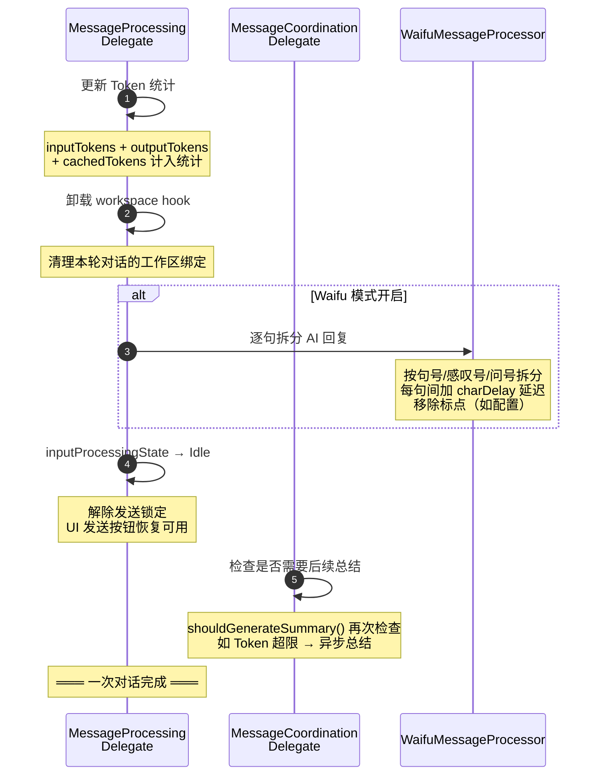

## 错误处理

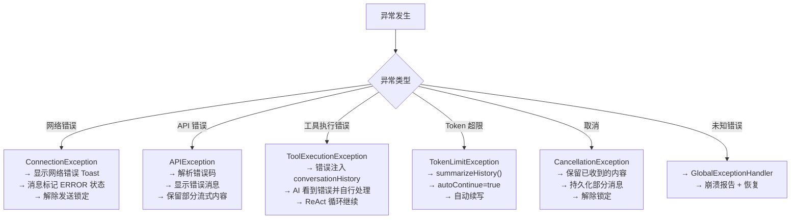

## 完整生命周期流程图

```
用户点击发送
│
├── ChatViewModel.sendUserMessage() ← 薄壳转发
│    └── MessageCoordinationDelegate.sendUserMessage()
│         ├── 对话创建（如需要）
│         ├── 角色卡/模型绑定解析
│         ├── Token 超限检查
│         ├── 群组编排判断
│         │    └── [群组] orchestrateGroupConversation()
│         │         └── 规划模型排列 → 逐成员 sendMessageInternal()
│         ├── 自动总结检查
│         └── MessageProcessingDelegate.sendUserMessage()
│
├── AIMessageManager.buildUserMessageContent() ← Prompt 构建
│    ├── InputProcessor 预处理
│    ├── proxySenderTag（代理发送者标签）
│    ├── replyTag（引用内容）
│    ├── workspaceTag（工作区附件）
│    ├── 附件处理（图片/音频/视频/其他）
│    └── 最终拼接
│
├── ChatHistoryDelegate.addMessageToChat() ← 用户消息写入 Room
│
├── AIMessageManager.sendMessage() ← 发送
│    ├── 插件接管检查
│    └── EnhancedAIService.sendMessage()
│         ├── prepareConversationHistory() ← System Prompt 注入
│         │    ├── 工具 Schema
│         │    ├── 角色设定
│         │    ├── 记忆查询
│         │    ├── 工作区文件列表
│         │    └── PromptHook 钩子
│         ├── getAIServiceForFunction() ← Provider 路由
│         └── serviceForFunction.sendMessage() ← 调用 LLM
│
├── 流式接收 + 双协程收集
│    ├── revisionJob: SAVEPOINT/ROLLBACK 事件处理
│    └── 主协程: SharedStream.emit(chunk) → UI 逐字渲染
│
├── processStreamCompletion() ← ReAct 循环
│    ├── extractToolInvocations()
│    ├── [无工具] → 结束
│    └── [有工具] → executeInvocations()
│         ├── 角色卡权限过滤
│         ├── checkToolPermission() (ALLOW/ASK/FORBID)
│         ├── 只读工具并行 / 写入工具串行
│         ├── processToolResults()
│         └── 再次 sendMessage() → 循环
│
├── persistStreamingSnapshot() ← 每 1000ms 快照写入 Room
│
├── finalizeMessageAndNotify() ← 最终持久化
│    ├── AI 消息写入 Room（覆盖快照）
│    ├── Token 统计更新
│    ├── workspace hook 卸载
│    ├── [Waifu] 逐句拆分 + 延迟渲染
│    └── inputProcessingState → Idle
│
└── ✅ 对话完成
```

## 核心文件清单

| 文件 | 路径 | 行数 | 职责 |
|------|------|------|------|
| **ChatViewModel** | `ui/features/chat/viewmodel/ChatViewModel.kt` | ~1300 | 薄壳委托层 |
| **ChatHistoryDelegate** | `services/core/ChatHistoryDelegate.kt` | ~200 | 消息 CRUD + 并发控制 |
| **MessageCoordinationDelegate** | `services/core/MessageCoordinationDelegate.kt` | ~1500 | 发送协调 + 群组编排 + 总结 |
| **MessageProcessingDelegate** | `services/core/MessageProcessingDelegate.kt` | ~1200 | 消息发送 + 流收集 + 持久化 |
| **AIMessageManager** | `core/chat/AIMessageManager.kt` | ~500 | Prompt 构建 (无状态单例) |
| **EnhancedAIService** | `api/chat/EnhancedAIService.kt` | ~2200 | Provider 路由 + System Prompt + ReAct |
| **ToolExecutionManager** | `api/chat/enhance/ToolExecutionManager.kt` | ~500 | 工具解析 + 权限 + 执行 |
| **ChatHistoryManager** | `data/repository/ChatHistoryManager.kt` | ~500 | Room 持久化层 |
| **MessageDao** | `data/dao/MessageDao.kt` | ~70 | Room DAO |
| **RevisableTextStreamRemember** | `ui/features/chat/components/RevisableTextStreamRemember.kt` | ~80 | UI 侧流式渲染 |
| **TextStreamRevisionTracker** | `util/stream/TextStreamRevisionTracker.kt` | ~60 | SAVEPOINT/ROLLBACK 快照 |
