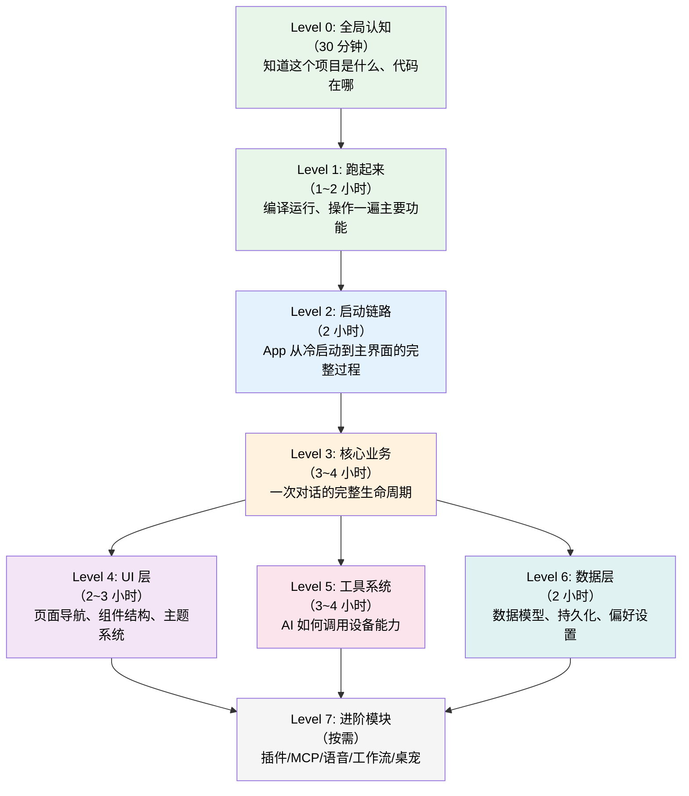
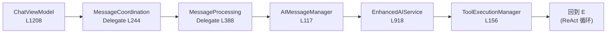
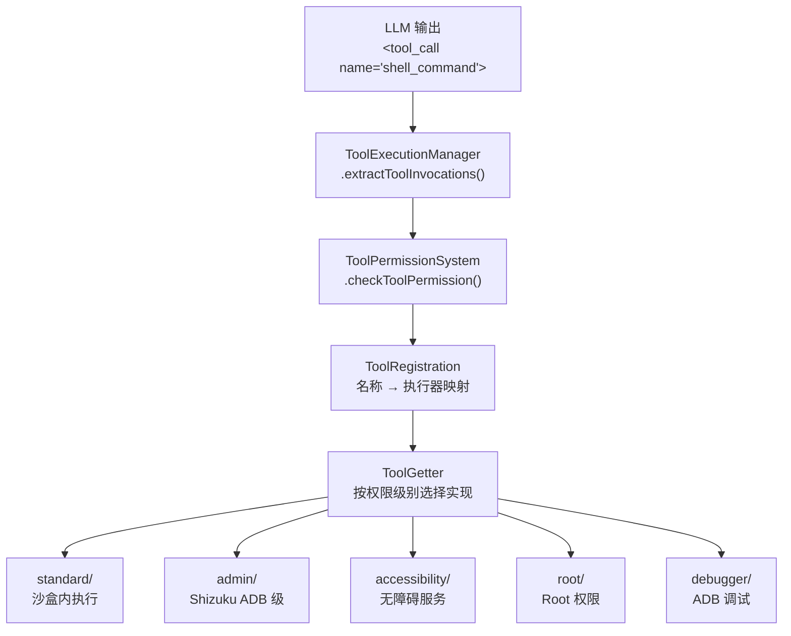
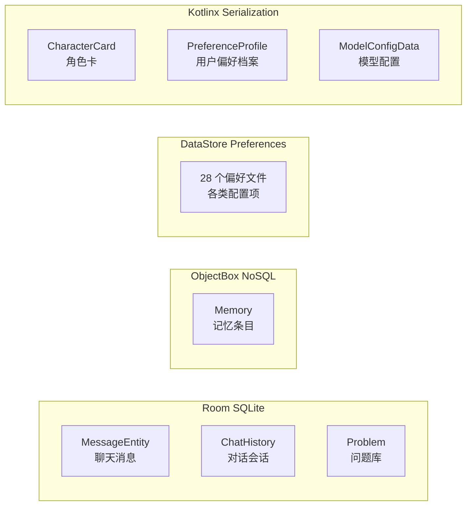

# Operit 项目学习路线图

> 适用对象：从零开始接触本项目的开发者。按 Level 递进，每个 Level 有明确的学习目标、阅读材料、动手验证和检查点。

## 路线全景



> Level 0-3 是**必修路径**（从上到下串行）。Level 4/5/6 是**并行选修**（根据你要改哪部分代码决定先学哪个）。Level 7 按需深入。

---

## Level 0: 全局认知（30 分钟）

### 学习目标
- 知道 Operit 是什么、解决什么问题
- 了解代码目录结构和分层架构
- 建立"包名 → 职责"的心理映射

### 阅读材料

| 顺序 | 文档 | 重点关注 |
|------|------|---------|
| 1 | `00_全景梳理.md` §一~§三 | 项目定位、目录总览、6 层架构 |
| 2 | `00_全景梳理.md` §五 | 核心数据流（一次 AI 对话链路概览） |

### 动手验证

打开项目根目录，对照文档看一遍 `app/src/main/java/com/ai/assistance/operit/` 下的包结构：

```
api/     → AI 接入层（66 文件）
core/    → 核心业务（201 文件，最重要）
data/    → 数据层（122 文件）
ui/      → 界面层（439 文件，最大）
services/ → 后台服务（21 文件）
```

### 检查点

- [ ] 能说出 `api/`、`core/`、`data/`、`ui/`、`services/` 各自的职责
- [ ] 知道 AI 对话的数据流方向：用户输入 → InputProcessor → ConversationService → AIService → ToolExecution → StreamRenderer → Compose UI
- [ ] 知道项目支持 18+ AI 提供商 + 本地推理（MNN/llama.cpp）

---

## Level 1: 跑起来（1~2 小时）

### 学习目标
- 成功编译并运行 App
- 动手操作一遍核心功能，建立感性认识
- 了解 Gradle 多模块结构

### 步骤

1. **环境准备**
   - Android Studio Hedgehog+ / IntelliJ + Android Plugin
   - JDK 17+
   - NDK（项目用到 llama/mnn/quickjs 原生库）
   - 连接实机或启动 Android 模拟器（API 26+）

2. **编译运行**
   ```bash
   # 项目根目录
   ./gradlew assembleDebug
   # 或在 Android Studio 中直接 Run
   ```

3. **核心功能体验清单**（按顺序操作）

   | 步骤 | 功能 | 要观察什么 |
   |------|------|-----------|
   | ① | 首次启动 | 协议页 → 权限引导（6 页）→ 插件加载 → 主界面 |
   | ② | 发一条消息 | 打字机效果、流式渲染、消息气泡 |
   | ③ | 让 AI 调用工具 | 对 AI 说"帮我列出 /sdcard 下的文件"，观察工具调用卡片 |
   | ④ | 打开设置页 | 看看有多少子页面（22 个），感受配置复杂度 |
   | ⑤ | 切换 AI 模型 | Settings → Model Config，配一个 API Key |
   | ⑥ | 打开工具箱 | Toolbox 页面，看有哪些内置工具 |

### 检查点

- [ ] App 能在设备上运行
- [ ] 成功发送一条消息并收到 AI 回复
- [ ] 看到 AI 调用工具的完整过程（请求 → 执行 → 返回结果 → AI 继续）
- [ ] 知道项目有哪些 Gradle 子模块（llama/mnn/quickjs/terminal/dragonbones/mmd/fbx/showerclient）

---

## Level 2: 启动链路（2 小时）

### 学习目标
- 理解 App 从进程创建到用户可交互的完整链路
- 知道 Application.onCreate 做了什么、为什么要做
- 理解 4 道启动门控的作用和顺序

### 阅读材料

| 顺序 | 文档 | 重点关注 |
|------|------|---------|
| 1 | `37_Runtime.冷启动全链路.md` Phase 0-1 | Application.onCreate 34 步初始化 |
| 2 | `37_Runtime.冷启动全链路.md` Phase 2-3 | MainActivity + 4 道门控 |
| 3 | `02_屏幕装配流程图.md` | Activity → OperitApp → Layout → Screen 的 5 层装配 |

### 源码对照（按顺序读）

| 顺序 | 文件 | 看什么 |
|------|------|--------|
| 1 | `core/application/OperitApplication.kt` L116-369 | `onCreate` 34 步，特别关注 3 次 `runBlocking` |
| 2 | `ui/main/MainActivity.kt` L256-302 | `onCreate` 流程 |
| 3 | `ui/main/MainActivity.kt` L428-461 | `performInitialChecks` 门控序列 |
| 4 | `ui/main/MainActivity.kt` L690+ | `setAppContent` 渲染决策树 |
| 5 | `ui/main/OperitApp.kt` L56-62 | 根 Composable 入口 |

### 动手验证

在 `OperitApplication.onCreate` 的第 118 行加一个日志断点：
```kotlin
Log.d("ColdStart", "Step 1: instance = this")
```
然后在几个关键步骤（步骤 12 前台服务判断、步骤 15 语言设置）加断点，运行后观察执行顺序。

### Walkthrough 动手导读

| Walkthrough | 说明 |
|-------------|------|
| [`walkthroughs/cold-start.md`](walkthroughs/cold-start.md) | 跟着代码走一遍 App 冷启动到主界面可交互的完整链路 |

### 检查点

- [ ] 能画出 `attachBaseContext → onCreate → MainActivity → performInitialChecks → setAppContent` 的流程
- [ ] 知道 3 次 `runBlocking` 分别读什么、为什么不能异步
- [ ] 能说出 4 道门控的检查顺序：协议 → 迁移 → 权限 → 插件加载
- [ ] 知道 `AIForegroundService` 在什么条件下会在 Application 阶段启动（alwaysListening || externalHttp）
- [ ] 知道插件加载覆盖层的 zIndex 是 10（浮在所有门控之上）

---

## Level 3: 核心业务 — 一次对话的完整生命周期（3~4 小时）

### 学习目标
- 理解从用户点击发送到 AI 回复渲染完毕的 11 个阶段
- 掌握 ChatViewModel 的委托架构
- 理解 ReAct 工具循环的工作原理
- 理解流式渲染和 SAVEPOINT/ROLLBACK 机制

### 阅读材料

| 顺序 | 文档 | 重点关注 |
|------|------|---------|
| 1 | `01_请求调用链时序图.md` | 先看高层 9 参与者时序图（鸟瞰） |
| 2 | `38_Runtime.一次对话完整生命周期.md` 阶段 1-4 | 入口 → 协调 → Prompt 构建 → 用户消息持久化 |
| 3 | `38_Runtime.一次对话完整生命周期.md` 阶段 5-8 | Provider 路由 → System Prompt → 流式请求 → 渲染 |
| 4 | `38_Runtime.一次对话完整生命周期.md` 阶段 9-11 | ReAct 循环 → 持久化 → 收尾 |

### 源码对照（按数据流方向读）



| 顺序 | 文件 | 关注方法 |
|------|------|---------|
| 1 | `ui/features/chat/viewmodel/ChatViewModel.kt` L1208 | `sendUserMessage` — 薄壳转发 |
| 2 | `services/core/MessageCoordinationDelegate.kt` L244 | `sendUserMessage` → `sendMessageInternal` |
| 3 | `services/core/MessageCoordinationDelegate.kt` L340 | 群组编排判断 |
| 4 | `services/core/MessageProcessingDelegate.kt` L388 | `sendUserMessage` — 实际发送 |
| 5 | `core/chat/AIMessageManager.kt` L117 | `buildUserMessageContent` — Prompt 拼接 |
| 6 | `core/chat/AIMessageManager.kt` L301 | `sendMessage` — 插件检查 + 发送 |
| 7 | `api/chat/EnhancedAIService.kt` L795 | `prepareConversationHistory` — System Prompt |
| 8 | `api/chat/EnhancedAIService.kt` L918 | `sendMessage` — 流式请求 |
| 9 | `api/chat/EnhancedAIService.kt` L1491 | `processStreamCompletion` — ReAct 入口 |
| 10 | `api/chat/enhance/ToolExecutionManager.kt` L156 | `extractToolInvocations` — 工具解析 |
| 11 | `api/chat/enhance/ToolExecutionManager.kt` L331 | `executeInvocations` — 执行 |

### 动手验证

1. 在 `MessageProcessingDelegate.sendUserMessage` 入口加日志，发一条消息，观察调用链
2. 在 `ToolExecutionManager.extractToolInvocations` 加断点，让 AI 调用一个工具，观察 XML 解析过程
3. 在 `persistStreamingSnapshot` 加计数日志，观察流式消息每秒持久化一次

### Walkthrough 动手导读

| Walkthrough | 说明 |
|-------------|------|
| [`walkthroughs/chat-message-flow.md`](walkthroughs/chat-message-flow.md) | 从用户点击发送到 AI 回复出现的 15 步全链路代码导读 |
| [`walkthroughs/context-summary.md`](walkthroughs/context-summary.md) | 上下文摘要触发、生成、注入的完整流程 |
| [`walkthroughs/model-config.md`](walkthroughs/model-config.md) | 模型配置修改如何传播到 Provider 并影响下一次请求 |

### 检查点

- [ ] 能说出 ChatViewModel 的 7 个委托分别是什么
- [ ] 知道 Prompt 构建的 6 个组成部分（InputProcessor、proxySenderTag、replyTag、workspaceTag、attachmentTags、最终拼接）
- [ ] 知道 System Prompt 注入了什么（工具 Schema + 角色设定 + 记忆 + 工作区 + 思考引导）
- [ ] 能解释 ReAct 循环：`processStreamCompletion → extractToolInvocations → executeInvocations → processToolResults → 再次 sendMessage`
- [ ] 知道工具执行的并行/串行分组策略（只读工具并行，写入工具串行）
- [ ] 知道流式消息每 1000ms 持久化一次快照，最终 `finalizeMessageAndNotify` 覆盖

---

## Level 4: UI 层（2~3 小时）

### 学习目标
- 理解单 Activity + 多 Screen 的导航架构
- 了解主要页面的组件结构
- 知道主题系统的工作方式

### 阅读材料

| 顺序 | 文档 | 重点关注 |
|------|------|---------|
| 1 | `02_屏幕装配流程图.md` | 5 层装配：Activity → OperitApp → Layout → AppContent → Screen |
| 2 | `03_Screen.AiChat页面结构.md` | 最核心页面的组件树 |
| 3 | `10_Screen.Settings页面结构.md` | 22 个子页面的路由方式 |
| 4 | `29_Settings.ThemeSettings页面结构.md` | 主题系统（如果你要改 UI 样式） |

### 核心概念

**自定义导航栈（非 Jetpack Navigation）：**
```
Screen (sealed class)
├── AiChat, Settings, Packages, Toolbox...（一级页面）
└── TokenConfig, ModelConfig, ThemeSettings...（二级页面，isSecondaryScreen=true）

导航：backStack: SnapshotStateList<Screen>
navigateTo(screen) → 压栈
goBack() → 弹栈，兜底到 AiChat
```

**手机/平板布局分叉：**
```
screenWidthDp >= 600 → TabletLayout（永久侧边栏）
screenWidthDp < 600  → PhoneLayout（手势抽屉）
```

### 源码对照

| 文件 | 看什么 |
|------|--------|
| `ui/main/screens/OperitScreens.kt` | 所有 Screen 子类定义 |
| `ui/main/OperitApp.kt` | 导航状态 + 布局选择 |
| `ui/main/layout/PhoneLayout.kt` | 手机布局 |
| `ui/main/layout/TabletLayout.kt` | 平板布局 |
| `ui/main/components/AppContent.kt` | Scaffold + TopAppBar + 屏幕渲染 |
| `ui/features/chat/` | 聊天界面（154 文件，最复杂的 feature） |

### 检查点

- [ ] 知道导航用的是自定义 backStack 而非 Jetpack Navigation
- [ ] 能说出手机和平板布局的分叉条件
- [ ] 知道一级页面和二级页面的区别（`isSecondaryScreen`）
- [ ] 知道 TopAppBar 的 actions 是由子页面通过 `LocalTopBarActions` 注入的

---

## Level 5: 工具系统（3~4 小时）

### 学习目标
- 理解工具从注册到执行的完整链路
- 了解权限分级架构
- 知道如何新增一个工具

### 阅读材料

| 顺序 | 文档 | 重点关注 |
|------|------|---------|
| 1 | `00_全景梳理.md` §三 层 2（工具系统） | 工具架构概览 |
| 2 | `38_Runtime.一次对话完整生命周期.md` 阶段 9 | ReAct 循环中的工具执行细节 |
| 3 | `00_全景梳理.md` §四 | 脚本包系统（QuickJS 工具包） |

### 核心架构



### 源码对照

| 文件 | 看什么 |
|------|--------|
| `core/config/SystemToolPrompts.kt` | 工具 Schema（给 LLM 看的"说明书"） |
| `core/tools/defaultTool/ToolRegistration.kt` | 工具名 → 执行器的映射表 |
| `core/tools/defaultTool/ToolGetter.kt` | 按权限级别选择实现 |
| `core/tools/defaultTool/standard/` | 标准权限工具实现 |
| `core/tools/javascript/JsEngine.kt` | QuickJS 引擎封装 |
| `core/tools/mcp/MCPToolExecutor.kt` | MCP 协议工具执行 |

### 动手验证

找到一个简单工具（如 `list_files`），从 Schema 定义到执行器实现走一遍：
1. `SystemToolPrompts.kt` 里搜索 `list_files` 看 Schema
2. `ToolRegistration.kt` 里看映射
3. `defaultTool/standard/` 里看 Kotlin 实现

### Walkthrough 动手导读

| Walkthrough | 说明 |
|-------------|------|
| [`walkthroughs/tool-execution.md`](walkthroughs/tool-execution.md) | AI 调用一个工具的 6 阶段执行管线完整代码导读 |
| [`walkthroughs/shell-permission.md`](walkthroughs/shell-permission.md) | Shell 命令如何按权限级别路由到不同执行后端 |

### 检查点

- [ ] 能说出工具执行的 5 步：LLM 输出 → XML 解析 → 权限检查 → 路由 → 执行
- [ ] 知道 5 个权限级别（standard/admin/accessibility/debugger/root）
- [ ] 知道新增工具需要同步 5 处（Schema/注册表/Kotlin 实现/JS Wrapper/TS 类型）
- [ ] 了解 MCP 工具和内置工具的区别

---

## Level 6: 数据层（2 小时）

### 学习目标
- 了解数据模型和持久化方式
- 理解 DataStore 偏好设置的使用模式
- 知道 Room 和 ObjectBox 各管什么

### 阅读材料

| 顺序 | 文档 | 重点关注 |
|------|------|---------|
| 1 | `00_全景梳理.md` §三 层 3（数据层） | 数据层总览 |
| 2 | 任意 Settings 文档的"状态管理"段 | DataStore 偏好设置模式 |

### 核心数据模型



### 源码对照

| 文件 | 看什么 |
|------|--------|
| `data/model/ChatMessage.kt` | 消息模型 |
| `data/model/CharacterCard.kt` | 角色卡模型 |
| `data/dao/MessageDao.kt` | Room DAO |
| `data/db/AppDatabase.kt` | Room Database 定义 |
| `data/preferences/` 目录 | 28 个偏好设置文件 |
| `data/repository/ChatHistoryManager.kt` | 消息持久化核心 |

### Walkthrough 动手导读

| Walkthrough | 说明 |
|-------------|------|
| [`walkthroughs/memory-system.md`](walkthroughs/memory-system.md) | 记忆从创建（向量生成 + HNSW 索引）到被 AI 混合检索的完整链路 |

### 检查点

- [ ] 知道 Room 管聊天消息，ObjectBox 管记忆
- [ ] 知道 DataStore 有 28 个偏好文件，多数 Settings 页面直接操作 DataStore 而不经过 ViewModel
- [ ] 知道角色卡用 Kotlinx Serialization JSON 存储在 DataStore 中

---

## Level 7: 进阶模块（按需深入）

根据你的开发任务选择性深入：

### 7A: 插件与 MCP 生态

| 文档 | 内容 |
|------|------|
| `15_Screen.MCPMarket_MCPPluginDetail.md` | MCP 市场 UI |
| `18_Screen.MCPManage_MCPPublish_MCPConfig.md` | MCP 管理/发布/配置 |
| `06_Screen.Packages.md` | 工具包管理 |
| [`walkthroughs/mcp-plugin-lifecycle.md`](walkthroughs/mcp-plugin-lifecycle.md) | **Walkthrough**: MCP 插件从安装到被 AI 调用 |

关键源码：`plugins/`、`core/tools/mcp/`、`data/mcp/`

### 7B: 语音交互

| 文档 | 内容 |
|------|------|
| `31_Settings.SpeechServicesSettings.md` | 6 TTS + 3 STT 提供商配置 |
| `22_Screen.SpeechToText_TextToSpeech.md` | 语音页面 |

关键源码：`api/speech/`、`api/voice/`

### 7C: 角色系统

| 文档 | 内容 |
|------|------|
| `32_Settings.ModelPrompts_TagMarket.md` | 角色卡/标签/角色组管理 |
| `33_Settings.PersonaCard_WaifuMode_CustomEmoji.md` | AI 生成角色卡 + Waifu 模式 |
| `27_Settings.UserPreferences_Guide.md` | 用户偏好档案 |
| [`walkthroughs/character-card.md`](walkthroughs/character-card.md) | **Walkthrough**: 人格卡片从创建到注入对话 |

关键源码：`data/model/CharacterCard.kt`、角色卡相关 Manager

### 7D: 工作流与自动化

| 文档 | 内容 |
|------|------|
| `08_Screen.Workflow.md` | 工作流编辑/管理 |
| [`walkthroughs/workflow-execution.md`](walkthroughs/workflow-execution.md) | **Walkthrough**: 工作流从创建到定时执行（拓扑排序引擎） |

关键源码：`core/workflow/`、`integrations/tasker/`

### 7E: 记忆系统

| 文档 | 内容 |
|------|------|
| `05_Screen.MemoryBase.md` | 记忆管理 UI |

关键源码：`data/model/Memory.kt`、ObjectBox 相关

### 7F: UI 高级定制

| 文档 | 内容 |
|------|------|
| `29_Settings.ThemeSettings.md` | 主题系统（2132+ 行，60 个偏好 Flow） |
| `28_Settings.Language_GlobalDisplay_Layout.md` | 布局设置 |
| [`walkthroughs/theme-settings.md`](walkthroughs/theme-settings.md) | **Walkthrough**: Settings 修改主题色到 UI 刷新的全链路 |

关键源码：`ui/theme/`、`ui/common/markdown/`（自研流式 Markdown 渲染引擎）

---

## 学习节奏建议

```mermaid
gantt
    title 建议学习时间线
    dateFormat X
    axisFormat %s小时

    section 必修路径
    Level 0 全局认知      :l0, 0, 0.5
    Level 1 跑起来        :l1, after l0, 2
    Level 2 启动链路      :l2, after l1, 2
    Level 3 核心业务      :l3, after l2, 4

    section 选修路径（并行）
    Level 4 UI 层         :l4, after l3, 3
    Level 5 工具系统      :l5, after l3, 4
    Level 6 数据层        :l6, after l3, 2

    section 进阶（按需）
    Level 7 进阶模块      :l7, after l4, 4
```



- **Day 1**（~5 小时）：Level 0 + 1 + 2 — 从跑起来到理解启动过程
- **Day 2**（~4 小时）：Level 3 — 核心业务，这是最重要的一天
- **Day 3+**（按需）：Level 4-7 — 根据你的任务选择性深入

---

## 全部文档索引

### 入门文档
| 编号 | 文档 | 内容 |
|------|------|------|
| 00 | `00_全景梳理.md` | 项目总览（从 0 到 1 的入口） |
| 01 | `01_请求调用链时序图.md` | 一次请求的高层时序图 |
| 02 | `02_屏幕装配流程图.md` | Activity → Screen 的 5 层装配 |

### 运行时流程（A 系列）
| 编号 | 文档 | 内容 |
|------|------|------|
| 37 | `37_Runtime.冷启动全链路.md` | 冷启动 34 步 + 4 道门控 |
| 38 | `38_Runtime.一次对话完整生命周期.md` | 对话 11 阶段 + ReAct + 持久化 |

### 页面结构（03-26）
| 编号范围 | 内容 |
|----------|------|
| 03-09 | 核心页面：AiChat、AssistantConfig、MemoryBase、Packages、Toolbox、Workflow、ShizukuCommands |
| 10-13 | 系统页面：Settings、Help/About/UpdateHistory、FileManager、Terminal |
| 14-19 | 功能页面：SkillMarket、MCPMarket、ShellExecutor、UIDebugger、MCPManage、FFmpegToolbox/Logcat |
| 20-26 | 辅助页面：AppPermissions、ProcessLimitRemover、ToolTester、SpeechToText、SqlViewer、AutoGlmOneClick、Agreement/TokenConfig/ToolPkgPluginConfig |

### Settings 子页面（27-36）
| 编号范围 | 内容 |
|----------|------|
| 27-29 | 个人化：UserPreferences、Language/GlobalDisplay/Layout、ThemeSettings |
| 30-32 | AI 配置：ModelConfig/FunctionalConfig、SpeechServices、ModelPrompts/TagMarket |
| 33-34 | 角色扮演：PersonaCard/WaifuMode/CustomEmoji、ContextSummary/ToolPermission/ExternalHttpChat |
| 35-36 | 系统：ChatBackup/ChatHistory、TokenUsage/MnnModel/GitHubAccount |
