# Tutorial: 启动链路精讲

> **前置条件：** 你已经读过 `00_全景梳理.md`，知道项目的分层架构（api/core/data/ui/services），并且已经把 App 编译跑起来过至少一次。
>
> **本教程的目标：** 读完后你能回答"App 从点击图标到用户看到聊天界面，中间经过了哪些环节，为什么要经过这些环节"。
>
> **参考手册：** 如果你需要查 34 步初始化的每一步行号，请看 `37_Runtime.冷启动全链路.md`。本教程不会覆盖所有细节，而是聚焦 **5 个关键设计决策** 背后的 WHY。

---

## 冷启动全景：你看到的 vs 实际发生的

先建立直觉。用户点击 App 图标后看到的是：

```
[黑屏] → [空白] → [协议页 or 权限引导 or 聊天界面] → [插件加载动画] → [可交互]
```

实际发生的是：

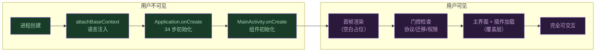

关键认知：**用户看到界面之前，系统已经做了大量工作**。这些工作分散在 3 个类里：

| 类 | 文件 | 职责 |
|---|------|------|
| `OperitApplication` | `core/application/OperitApplication.kt` | 进程级初始化（全局单例、服务、预热） |
| `MainActivity` | `ui/main/MainActivity.kt` | Activity 级初始化（组件、门控、首帧） |
| `OperitApp` | `ui/main/OperitApp.kt` | Compose 级初始化（导航、网络轮询） |

---

## 第一课：Android 启动生命周期基础

如果你熟悉 Android 开发，可以跳过这一节。

Android App 启动时，系统按这个顺序调用：

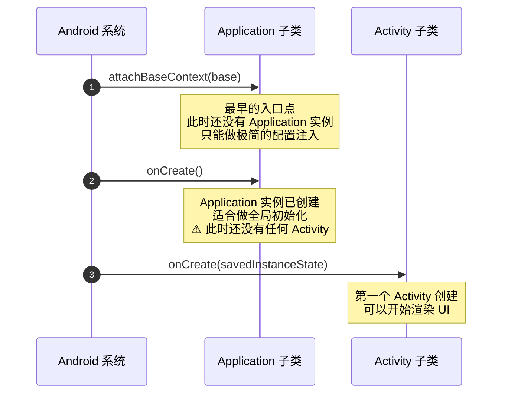

**关键约束：**
- `attachBaseContext` 时几乎什么都不能做，因为 Application 还没初始化完
- `Application.onCreate` 在**主线程**执行，耗时操作会导致 ANR（Application Not Responding）
- `Activity.onCreate` 调用 `setContent {}` 后 Compose 才开始渲染第一帧

Operit 的挑战在于：它有 34 个初始化步骤要在 `Application.onCreate` 里完成，而主线程不能阻塞太久。接下来我们看它是怎么解决这个矛盾的。

---

## 第二课：语言注入 — 为什么必须在 attachBaseContext 做

### 问题

Operit 支持多语言。用户设置了日语界面，App 启动时所有 `getString(R.string.xxx)` 调用必须返回日语文本。但 Android 的资源系统在 `attachBaseContext` 阶段就绑定了 `Configuration`——如果你在 `onCreate` 里才改语言，那些在 `onCreate` 之前就被加载的资源字符串已经是默认语言了。

### 解决方案

```kotlin
// OperitApplication.kt:545
override fun attachBaseContext(base: Context) {
    // 1. 从 SharedPreferences 同步读取语言设置
    val code = LocaleUtils.getCurrentLanguage(base)

    // 2. 用读到的语言创建新的 Configuration
    val locale = Locale(code)
    val config = Configuration(base.resources.configuration).apply {
        setLocale(locale)
    }

    // 3. 用新 Configuration 创建 Context，传给 super
    val context = base.createConfigurationContext(config)
    super.attachBaseContext(context)
}
```

### 为什么这么设计

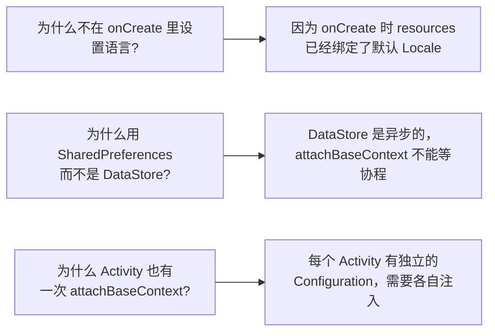

> **动手验证：** 在 `attachBaseContext` 的 `val code = ...` 行加断点，启动 App，确认它比 `onCreate` 先执行。注意变量 `code` 的值——这就是用户上次选择的语言。

---

## 第三课：Application.onCreate — 34 步背后的 5 类任务

34 步初始化看起来很吓人，但它们归属于 **5 类任务**，每类有不同的执行策略：

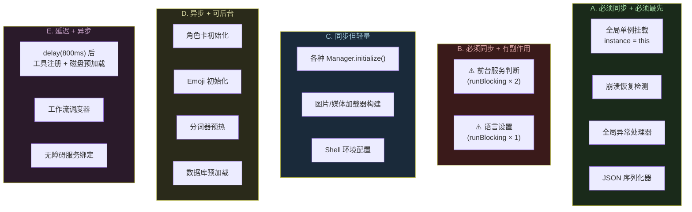

### 重点解析：B 类 — 为什么要在主线程阻塞读取?

这是整个启动链路中最关键的设计决策。Operit 在 `Application.onCreate` 里做了 **3 次 `runBlocking`**（在主线程同步等待协程完成）：

```kotlin
// OperitApplication.kt:471-493
private fun startGlobalAIForegroundServiceIfNeeded() {
    // ⚠️ 阻塞读取 1: 唤醒词是否开启
    val alwaysListeningEnabled = runBlocking {
        WakeWordPreferences(applicationContext)
            .alwaysListeningEnabledFlow.first()
    }
    // ⚠️ 阻塞读取 2: 外部 HTTP API 是否开启
    val externalHttpEnabled = runBlocking {
        ExternalHttpApiPreferences.getInstance(applicationContext)
            .enabledFlow.first()
    }

    // 两个都关闭 → 不启动前台服务
    if ((!alwaysListeningEnabled && !externalHttpEnabled)
        || AIForegroundService.isRunning.get()) {
        return
    }

    // 需要启动前台服务
    startForegroundService(Intent(this, AIForegroundService::class.java))
}
```

### 为什么不能异步?

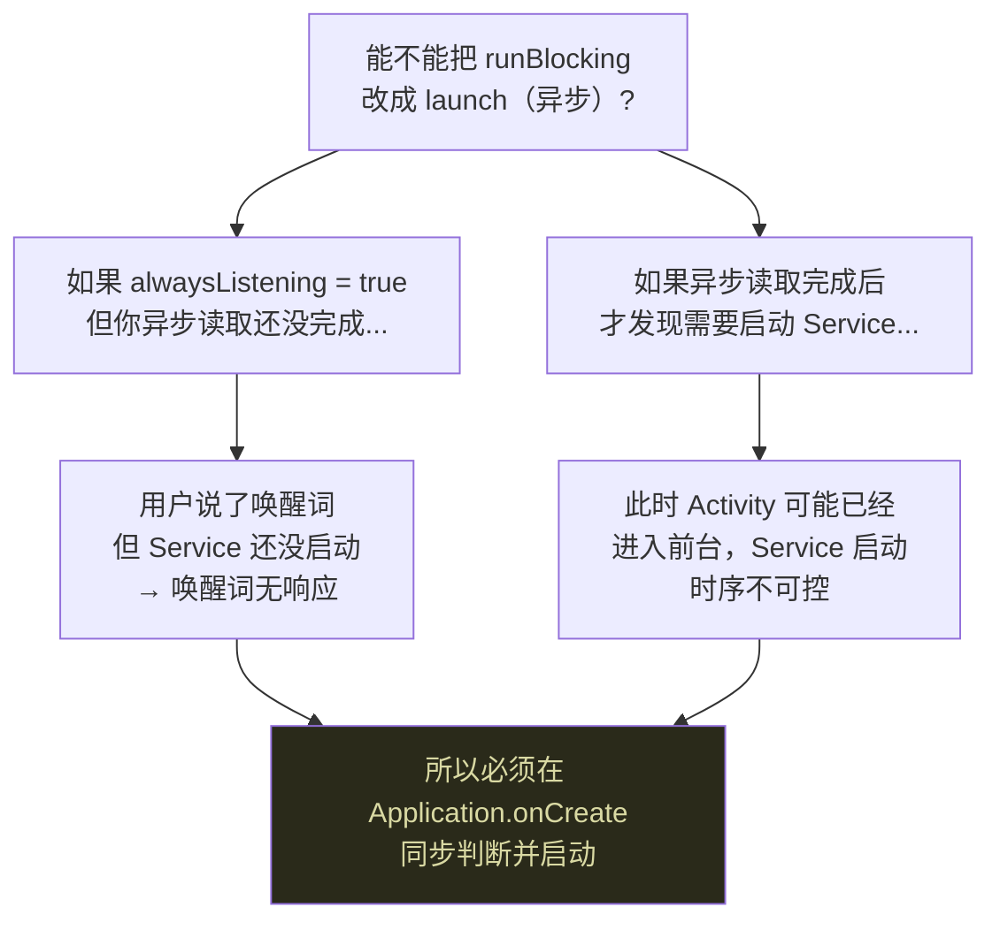

**同理，语言设置也必须同步读取** — 如果异步读取，`onCreate` 后面的 `getString()` 调用可能拿到错误语言的字符串。

> **常见疑问：runBlocking 会导致 ANR 吗？**
> 
> DataStore 的 `first()` 通常在几毫秒内完成（它从本地文件读取，不涉及网络）。ANR 阈值是 5 秒。实测这 3 次读取总共不到 50ms。但如果 DataStore 文件损坏或磁盘 I/O 异常慢，理论上有 ANR 风险。

### E 类 — delay(800ms) 的精妙设计

```kotlin
// OperitApplication.kt:317-333
lifecycleScope.launch(Dispatchers.IO) {
    delay(800)  // 等首帧渲染完成
    ImagePoolManager.preloadFromDisk()
    MediaPoolManager.preloadFromDisk()
    AIToolHandler.registerDefaultTools(applicationContext)
}
```

**为什么延迟 800ms？** 因为 `Application.onCreate` 结束后，系统要执行 `Activity.onCreate` → 第一次 `setContent` → Compose 首帧布局和渲染。这个过程大约需要 500-800ms。如果在此期间同时做磁盘 I/O 和工具注册，会抢占主线程的 CPU 时间，导致首帧掉帧（用户感知为启动卡顿）。

> **动手验证：** 把 `delay(800)` 改成 `delay(0)`，重新编译运行，观察启动动画是否变得更卡顿。改完记得恢复。

---

## 第四课：MainActivity — "先渲染再检查"策略

### 问题

MainActivity 需要做很多事：初始化组件、检查协议、检查权限、检查数据迁移。如果全部完成后才渲染第一帧，用户会看到一个很长的黑屏。

### 解决方案：先渲染空白占位，再异步检查

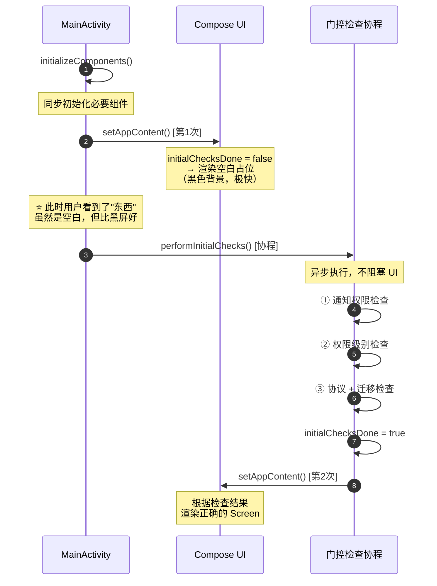

注意 `setAppContent()` 被调用了**两次**：
1. 第一次：立即渲染空白占位，让系统知道"Activity 已经有内容了"
2. 第二次：门控检查完成后，根据结果渲染正确的页面

**为什么不用 Splash Screen API？** Operit 的启动门控是动态的（取决于用户是否接受过协议、是否设置过权限、是否需要数据迁移），Splash Screen API 适合固定时长的品牌展示，不适合条件分支。

### 源码实录

```kotlin
// MainActivity.kt:724-770 (简化)
private fun setAppContent() {
    setContent {
        OperitTheme {
            Box {
                if (!initialChecksDone) {
                    // 空白占位 — 什么都不渲染
                } else if (!agreementPreferences.isAgreementAccepted()) {
                    // 门1: 用户协议
                    AgreementScreen(onAgreementAccepted = { /* ... */ })
                } else if (showMigrationScreen) {
                    // 门2: 数据迁移
                    MigrationScreen(onComplete = { /* ... */ })
                } else if (showPermissionGuide) {
                    // 门3: 权限引导
                    PermissionGuideScreen(onComplete = { /* ... */ })
                } else {
                    // 主界面
                    OperitApp(initialNavItem = NavItem.AiChat)
                    // + 插件加载覆盖层 (zIndex = 10)
                }
            }
        }
    }
}
```

> **关键设计模式：if-else 链 = 优先级队列**
>
> 这个 if-else 链就是门控的优先级：协议 > 迁移 > 权限 > 主界面。每道门通过后会调用 `setAppContent()` 刷新，进入下一道门或主界面。

---

## 第五课：4 道门控 — 渐进式解锁

### 为什么需要门控?

Operit 不是一个打开就能用的 App。它需要：
1. 用户明确接受隐私协议（法律要求）
2. 如果是老版本升级，聊天记录需要从 DataStore 迁移到 Room（数据安全）
3. 用户选择权限级别（Standard/Admin/Root），决定 AI 能做什么（安全边界）
4. 加载 MCP 插件（功能完整性）

### 门控顺序不能随意调换

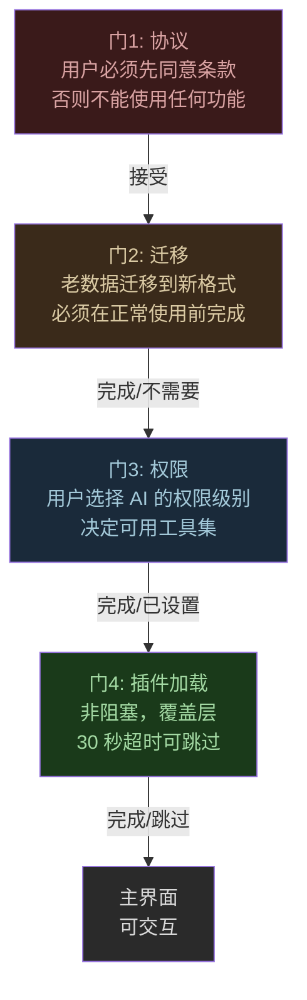

**如果调换顺序会怎样？**

| 错误顺序 | 后果 |
|---------|------|
| 权限 → 协议 | 用户还没同意条款就开始设置权限，法律风险 |
| 主界面 → 迁移 | 用户发消息时老数据还在迁移，可能看到不完整的聊天记录 |
| 插件 → 权限 | 插件可能需要知道权限级别才能正确初始化 |

### 门4 的特殊性：非阻塞覆盖层

前 3 道门是**阻塞式**的（必须完成才能进入下一步），但门 4（插件加载）是**非阻塞覆盖层**：

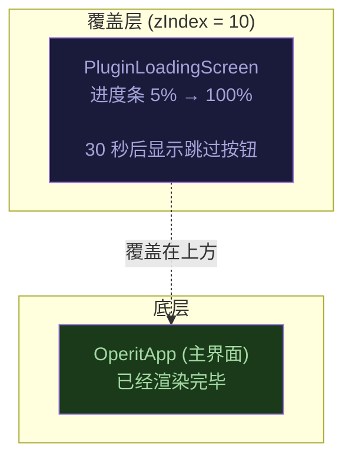

**为什么这么设计？** 因为 MCP 插件启动可能很慢（网络连接、进程启动），但主界面本身的核心功能（聊天、设置）不依赖插件。用 `zIndex = 10` 的覆盖层可以在后台同时初始化主界面，插件加载完毕后覆盖层消失，用户立刻可交互——感知上比"加载完才显示主界面"快很多。

> **动手验证：** 找到 `pluginLoadingState.show()` 调用，在其前后加日志。观察覆盖层显示时，底层的 `OperitApp` 是否已经完成了 LaunchedEffect（网络轮询、公告拉取等）。

---

## 第六课：AIForegroundService — 条件启动的前台服务

### 为什么存在这个服务?

Operit 有两个需要 App 被杀后仍然运行的功能：
1. **唤醒词监听**（"Hey Operit" 语音唤醒）— 需要持续录音
2. **外部 HTTP API**（其他 App 通过 HTTP 接口调用 AI）— 需要持续监听端口

Android 系统会在后台杀死空闲 App。前台服务（Foreground Service）通过显示一个持续通知来告诉系统"我正在做重要的事，别杀我"。

### 启动条件的决策逻辑

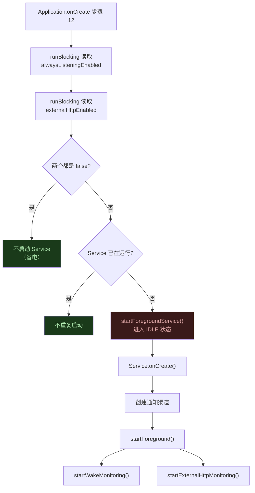

### Service 什么时候自停?

```kotlin
// AIForegroundService.kt:867-886 (简化)
private fun stopSelfIfIdle() {
    if (AI 正在工作) return          // 有活跃对话
    if (alwaysListening 开启) return  // 需要持续监听唤醒词
    if (externalHttp 运行中) return   // 需要持续监听 HTTP 端口
    if (应用在前台) return             // 用户正在使用

    // 以上全都不满足 → 安全自停
    stopSelf()
}
```

> **设计哲学：最小化后台存在。** Service 只在确实需要时运行，一旦条件不满足就立即停止，对电池友好。

---

## 第七课：OperitApp — Compose 世界的入口

通过所有门控后，`OperitApp` composable 被首次组合（compose）。它在首次组合时启动一组异步任务：

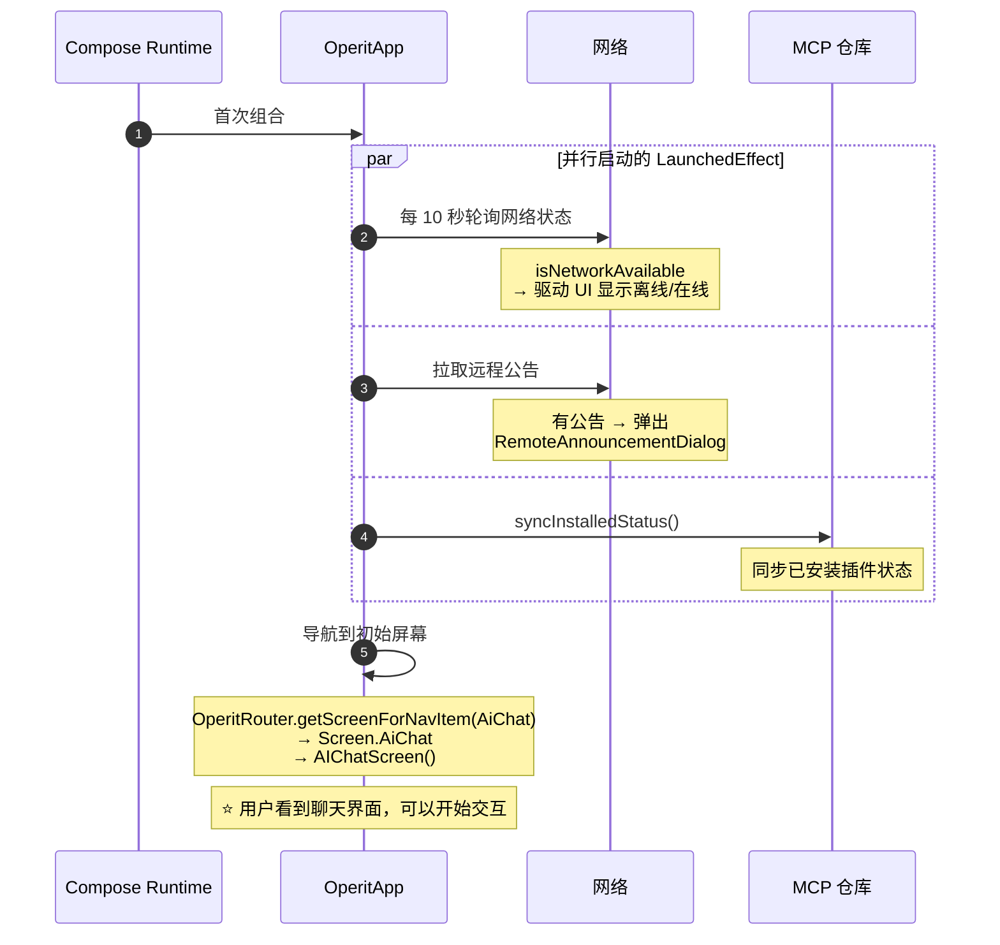

**为什么网络轮询不用 ConnectivityManager 回调？** 因为 Operit 需要检测的不仅是系统级网络连通性，还包括 AI API 的可达性。系统回调只告诉你"有没有 WiFi/移动数据"，不告诉你"AI 服务器能不能连上"。

---

## 总结：启动链路的 5 个关键设计决策

| # | 设计决策 | WHY |
|---|---------|-----|
| 1 | 语言在 `attachBaseContext` 注入 | 必须在资源系统绑定 Configuration 之前完成 |
| 2 | 3 次 `runBlocking` 同步读取 | 前台服务和语言设置必须在 onCreate 结束前确定 |
| 3 | 首帧渲染用空白占位 | 避免长时间黑屏，先让系统知道"Activity 有内容" |
| 4 | 门控用 if-else 链而非导航 | 优先级固定、每道门通过后刷新整个内容树 |
| 5 | 插件加载是非阻塞覆盖层 | 主界面可以提前初始化，感知启动速度更快 |

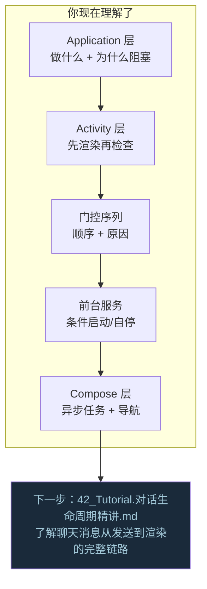

---

## 动手练习

### 练习 1: 追踪启动日志

Operit 在启动过程中打印了详细的计时日志（`【启动计时】` 前缀）。运行 App，过滤 logcat：

```bash
adb logcat | grep "启动计时"
```

你会看到类似：
```
启动计时】应用启动开始
【启动计时】实例初始化完成 - 3ms
【启动计时】cleanOnExit 清理任务已提交（异步IO） - 5ms
【启动计时】ActivityLifecycleManager初始化完成 - 6ms
【启动计时】AIMessageManager初始化完成 - 12ms
【启动计时】AIForegroundService 持久后台职责检查完成 - 48ms
...
```

**练习目标：** 找到耗时最长的步骤。它是同步还是异步的？为什么它耗时最长？

### 练习 2: 跳过门控

在 `performInitialChecks()` 的第一行加上 `initialChecksDone = true; setAppContent(); return`，让门控检查直接跳过。重新运行 App：

- 如果是全新安装，你会看到什么？（提示：协议页不会出现）
- 如果是升级安装且有旧数据，会发生什么？（提示：聊天记录可能不完整）

**练习目标：** 理解门控不是"烦人的欢迎页"，而是保障数据完整性和法律合规的必要步骤。

### 练习 3: 观察插件加载

找到 `PluginLoadingState.initializeMCPServer()` 方法，在每个插件启动前后加日志，记录每个插件的启动耗时。

**练习目标：** 理解为什么需要 30 秒超时——某些 MCP 插件可能因网络问题启动很慢。

---

## 关联文档

| 文档 | 关系 |
|------|------|
| `37_Runtime.冷启动全链路.md` | 参考手册 — 34 步完整行号索引 |
| `39_学习路线图.md` | 总索引 — 本教程对应 Level 2 |
| `42_Tutorial.对话生命周期精讲.md` | 下一篇 — 理解核心业务链路 |
