# Tutorial: 对话生命周期精讲

> **前置条件：** 你已经读过 `41_Tutorial.启动链路精讲.md`，理解 App 如何从启动到达主界面。
>
> **本教程的目标：** 读完后你能回答"用户点击发送按钮后，消息经过了哪些处理，AI 的回复是怎么一步步出现在屏幕上的"。
>
> **参考手册：** 11 个阶段的完整行号索引见 `38_Runtime.一次对话完整生命周期.md`。本教程聚焦 **7 个关键设计决策**。

---

## 对话全景：一条消息的旅程

用户输入"帮我查看一下 /sdcard 下的文件"，点击发送。接下来发生了什么？

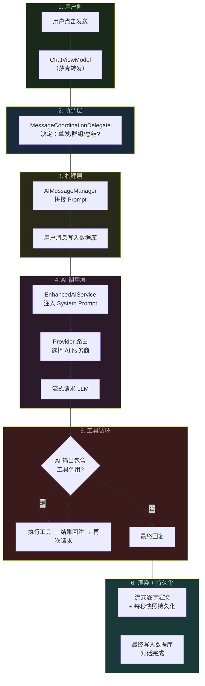

这 6 个阶段涉及 **7 个核心类**。在深入每个阶段之前，先认识它们之间的关系。

---

## 认识核心类：委托架构

### 为什么重要

Operit 的聊天逻辑分散在 7 个文件、约 7000 行代码里。如果不先理解它们的分工，你会在代码间来回跳转完全迷路。

### 类关系图

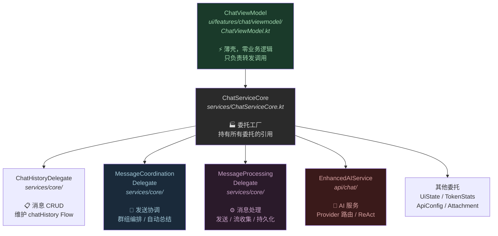

### 为什么用委托而不是把所有逻辑放在 ViewModel 里?

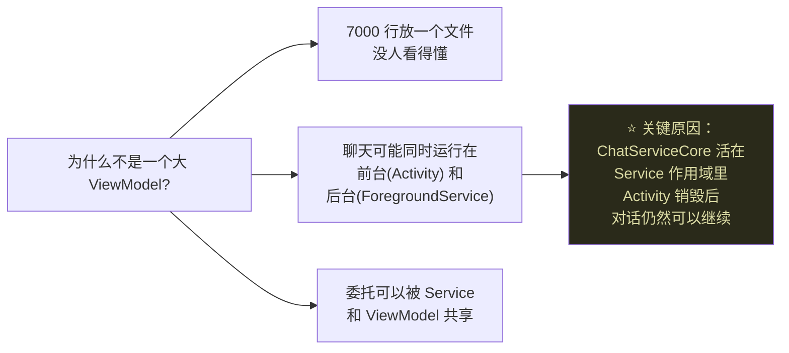

**核心认知：** `ChatViewModel` 只是 UI 层的代理。真正的对话运行时活在 `ChatServiceCore` 里，由 `AIForegroundService` 持有。这就是为什么你可以切到其他 App 再回来，对话仍在继续。

> **动手验证：** 在 `ChatViewModel.sendUserMessage()` 加断点，你会发现它只有一行代码：
> ```kotlin
> fun sendUserMessage(promptFunctionType: PromptFunctionType = PromptFunctionType.CHAT) {
>     messageCoordinationDelegate.sendUserMessage(promptFunctionType)
> }
> ```
> 整个 ViewModel 都是这样——每个方法都是一行转发。

---

## 第一课：消息协调 — "发送前需要做几个决定"

### 为什么重要

用户点击发送后，系统不是直接把消息丢给 AI。它需要先做 3 个决定：
1. 这是单轮对话还是**群组编排**（多个角色轮流回复）？
2. 历史消息的 Token 是否快超限了，需不需要**异步总结**？
3. 当前活跃的角色卡/模型配置是什么？

### 决策流程

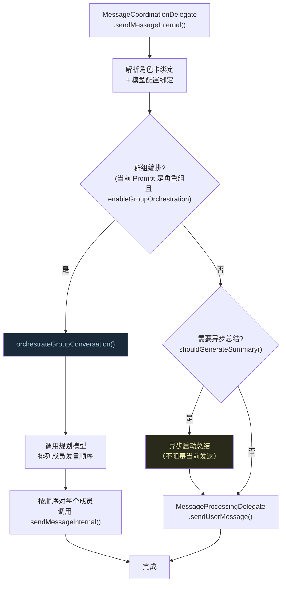

### 群组编排是什么?

Operit 支持"角色组"——一个聊天里有多个 AI 角色（比如一个技术专家 + 一个产品经理），它们轮流回复。编排流程：

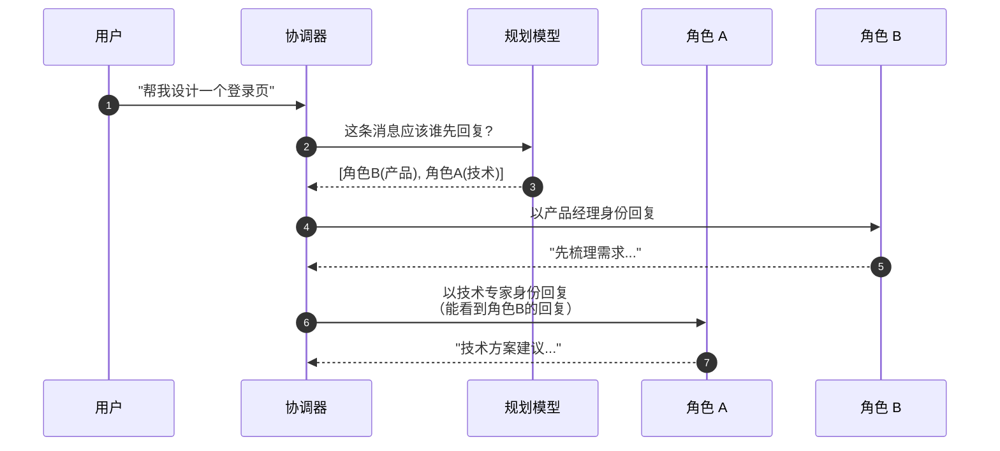

### 自动总结的触发条件

```kotlin
// AIMessageManager.kt (简化)
fun shouldGenerateSummary(
    messages: List<ChatMessage>,
    currentTokens: Int,
    maxTokens: Int,
    tokenUsageThreshold: Float,  // 默认 0.7
    enableSummary: Boolean
): Boolean {
    if (!enableSummary) return false
    // Token 用量超过 70% 上限 → 需要总结
    return currentTokens > (maxTokens * tokenUsageThreshold)
}
```

**为什么异步总结而不是同步?** 总结需要调用 AI（把历史消息压缩成摘要），耗时可能几秒到十几秒。如果同步等待，用户发送的消息会卡住很久。所以总结在后台默默进行，用户的消息立即发送。

> **常见疑问：总结还没完成，新消息就发出去了，会不会冲突？**
> 
> 不会。总结的结果会插入到历史消息列表的特定位置（通过 `findProperSummaryPosition` 计算），新消息在总结之后。两者操作不同的历史区段。

---

## 第二课：Prompt 构建 — "AI 实际收到的不只是你打的字"

### 为什么重要

用户输入"帮我查看 /sdcard 的文件"，但 AI 实际收到的消息远不止这一句话。`AIMessageManager.buildUserMessageContent()` 会把用户输入包装成一个**结构化的富文本消息**。

### 组装过程

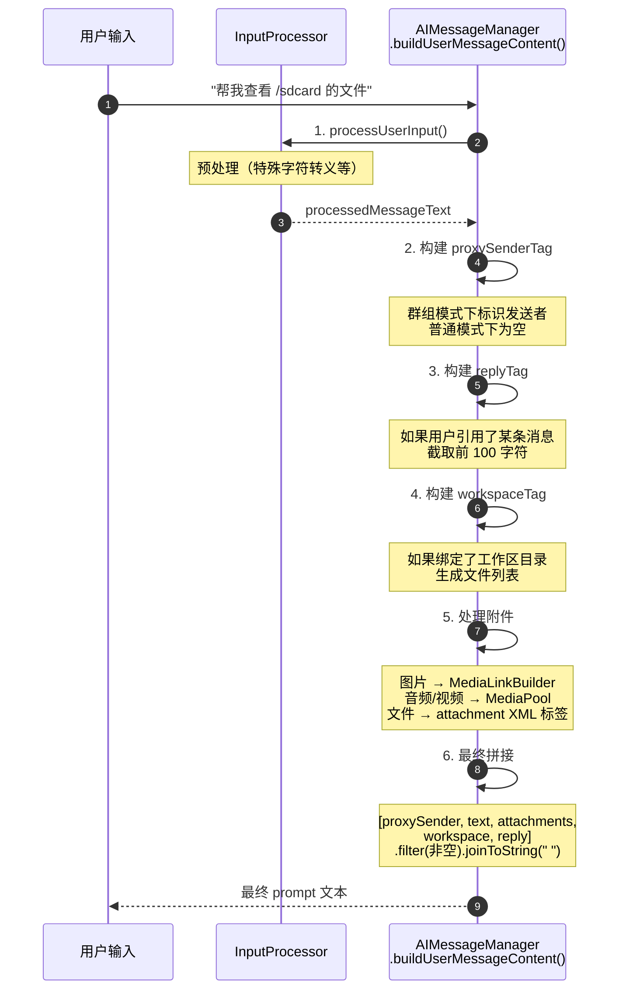

### 拼接结果示例

假设用户附加了一张图片并引用了一条历史消息：

```
<proxy_sender name="技术专家"/>
帮我查看 /sdcard 的文件
<attachment id="img_001" type="image/png">[图片链接]</attachment>
<workspace_attachment>
  project/src/Main.kt (2.3KB)
  project/build.gradle (1.1KB)
</workspace_attachment>
<reply_to sender="产品经理" timestamp="1715500000">先梳理一下需求...</reply_to>
```

**AI 看到的是这个完整的结构化文本**，不只是"帮我查看 /sdcard 的文件"。

> **为什么不用 JSON 而用 XML 标签?**
> 
> 因为 LLM 对 XML 标签的理解能力普遍比结构化 JSON 好（尤其是在混合自然语言的场景）。XML 标签可以自然地嵌入在文本流中，不破坏可读性。

---

## 第三课：System Prompt — "AI 的世界观在这里注入"

### 为什么重要

System Prompt 决定了 AI "是谁"、"能做什么"、"怎么回答"。每次发送消息前，Operit 会动态生成一个 System Prompt 并注入到对话历史的最前面。

### System Prompt 的分层结构

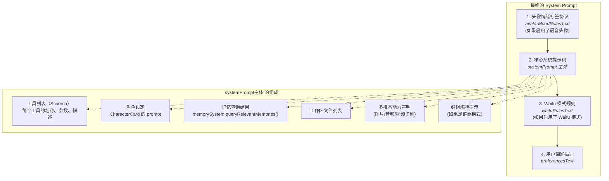

### AI 实际看到的对话历史

```
[System] 你是 Operit AI 助手...
         可用工具：
         - shell_command: 执行 Shell 命令
           参数: command (string, 必填)
         - list_files: 列出目录内容
           参数: path (string, 必填), recursive (boolean, 可选)
         - read_file: 读取文件内容
           ...（40+ 个工具的完整描述）

         角色设定：你是一个专业的技术助手...

         用户偏好：用户是一名 Android 开发者，偏好简洁直接的回答风格。

[User]   帮我查看 /sdcard 的文件
```

**工具 Schema 的体量：** 40+ 个工具的完整参数描述可能占 3000-5000 个 Token。这就是为什么 Operit 有上下文截断设置（ContextSummarySettings）——控制 System Prompt 不要太大。

### 记忆注入

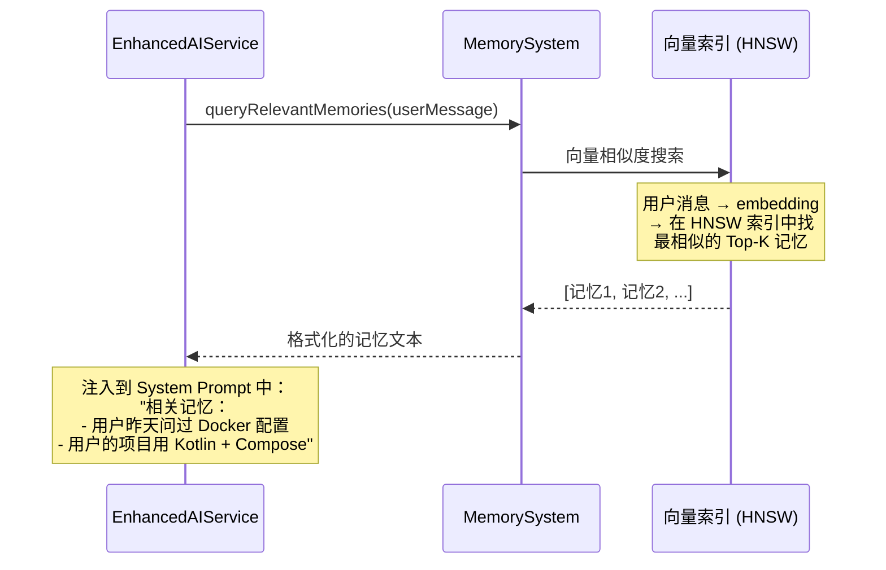

> **动手验证：** 在 `ConversationService.kt:321` 附近加断点，检查 `finalSystemPrompt` 变量的内容。你会看到一个巨大的字符串——这就是 AI 在回答你之前"读到"的全部上下文。

---

## 第四课：Provider 路由 — "怎么选择用哪个 AI"

### 为什么重要

Operit 支持 18+ 个 AI 服务商。用户可能给不同功能配置不同的模型（聊天用 GPT-4，总结用更便宜的模型）。Provider 路由决定每次请求用哪个模型。

### 路由逻辑

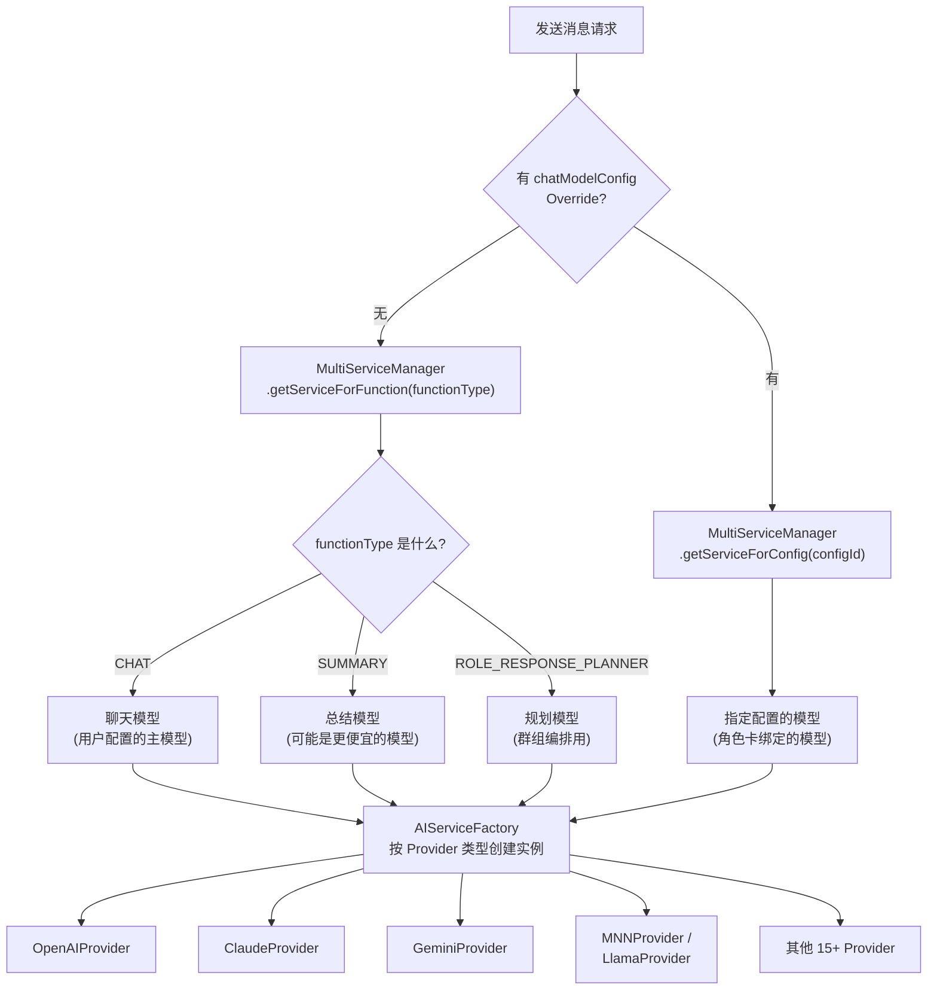

### 实例隔离

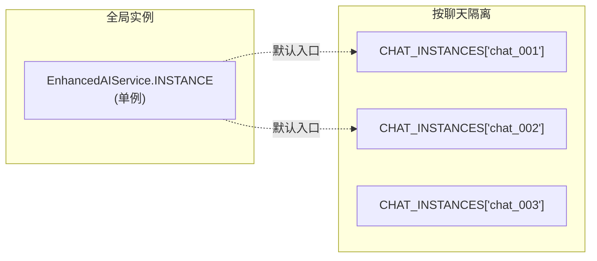

**为什么每个聊天有独立的 Service 实例？** 因为每个聊天可能用不同的模型配置、绑定不同的角色卡，对话历史也是独立的。共享实例会导致状态混乱。

---

## 第五课：ReAct 循环 — "AI 如何使用工具"

### 为什么重要

这是 Operit 与普通聊天 App 最大的区别。普通聊天 App 只做"用户说 → AI 回"。Operit 的 AI 可以**调用工具**——读文件、执行命令、访问网页——然后根据工具结果继续思考。这个"思考-行动-观察"的循环叫 **ReAct（Reasoning + Acting）**。

### 一次工具调用的完整过程

```mermaid
sequenceDiagram
    autonumber
    participant AI as AI 模型
    participant EAS as EnhancedAIService
    participant TEM as ToolExecutionManager
    participant TPS as ToolPermissionSystem
    participant TOOL as 工具执行器

    Note over AI: AI 决定需要查看文件

    AI-->>EAS: 流式输出：<br/>"我来帮你查看文件列表。<br/>&lt;tool_call name='list_files'&gt;<br/>  &lt;path&gt;/sdcard&lt;/path&gt;<br/>&lt;/tool_call&gt;"

    EAS->>EAS: processStreamCompletion()
    Note over EAS: 流结束，检查是否有工具调用

    EAS->>TEM: extractToolInvocations(输出文本)
    Note over TEM: 用正则解析 &lt;tool_call&gt; XML

    TEM-->>EAS: [ToolInvocation(name=list_files, path=/sdcard)]

    EAS->>TEM: executeInvocations(invocations)

    TEM->>TPS: checkToolPermission("list_files")
    TPS-->>TEM: ALLOW

    TEM->>TOOL: executeToolSafely(list_files, {path: /sdcard})
    TOOL-->>TEM: "Documents/\nDownloads/\nDCIM/\n..."

    TEM-->>EAS: 工具执行结果

    EAS->>EAS: processToolResults()
    Note over EAS: 把工具结果加入对话历史

    EAS->>AI: 再次发送（带工具结果的历史）

    AI-->>EAS: "你的 /sdcard 目录下有以下文件夹：<br/>- Documents<br/>- Downloads<br/>- DCIM<br/>..."

    Note over EAS: 这次没有工具调用<br/>→ 循环结束
```

### 工具调用的 XML 格式

AI 输出中包含的工具调用长这样：

```xml
<tool_call name="list_files">
  <path>/sdcard</path>
  <recursive>false</recursive>
</tool_call>
```

`ToolExecutionManager.extractToolInvocations()` 用正则解析这些 XML 标签，提取工具名和参数。

### 并行 vs 串行执行

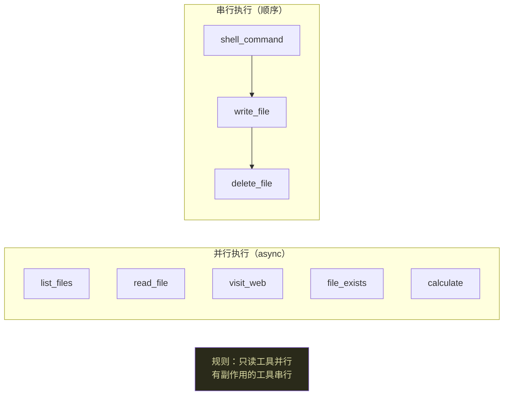

**为什么这么分？** 只读工具（查看文件、读网页、计算）互不干扰，并行执行可以显著减少等待时间。但写入工具（执行命令、写文件、删文件）可能互相依赖——比如先创建目录再往里写文件——必须串行保证顺序。

```kotlin
// ToolExecutionManager.kt:438 (简化)
val parallelizableToolNames = setOf(
    "list_files", "read_file", "visit_web",
    "file_exists", "calculate", "grep_code", ...
)

val (parallel, serial) = invocations.partition {
    parallelizableToolNames.contains(it.tool.name)
}

// 并行：每个工具一个 async 协程
val jobs = parallel.map { async { executeAndEmitTool(it) } }

// 串行：按顺序依次执行
for (inv in serial) { executeAndEmitTool(inv) }

// 等待并行任务全部完成
jobs.awaitAll()
```

### 权限检查

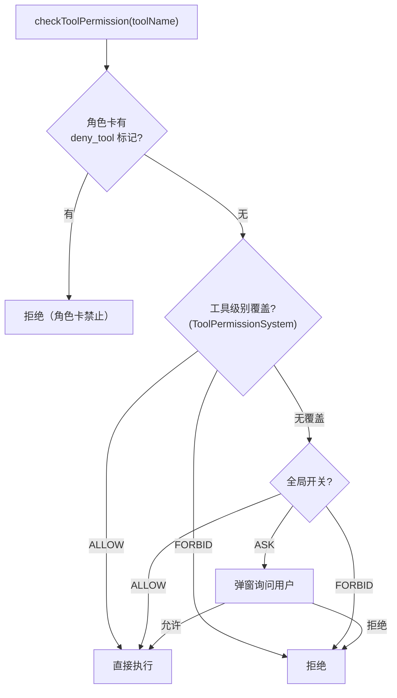

三层优先级：角色卡 > 工具级覆盖 > 全局开关。这样角色卡作者可以限制 AI 不能使用某些危险工具（如 shell_command），即使全局设置允许。

> **常见疑问：ReAct 循环会不会无限执行?**
> 
> 不会。有三个终止条件：
> 1. AI 输出中不包含任何 `<tool_call>` → 正常结束
> 2. 达到最大工具调用轮次上限 → 强制结束
> 3. Token 超限 → 触发总结后自动续写

---

## 第六课：流式渲染 — "打字机效果怎么实现的"

### 为什么重要

AI 的回复不是一次性返回的，而是逐词（或逐 token）流式返回。Operit 需要把这些碎片实时渲染到界面上，给用户"AI 正在打字"的感觉。

### 流式渲染管线

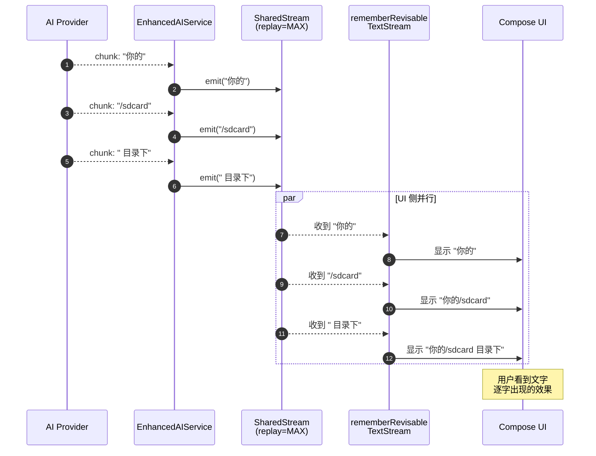

### SAVEPOINT / ROLLBACK 机制

某些 AI（如 Gemini 的思考模式）可能在流式输出中修正已发出的内容——比如写了半句话发现逻辑不对，回撤重写。

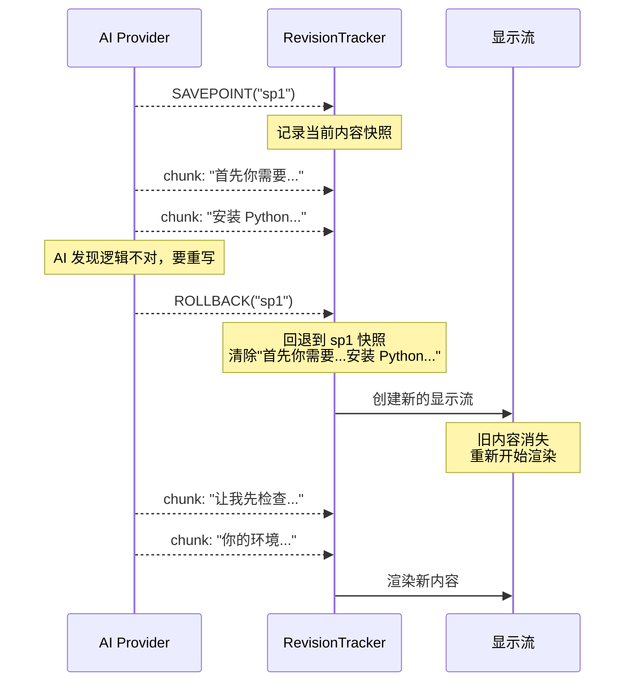

**用户感知：** 旧文字消失，新文字从头开始出现。类似于看到有人在打字，删了一段重打。

---

## 第七课：持久化策略 — "崩溃了也不丢消息"

### 为什么重要

AI 回复可能持续十几秒甚至几分钟（特别是多轮工具调用时）。如果回复到一半 App 崩溃了，用户会丢失所有已收到的内容。

### 双阶段持久化

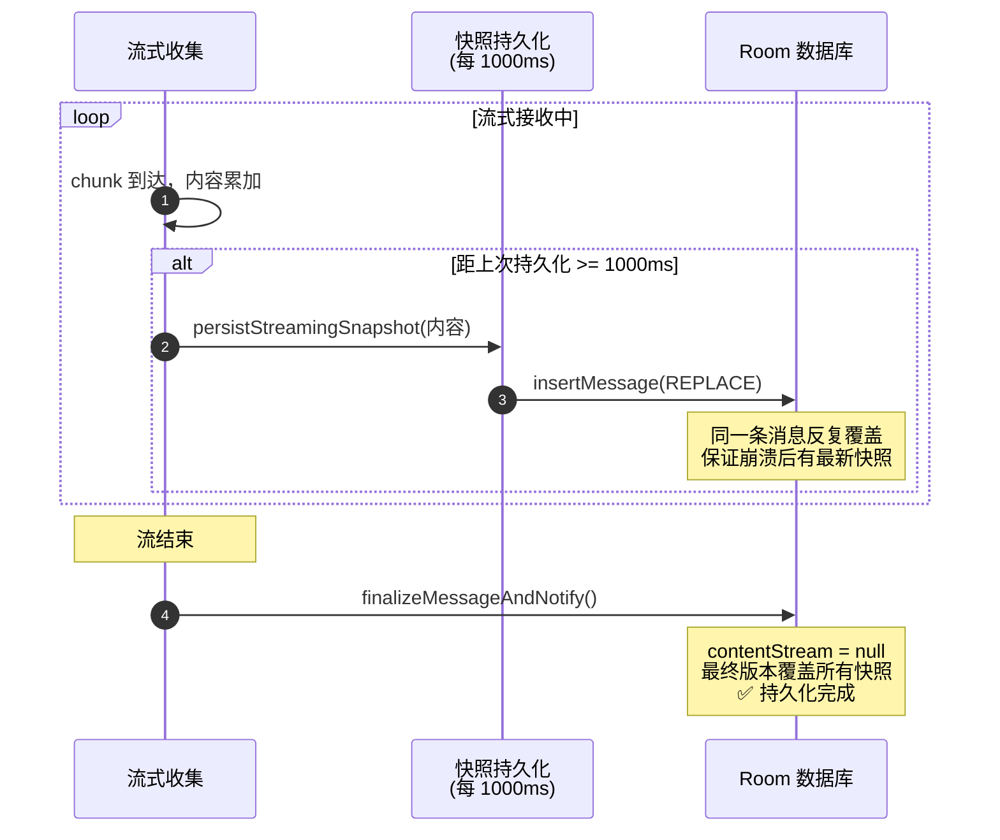

### 代码实现

```kotlin
// MessageProcessingDelegate.kt:870 (简化)
suspend fun persistStreamingSnapshot(content: String, force: Boolean = false) {
    // Waifu 模式下跳过（只渲染不落盘）
    if (isWaifuModeEnabled) return

    val now = messageTimingNow()
    // 节流：距上次不足 1000ms → 跳过
    if (!force && now - lastStreamingPersistAt < 1000L) return

    // 写入数据库（REPLACE 策略，覆盖之前的快照）
    addMessageToChat(chatId, aiMessage.copy(content = content))
    lastStreamingPersistAt = now
}
```

### 为什么 1000ms?

| 如果更频繁（如 100ms） | 如果更稀疏（如 5000ms） |
|----------------------|----------------------|
| 每秒写 10 次数据库<br/>I/O 压力大，UI 可能卡顿 | 崩溃时最多丢 5 秒内容<br/>用户接受度差 |
| ↓ | ↓ |
| **1000ms 是平衡点：** 每秒写一次，I/O 可接受；最多丢 1 秒内容 |

> **动手验证：** 在 `persistStreamingSnapshot` 入口加计数日志。发一条需要 AI 长回复的消息，观察快照写入频率。

---

## 总结：对话生命周期的 7 个关键设计决策

| # | 设计决策 | WHY |
|---|---------|-----|
| 1 | 委托架构而非大 ViewModel | Service 和 Activity 共享对话运行时 |
| 2 | 群组编排独立于普通发送 | 多角色轮流回复需要规划模型排序 |
| 3 | Prompt 用 XML 标签结构化 | LLM 对 XML 混合自然语言理解力最好 |
| 4 | System Prompt 动态生成 | 不同角色卡/模型/功能开关 → 不同的 AI 人格 |
| 5 | 只读工具并行、写入工具串行 | 安全性 + 性能的平衡 |
| 6 | SAVEPOINT/ROLLBACK 流管理 | 支持 AI 回撤重写而不闪烁 |
| 7 | 每秒快照持久化 | 崩溃最多丢 1 秒内容 |

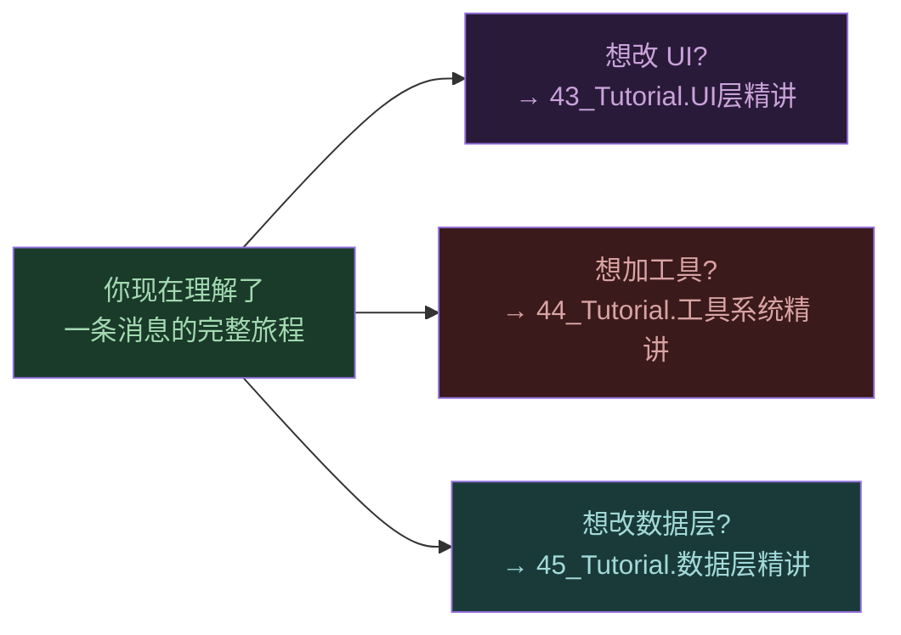

---

## 动手练习

### 练习 1: 追踪一条消息的完整链路

在以下 5 个位置加日志（或断点），然后发送一条消息：

1. `ChatViewModel.sendUserMessage()` — 入口
2. `MessageCoordinationDelegate.sendMessageInternal()` — 协调
3. `AIMessageManager.buildUserMessageContent()` 的 return 语句 — 查看最终 prompt
4. `EnhancedAIService.sendMessage()` — 查看发给 AI 的完整历史
5. `MessageProcessingDelegate.persistStreamingSnapshot()` — 持久化

**练习目标：** 亲眼看到消息从 UI 层穿过 7 个类到达 AI，再从 AI 回到 UI 的完整路径。

### 练习 2: 触发工具调用

对 AI 说"帮我查看 /sdcard/Download 目录下有什么文件"。在 `ToolExecutionManager.extractToolInvocations()` 加断点：

- 检查 `response` 参数——这是 AI 的原始输出，包含 `<tool_call>` XML
- 检查返回的 `invocations` 列表——解析出的工具名和参数

**练习目标：** 理解 AI 的工具调用是文本级的 XML 标签，不是函数调用。

### 练习 3: 观察 System Prompt 体量

在 `ConversationService.kt` 的 `prepareConversationHistory` 方法中，在 system prompt 构建完成后打印其长度：

```kotlin
AppLogger.d("SystemPrompt", "长度: ${finalSystemPrompt.length} 字符")
```

**练习目标：** 感受 System Prompt 的体量（通常 3000-8000 字符），理解为什么需要上下文截断设置。

---

## 关联文档

| 文档 | 关系 |
|------|------|
| `38_Runtime.一次对话完整生命周期.md` | 参考手册 — 11 阶段完整行号索引 |
| `01_请求调用链时序图.md` | 高层鸟瞰 — 9 参与者时序图 |
| `41_Tutorial.启动链路精讲.md` | 上一篇 — App 如何到达主界面 |
| `39_学习路线图.md` | 总索引 — 本教程对应 Level 3 |
