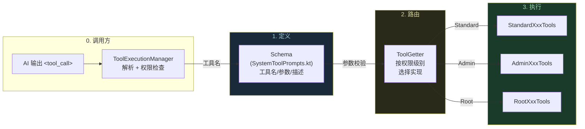
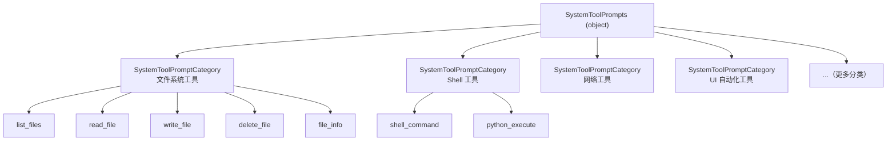
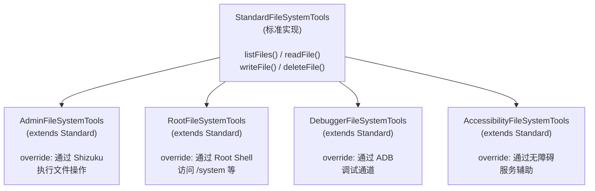
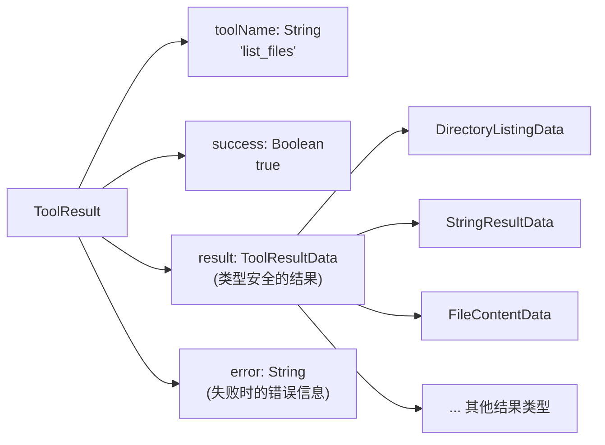
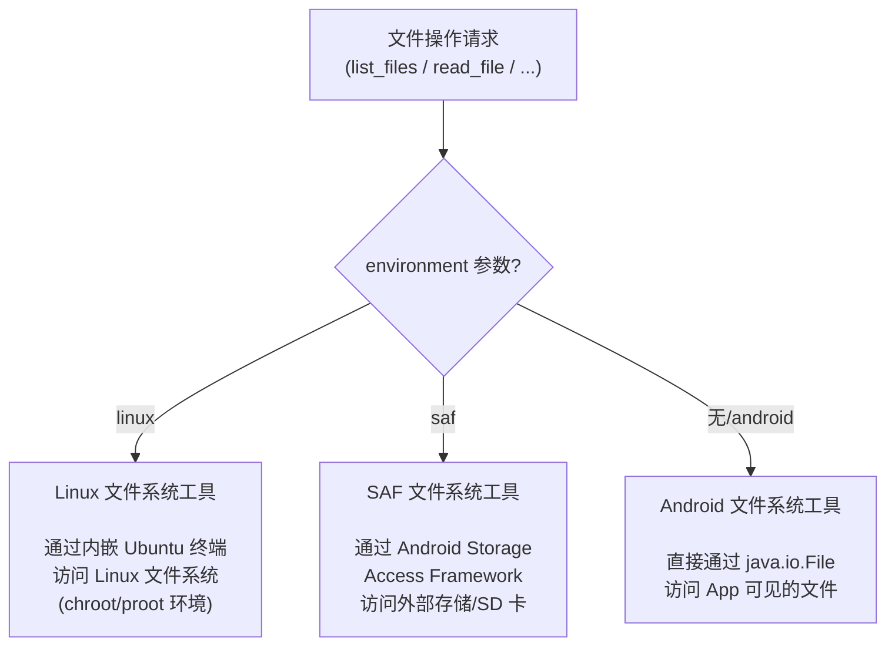
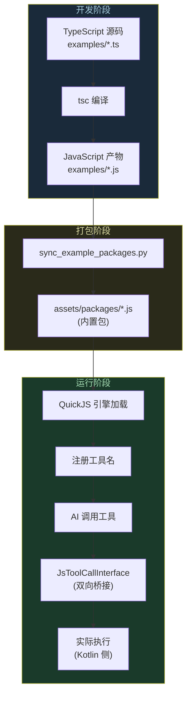
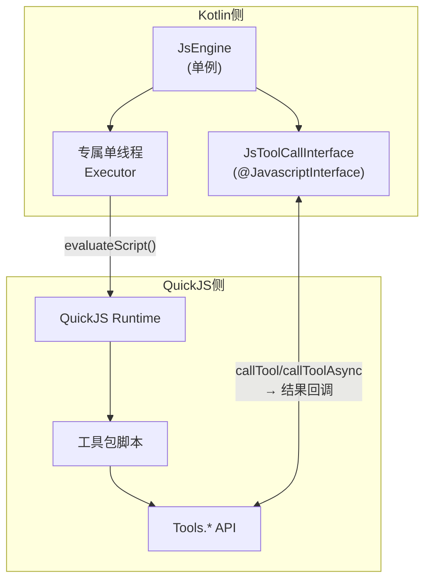
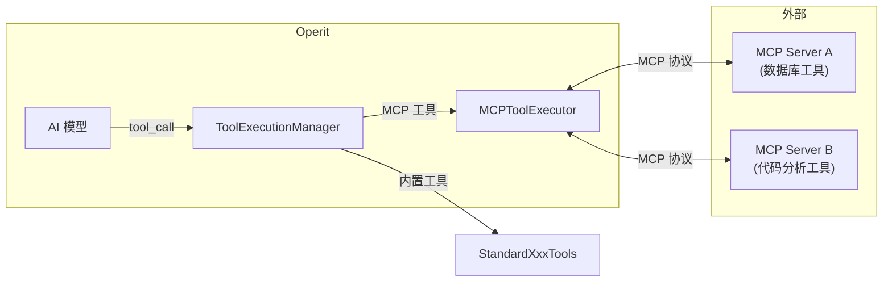
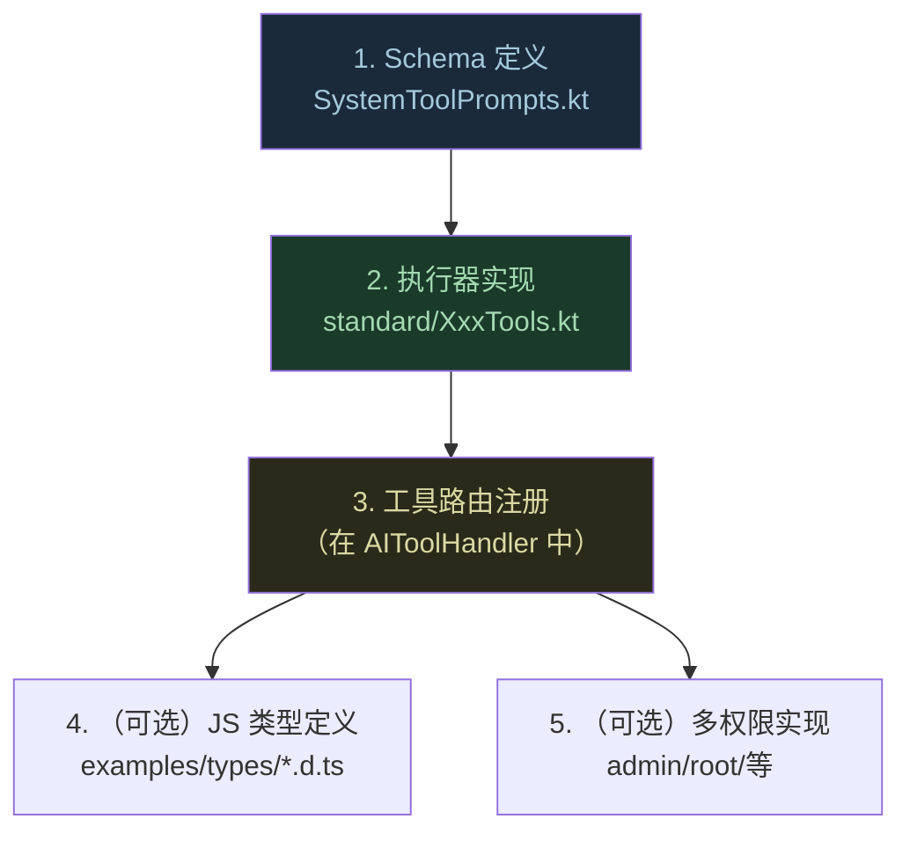

# Tutorial: 工具系统精讲

> **前置条件：** 你已经读过 `42_Tutorial.对话生命周期精讲.md` 第五课（ReAct 循环），知道 AI 通过 `<tool_call>` XML 标签调用工具。
>
> **本教程的目标：** 读完后你能回答"一个工具从定义到被 AI 调用到执行完毕，经过了哪些环节"，并且知道如何新增一个自定义工具。
>
> **参考文档：** `00_全景梳理.md` §三 层 2（工具系统概览）。

---

## 工具系统全景：从定义到执行



这 3 层的设计哲学：**同一个工具名，不同权限下行为不同**。比如 `shell_command`：

| 权限级别 | 实现类 | 行为 |
|---------|--------|------|
| Standard | `StandardShellToolExecutor` | 在沙盒内执行，无法访问系统目录 |
| Admin | `AdminShellToolExecutor` | 通过 Shizuku 获得 ADB 级权限 |
| Root | `RootShellToolExecutor` | 完整 Root Shell |

用户选择的权限级别在启动时设定（Level 2 教程的"权限门"），之后 AI 调用工具时自动路由到对应实现。

---

## 第一课：工具 Schema — "AI 的工具说明书"

### 为什么重要

AI 不是天生知道有哪些工具可用的。它需要看到每个工具的**名称、描述、参数列表**，才知道什么时候该调用什么工具。这个"说明书"就是 Schema。

### Schema 长什么样

以 `list_files` 工具为例：

```kotlin
// SystemToolPrompts.kt:91-98
ToolPrompt(
    name = "list_files",
    description = "List files in a directory.",
    parametersStructured = listOf(
        ToolParameterSchema(
            name = "path",
            type = "string",
            description = "e.g. \"/sdcard/Download\"",
            required = true
        ),
        ToolParameterSchema(
            name = "environment",
            type = "string",
            description = "optional, same as read_file environment",
            required = false
        )
    )
)
```

### Schema 在 System Prompt 中的呈现

这个 Schema 会被转换成文本，注入到 System Prompt 里。AI 看到的大致是：

```
Available tools:

- list_files: List files in a directory.
  Parameters:
    - path (string, required): e.g. "/sdcard/Download"
    - environment (string, optional): optional, same as read_file environment

- shell_command: Execute a shell command.
  Parameters:
    - command (string, required): The command to execute
    ...
```

### Schema 的组织结构



> **动手验证：** 打开 `SystemToolPrompts.kt`，搜索 `ToolPrompt(`。数一下有多少个——这就是 AI 可用工具的总数（40+）。

---

## 第二课：ToolGetter — "按权限级别选择实现"

### 为什么重要

这是整个工具系统最优雅的设计之一。用户说"我给 App Root 权限"，AI 的 `shell_command` 就自动变成 Root Shell，不需要改任何业务代码。

### 核心代码

```kotlin
// ToolGetter.kt:20-29
fun getFileSystemTools(context: Context): StandardFileSystemTools {
    return when (androidPermissionPreferences.getPreferredPermissionLevel()) {
        AndroidPermissionLevel.ROOT          -> RootFileSystemTools(context)
        AndroidPermissionLevel.ADMIN         -> AdminFileSystemTools(context)
        AndroidPermissionLevel.DEBUGGER      -> DebuggerFileSystemTools(context)
        AndroidPermissionLevel.ACCESSIBILITY -> AccessibilityFileSystemTools(context)
        AndroidPermissionLevel.STANDARD      -> StandardFileSystemTools(context)
        null -> StandardFileSystemTools(context)
    }
}
```

### 继承关系



**设计模式：模板方法 + 策略**。子类只需要 override 那些在更高权限下行为不同的方法。没有 override 的方法自动继承 Standard 实现。

### 所有工具都遵循同样的路由模式

```kotlin
// ToolGetter.kt (概括)
fun getShellToolExecutor(context)         → Standard/Admin/Root/... ShellToolExecutor
fun getUITools(context)                   → Standard/Admin/Root/... UITools
fun getSystemOperationTools(context)      → Standard/Admin/Root/... SystemOperationTools
fun getDeviceInfoToolExecutor(context)    → Standard/Admin/Root/... DeviceInfoToolExecutor
fun getHttpTools(context)                 → StandardHttpTools  // 网络工具不分权限
fun getWebVisitTool(context)              → StandardWebVisitTool
```

注意：不是所有工具都有权限分级。`HttpTools`、`WebVisitTool` 等网络工具不涉及系统权限，所有级别用同一实现。

---

## 第三课：工具执行器 — "工具到底怎么干活"

### 一个具体的例子：list_files

跟着 `list_files` 从 AI 调用到返回结果，走完整条链路：

```mermaid
sequenceDiagram
    autonumber
    participant AI as AI 输出
    participant TEM as ToolExecutionManager
    participant GETTER as ToolGetter
    participant TOOL as StandardFileSystemTools
    participant FS as Android 文件系统

    AI-->>TEM: "&lt;tool_call name='list_files'&gt;<br/>  &lt;path&gt;/sdcard/Download&lt;/path&gt;<br/>&lt;/tool_call&gt;"

    TEM->>TEM: extractToolInvocations()
    Note over TEM: 解析 XML → ToolInvocation<br/>name=list_files, path=/sdcard/Download

    TEM->>TEM: checkToolPermission("list_files")
    Note over TEM: → ALLOW

    TEM->>GETTER: getFileSystemTools(context)
    Note over GETTER: 假设用户权限 = STANDARD

    GETTER-->>TEM: StandardFileSystemTools 实例

    TEM->>TOOL: listFiles(AITool(name=list_files, params=[path=/sdcard/Download]))

    TOOL->>TOOL: 提取参数 path
    TOOL->>TOOL: PathValidator.validateAndroidPath(path)
    Note over TOOL: 安全校验：防止路径穿越攻击

    TOOL->>FS: File("/sdcard/Download").listFiles()
    FS-->>TOOL: [file1.pdf, photo.jpg, ...]

    TOOL->>TOOL: 构建 DirectoryListingData
    Note over TOOL: 每个文件：name, isDirectory,<br/>size, permissions, lastModified

    TOOL-->>TEM: ToolResult(success=true,<br/>result=DirectoryListingData)

    TEM-->>AI: 工具结果（格式化文本）
```

### listFiles 的源码

```kotlin
// StandardFileSystemTools.kt:1223 (简化)
open suspend fun listFiles(tool: AITool): ToolResult {
    val path = tool.parameters.find { it.name == "path" }?.value ?: ""
    val environment = tool.parameters.find { it.name == "environment" }?.value

    // 路由：Linux 环境 / SAF 环境 / 普通 Android
    if (isLinuxEnvironment(environment)) return linuxTools.listFiles(tool)
    if (isSafEnvironment(environment))  return safTools.listFiles(tool)

    // 安全校验
    PathValidator.validateAndroidPath(path, tool.name)?.let { return it }

    val directory = File(path)
    if (!directory.exists() || !directory.isDirectory) {
        return ToolResult(success = false, error = "Not a valid directory")
    }

    val entries = directory.listFiles()?.map { file ->
        FileEntry(
            name = file.name,
            isDirectory = file.isDirectory,
            size = file.length(),
            permissions = getFilePermissions(file),
            lastModified = dateFormat.format(Date(file.lastModified()))
        )
    } ?: emptyList()

    return ToolResult(success = true, result = DirectoryListingData(path, entries))
}
```

### ToolResult 的结构



`ToolResult` 会被格式化为文本后注入到对话历史中，AI 在下一轮看到这个结果。

---

## 第四课：三种文件系统 — "同一个工具，三种环境"

### 为什么重要

Operit 的文件工具支持 3 种文件系统环境，通过 `environment` 参数切换。不了解这一点，你会对代码中的 `linuxTools` / `safTools` 感到困惑。



这意味着 AI 可以在同一次对话里操作 Android 本地文件、Linux 虚拟机文件和 SD 卡文件，只需切换 `environment` 参数。

---

## 第五课：JavaScript 工具包 — "用户可以写自己的工具"

### 为什么重要

40+ 内置工具是 Operit 自带的。但用户（或社区）可以用 TypeScript 写自定义工具包，发布到市场让别人安装。这是 Operit 的工具包生态。

### 工具包的生命周期



### QuickJS 引擎架构



**关键约束：** QuickJS 是单线程的，所有 JS 执行都必须派发到专属线程。这就是为什么 `JsEngine` 用 `newSingleThreadExecutor`。

### JS 工具包脚本示例

```typescript
// 工具包脚本 (TypeScript)
export function execute(params: { query: string }): string {
    // 可以调用 Kotlin 侧的工具
    const files = Tools.Files.listFiles("/sdcard/Download");
    const result = Tools.Http.get("https://api.example.com/search?q=" + params.query);
    return JSON.stringify({ files, searchResult: result });
}
```

脚本通过 `Tools.*` API 调用 Kotlin 侧的能力，形成"JS 脚本 → Kotlin 桥 → 原生工具"的调用链。

---

## 第六课：MCP 工具 — "外部服务器提供的工具"

### 为什么重要

MCP（Model Context Protocol）是 Anthropic 提出的标准化协议，允许外部服务器向 AI 提供工具。Operit 作为 MCP 客户端，可以连接外部 MCP 服务器获取更多工具。



内置工具和 MCP 工具对 AI 来说是透明的——它只看到工具名和参数描述，不关心工具是内置的还是来自外部服务器。

---

## 第七课：如何新增一个工具

假设你要新增一个 `get_battery_level` 工具，返回当前电量百分比。

### 步骤总览



### 步骤 1: Schema 定义

在 `SystemToolPrompts.kt` 的适当分类下添加：

```kotlin
ToolPrompt(
    name = "get_battery_level",
    description = "Get the current battery level percentage.",
    parametersStructured = emptyList()  // 无参数
)
```

### 步骤 2: 执行器实现

在 `StandardDeviceInfoToolExecutor.kt`（或新建文件）中实现：

```kotlin
fun getBatteryLevel(tool: AITool): ToolResult {
    val batteryManager = context.getSystemService(Context.BATTERY_SERVICE)
        as BatteryManager
    val level = batteryManager.getIntProperty(
        BatteryManager.BATTERY_PROPERTY_CAPACITY
    )
    return ToolResult(
        toolName = tool.name,
        success = true,
        result = StringResultData("Battery level: $level%")
    )
}
```

### 步骤 3: 路由注册

在工具名到执行器方法的映射中添加条目（具体位置取决于工具分类）。

### 验证

重新编译运行，对 AI 说"帮我看看电池还剩多少"。AI 应该会调用 `get_battery_level` 工具。

> **注意 5 处同步要求：**
> 修改工具参数时必须同步更新：
> 1. Schema（SystemToolPrompts.kt）
> 2. Kotlin 执行器实现
> 3. 工具路由注册
> 4. JS Wrapper（如果有工具包脚本调用）
> 5. TS 类型定义（examples/types/*.d.ts）
>
> 遗漏任何一处都会导致不一致。

---

## 总结：工具系统的 5 个关键设计决策

| # | 设计决策 | WHY |
|---|---------|-----|
| 1 | Schema 与实现分离 | AI 只看 Schema，实现可以按权限级别变化 |
| 2 | 权限级别路由（ToolGetter） | 同一工具名在不同权限下行为不同，用户无感 |
| 3 | 继承 + override 模式 | 子类只需覆盖差异部分，减少代码重复 |
| 4 | QuickJS 单线程 + 桥接 | 安全隔离 JS 沙箱，双向通信实现扩展性 |
| 5 | MCP 协议集成 | 标准化的外部工具接入，与内置工具统一调度 |

---

## 动手练习

### 练习 1: 追踪一个工具调用

在 `ToolGetter.getFileSystemTools()` 的 `when` 表达式加断点。让 AI 执行 `list_files`，观察：
- `getPreferredPermissionLevel()` 返回什么？
- 最终创建的是哪个子类实例？

### 练习 2: 读懂一个 Schema

打开 `SystemToolPrompts.kt`，找到 `shell_command` 的 Schema。回答：
- 它有几个参数？哪些是必填？
- `description` 里对 AI 有什么特殊指示？

### 练习 3: 新增一个工具

按照第七课的步骤，实际新增 `get_battery_level` 工具。不需要多权限实现，只做 Standard 版本就够。测试 AI 是否能正确调用它。

---

## 关联文档

| 文档 | 关系 |
|------|------|
| `42_Tutorial.对话生命周期精讲.md` 第五课 | ReAct 循环（工具调用的上层逻辑） |
| `00_全景梳理.md` §三 层 2 | 工具系统概览 |
| `00_全景梳理.md` §四 | 脚本包系统 |
| `39_学习路线图.md` | 总索引 — 本教程对应 Level 5 |
