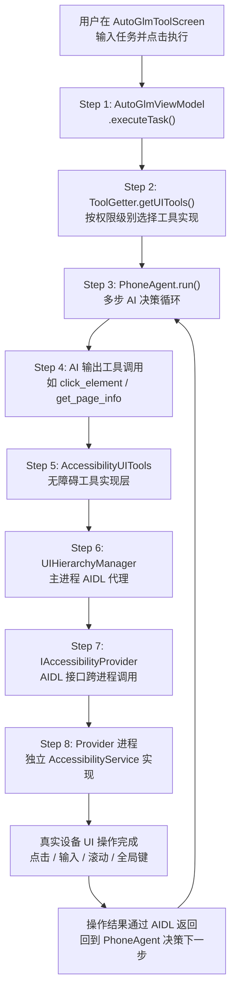

# Walkthrough: AutoGLM 无障碍 UI 自动化全链路

> **场景：** AI 需要在设备上操作一个 App（比如打开微信发一条消息）。系统通过无障碍服务获取屏幕 UI 层级树，找到目标元素并执行点击/输入操作。从用户在 AutoGLM 界面输入任务，到操作真正落地设备屏幕，经过了哪些代码。
>
> **前置知识：** 建议先读 `tool-execution.md` 了解 AI 工具调用的通用执行流程，本文专注于 UI 自动化这条特殊路径。
>
> **预计时间：** 35-45 分钟。

---

## 全链路总览



---

## 架构核心问题：为什么不在主进程继承 AccessibilityService？

在跟代码之前，先回答这个架构问题。

查看 AIDL 文件可以发现，无障碍服务不在主 App 进程，而是独立为一个 Provider 进程（包名 `com.ai.assistance.operit.provider`），通过 AIDL 与主进程通信。

> **架构推断（非代码注释，开发者推理）：**
>
> 1. **进程隔离 - 最重要的原因：** `AccessibilityService` 是系统级服务，若服务崩溃会被系统强制 kill 掉整个进程。独立进程下，无障碍服务崩溃只影响 Provider 进程，主 App 进程仍然存活，可以重新绑定恢复。若合并在主进程，任何 UI 自动化 Bug 都可能导致整个应用崩溃。
>
> 2. **ANR 监控隔离：** Android 系统对前台 App 有 5 秒 ANR 超时监控。无障碍服务在执行截图、遍历 UI 树等耗时操作时，可能触发 ANR。独立进程使这些操作的 ANR 风险不影响主 App 的响应性。
>
> 3. **独立权限声明周期：** 系统无障碍设置列表中，`AccessibilityService` 以独立 App 形式展示给用户授权。独立 APK 可以有独立的图标和描述，也可以独立更新（通过 `AccessibilityProviderInstaller` 检测版本并推送安装），不需要随主 App 整体更新。

---

## Step 1: UI 入口 — AutoGlmToolScreen

```
📂 ui/features/toolbox/screens/autoglm/AutoGlmToolScreen.kt L18-33
```

用户在这个界面输入自然语言任务，点击"Execute"按钮后触发执行：

```kotlin
@Composable
fun AutoGlmToolScreen(
    viewModel: AutoGlmViewModel = viewModel(...)
) {
    val uiState by viewModel.uiState.collectAsState()
    var task by remember { mutableStateOf("") }
    var useVirtualScreen by remember { mutableStateOf(false) }

    AutoGlmToolContent(
        // ...
        onExecute = { viewModel.executeTask(it, useVirtualScreen) },
        onCancel  = { viewModel.cancelTask() }
    )
}
```

界面有两个关键选项：
- **任务输入框** — 自然语言描述，如"打开微信，发消息给张三，内容是在吗"
- **Virtual Screen 开关** — 开启后使用 Shower 虚拟显示（需要 Debugger/ADB 权限），关闭后直接操作主屏幕

---

## Step 2: ViewModel — 组装 Agent

```
📂 ui/features/toolbox/screens/autoglm/AutoGlmViewModel.kt L45-127
```

`executeTask` 是整个自动化的入口，它组装了三个关键组件：

```kotlin
fun executeTask(task: String, useVirtualScreen: Boolean = false) {
    executionJob = viewModelScope.launch {

        // 1. 获取 AI 服务（UI 控制专用模型）
        val uiService = EnhancedAIService.getAIServiceForFunction(
            context, FunctionType.UI_CONTROLLER
        )

        // 2. 根据权限级别选择 UI 工具实现（关键！）
        val uiTools = ToolGetter.getUITools(context)

        // 3. 构建 ActionHandler（封装具体操作）
        val actionHandler = ActionHandler(
            context = context,
            screenWidth  = context.resources.displayMetrics.widthPixels,
            screenHeight = context.resources.displayMetrics.heightPixels,
            toolImplementations = uiTools   // 注入无障碍工具实现
        )

        // 4. 创建 PhoneAgent 并运行
        val agent = PhoneAgent(
            context       = context,
            config        = AgentConfig(maxSteps = 25),
            uiService     = uiService,
            actionHandler = actionHandler,
            agentId       = agentIdForRun
        )

        agent.run(task = task, systemPrompt = systemPrompt, onStep = { ... })
    }
}
```

### 权限级别路由 — ToolGetter

```
📂 core/tools/defaultTool/ToolGetter.kt L45-53
```

```kotlin
fun getUITools(context: Context): StandardUITools {
    return when (androidPermissionPreferences.getPreferredPermissionLevel()) {
        AndroidPermissionLevel.ROOT          -> RootUITools(context)
        AndroidPermissionLevel.ADMIN         -> AdminUITools(context)
        AndroidPermissionLevel.DEBUGGER      -> DebuggerUITools(context)
        AndroidPermissionLevel.ACCESSIBILITY -> AccessibilityUITools(context)  // ← 本文聚焦
        AndroidPermissionLevel.STANDARD      -> StandardUITools(context)
        null -> StandardUITools(context)
    }
}
```

当用户选择 **ACCESSIBILITY** 权限级别时，返回 `AccessibilityUITools`。这是无障碍服务路径的入口。

---

## Step 3: PhoneAgent — AI 决策循环

```
📂 core/tools/agent/PhoneAgent.kt L119-357
```

`PhoneAgent` 是整个 UI 自动化的大脑，它实现了一个多步骤的视觉-语言-动作循环：

```kotlin
class PhoneAgent(
    private val context: Context,
    private val config: AgentConfig,       // maxSteps = 25
    private val uiService: AIService,      // 专用 UI 控制 AI
    private val actionHandler: ActionHandler,
    val agentId: String = "default"        // "default" = 主屏幕，其他 = 虚拟屏幕
) {
    // ...

    suspend fun run(
        task: String,
        systemPrompt: String,
        onStep: (suspend (StepResult) -> Unit)? = null,
        isPausedFlow: StateFlow<Boolean>? = null
    ): StepResult {
        // 循环执行，最多 maxSteps 步
        for (step in 0 until config.maxSteps) {
            awaitIfPaused()

            // 1. 截取当前屏幕（发给 AI 看）
            // 2. 获取当前 UI 层级树（可选，辅助 AI 定位元素）
            // 3. 将截图 + UI 树 + 任务发给 AI
            // 4. AI 返回下一步操作（ParsedAgentAction）
            // 5. actionHandler.executeAgentAction(action)
            // 6. 检查是否完成任务
        }
    }
}
```

**Agent 的思路：** 每步都截一张当前屏幕图，AI 看图决定下一步动作（点哪里、输什么、是否完成）。这模仿了人类操作手机的方式——看屏幕 → 想下一步 → 操作 → 再看。

---

## Step 4: AI 工具调用 — AccessibilityUITools 的工具集

AI 在每一步中可以调用的 UI 操作工具，都在 `AccessibilityUITools` 中实现：

| 工具名 | 方法 | 说明 |
|--------|------|------|
| `get_page_info` | `getPageInfo()` | 获取当前屏幕 UI 层级树 |
| `click_element` | `clickElement()` | 按资源 ID / 描述 / 坐标点击元素 |
| `tap` | `tap()` | 按坐标轻触屏幕 |
| `long_press` | `longPress()` | 长按指定坐标 |
| `swipe` | `swipe()` | 从起点滑动到终点 |
| `set_input_text` | `setInputText()` | 在当前焦点输入框设置文本 |
| `press_key` | `pressKey()` | 按系统键（返回/Home/最近任务） |
| `capture_screenshot` | `captureScreenshot()` | 截图并编码供 AI 分析 |

---

## Step 5: AccessibilityUITools — 无障碍工具实现层

```
📂 core/tools/defaultTool/accessbility/AccessibilityUITools.kt
```

这是从 AI 决策到实际设备操作的中间层，负责：

1. 检查无障碍服务是否可用
2. 解析 AI 传入的参数（坐标、资源 ID 等）
3. 将操作请求委托给 `UIHierarchyManager`

### 前置检查模式

```kotlin
// L45-50: 所有无障碍工具都用这个包装器做前置检查
private suspend fun <T> withAccessibilityCheck(tool: AITool, block: suspend () -> T): T {
    if (!isAccessibilityServiceEnabled()) {
        throw IllegalStateException(
            "Accessibility Service is not enabled. Please enable it in system settings."
        )
    }
    return block()
}
```

### 获取 UI 层级树（带重试）

```kotlin
// L56-75: 网络不稳或服务刚启动时，自动重试 3 次
private suspend fun getUIHierarchyWithRetry(): String {
    var retryCount = 0
    while (retryCount < MAX_RETRY_COUNT) {  // MAX_RETRY_COUNT = 3
        val uiXml = UIHierarchyManager.getUIHierarchy(context)
        if (uiXml.isNotEmpty()) return uiXml

        retryCount++
        if (retryCount < MAX_RETRY_COUNT) {
            delay(RETRY_DELAY_MS)  // RETRY_DELAY_MS = 300ms
        }
    }
    return ""
}
```

### 点击元素的完整流程

```kotlin
// L228-315: clickElement — 最复杂的工具，支持多种定位方式
override suspend fun clickElement(tool: AITool): ToolResult {
    return withAccessibilityCheck(tool) {
        val resourceId  = tool.parameters.find { it.name == "resourceId" }?.value
        val className   = tool.parameters.find { it.name == "className" }?.value
        val contentDesc = tool.parameters.find { it.name == "contentDesc" }?.value
        val bounds      = tool.parameters.find { it.name == "bounds" }?.value

        // 优先路径 1：直接提供 bounds，无需遍历 UI 树
        if (bounds != null) return@withAccessibilityCheck handleClickByBounds(tool, bounds)

        // 路径 2：在 UI 树中查找匹配节点
        val uiXml = getUIHierarchyWithRetry()
        val matchedNodes = findNodesInXml(uiXml) { parser ->
            // 按 resourceId / className / contentDesc 匹配
            ...
        }

        // 取 index 指定的匹配节点，解析其 bounds
        val targetBounds = matchedNodes[index].bounds
        handleClickByBounds(tool, targetBounds)
    }
}

// L318-352: 解析 bounds → 计算中心点 → 调用 UIHierarchyManager
private suspend fun handleClickByBounds(tool: AITool, bounds: String): ToolResult {
    val rect    = parseBounds(bounds)           // "[left,top][right,bottom]" 格式
    val centerX = rect.centerX()
    val centerY = rect.centerY()

    operationOverlay.showTap(centerX, centerY) // 在屏幕上显示点击视觉反馈

    val clickSuccess = UIHierarchyManager.performClick(context, centerX, centerY)  // ← Step 6
    // ...
}
```

### 文本输入流程

```kotlin
// L378-436: setInputText — 先找焦点节点 ID，再设置文本
override suspend fun setInputText(tool: AITool): ToolResult {
    return withAccessibilityCheck(tool) {
        val text = tool.parameters.find { it.name == "text" }?.value ?: ""

        // 1. 找当前有焦点的可编辑节点
        val focusedNodeId = UIHierarchyManager.findFocusedNodeId(context)

        // 2. 通过节点 ID 直接设置文本（比模拟键盘输入可靠得多）
        val result = UIHierarchyManager.setTextOnNode(context, focusedNodeId, text)
        // ...
    }
}
```

---

## Step 6: UIHierarchyManager — 主进程 AIDL 代理

```
📂 data/repository/UIHierarchyManager.kt
```

这是主进程侧的 AIDL 客户端，以 `object`（单例）形式存在，管理与 Provider 进程的连接生命周期。

### 跨进程连接建立

```kotlin
// L197-285: bindToService — 协程挂起等待连接建立
suspend fun bindToService(context: Context): Boolean {
    return bindingMutex.withLock {  // 互斥锁防止并发绑定

        // 1. 构造隐式 Intent（Action = "com.ai.assistance.operit.provider.IAccessibilityProvider"）
        val implicitIntent = Intent(PROVIDER_ACTION).setPackage(PROVIDER_PACKAGE_NAME)

        // 2. 解析出具体 Service 组件名（防止隐式 Intent 被 Android 8+ 限制）
        val resolveInfo = context.packageManager.resolveService(implicitIntent, ...)
        val explicitIntent = Intent(PROVIDER_ACTION).apply {
            component = ComponentName(resolveInfo.serviceInfo.packageName,
                                      resolveInfo.serviceInfo.name)
        }

        // 3. 协程挂起等待连接回调（超时 3 秒）
        val result = withTimeoutOrNull(BIND_SERVICE_TIMEOUT_MS) {  // 3000ms
            suspendCancellableCoroutine { continuation ->
                connectionContinuation = { success -> continuation.resume(success) }
                context.applicationContext.bindService(
                    explicitIntent, serviceConnection, Context.BIND_AUTO_CREATE
                )
            }
        }

        result ?: false  // 超时返回 false
    }
}

// L64-80: ServiceConnection 回调
private val serviceConnection = object : ServiceConnection {
    override fun onServiceConnected(name: ComponentName?, service: IBinder?) {
        // IBinder → 转换为 AIDL Stub 代理对象
        accessibilityProvider = IAccessibilityProvider.Stub.asInterface(service)
        _isBound.value = true
        connectionContinuation?.invoke(true)
    }

    override fun onServiceDisconnected(name: ComponentName?) {
        accessibilityProvider = null
        _isBound.value = false
    }
}
```

### 自动重连机制

```kotlin
// L166-178: ensureBound — 调用任何方法前都会先检查连接状态
private suspend fun ensureBound(context: Context): Boolean {
    if (!_isBound.value || accessibilityProvider == null) {
        // 未连接 → 自动重新绑定（覆盖网络抖动、服务重启场景）
        val bound = bindToService(context)
        if (!bound) return false
    }
    return _isBound.value && accessibilityProvider != null
}
```

### 所有公开操作方法

```kotlin
// L308-320: 获取 UI 层级树（返回 XML 字符串）
suspend fun getUIHierarchy(context: Context): String {
    if (!ensureBound(context)) return ""
    return accessibilityProvider?.uiHierarchy ?: ""
}

// L363-374: 点击
suspend fun performClick(context: Context, x: Int, y: Int): Boolean {
    if (!ensureBound(context)) return false
    return accessibilityProvider?.performClick(x, y) ?: false
}

// L392-403: 滑动
suspend fun performSwipe(context: Context, startX: Int, startY: Int,
                          endX: Int, endY: Int, duration: Long): Boolean {
    if (!ensureBound(context)) return false
    return accessibilityProvider?.performSwipe(startX, startY, endX, endY, duration) ?: false
}

// L408-419: 全局操作（返回/Home/最近任务）
suspend fun performGlobalAction(context: Context, actionId: Int): Boolean {
    if (!ensureBound(context)) return false
    return accessibilityProvider?.performGlobalAction(actionId) ?: false
}

// L440-454: 在节点上设置文本
suspend fun setTextOnNode(context: Context, nodeId: String, text: String): Boolean {
    if (!ensureBound(context)) return false
    return accessibilityProvider?.setTextOnNode(nodeId, text) ?: false
}
```

---

## Step 7: AIDL 接口 — 跨进程契约

```
📂 app/src/main/aidl/com/ai/assistance/operit/provider/IAccessibilityProvider.aidl
```

这是主进程与 Provider 进程之间的完整接口合约：

```aidl
interface IAccessibilityProvider {
    String  getUiHierarchy();                                // 获取 UI 树 XML
    boolean performClick(int x, int y);                      // 坐标点击
    boolean performLongPress(int x, int y);                  // 长按
    boolean performGlobalAction(int actionId);               // 全局键（返回/Home）
    boolean performSwipe(int startX, int startY,
                         int endX, int endY, long duration); // 滑动
    String  findFocusedNodeId();                             // 查找焦点节点 ID
    boolean setTextOnNode(String nodeId, String text);       // 节点设置文本
    boolean takeScreenshot(String path, String format);      // 截图存文件
    boolean isAccessibilityServiceEnabled();                 // 服务是否已启用
    String  getCurrentActivityName();                        // 当前 Activity 名
}
```

```
📂 app/src/main/aidl/com/ai/assistance/operit/provider/IAccessibilityEventCallback.aidl
```

```aidl
// 反向回调：Provider 进程将无障碍事件推送给主进程
oneway interface IAccessibilityEventCallback {
    void onAccessibilityEvent(in AccessibilityEvent event);
}
```

**`oneway` 关键字：** 事件回调是单向非阻塞的，Provider 进程发完即返回，不等待主进程处理完毕。这避免了反向调用时的死锁风险。

---

## Step 8: Provider 进程 — 独立 AccessibilityService

Provider 进程是一个独立安装的 APK（包名 `com.ai.assistance.operit.provider`），内含真正继承了 `AccessibilityService` 的实现。

### Provider APK 的管理

```
📂 core/tools/system/AccessibilityProviderInstaller.kt L15-160
```

主 App 负责管理 Provider APK 的生命周期：

```kotlin
class AccessibilityProviderInstaller {
    companion object {
        // L81-134: 对比内置 APK 版本和已安装版本，判断是否需要更新
        fun isUpdateNeeded(context: Context): Boolean {
            val installedVersion = getInstalledVersion(context)  // 已安装版本
            val bundledVersion   = getBundledVersion(context)    // assets/ 内置版本

            // 逐节比较版本号（如 1.2.3 → [1, 2, 3]）
            val installed = installedVersion.split(".").map { it.toIntOrNull() ?: 0 }
            val bundled   = bundledVersion.split(".").map { it.toIntOrNull() ?: 0 }
            // ...
        }

        // L139-141: 触发安装
        fun launchInstall(context: Context) {
            UIHierarchyManager.launchProviderInstall(context)
        }
    }
}
```

### Provider APK 安装流程

```
📂 data/repository/UIHierarchyManager.kt L107-153
```

```kotlin
fun launchProviderInstall(context: Context) {
    GlobalScope.launch(Dispatchers.IO) {
        // 1. 从 assets/accessibility.apk 提取到缓存目录
        val apkFile = extractProviderApkFromAssets(context)

        // 2. 用 FileProvider 生成临时 URI（Android 7+ 要求）
        val apkUri = FileProvider.getUriForFile(context, "${context.packageName}.fileprovider", apkFile)

        // 3. 弹出系统安装界面
        val installIntent = Intent(Intent.ACTION_VIEW).apply {
            setDataAndType(apkUri, "application/vnd.android.package-archive")
            addFlags(Intent.FLAG_GRANT_READ_URI_PERMISSION)
        }
        context.startActivity(installIntent)
    }
}
```

### Provider 进程内部（概念说明）

Provider 进程实现了 `IAccessibilityProvider.Stub`（AIDL 服务端），在 `AccessibilityService` 的 `onServiceConnected` 之后启动 AIDL 服务。当主进程调用 `performClick(x, y)` 时，Provider 端执行：

```kotlin
// Provider 进程内部（概念示意，源码在独立 APK 中）
override fun performClick(x: Int, y: Int): Boolean {
    // 构造 Path 手势
    val path = Path().apply { moveTo(x.toFloat(), y.toFloat()) }
    val gesture = GestureDescription.Builder()
        .addStroke(GestureDescription.StrokeDescription(path, 0L, 50L))
        .build()
    // 通过 AccessibilityService 的 dispatchGesture 执行
    return dispatchGesture(gesture, null, null)
}

override fun getUiHierarchy(): String {
    // 通过 AccessibilityService 遍历 rootInActiveWindow
    val root = rootInActiveWindow ?: return ""
    return buildXmlFromNode(root)
}
```

---

## Step 9: 全局键操作 — pressKey 的实现

```
📂 core/tools/defaultTool/accessbility/AccessibilityUITools.kt L655-721
```

```kotlin
override suspend fun pressKey(tool: AITool): ToolResult {
    val keyCode = tool.parameters.find { it.name == "key_code" }?.value

    // 将字符串键名映射到 AccessibilityService 全局动作常量
    val keyAction = when (keyCode) {
        "KEYCODE_BACK"          -> AccessibilityService.GLOBAL_ACTION_BACK
        "KEYCODE_HOME"          -> AccessibilityService.GLOBAL_ACTION_HOME
        "KEYCODE_RECENTS"       -> AccessibilityService.GLOBAL_ACTION_RECENTS
        "KEYCODE_NOTIFICATIONS" -> AccessibilityService.GLOBAL_ACTION_NOTIFICATIONS
        "KEYCODE_QUICK_SETTINGS"-> AccessibilityService.GLOBAL_ACTION_QUICK_SETTINGS
        "KEYCODE_POWER_DIALOG"  -> AccessibilityService.GLOBAL_ACTION_POWER_DIALOG
        else -> null
    }

    // 通过 UIHierarchyManager 跨进程调用 Provider 执行全局动作
    val success = UIHierarchyManager.performGlobalAction(context, keyAction)
    // ...
}
```

**注意：** 无障碍服务只能执行系统定义的全局动作，不能像 Root 那样注入任意 KeyEvent。这是 ACCESSIBILITY 权限级别的固有限制。

---

## Step 10: UI 层级树解析 — AI 如何看懂屏幕结构

```
📂 core/tools/defaultTool/accessbility/AccessibilityUITools.kt L166-225
```

Provider 进程返回的 UI 层级树是原始 XML，`AccessibilityUITools` 将其简化为结构体供 AI 分析：

```kotlin
fun simplifyLayout(xml: String): SimplifiedUINode {
    val parser = XmlPullParserFactory.newInstance().newPullParser().apply {
        setInput(StringReader(xml))
    }

    val nodeStack = mutableListOf<UINode>()
    var rootNode: UINode? = null

    while (parser.eventType != XmlPullParser.END_DOCUMENT) {
        when (parser.eventType) {
            XmlPullParser.START_TAG -> {
                if (parser.name == "node") {
                    val newNode = createNode(parser)
                    // 构建树结构
                    rootNode?.let { nodeStack.lastOrNull()?.children?.add(newNode) }
                        ?: run { rootNode = newNode }
                    nodeStack.add(newNode)
                }
            }
            XmlPullParser.END_TAG -> {
                if (parser.name == "node") nodeStack.removeLastOrNull()
            }
        }
        parser.next()
    }
    return rootNode?.toUINode() ?: SimplifiedUINode(...)
}

private fun createNode(parser: XmlPullParser): UINode {
    return UINode(
        className   = parser.getAttributeValue(null, "class")?.substringAfterLast('.'),
        text        = parser.getAttributeValue(null, "text"),
        contentDesc = parser.getAttributeValue(null, "content-desc"),
        resourceId  = parser.getAttributeValue(null, "resource-id"),
        bounds      = parser.getAttributeValue(null, "bounds"),   // "[left,top][right,bottom]"
        isClickable = parser.getAttributeValue(null, "clickable") == "true"
    )
}
```

---

## 完整调用链回顾

```
用户输入"打开微信发消息给张三"并点击执行
│
├─ Step 1:  AutoGlmToolScreen                        [AutoGlmToolScreen.kt L31]
│           viewModel.executeTask(task, useVirtualScreen)
│
├─ Step 2:  AutoGlmViewModel.executeTask()           [AutoGlmViewModel.kt L45]
│   ├─ ToolGetter.getUITools() → AccessibilityUITools [ToolGetter.kt L45]
│   ├─ ActionHandler 注入 uiTools
│   └─ PhoneAgent 创建并 run()
│
├─ Step 3:  PhoneAgent.run() 决策循环                [PhoneAgent.kt L355]
│   ├─ 截图 → 发给 AI
│   ├─ AI 返回 "get_page_info" → 获取 UI 树
│   ├─ AI 返回 "click_element resourceId=wechat_icon"
│   ├─ AI 返回 "tap x=540 y=200"（点击联系人）
│   ├─ AI 返回 "set_input_text text=在吗"
│   └─ AI 返回 "click_element resourceId=send_btn"
│
├─ Step 4:  AccessibilityUITools（每次工具调用）     [AccessibilityUITools.kt]
│   ├─ withAccessibilityCheck() 前置检查
│   ├─ getUIHierarchyWithRetry() 重试获取 UI 树（如 get_page_info）
│   └─ UIHierarchyManager.performClick(x, y)（如 tap/click_element）
│
├─ Step 5:  UIHierarchyManager                       [UIHierarchyManager.kt]
│   ├─ ensureBound() → bindToService()（首次建立 AIDL 连接）
│   └─ accessibilityProvider?.performClick(x, y)（AIDL 跨进程调用）
│
├─ Step 6:  IAccessibilityProvider AIDL              [IAccessibilityProvider.aidl]
│           （Binder IPC 传输）
│
└─ Step 7:  Provider 进程 AccessibilityService 实现  [独立 APK]
            dispatchGesture() / rootInActiveWindow 遍历
            → 真实设备 UI 操作完成
```

---

## 涉及文件

| 文件 | 角色 |
|------|------|
| `app/.../ui/features/toolbox/screens/autoglm/AutoGlmToolScreen.kt` | Phone Agent 手动控制界面 |
| `app/.../ui/features/toolbox/screens/autoglm/AutoGlmViewModel.kt` | Agent 组装与生命周期管理 |
| `app/.../core/tools/agent/PhoneAgent.kt` | AI 决策循环主体 |
| `app/.../core/tools/defaultTool/ToolGetter.kt` | 权限级别工具路由 |
| `app/.../core/tools/defaultTool/accessbility/AccessibilityUITools.kt` | 无障碍工具实现层 |
| `app/.../data/repository/UIHierarchyManager.kt` | AIDL 客户端单例 / 连接管理 |
| `app/.../core/tools/system/AccessibilityProviderInstaller.kt` | Provider APK 版本管理与安装 |
| `app/.../core/tools/system/action/AccessibilityActionListener.kt` | 无障碍事件监听器 |
| `app/.../core/tools/system/shell/AccessibilityShellExecutor.kt` | 无障碍 Shell 适配器（受限，不执行实际命令） |
| `app/src/main/aidl/.../provider/IAccessibilityProvider.aidl` | 跨进程接口定义 |
| `app/src/main/aidl/.../provider/IAccessibilityEventCallback.aidl` | 事件回调接口定义 |

---

## 动手练习

### 练习 1: 观察 AIDL 连接建立过程

在 `UIHierarchyManager.kt:233`（`bindService` 调用处）加断点。在 AutoGLM 界面输入任意任务并执行：
- 观察 `PROVIDER_PACKAGE_NAME` 和 `PROVIDER_ACTION`
- 检查 `resolveInfo` 是否成功解析（如果为 null 说明 Provider APK 未安装）
- 观察 `BIND_SERVICE_TIMEOUT_MS = 3000` 超时逻辑何时触发

### 练习 2: 追踪 UI 树的生成

对 AI 发出 "get_page_info" 工具调用触发后，在 `AccessibilityUITools.kt:61`（`getUIHierarchyWithRetry`）加断点：
- `uiXml` 是什么结构？复制出来用 XML 格式化工具查看
- `simplifyLayout` 返回的节点树有多少层？

### 练习 3: 对比 ACCESSIBILITY 和 DEBUGGER 权限下的点击差异

1. 在设置里切换权限级别为 ACCESSIBILITY，记录 `ToolGetter.getUITools()` 返回的类名
2. 切换为 DEBUGGER，再次检查，观察返回了哪个子类
3. 在 `AccessibilityUITools.handleClickByBounds:329` 加断点，确认 ACCESSIBILITY 路径下调用了 `UIHierarchyManager.performClick`

### 练习 4: 手动触发 Provider APK 安装

1. 在手机上卸载 `com.ai.assistance.operit.provider`
2. 观察 `UIHierarchyManager.isProviderAppInstalled()` 返回 `false`
3. 调用 `UIHierarchyManager.launchProviderInstall(context)` 触发安装流程
4. 安装完成后调用 `bindToService(context)`，观察连接建立时序

### 练习 5: 新增一个全局操作键

在 `AccessibilityUITools.pressKey()` 的 `when` 块中添加对 `KEYCODE_DPAD_UP` 的支持（方向键上），对应 `GLOBAL_ACTION_ACCESSIBILITY_BUTTON`，验证 AI 可以通过工具调用触发此操作。

---

## 关联文档

| 文档 | 关系 |
|------|------|
| `tool-execution.md` | 前置导读 — AI 工具调用的通用执行管线 |
| `shell-permission.md` | 姊妹文档 — Shell 权限级别的对比（Root/Admin/Standard 路径） |
| `cold-start.md` | 应用启动时无障碍服务的初始化时机 |
| `chat-message-flow.md` | PhoneAgent 底层依赖的 AI 对话流程 |
