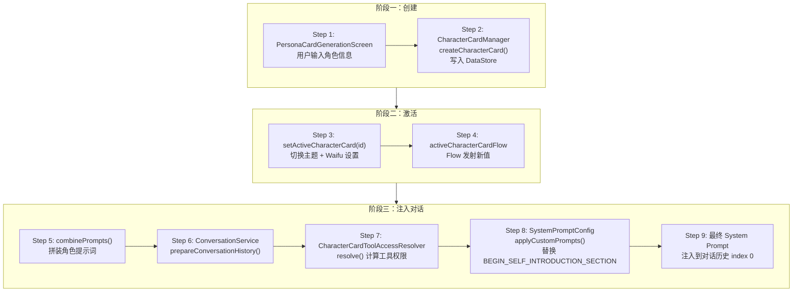

# Walkthrough: 人格卡片从创建到注入对话

> **场景：** 用户在人格卡片页面创建一个"代码助手"角色，设置系统提示词和工具权限。切换到这个角色后发送消息，AI 的行为和可用工具都受到角色卡的约束。从创建到生效，经过了哪些代码。
>
> **预计时间：** 25-35 分钟。

---

## 全链路总览



---

## 阶段一：创建角色卡

### Step 1: PersonaCardGenerationScreen — AI 辅助创建

```
📂 ui/features/settings/screens/PersonaCardGenerationScreen.kt L140
```

```kotlin
@Composable
fun PersonaCardGenerationScreen(
    onNavigateToSettings: () -> Unit = {},
    onNavigateToUserPreferences: () -> Unit = {},
    ...
)
```

这个页面有两种使用方式：
1. **手动编辑** — 用户直接填写角色设定、开场白等字段
2. **AI 辅助生成** — 用户描述想要的角色，AI 通过 `save_character_info` 工具自动填充字段

**AI 辅助生成的工具调用（L49-128）：**

```kotlin
object LocalCharacterToolExecutor {
    fun executeSaveCharacterInfo(tool: AITool, card: CharacterCard): CharacterCard {
        val field = tool.parameters.find { it.name == "field" }?.value
        val value = tool.parameters.find { it.name == "value" }?.value

        return when (field) {
            "name" -> card.copy(name = value)
            "characterSetting" -> card.copy(characterSetting = value)
            "openingStatement" -> card.copy(openingStatement = value)
            "otherContentChat" -> card.copy(otherContentChat = value)
            "advancedCustomPrompt" -> card.copy(advancedCustomPrompt = value)
            // ...
        }
    }
}
```

AI 每生成一个字段，就通过 `<tool name="save_character_info">` 标签输出，`processToolInvocations()`（L387）解析后自动更新对应字段。

### Step 2: 持久化到 DataStore

```
📂 data/preferences/CharacterCardManager.kt L227
```

```kotlin
suspend fun createCharacterCard(card: CharacterCard): String {
    val id = card.id.ifBlank { UUID.randomUUID().toString() }

    dataStore.edit { preferences ->
        // 添加到卡片列表
        val list = (preferences[CHARACTER_CARD_LIST] ?: emptySet()).toMutableSet()
        list.add(id)
        preferences[CHARACTER_CARD_LIST] = list

        // 写入各字段
        preferences[stringPreferencesKey("character_card_${id}_name")] = card.name
        preferences[stringPreferencesKey("character_card_${id}_character_setting")] = card.characterSetting
        preferences[stringPreferencesKey("character_card_${id}_opening_statement")] = card.openingStatement
        preferences[stringPreferencesKey("character_card_${id}_other_content_chat")] = card.otherContentChat
        preferences[stringPreferencesKey("character_card_${id}_advanced_custom_prompt")] = card.advancedCustomPrompt
        // ... 工具权限配置 JSON
        preferences[stringPreferencesKey("character_card_${id}_tool_access_config_json")] =
            Json.encodeToString(card.toolAccessConfig)
    }

    // 如果是默认卡或没有激活卡，自动激活
    if (card.isDefault || activeId == null) {
        setActiveCharacterCard(id)
    }

    return id
}
```

**CharacterCard 实体（`data/model/CharacterCard.kt` L42-70）：**

| 字段 | 作用 |
|------|------|
| `characterSetting` | 角色设定（核心系统提示词） |
| `openingStatement` | 开场白（首条消息） |
| `otherContentChat` | 对话模式补充指令 |
| `otherContentVoice` | 语音模式补充指令 |
| `advancedCustomPrompt` | 高级自定义指令 |
| `attachedTagIds` | 关联的 PromptTag ID 列表 |
| `toolAccessConfig` | 工具权限配置 |
| `chatModelBindingMode` | FOLLOW_GLOBAL 或 FIXED_CONFIG |

---

## 阶段二：激活角色卡

### Step 3: 切换活跃卡

```
📂 data/preferences/CharacterCardManager.kt L362
```

```kotlin
suspend fun setActiveCharacterCard(id: String) {
    dataStore.edit { preferences ->
        preferences[ACTIVE_CHARACTER_CARD_ID] = id
    }
    switchToCharacterCardTheme(id)        // 切换到角色卡专属主题色
    switchToCharacterCardWaifuSettings(id) // 切换到角色卡的 Waifu 设置
}
```

**每个角色卡可以有独立的主题色和看板娘设置。** 切换角色卡不只是换提示词，整个 App 的外观都可能跟着变。

### Step 4: Flow 发射新值

```
📂 data/preferences/CharacterCardManager.kt L89
```

```kotlin
val activeCharacterCardFlow: Flow<CharacterCard?> =
    dataStore.data.map { preferences ->
        val activeId = preferences[ACTIVE_CHARACTER_CARD_ID] ?: return@map null
        getCharacterCardFromPreferences(preferences, activeId)
    }
```

`ACTIVE_CHARACTER_CARD_ID` 变化 → `activeCharacterCardFlow` 发射新值 → 所有 `collectAsState` 的 UI 自动更新。

---

## 阶段三：注入到对话

### Step 5: combinePrompts — 拼装角色提示词

```
📂 data/preferences/CharacterCardManager.kt L381
```

```kotlin
suspend fun combinePrompts(
    characterCardId: String,
    additionalTagIds: List<String> = emptyList(),
    promptFunctionType: PromptFunctionType = PromptFunctionType.CHAT
): String {
    val card = getCharacterCard(characterCardId) ?: return ""

    val parts = mutableListOf<String>()

    // 1. 角色设定（核心）
    if (card.characterSetting.isNotBlank()) {
        parts.add(card.characterSetting)
    }

    // 2. 模式补充指令（对话/语音二选一）
    val modeContent = when (promptFunctionType) {
        PromptFunctionType.CHAT -> card.otherContentChat
        PromptFunctionType.VOICE -> card.otherContentVoice
        else -> card.otherContentChat
    }
    if (modeContent.isNotBlank()) parts.add(modeContent)

    // 3. 关联的 PromptTag 内容
    val tagIds = card.attachedTagIds + additionalTagIds
    tagIds.forEach { tagId ->
        val tag = getPromptTag(tagId)
        if (tag?.promptContent?.isNotBlank() == true) {
            parts.add(tag.promptContent)
        }
    }

    // 4. 高级自定义指令
    if (card.advancedCustomPrompt.isNotBlank()) {
        parts.add(card.advancedCustomPrompt)
    }

    return parts.joinToString("\n\n").trim()
}
```

**拼装顺序：** 角色设定 → 模式补充 → PromptTag → 高级指令。用 `"\n\n"` 分隔。

### Step 6-7: 准备对话历史 + 解析工具权限

```
📂 api/chat/enhance/ConversationService.kt L262, L341, L371
```

```kotlin
suspend fun prepareConversationHistory(..., roleCardId: String?, ...) {
    // L341: 获取角色卡并拼装提示词
    val activeCard = roleCardId?.let {
        characterCardManager.getCharacterCardFlow(it).first()
    }
    val introPrompt = activeCard?.let {
        characterCardManager.combinePrompts(it.id, promptFunctionType = promptFunctionType)
    }.orEmpty()

    // L371: 解析工具权限
    val roleCardToolAccess = characterCardToolAccessResolver.resolve(
        roleCardId = roleCardId,
        packageManager = packageManager,
        globalToolVisibility = toolPromptVisibility
    )

    // L378: 构建 System Prompt
    val systemPrompt = SystemPromptConfig.getSystemPromptWithCustomPrompts(
        customIntroPrompt = introPrompt,
        toolVisibility = roleCardToolAccess.effectiveBuiltinToolVisibility,
        allowedPackageNames = roleCardToolAccess.allowedPackageNames,
        ...
    )
}
```

### CharacterCardToolAccessResolver — 权限交叉

```
📂 data/preferences/CharacterCardToolAccessResolver.kt L56
```

```kotlin
suspend fun resolve(
    roleCardId: String?,
    packageManager: PackageManager,
    globalToolVisibility: Map<String, Boolean>?
): ResolvedCharacterCardToolAccess {
    // 无角色卡 → 使用全局权限
    if (roleCardId.isNullOrBlank()) {
        return ResolvedCharacterCardToolAccess(customEnabled = false, ...)
    }

    val config = getCardToolAccessConfig(roleCardId)

    // 角色卡未启用自定义权限 → 使用全局权限
    if (!config.enabled) {
        return ResolvedCharacterCardToolAccess(customEnabled = false, ...)
    }

    // 启用了自定义权限 → 交叉：角色卡白名单 ∩ 全局可见性
    val effectiveVisibility = config.allowedBuiltinTools
        .filter { globalVisibility[it] == true }
        .associateWith { true }

    return ResolvedCharacterCardToolAccess(
        customEnabled = true,
        effectiveBuiltinToolVisibility = effectiveVisibility,
        allowedPackageNames = config.allowedPackages.toSet(),
        allowedSkillNames = config.allowedSkills.toSet(),
        allowedMcpServerNames = config.allowedMcpServers.toSet()
    )
}
```

**权限交叉逻辑：** 角色卡的白名单 ∩ 全局可见性。比如全局关闭了 `shell_command`，即使角色卡白名单里有它，最终也不可用。

### Step 8: 替换 System Prompt 占位符

```
📂 core/config/SystemPromptConfig.kt L305
```

```kotlin
fun applyCustomPrompts(systemPrompt: String, customIntroPrompt: String): String {
    var result = systemPrompt
    if (customIntroPrompt.isNotEmpty()) {
        result = result.replace("BEGIN_SELF_INTRODUCTION_SECTION", customIntroPrompt)
    }
    return result
}
```

System Prompt 模板中有一个 `BEGIN_SELF_INTRODUCTION_SECTION` 占位符。`applyCustomPrompts` 把它替换为角色卡的拼装结果。

### Step 9: 注入到对话历史

最终的 System Prompt 作为 `PromptTurn(kind = SYSTEM)` 插入到对话历史的 index 0 位置，发送给 LLM。

---

## 完整调用链回顾

```
创建阶段:
PersonaCardGenerationScreen                            [L140]
  → AI 辅助: save_character_info 工具                   [L49]
  → CharacterCardManager.createCharacterCard()          [L227]
    → DataStore.edit { 写入所有字段 }

激活阶段:
setActiveCharacterCard(id)                              [L362]
  → DataStore ACTIVE_CHARACTER_CARD_ID = id
  → switchToCharacterCardTheme()
  → activeCharacterCardFlow 发射新值                     [L89]

注入阶段:
ConversationService.prepareConversationHistory()         [L262]
  → combinePrompts(cardId, promptFunctionType)           [L381]
    → characterSetting + otherContent + tags + advanced
  → CharacterCardToolAccessResolver.resolve()            [L56]
    → 角色卡白名单 ∩ 全局可见性
  → SystemPromptConfig.applyCustomPrompts()              [L305]
    → 替换 BEGIN_SELF_INTRODUCTION_SECTION
  → PromptTurn(SYSTEM) 插入 index 0

涉及文件:
1. ui/features/settings/screens/PersonaCardGenerationScreen.kt — 创建 UI
2. data/model/CharacterCard.kt                                  — 数据模型
3. data/preferences/CharacterCardManager.kt                     — CRUD + 提示词拼装
4. data/preferences/CharacterCardToolAccessResolver.kt          — 工具权限交叉
5. api/chat/enhance/ConversationService.kt                      — 对话历史准备
6. core/config/SystemPromptConfig.kt                            — System Prompt 模板
```

---

## 动手练习

### 练习 1: 追踪提示词拼装

在 `CharacterCardManager.kt:381`（`combinePrompts`）加断点。激活一个角色卡后发送消息，观察 `parts` 列表的内容和最终拼装结果。

### 练习 2: 观察工具权限过滤

在 `CharacterCardToolAccessResolver.kt:91` 加断点。创建一个限制工具的角色卡（只允许 `read_file` 和 `list_files`），观察 `effectiveVisibility` 的内容。

### 练习 3: 导入 SillyTavern 角色卡

找一个 SillyTavern v2 格式的角色卡 JSON。在 `CharacterCardManager.kt:751`（`createCharacterCardFromTavernJson`）加断点，观察字段映射过程。

---

## 关联文档

| 文档 | 关系 |
|------|------|
| `chat-message-flow.md` | System Prompt 注入在 Step 8 |
| `tool-execution.md` | 工具权限在 Stage 1（角色卡权限过滤）生效 |
| `theme-settings.md` | 角色卡可以关联独立主题 |
