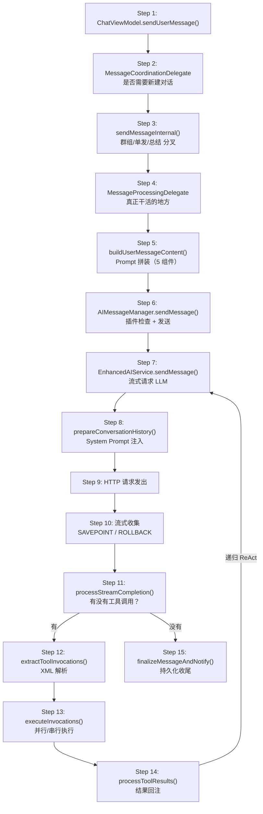

# Walkthrough: 发送一条消息到 AI 回复出现

> **场景：** 用户在聊天界面输入"帮我查看 /sdcard 下的文件"，点击发送按钮。AI 调用 `list_files` 工具，获取结果后给出最终回复。
>
> **阅读方式：** 左边打开这篇文档，右边打开 Android Studio。每一步都标注了文件路径和行号，跟着跳转。
>
> **预计时间：** 40-60 分钟（包括在 IDE 里跳转和阅读源码的时间）。

---

## 全链路总览



---

## Step 1: UI 入口 — ChatViewModel

```
📂 ui/features/chat/viewmodel/ChatViewModel.kt L1208
```

```kotlin
fun sendUserMessage(promptFunctionType: PromptFunctionType = PromptFunctionType.CHAT) {
    messageCoordinationDelegate.sendUserMessage(promptFunctionType)
}
```

整个方法就一行。`ChatViewModel` 是一个**薄壳**——所有聊天相关方法都是一行转发，零业务逻辑。

**为什么这么设计？** 因为聊天运行时不活在 ViewModel 里。它活在 `ChatServiceCore` 中，由 `AIForegroundService` 持有。用户切到别的 App 再切回来，Activity 可能已经被销毁重建，但对话仍在继续——因为 Service 不受 Activity 生命周期影响。ViewModel 只是把 UI 事件转发给 Service 侧的委托。

**验证方式：** 在这一行加断点，发送一条消息，确认断点命中后 F7 Step Into 进入委托。

> **→ 下一步：跳到 `services/core/MessageCoordinationDelegate.kt` L244**

---

## Step 2: 协调入口 — 是否需要新建对话

```
📂 services/core/MessageCoordinationDelegate.kt L244-303
```

```kotlin
fun sendUserMessage(
    promptFunctionType: PromptFunctionType = PromptFunctionType.CHAT,
    roleCardIdOverride: String? = null,
    chatIdOverride: String? = null,
    messageTextOverride: String? = null,
    proxySenderNameOverride: String? = null,
    chatModelConfigIdOverride: String? = null,
    chatModelIndexOverride: Int? = null
) {
    // L260-270: 如果没有活跃对话，先创建一个
    if (chatIdOverride.isNullOrBlank() && currentChatId == null) {
        scope.launch {
            chatHistoryDelegate.createNewChat()
            // 轮询最多 10 次（每次 100ms）等待 chatId 出现
            repeat(10) {
                if (currentChatId != null) return@repeat
                delay(100)
            }
            sendMessageInternal(promptFunctionType, ...)
        }
        return
    }
    // L295: 已有对话，直接进入内部发送
    sendMessageInternal(promptFunctionType, ...)
}
```

这一步做了一个简单判断：有没有活跃的对话 ID？没有就先创建对话，然后等 ID 出现。

**注意轮询等待的设计**：`createNewChat()` 是异步的（写数据库 → 触发 Flow 更新 → `currentChatId` 被赋值），所以这里用 `repeat(10) + delay(100)` 轮询。最多等 1 秒。

> **→ 下一步：跟进 `sendMessageInternal()`，同一个文件 L308**

---

## Step 3: 核心分叉 — 群组？总结？直发？

```
📂 services/core/MessageCoordinationDelegate.kt L308-511
```

这是整个协调层最关键的方法，有 200 行。但只有 3 个分叉需要关注：

### 分叉 1: 群组编排（L340-379）

```kotlin
// L340
if (enableGroupOrchestration && shouldRunGroupOrchestration(...)) {
    scope.launch {
        val handled = orchestrateGroupConversation(chatId, ...)
        if (!handled) {
            // 编排失败，退回单发
            sendMessageInternal(..., enableGroupOrchestration = false)
        }
    }
    return
}
```

如果当前聊天绑定了"角色组"（多个 AI 角色轮流回复），走群组编排。`orchestrateGroupConversation()` 在 L534-760，它会：
1. 调用规划模型（L633）决定哪些角色以什么顺序发言
2. 按顺序对每个角色递归调用 `sendMessageInternal()`（L708）

**我们的场景是普通单发，跳过这个分叉。**

### 分叉 2: 异步总结（L427-459）

```kotlin
// L432
val isShouldGenerateSummary = AIMessageManager.shouldGenerateSummary(
    messages = currentMessages,
    currentTokens = currentTokens,
    maxTokens = maxTokens,
    tokenUsageThreshold = tokenUsageThresholdForSend,
    enableSummary = apiConfigDelegate.enableSummary.value,
    ...
)

if (isShouldGenerateSummary) {
    // L447: 异步启动总结，不阻塞当前发送
    launchAsyncSummaryForSend(chatId, ...)
    tokenUsageThresholdForSend += 0.5  // 提高阈值，避免频繁触发
}
```

当 Token 用量超过阈值（默认 70%），异步启动历史消息总结（把长历史压缩成摘要）。**注意是异步的**——总结在后台跑，用户的消息立即发出，不等待。

### 分叉 3: 直接发送（L476-501）

```kotlin
// L476
messageProcessingDelegate.sendUserMessage(
    attachments = attachments,
    chatId = chatId,
    messageTextOverride = messageTextOverride,
    promptFunctionType = promptFunctionType,
    roleCardId = effectiveRoleCardId,
    enableThinking = enableThinking,
    maxTokens = maxTokens,
    ...
)
```

**我们的场景走这里。** 所有参数打包后传给 `MessageProcessingDelegate`。

> **→ 下一步：跳到 `services/core/MessageProcessingDelegate.kt` L388**

---

## Step 4: 真正干活 — 消息处理委托

```
📂 services/core/MessageProcessingDelegate.kt L388-1124
```

这个方法有 700+ 行，是整个链路最长的方法。它做了 8 件事，我们逐段看。

### 4.1 前置校验 + 状态切换（L412-436）

```kotlin
// L413: 消息不能为空
val currentText = messageTextOverride ?: inputText.value
if (currentText.isBlank() && attachments.isEmpty()) return

// L420: 防止重复发送
if (_isLoading.value) return

// L428: 清空输入框
_inputText.value = ""

// L432: 设置加载状态
_isLoading.value = true
```

### 4.2 启动 IO 协程（L441-442）

```kotlin
sendJob = scope.launch(Dispatchers.IO) {
    // 后续所有工作都在 IO 线程
```

**从这里开始，所有操作都在后台线程。** UI 线程被释放，用户可以继续滑动界面。

### 4.3 构建用户消息内容（L474-488）

```kotlin
val messageContent = AIMessageManager.buildUserMessageContent(
    messageText = currentText,
    proxySenderName = proxySenderNameOverride,
    attachments = attachments,
    enableMemoryQuery = enableMemoryQuery,
    workspacePath = workspacePath,
    replyToMessage = replyToMessage,
    chatId = chatId,
    ...
)
```

**这里调用了 Prompt 拼装——Step 5 的内容。** 我们先跟完这个方法的主干，再回来看 Prompt 怎么拼的。

### 4.4 用户消息写入数据库（L497-554）

```kotlin
// L540: 构建 ChatMessage 对象
val userMessage = ChatMessage(
    chatId = chatId,
    content = messageContent,
    isFromUser = true,
    ...
)

// L547: 写入数据库
addMessageToChat(chatId, userMessage)
```

**用户消息在发给 AI 之前就已经持久化了。** 这样即使后续 AI 请求失败，用户的输入也不会丢。

### 4.5 发送给 AI（L707-742）

```kotlin
// L707
val responseStream = AIMessageManager.sendMessage(
    enhancedAiService = service,
    chatId = chatId,
    messageContent = messageContent,
    chatHistory = currentMessages,
    promptFunctionType = promptFunctionType,
    enableThinking = enableThinking,
    maxTokens = maxTokens,
    ...
)
```

**这是调用链往下走的关键跳转点——Step 6。** 返回的是一个 `SharedStream<String>`，流式输出 AI 回复的每一个字符片段。

### 4.6 创建 AI 消息 + 开始流式收集（L793-964）

```kotlin
// L793: 创建 AI 消息对象（此时 content 为空，contentStream 指向活的流）
val aiMessage = ChatMessage(
    chatId = chatId,
    content = "",
    isFromUser = false,
    contentStream = sharedCharStream,  // ← 活的流
    ...
)

// L816: AI 消息写入数据库（带 contentStream，UI 直接从流渲染）
addMessageToChat(chatId, aiMessage)

// L823: 启动流收集协程
streamCollectionJob = scope.launch {
    var lastStreamingPersistAt = 0L

    sharedCharStream.collect { chunk ->
        // L940: 每收到一个 chunk，尝试快照持久化
        persistStreamingSnapshot(contentSnapshot, force = false)
    }
}
```

**关键设计：** `aiMessage.contentStream` 是一个活的流。Compose UI 侧通过 `rememberRevisableTextStream` 订阅这个流，实现逐字渲染的"打字机效果"。同时每 1000ms 持久化一次快照到数据库，防止崩溃丢失内容。

### 4.7 流式快照持久化（L870-882）

```kotlin
suspend fun persistStreamingSnapshot(contentSnapshot: String, force: Boolean = false) {
    if (isWaifuModeEnabled || chatId == null) return
    val now = messageTimingNow()
    // 节流：距上次不到 1000ms → 跳过
    if (!force && now - lastStreamingPersistAt < STREAM_PERSIST_INTERVAL_MS) return

    // 覆盖写入（REPLACE 策略）
    addMessageToChat(chatId, aiMessage.copy(content = contentSnapshot))
    lastStreamingPersistAt = now
}
```

`STREAM_PERSIST_INTERVAL_MS = 1000`（L73 定义）。1 秒写一次数据库，平衡 I/O 开销和崩溃恢复的数据损失。

### 4.8 最终收尾（L1052-1121，finally 块）

```kotlin
finally {
    // L1055: 最终持久化
    finalizeMessageAndNotify(chatId, ...)

    // L1100: 重置加载状态
    _isLoading.value = false
}
```

**`finalizeMessageAndNotify` 是 Step 15。** 我们先继续往调用链深处走，最后再回来看它。

> **→ 下一步：回到 4.3 的 `buildUserMessageContent`，跳到 `core/chat/AIMessageManager.kt` L117**

---

## Step 5: Prompt 拼装 — 用户消息不只是用户打的字

```
📂 core/chat/AIMessageManager.kt L117-278
```

用户输入"帮我查看 /sdcard 下的文件"，但 AI 实际收到的可能是这样的：

```
<proxy_sender name="技术专家"/>
帮我查看 /sdcard 下的文件
<workspace_attachment>project/src/Main.kt (2.3KB)</workspace_attachment>
<reply_to sender="小明" timestamp="1715500000">先看看目录结构</reply_to>
```

拼装过程在 `buildUserMessageContent` 里：

### 5.1 输入预处理（L133-138）

```kotlin
val processedMessageText = InputProcessor.processUserInput(messageText, chatId)
```

`InputProcessor` 做特殊字符转义等预处理。

### 5.2 代理发送者标签（L139-147）

```kotlin
val proxySenderTag = if (!proxySenderName.isNullOrBlank()
    && !processedMessageText.contains("<proxy_sender")) {
    "<proxy_sender name=\"${safeProxySenderName}\"/>"
} else ""
```

群组编排模式下，标识这条消息的"代理发送者"（比如让 AI 知道"这是以产品经理身份说的"）。

### 5.3 引用消息标签（L151-165）

```kotlin
val replyTag = if (replyToMessage != null) {
    val cleanContent = replyToMessage.content
        .replace(Regex("<[^>]+>"), "")  // 去掉所有 XML 标签
        .take(100)                        // 截取前 100 字符
    "<reply_to sender=\"$roleName\" timestamp=\"$ts\">\"$cleanContent\"</reply_to>"
} else ""
```

### 5.4 工作区附件（L169-186）

```kotlin
val workspaceTag = if (enableWorkspaceAttachment && !workspacePath.isNullOrBlank()) {
    val content = WorkspaceAttachmentProcessor.generateWorkspaceAttachment(workspacePath, ...)
    "<workspace_attachment>$content</workspace_attachment>"
} else ""
```

### 5.5 最终拼接（L269-271）

```kotlin
val finalMessageContent = listOf(
    proxySenderTag,         // 1. 代理发送者
    processedMessageText,   // 2. 用户输入
    attachmentTags,         // 3. 文件/图片附件
    workspaceTag,           // 4. 工作区文件列表
    replyTag                // 5. 引用的历史消息
).filter { it.isNotBlank() }
 .joinToString(" ")
```

**5 个部分，空的过滤掉，用空格拼在一起。** 对于我们的简单场景（没有附件、没有工作区、没有引用），最终就是 `"帮我查看 /sdcard 下的文件"`。

> **→ 下一步：跳到同文件的 `sendMessage` 方法，L301**

---

## Step 6: 插件检查 + 发送

```
📂 core/chat/AIMessageManager.kt L301-476
```

### 6.1 构建对话历史（L333-343）

```kotlin
val memory = getMemoryFromMessages(chatHistory, splitByRole, currentRoleName, groupOrchestrationMode)
```

把 `ChatMessage` 列表转换成 `PromptTurn` 列表（AI 能理解的格式）。

### 6.2 媒体链接限制（L354-381）

```kotlin
val limitedHistory = limitImageLinksInChatHistory(memory, maxImageHistoryUserTurns)
val memoryForRequest = limitMediaLinksInChatHistory(limitedHistory, maxMediaHistoryUserTurns)
```

历史消息中的图片/音视频链接太多会爆 Token。这里按配置限制只保留最近 N 轮的媒体内容。

### 6.3 插件拦截检查（L383-420）

```kotlin
val matchedPlugin = MessageProcessingPluginRegistry.createExecutionIfMatched(
    messageContent, chatHistory, promptFunctionType
)
if (matchedPlugin != null) {
    // 插件接管，返回插件的流
    return matchedPlugin.execute().shareRevisable(scope)
}
```

**这是一个拦截点。** 如果有注册的消息处理插件匹配了当前消息（比如某个插件处理特定前缀的命令），插件会接管整个响应流程，不会走到 AI。我们的场景不会被拦截。

### 6.4 调用 EnhancedAIService（L434-463）

```kotlin
val responseStream = enhancedAiService.sendMessage(
    message = messageContent,
    chatHistory = memoryForRequest,
    functionType = FunctionType.CHAT,
    promptFunctionType = promptFunctionType,
    enableThinking = enableThinking,
    maxTokens = maxTokens,
    stream = enableStream,
    ...
)
```

**关键跳转：进入 AI 服务层。** 从这里开始是真正和 LLM 打交道的部分。

> **→ 下一步：跳到 `api/chat/EnhancedAIService.kt` L730**

---

## Step 7: 流式请求 LLM

```
📂 api/chat/EnhancedAIService.kt L730-1107
```

这是一个 400 行的大方法。核心流程：

### 7.1 创建流式通道（L766）

```kotlin
val eventChannel = MutableSharedStream<TextStreamEvent>(replay = Int.MAX_VALUE)
```

`MutableSharedStream` 是自研的热流实现（不是 Kotlin Flow）。`replay = Int.MAX_VALUE` 意味着所有事件都会被缓存，晚加入的订阅者也能收到完整历史。

### 7.2 构建执行上下文（L768-773）

```kotlin
val context = MessageExecutionContext(
    streamBuffer = StringBuilder(),
    roundManager = ...,
    conversationHistory = mutableListOf(),
    eventChannel = eventChannel,
    isConversationActive = true
)
```

`streamBuffer` 累积 AI 输出的全文。`conversationHistory` 存放本轮对话（包括工具调用/结果，用于 ReAct 循环中的多轮请求）。

### 7.3 准备对话历史（L794-813）

```kotlin
val preparedHistory = prepareConversationHistory(
    chatHistory = chatHistory,
    processedInput = message,
    workspacePath = workspacePath,
    promptFunctionType = promptFunctionType,
    enableMemoryQuery = enableMemoryQuery,
    roleCardId = roleCardId,
    ...
)
context.conversationHistory.addAll(preparedHistory)
```

**这里构建 System Prompt 并注入到对话历史最前面——Step 8。** 先继续看主干。

### 7.4 获取 AI 服务实例（L838-842）

```kotlin
val serviceForFunction = getAIServiceForFunction(functionType, configOverride, indexOverride)
```

**Provider 路由发生在这里。** `getAIServiceForFunction` 内部（L454-469）：

```kotlin
suspend fun getAIServiceForFunction(...): AIService {
    return if (functionType == FunctionType.CHAT && overrideConfigId != null) {
        multiServiceManager.getServiceForConfig(configId, modelIndex)
    } else {
        multiServiceManager.getServiceForFunction(functionType)
    }
}
```

根据 `functionType`（CHAT/SUMMARY/PLANNER 等）选择对应的 AI 服务商。如果角色卡绑定了特定模型配置，用绑定的。

### 7.5 发起 HTTP 请求（L917-929）

```kotlin
val responseStream = serviceForFunction.sendMessage(
    message = ...,
    conversationHistory = context.conversationHistory,
    systemPrompt = systemPrompt,
    tools = availableTools,
    stream = stream,
    ...
)
```

**网络请求在这里发出。** `serviceForFunction` 是一个具体的 Provider 实现（OpenAIProvider/ClaudeProvider/GeminiProvider/...），它会构造 HTTP 请求发给 LLM API。返回的 `responseStream` 是一个 `Stream<String>`，每个元素是 AI 回复的一个 token 片段。

> **→ 下一步：先看 Step 8（System Prompt 注入），再回来看 Step 10（流式收集）**

---

## Step 8: System Prompt 注入

```
📂 api/chat/enhance/ConversationService.kt L262-480
```

`prepareConversationHistory` 负责在对话历史的最前面插入 System Prompt。System Prompt 决定了 AI "是谁"、"能做什么"。

### 8.1 角色卡提示词（L341-350）

```kotlin
val activeCard = effectiveRoleCardId?.let {
    characterCardManager.getCharacterCardFlow(it).first()
}
val introPrompt = activeCard?.let {
    characterCardManager.combinePrompts(it.id, promptFunctionType)
}.orEmpty()
```

从角色卡读取自定义提示词（"你是一个专业的技术助手..."）。

### 8.2 核心 System Prompt 组装（L378-409）

```kotlin
val systemPrompt = SystemPromptConfig.getSystemPromptWithCustomPrompts(
    context, packageManager, workspacePath, workspaceEnv, safBookmarkNames,
    customIntroPrompt = introPrompt,
    enableTools = enableTools,
    enableMemoryQuery = enableMemoryQuery,
    toolVisibility = roleCardToolAccess.effectiveBuiltinToolVisibility,
    ...
)
```

**`SystemPromptConfig.getSystemPromptWithCustomPrompts` 是 System Prompt 的核心构建器。** 它把工具 Schema（40+ 个工具的名称、参数、描述）、角色设定、记忆查询提示、工作区信息等全部拼接成一个大文本。

### 8.3 最终 System Prompt 拼接（L423-431）

```kotlin
val finalSystemPrompt = buildString {
    append(avatarMoodRulesText)    // 1. 语音头像情绪标签协议（如果启用）
    append(systemPrompt)           // 2. 核心系统提示词（含工具 Schema）
    append(waifuRulesText)         // 3. Waifu 模式规则（如果启用）
    if (!disableUserPreferenceDescription && preferencesText.isNotEmpty()) {
        append("\n\nUser preference description: ")
        append(preferencesText)    // 4. 用户偏好描述
    }
}
```

4 层拼接，顺序固定。最终可能是 3000-8000 字符的大文本。

### 8.4 插入对话历史头部（L439-445）

```kotlin
preparedHistory.add(0, PromptTurn(
    kind = PromptTurnKind.SYSTEM,
    content = finalSystemPromptWithReplacements
))
```

**System Prompt 作为第一条 SYSTEM 消息，插入到对话历史的最前面。** 后面的用户消息和 AI 回复都排在它后面。

> **→ 下一步：回到 EnhancedAIService.sendMessage，看流式收集。同文件 L946**

---

## Step 9: HTTP 请求发出

```
📂 api/chat/EnhancedAIService.kt L917-929
```

```kotlin
val responseStream = serviceForFunction.sendMessage(
    message = processedInput,
    conversationHistory = context.conversationHistory,
    systemPrompt = systemPrompt,
    tools = availableTools,
    stream = stream,
    ...
)
```

`serviceForFunction` 是一个 `AIService` 接口的实现。以 `OpenAIProvider` 为例，它会：
1. 把 `conversationHistory` 转成 OpenAI API 的 `messages` 数组格式
2. 把 `tools` 转成 `functions` 或 `tools` 参数
3. 构造 HTTP POST 请求发给 `https://api.openai.com/v1/chat/completions`
4. 设置 `stream: true`，返回 SSE 流

**从这里开始，网络请求已经发出，等待 AI 逐 token 返回。**

> **→ 下一步：看流式收集循环，同文件 L946-1017**

---

## Step 10: 流式收集 + SAVEPOINT/ROLLBACK

```
📂 api/chat/EnhancedAIService.kt L946-1017
```

两个并发任务同时运行：

### 10.1 Revision 监听（L947-970）

```kotlin
val revisionJob = launch {
    carrier?.eventChannel?.collect { event ->
        when (event.type) {
            TextStreamEventType.SAVEPOINT -> {
                context.streamBuffer.savepoint(event.id)
            }
            TextStreamEventType.ROLLBACK -> {
                val snapshot = context.streamBuffer.rollback(event.id)
                if (snapshot != null) {
                    eventChannel.emit(TextStreamEvent(ROLLBACK, event.id))
                }
            }
        }
    }
}
```

某些 AI（如 Gemini 思考模式）会在输出过程中修正已发内容。`SAVEPOINT` 记录当前内容快照，`ROLLBACK` 回退到快照。用户看到的效果是"文字消失，重新开始打字"。

### 10.2 主收集循环（L972-1016）

```kotlin
responseStream.collect { content ->
    if (content.isNotEmpty()) {
        context.streamBuffer.append(content)
        context.roundManager.appendToCurrentRound(content)
        collector.emit(content)  // → 传给上层，最终驱动 UI 渲染
    }
}
```

每收到一个 token 片段：
1. 追加到 `streamBuffer`（累积全文）
2. 追加到 `roundManager`（当前轮次的文本）
3. `emit(content)` — 传给上层的 `SharedStream`，Compose UI 订阅这个流实现逐字渲染

**这就是"打字机效果"的来源。** 每个 `emit` 都会触发 UI 重组，显示新到达的文字。

> **→ 下一步：流收集结束后，进入 `processStreamCompletion`。同文件 L1067 finally 块 → L1491**

---

## Step 11: 流结束 — 有没有工具调用？

```
📂 api/chat/EnhancedAIService.kt L1491-1789
```

AI 的流式输出结束了。现在要检查输出中是否包含工具调用。

### 11.1 读取完整输出（L1520）

```kotlin
val content = context.streamBuffer.toString().trim()
```

把累积的 `streamBuffer` 转成完整字符串。

### 11.2 增强工具检测 + 修复截断（L1589-1605）

```kotlin
val enhancedContent = enhanceToolDetection(content)
val (repairedContent, wasTruncated) = detectAndRepairTruncatedToolRound(enhancedContent)
```

AI 有时候输出的工具调用 XML 不完整（比如被 token 限制截断了）。这里尝试修复。

### 11.3 提取工具调用（L1607-1614）

```kotlin
val extractedToolInvocations = ToolExecutionManager.extractToolInvocations(finalContent)
val hasTaskCompletion = ConversationMarkupManager.containsTaskCompletion(finalContent)
```

**关键跳转：`extractToolInvocations` 解析 XML — Step 12。**

### 11.4 决定下一步（L1694-1777）

```kotlin
if (extractedToolInvocations.isNotEmpty()) {
    // L1694: 有工具调用 → 执行工具
    handleToolInvocation(extractedToolInvocations, context, ...)
} else {
    // L1764: 没有工具调用 → 对话结束，等待用户下一条消息
    handleWaitForUserNeed(context, ...)
}
```

**我们的场景：** AI 输出了 `<tool_call name="list_files"><path>/sdcard</path></tool_call>`，所以 `extractedToolInvocations` 非空，走工具调用分支。

> **→ 下一步：跳到 `api/chat/enhance/ToolExecutionManager.kt` L156**

---

## Step 12: XML 解析 — 从文本中提取工具调用

```
📂 api/chat/enhance/ToolExecutionManager.kt L156-200
```

```kotlin
suspend fun extractToolInvocations(response: String): List<ToolInvocation> {
    val invocations = mutableListOf<ToolInvocation>()

    // L163: 流式 XML 解析
    charStream.splitBy(plugins).collect { chunk ->
        // L171: 正则匹配 <tool_call name="...">...</tool_call>
        ChatMarkupRegex.toolCallPattern.findAll(chunkString).forEach { match ->
            val toolName = match.groupValues[2]   // "list_files"
            val toolBody = match.groupValues[3]   // "<path>/sdcard</path>"

            // L176: 提取参数
            val params = MessageContentParser.toolParamPattern.findAll(toolBody).map { paramMatch ->
                val paramName = paramMatch.groupValues[1]    // "path"
                val paramValue = unescapeXml(paramMatch.groupValues[2])  // "/sdcard"
                ToolParameter(name = paramName, value = paramValue)
            }

            invocations.add(ToolInvocation(
                tool = AITool(name = toolName, parameters = params.toList()),
                rawText = match.value,
                responseLocation = ...
            ))
        }
    }
    return invocations
}
```

**AI 的工具调用是文本级的 XML 标签，不是函数调用。** 这个方法用正则解析 AI 输出中的 `<tool_call>` 标签，提取工具名和参数。

对于我们的场景，解析结果：
```
ToolInvocation(
    tool = AITool(name="list_files", parameters=[ToolParameter(name="path", value="/sdcard")])
)
```

> **→ 下一步：工具调用被提取出来后，跳到 `executeInvocations`。同文件 L331**

---

## Step 13: 执行工具 — 并行还是串行？

```
📂 api/chat/enhance/ToolExecutionManager.kt L331-475
```

### 13.1 角色卡权限过滤（L359-380）

```kotlin
// 检查角色卡是否禁止了某些工具
invocations.forEach { inv ->
    if (roleCardDeniesAccess(inv.tool.name)) {
        roleCardDeniedResults.add(buildRoleCardDeniedResult(inv))
    }
}
```

角色卡可以限制 AI 不能调用某些危险工具（比如 shell_command）。

### 13.2 用户权限检查（L383-398）

```kotlin
val permission = checkToolPermission(inv.tool.name)
if (permission == FORBID) {
    permissionDeniedResults.add(ToolResult(error = "User cancelled the tool execution."))
}
```

三层权限：角色卡 > 工具级覆盖 > 全局开关。如果全局设为 ASK，会弹窗询问用户。

### 13.3 并行/串行分组（L439-448）

```kotlin
val parallelizableToolNames = setOf(
    "list_files", "read_file", "read_file_part", "read_file_full", "file_exists",
    "find_files", "file_info", "grep_code", "calculate", "ffmpeg_info",
    "visit_web", "download_file"
)

val (parallelInvocations, serialInvocations) = injectedInvocations.partition {
    parallelizableToolNames.contains(it.tool.name)
}
```

**12 个只读工具可以并行执行。** 其他工具（shell_command、write_file、delete_file 等）串行执行，保证顺序。

`list_files` 在并行列表里。

### 13.4 执行（L450-468）

```kotlin
// 并行：每个工具一个 async 协程
val parallelJobs = parallelInvocations.map { inv ->
    async { executeAndEmitTool(inv, ...) }
}

// 串行：按顺序执行
for (inv in serialInvocations) {
    executeAndEmitTool(inv, ...)
}

// 等待并行任务完成
parallelJobs.awaitAll()
```

`executeAndEmitTool` 内部会通过 `ToolGetter` 根据权限级别选择实现（Standard/Admin/Root），然后调用具体的工具执行器。

**对于 `list_files`：** `ToolGetter.getFileSystemTools()` → `StandardFileSystemTools` → `listFiles()` → `File("/sdcard").listFiles()` → 返回文件列表。

> **→ 下一步：工具执行完毕，结果回注给 AI。跳到 `processToolResults`，`EnhancedAIService.kt` L1971**

---

## Step 14: 工具结果回注 — ReAct 循环

```
📂 api/chat/EnhancedAIService.kt L1971-2270
```

工具执行完毕，结果要注入回对话历史，然后**再次请求 AI**，让 AI 根据工具结果继续回答。

### 14.1 格式化工具结果（L1996-1998）

```kotlin
val formattedResults = results.joinToString("\n") {
    ConversationMarkupManager.formatToolResultForMessage(it)
}
```

工具结果被格式化成文本。比如 `list_files` 的结果可能是：

```
<tool_result name="list_files" success="true">
Documents/
Downloads/
DCIM/
Pictures/
...
</tool_result>
```

### 14.2 添加到对话历史（L2025-2036）

```kotlin
context.conversationHistory.add(PromptTurn(
    kind = PromptTurnKind.TOOL_RESULT,
    content = formattedResults
))
```

### 14.3 Token 超限检查（L2088-2101）

```kotlin
if (estimatedTokens > maxTokens * tokenUsageThreshold) {
    onTokenLimitExceeded?.invoke()
    return
}
```

如果加上工具结果后 Token 超限了，触发总结。

### 14.4 再次请求 AI（L2112-2123）

```kotlin
val responseStream = serviceForFunction.sendMessage(
    conversationHistory = context.conversationHistory,  // 现在包含工具结果
    ...
)
```

**关键：这里又发了一次 HTTP 请求给 AI。** 对话历史现在包含了：
1. System Prompt
2. 用户消息："帮我查看 /sdcard 下的文件"
3. AI 第一轮输出（包含 `<tool_call>`）
4. 工具结果（`<tool_result>`）

AI 看到工具结果后，会生成最终回复。

### 14.5 再次流式收集（L2142-2206）

和 Step 10 一样的流式收集循环——收到 token 就 emit 给上层。

### 14.6 递归检查（L2232-2252）

```kotlin
processStreamCompletion(context, ...)  // 递归回到 Step 11
```

**流结束后，又回到 Step 11 的 `processStreamCompletion`。** 如果 AI 又输出了工具调用，继续执行；如果没有，循环结束。

**这就是 ReAct 循环：** `sendMessage → 流收集 → processStreamCompletion → extractToolInvocations → executeInvocations → processToolResults → sendMessage → ...`，直到 AI 不再调用工具。

> **→ 下一步：AI 的最终回复流结束，回到 Step 4 的 finally 块。跳到 `MessageProcessingDelegate.kt` L1145**

---

## Step 15: 最终持久化 — 消息落盘

```
📂 services/core/MessageProcessingDelegate.kt L1145-1325
```

```kotlin
private suspend fun finalizeMessageAndNotify(...): Boolean {
    // L1160: 从流的 replay cache 解析最终内容
    val finalContent = resolveFinalContent(aiMessage)
    aiMessage.content = finalContent

    // L1289-1302: 普通模式 — 最终写入数据库
    val finalMessage = aiMessage.copy(contentStream = null)  // 清掉活的流引用
    addMessageToChat(chatId, finalMessage)                    // REPLACE 策略覆盖之前的快照
}
```

**关键：** `contentStream = null`。之前快照持久化时 `aiMessage` 还带着活的流引用。最终持久化时把流清掉，只保留纯文本内容。这条消息从此变成了数据库中的静态记录。

至此，一条消息从用户输入到 AI 回复，完整链路走完。

---

## 完整调用链回顾

```
用户点击发送
│
├─ Step 1:  ChatViewModel.sendUserMessage()           [L1208] 一行转发
├─ Step 2:  MessageCoordinationDelegate.sendUserMessage()  [L244] 检查/创建对话
├─ Step 3:  sendMessageInternal()                      [L308] 群组/总结/直发分叉
├─ Step 4:  MessageProcessingDelegate.sendUserMessage() [L388] 主干逻辑
│   ├─ Step 5:  AIMessageManager.buildUserMessageContent() [L117] 拼装5要素
│   ├─ 用户消息写入数据库                                  [L547]
│   ├─ Step 6:  AIMessageManager.sendMessage()          [L301] 插件检查
│   │   └─ Step 7:  EnhancedAIService.sendMessage()     [L730] 流式请求
│   │       ├─ Step 8:  prepareConversationHistory()     [L262] System Prompt
│   │       ├─ Step 9:  serviceForFunction.sendMessage() [L917] HTTP 请求
│   │       ├─ Step 10: 流式收集 + emit                  [L972] 打字机效果
│   │       └─ Step 11: processStreamCompletion()        [L1491] 工具检测
│   │           ├─ Step 12: extractToolInvocations()     [L156] XML 解析
│   │           ├─ Step 13: executeInvocations()         [L331] 并行/串行执行
│   │           ├─ Step 14: processToolResults()         [L1971] 结果回注 → 递归
│   │           └─ (递归回到 Step 9-11，直到无工具调用)
│   ├─ 流式快照持久化（每1000ms）                         [L870]
│   └─ Step 15: finalizeMessageAndNotify()              [L1145] 最终落盘
│
└─ 用户看到完整的 AI 回复

涉及文件（按调用顺序）:
1. ui/features/chat/viewmodel/ChatViewModel.kt
2. services/core/MessageCoordinationDelegate.kt
3. services/core/MessageProcessingDelegate.kt
4. core/chat/AIMessageManager.kt
5. api/chat/EnhancedAIService.kt
6. api/chat/enhance/ConversationService.kt
7. api/chat/enhance/ToolExecutionManager.kt
```

---

## 动手练习

### 练习 1: 在 5 个关键点加断点

在以下位置加断点，然后发送一条消息，观察执行顺序：

1. `ChatViewModel.kt:1208` — 入口
2. `MessageCoordinationDelegate.kt:308` — sendMessageInternal 入口
3. `MessageProcessingDelegate.kt:474` — buildUserMessageContent 调用处
4. `EnhancedAIService.kt:917` — HTTP 请求发出
5. `MessageProcessingDelegate.kt:1145` — finalizeMessageAndNotify

### 练习 2: 观察工具调用

对 AI 说"帮我列出 /sdcard/Download 下的文件"。在 `ToolExecutionManager.kt:171` 加断点：

- 检查 `chunkString` — 这是 AI 的原始输出，包含 `<tool_call>` XML
- 检查 `toolName` 和 `params` — 解析出的工具名和参数

### 练习 3: 计算 System Prompt 大小

在 `ConversationService.kt:431` 后面加日志：
```kotlin
Log.d("SystemPrompt", "长度: ${finalSystemPrompt.length} 字符")
```

发一条消息，看看 System Prompt 有多大。切换角色卡后再发一条，对比变化。

### 练习 4: 观察 ReAct 循环

在 `EnhancedAIService.kt:2232`（processToolResults 里的递归 processStreamCompletion 调用）加断点。让 AI 连续调用多个工具（比如"帮我看看 /sdcard 有什么文件，然后读一下其中某个文件的内容"），观察递归执行了几次。

---

## 关联文档

| 文档 | 关系 |
|------|------|
| `42_Tutorial.对话生命周期精讲.md` | 概念层 — 理解 WHY |
| `38_Runtime.一次对话完整生命周期.md` | 参考手册 — 完整行号索引 |
| `44_Tutorial.工具系统精讲.md` | 工具系统概念 — Schema/路由/执行 |
| `cold-start.md` | 下一篇导读 — App 启动链路 |
