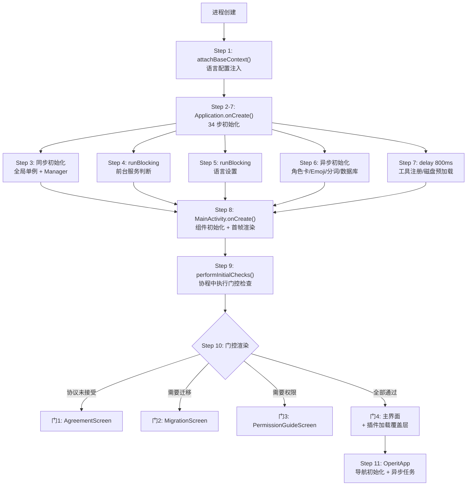

# Walkthrough: App 冷启动到主界面可交互

> **场景：** 用户点击 Operit 的 App 图标。从进程创建到看到聊天界面、可以发消息，中间经过了哪些代码。
>
> **阅读方式：** 左边打开这篇文档，右边打开 Android Studio。每一步都标注了文件路径和行号，跟着跳转。
>
> **预计时间：** 30-40 分钟。

---

## 全链路总览



---

## Step 1: 最早的入口 — 语言注入

```
📂 core/application/OperitApplication.kt L545-571
```

```kotlin
override fun attachBaseContext(base: Context) {
    try {
        configureOpenMpEnvironment()

        // L549: 从 SharedPreferences 同步读取用户设置的语言
        val code = LocaleUtils.getCurrentLanguage(base)
        val locale = LocaleUtils.getLocaleForLanguageCode(code, base)

        // L551: 用读到的语言创建新的 Configuration
        val config = Configuration(base.resources.configuration)
        // L554-561: 设置 Locale
        if (Build.VERSION.SDK_INT >= 24) {
            config.setLocales(LocaleList(locale))
        } else {
            config.locale = locale
        }

        // L564: 用新 Configuration 创建 Context
        val context = base.createConfigurationContext(config)
        super.attachBaseContext(context)
    } catch (e: Exception) {
        super.attachBaseContext(base)
    }
}
```

**为什么在这里做语言注入？** `attachBaseContext` 是 Android 最早的入口点——比 `onCreate` 还早。如果等到 `onCreate` 再设置语言，那些在 `onCreate` 之前就通过 `getString(R.string.xxx)` 加载的资源字符串已经用了默认语言，改不回来了。

**注意：** 这里用的是 `SharedPreferences`（同步读取），不是 DataStore（异步读取）。因为 `attachBaseContext` 不能等协程。

> **→ 下一步：`attachBaseContext` 结束后，系统调用 `onCreate()`。同文件 L116**

---

## Step 2: Application.onCreate — 34 步初始化概览

```
📂 core/application/OperitApplication.kt L116-369
```

```kotlin
override fun onCreate() {
    super.onCreate()
    val startTime = System.currentTimeMillis()
    appStartupTimeMs = startTime
    instance = this   // L120: 全局单例挂载
    // ... 接下来 34 步初始化
}
```

34 步初始化看起来很吓人，但它们归为 5 类任务。接下来按类型分段看。

> **→ 下一步：同步初始化段，同文件 L120-169**

---

## Step 3: 同步初始化 — 全局单例和 Manager

```
📂 core/application/OperitApplication.kt L120-169
```

按执行顺序：

| 行号 | 做什么 | 为什么必须同步 |
|------|--------|---------------|
| L120 | `instance = this` | 全局单例，后续所有代码通过它获取 Application 引用 |
| L122 | `configureOpenMpEnvironment()` | 设置 CPU 亲和性，影响 NDK 推理性能 |
| L123 | `AppIconManager.ensureComponentState()` | 确保 App 图标组件状态正确 |
| L126 | `CrashRecoveryState.consumePendingCrashReportLaunch()` | 检测是否崩溃恢复启动 |
| L128 | `AppLogger.resetLogFile()` | 非崩溃恢复时重置日志文件 |
| L131 | `ensureWorkManagerInitialized()` | WorkManager 初始化 |
| L144 | `ActivityLifecycleManager.initialize(this)` | 注册全局 Activity 生命周期回调 |
| L148 | `AIMessageManager.initialize(this)` | 消息管理器初始化 |
| L149 | `PluginRegistry.initializeBuiltins()` | 内置插件注册 |
| L169 | `Thread.setDefaultUncaughtExceptionHandler(...)` | 全局异常处理器 |
| L173 | 初始化 `Json` 实例 | kotlinx.serialization 配置 |

这些步骤都是轻量级的（每个几毫秒），而且后续代码依赖它们的结果，所以必须同步执行。

> **→ 下一步：第一个 runBlocking 出现。同文件 L162（通过调用 `startGlobalAIForegroundServiceIfNeeded`，跳到 L471）**

---

## Step 4: 阻塞读取 — 前台服务是否需要启动？

```
📂 core/application/OperitApplication.kt L471-493
```

```kotlin
private fun startGlobalAIForegroundServiceIfNeeded() {
    try {
        // ⚠️ 阻塞读取 1: 唤醒词是否开启
        val alwaysListeningEnabled = runBlocking {
            WakeWordPreferences(applicationContext)
                .alwaysListeningEnabledFlow.first()
        }
        // ⚠️ 阻塞读取 2: 外部 HTTP API 是否开启
        val externalHttpEnabled = runBlocking {
            ExternalHttpApiPreferences.getInstance(applicationContext)
                .enabledFlow.first()
        }

        // L479: 两个都关闭，且 Service 没在运行 → 不启动
        if ((!alwaysListeningEnabled && !externalHttpEnabled)
            || AIForegroundService.isRunning.get()) {
            return
        }

        // L482-489: 需要启动前台服务
        val intent = Intent(this, AIForegroundService::class.java)
        intent.putExtra(AIForegroundService.EXTRA_STATE, AIForegroundService.STATE_IDLE)
        startForegroundService(intent)
    } catch (e: Exception) {
        AppLogger.e("OperitApp", "Failed to start foreground service", e)
    }
}
```

**两次 `runBlocking`**——在主线程同步等待 DataStore 读取完成。

**为什么不能异步？** 如果异步读取唤醒词设置，等协程跑完的时候 Activity 可能已经创建了。此时用户说了唤醒词但 Service 还没启动，唤醒词无响应。必须在 `onCreate` 结束前就确定是否启动 Service。

**会不会 ANR？** DataStore 的 `first()` 读本地文件，通常几毫秒完成。ANR 阈值是 5 秒，远远够用。

> **→ 下一步：第三次 runBlocking。同文件 L183（通过调用 `initializeAppLanguage`，跳到 L496）**

---

## Step 5: 阻塞读取 — 语言设置

```
📂 core/application/OperitApplication.kt L496-543
```

```kotlin
private fun initializeAppLanguage() {
    try {
        // ⚠️ 阻塞读取 3: 语言设置
        val languageCode = runBlocking {
            try {
                preferencesManager.appLanguage.first()
            } catch (e: Exception) {
                DEFAULT_LANGUAGE
            }
        }

        val locale = LocaleUtils.getLocaleForLanguageCode(languageCode, this)
        Locale.setDefault(locale)

        // L521-537: 根据 API 版本应用语言设置
        if (Build.VERSION.SDK_INT >= 33) {
            AppCompatDelegate.setApplicationLocales(LocaleListCompat.create(locale))
        } else {
            val config = Configuration(resources.configuration)
            config.setLocales(LocaleList(locale))
            resources.updateConfiguration(config, resources.displayMetrics)
        }
    } catch (e: Exception) {
        AppLogger.e("OperitApp", "Failed to initialize language", e)
    }
}
```

**等等，Step 1 不是已经在 `attachBaseContext` 里设过语言了吗？为什么这里又设一次？**

`attachBaseContext` 读的是 `SharedPreferences`（最基本的存储）。这里读的是 `DataStore`（更完整的用户偏好）。两者可能不一致——比如用户在上次运行时通过 Settings 改了语言（写入 DataStore），但 SharedPreferences 的缓存还没同步。这一步确保用 DataStore 的最新值覆盖。

> **→ 下一步：异步初始化段。同文件 L196-268**

---

## Step 6: 异步初始化 — 不阻塞主线程的任务

```
📂 core/application/OperitApplication.kt L196-268
```

这些任务通过 `scope.launch(Dispatchers.IO)` 在后台线程执行，不阻塞主线程：

| 行号 | 任务 | 为什么可以异步 |
|------|------|---------------|
| L196-200 | `CharacterCardManager.initializeIfNeeded()` | 角色卡不影响首帧渲染 |
| L203-207 | `CustomEmojiRepository.initializeBuiltinEmojis()` | Emoji 在聊天时才需要 |
| L252-256 | `TextSegmenter.initialize()` | Jieba 分词预热，搜索时才需要 |
| L263-268 | `database.problemDao().getProblemCount()` | Room 数据库预加载（触发建表） |

中间穿插的同步步骤（L210 `AndroidShellExecutor`、L214-239 `ShowerEnvironment`、L244 `PDFBoxResourceLoader`、L248 `LanguageFactory`）都是轻量级的配置设置。

**同步的图片加载器构建（L272-303）：**

```kotlin
// L272-303: 构建 Coil ImageLoader
globalImageLoader = ImageLoader.Builder(this)
    .okHttpClient(OkHttpClient.Builder()
        .connectTimeout(30, TimeUnit.SECONDS)
        .readTimeout(60, TimeUnit.SECONDS)
        .build())
    .diskCache(DiskCache.Builder()
        .maxSizeBytes(50 * 1024 * 1024)   // 50MB 磁盘缓存
        .build())
    .memoryCachePolicy(CachePolicy.ENABLED)
    .memoryCache(MemoryCache.Builder(this)
        .maxSizePercent(0.15)              // 15% 可用内存
        .build())
    .build()
```

这个必须同步——后续 UI 渲染需要用它加载图片。

> **→ 下一步：delay(800ms) 延迟块。同文件 L317-333**

---

## Step 7: 延迟 800ms — 等首帧渲染完再干重活

```
📂 core/application/OperitApplication.kt L317-333
```

```kotlin
applicationScope.launch(Dispatchers.Default) {
    delay(800)  // L319: 给 UI 线程留出首帧渲染时间

    // 1. 图片池从磁盘预加载
    withContext(Dispatchers.IO) { ImagePoolManager.preloadFromDisk() }

    // 2. 媒体池从磁盘预加载
    withContext(Dispatchers.IO) { MediaPoolManager.preloadFromDisk() }

    // 3. 注册默认工具
    val toolHandler = AIToolHandler.getInstance(this@OperitApplication)
    toolHandler.registerDefaultTools()
}
```

**为什么延迟 800ms？** `Application.onCreate` 结束后，系统要执行 `Activity.onCreate → setContent → Compose 首帧布局和渲染`。这个过程大约 500-800ms。如果在此期间做磁盘 I/O（预加载图片/媒体池）和 CPU 密集操作（工具注册），会抢占主线程 CPU 时间，导致首帧掉帧。

**验证方式：** 把 `delay(800)` 改成 `delay(0)`，重新编译运行，看启动动画是否变卡。

> **→ 下一步：Application.onCreate 结束，系统创建 Activity。跳到 `ui/main/MainActivity.kt` L256**

---

## Step 8: MainActivity.onCreate — 组件初始化 + 首帧渲染

```
📂 ui/main/MainActivity.kt L256-302
```

```kotlin
override fun onCreate(savedInstanceState: Bundle?) {
    super.onCreate(savedInstanceState)

    // L261: 窗口背景设为黑色（防止系统主题色渗透）
    window.decorView.setBackgroundColor(Color.Black.toArgb())

    // L265: 处理 Intent（分享文件/链接/OAuth 回调/快捷方式）
    handleIntent(intent)

    // L270: 初始化核心组件
    initializeComponents()

    // L271-273: ANR 监控 + 偏好监听 + 显示设置（高刷新率等）
    anrMonitor.start()
    setupPreferencesListener()
    configureDisplaySettings()

    // L286: ⭐ 首帧渲染
    setAppContent()

    // L289: 延迟 3 秒检查更新
    setupUpdateManager()

    // L291-299: 门控检查
    if (savedInstanceState == null) {
        performInitialChecks()   // 冷启动 → 执行门控
    } else {
        initialChecksDone = true // 配置变更重建 → 跳过门控
    }
}
```

**关键设计：L286 的 `setAppContent()` 在 `performInitialChecks()` 之前调用。** 此时 `initialChecksDone = false`，所以渲染的是空白占位。但系统已经知道"Activity 有内容了"——从黑屏变成了空白屏。虽然用户看不出区别，但系统层面这是很重要的：系统会停止显示 App 启动的白屏闪烁。

### initializeComponents（L601-623）

```kotlin
private fun initializeComponents() {
    toolHandler = AIToolHandler.getInstance(this)
    mcpRepository = MCPRepository(this)
    anrMonitor = AnrMonitor(this, lifecycleScope)
    val preferencesManager = UserPreferencesManager.getInstance(this)
    showPreferencesGuide = !preferencesManager.isPreferencesInitialized()
    agreementPreferences = AgreementPreferences(this)
    migrationManager = ChatHistoryMigrationManager(this)
}
```

7 个组件实例化。注意 `showPreferencesGuide` 的赋值——如果用户从来没填过偏好问卷，首次进入会显示引导页而不是直接进聊天。

> **→ 下一步：门控检查。同文件 L428**

---

## Step 9: 门控检查 — 协程中异步执行

```
📂 ui/main/MainActivity.kt L428-461
```

```kotlin
private fun performInitialChecks() {
    lifecycleScope.launch {
        // 1. 通知权限（Android 13+ 需要运行时请求 POST_NOTIFICATIONS）
        checkNotificationPermission()

        // 2. 权限级别检查
        checkPermissionLevelSet()
        // → 如果 getPreferredPermissionLevel() == null
        //   → showPermissionGuide = true

        // 3. 协议 + 迁移检查
        if (!showPermissionGuide && agreementPreferences.isAgreementAccepted()) {
            try {
                if (migrationManager.needsMigration()) {
                    showMigrationScreen = true
                } else {
                    startPluginLoading()
                }
            } catch (e: Exception) {
                startPluginLoading()  // 迁移检查失败也继续
            }
        }

        // 4. 标记完成，刷新渲染
        initialChecksDone = true
        setAppContent()
    }
}
```

**注意执行顺序：** 先查通知权限 → 再查有没有设过权限级别 → 再查协议和迁移。三个检查是串行的，前一个的结果影响后一个。

**`initialChecksDone = true` 之后调用 `setAppContent()`**——这是第二次调用 setAppContent。这次会根据检查结果渲染正确的页面。

> **→ 下一步：看 setAppContent 的 if/else 链。同文件 L724**

---

## Step 10: 门控渲染 — if/else 链 = 优先级队列

```
📂 ui/main/MainActivity.kt L724-825
```

```kotlin
private fun setAppContent() {
    setContent {
        OperitTheme {
            Box {
                // 门 0: 还没检查完 → 空白占位
                if (!initialChecksDone) {
                    // 什么都不渲染
                }
                // 门 1: 用户协议未接受
                else if (!agreementPreferences.isAgreementAccepted()) {
                    AgreementScreen(
                        onAgreementAccepted = {
                            // 接受后：保存状态 → 检查权限 → 刷新
                            agreementPreferences.setAgreementAccepted(true)
                            lifecycleScope.launch {
                                delay(300)
                                checkPermissionLevelSet()
                                setAppContent()  // 递归刷新
                            }
                        }
                    )
                }
                // 门 2: 需要数据迁移
                else if (showMigrationScreen) {
                    MigrationScreen(
                        onComplete = {
                            showMigrationScreen = false
                            startPluginLoading()
                            setAppContent()  // 递归刷新
                        }
                    )
                }
                // 门 3: 需要权限引导
                else if (showPermissionGuide) {
                    PermissionGuideScreen(
                        onComplete = {
                            showPermissionGuide = false
                            setAppContent()  // 递归刷新
                        }
                    )
                }
                // 门 4: 所有门通过 → 主界面
                else {
                    // 处理待分享的文件/链接
                    processPendingSharedFiles()
                    processPendingSharedLinks()

                    // 确定初始页面
                    val initialNavItem = when {
                        showPreferencesGuide -> NavItem.UserPreferencesGuide
                        shortcutNavItem != null -> shortcutNavItem!!
                        else -> NavItem.AiChat
                    }

                    // 渲染主界面
                    CompositionLocalProvider(LocalPluginLoadingState provides pluginLoadingState) {
                        OperitApp(initialNavItem = initialNavItem, ...)
                    }
                }

                // 插件加载覆盖层（zIndex=10，浮在所有内容之上）
                PluginLoadingScreenWithState(
                    pluginLoadingState = pluginLoadingState,
                    modifier = Modifier.zIndex(10f)
                )
            }
        }
    }
}
```

**设计模式：** if/else 链就是优先级队列。协议 > 迁移 > 权限 > 主界面。每道门通过后调用 `setAppContent()` 递归刷新，进入下一道门。

**门的顺序不能调换：**
- 协议必须最先（法律要求，未接受不能使用任何功能）
- 迁移在权限之前（老数据必须迁移完才能正常使用）
- 权限在主界面之前（AI 工具需要知道权限级别）

**插件加载覆盖层（L804）：** `PluginLoadingScreenWithState` 用 `zIndex(10f)` 浮在所有内容之上。它是**非阻塞的**——主界面（`OperitApp`）已经在后台渲染和初始化了，插件加载完毕后覆盖层消失，用户立即可交互。

> **→ 下一步：主界面 `OperitApp` composable。跳到 `ui/main/OperitApp.kt` L55**

---

## Step 11: OperitApp — Compose 世界的入口

```
📂 ui/main/OperitApp.kt L55-62
```

```kotlin
@Composable
fun OperitApp(
    initialNavItem: NavItem = NavItem.AiChat,
    toolHandler: AIToolHandler? = null,
    shortcutNavRequest: NavItem? = null,
    shortcutNavRequestId: Long = 0L,
    onShortcutNavHandled: (Long) -> Unit = {}
)
```

### 11.1 导航初始化（L71-75）

```kotlin
var selectedItem by remember { mutableStateOf(initialNavItem) }
var currentScreen by remember {
    mutableStateOf(OperitRouter.getScreenForNavItem(initialNavItem))
}
val backStack = remember { mutableStateListOf<Screen>() }
```

**自定义导航栈。** 不用 Jetpack Navigation，而是用 `SnapshotStateList<Screen>` 手动管理。`navigateTo` 压栈，`goBack` 弹栈。

### 11.2 异步任务启动（LaunchedEffect 块）

```kotlin
// L240: 每 10 秒轮询网络状态
LaunchedEffect(Unit) {
    while (true) {
        isNetworkAvailable = checkNetworkAvailability()
        delay(10000)
    }
}

// L249: 网络可用时拉取远程公告
LaunchedEffect(isNetworkAvailable) {
    if (isNetworkAvailable && !isShowingAnnouncement) {
        fetchRemoteAnnouncement()
    }
}

// L266: 同步 MCP 插件安装状态
LaunchedEffect(Unit) {
    mcpRepository.syncInstalledStatus()
}
```

### 11.3 布局选择（L191, L281）

```kotlin
// L191: 平板/手机判断
val useTabletLayout = screenWidthDp >= 600

// L281: 选择布局
if (useTabletLayout) {
    TabletLayout(...)   // 永久侧边栏
} else {
    PhoneLayout(...)    // 手势抽屉
}
```

**600dp** 是 Material Design 3 的分界点。平板用永久可见的侧边导航栏，手机用手势滑出的抽屉式导航。

**至此，用户看到了聊天界面，可以开始交互。**

---

## 完整调用链回顾

```
用户点击 App 图标
│
├─ 进程创建
│
├─ Step 1:  attachBaseContext()                    [L545] SharedPreferences 读语言
│
├─ Step 2-7: Application.onCreate()               [L116] 34 步初始化
│   ├─ Step 3:  同步初始化（L120-169）             单例 + Manager + 异常处理
│   ├─ Step 4:  startGlobalAIForegroundServiceIfNeeded() [L471]
│   │           ⚠️ 2 次 runBlocking 读 DataStore
│   ├─ Step 5:  initializeAppLanguage()            [L496]
│   │           ⚠️ 1 次 runBlocking 读 DataStore
│   ├─ Step 6:  异步初始化（L196-268）             角色卡/Emoji/分词/数据库
│   └─ Step 7:  delay(800ms)（L317）               工具注册/磁盘预加载
│
├─ Step 8:  MainActivity.onCreate()                [L256]
│   ├─ initializeComponents()                      [L601] 7 个组件实例化
│   ├─ setAppContent() ⭐ 首帧渲染                  [L724] 空白占位
│   └─ performInitialChecks()                      [L428] 协程启动
│
├─ Step 9:  门控检查（协程中）
│   ├─ 通知权限 → 权限级别 → 协议 → 迁移
│   └─ initialChecksDone = true → setAppContent()
│
├─ Step 10: setAppContent() 门控渲染               [L724]
│   ├─ 协议未接受 → AgreementScreen（5 秒倒计时）
│   ├─ 需要迁移   → MigrationScreen
│   ├─ 需要权限   → PermissionGuideScreen（6 页引导）
│   └─ 全部通过   → OperitApp + PluginLoadingScreen（zIndex=10）
│
└─ Step 11: OperitApp                              [L55]
    ├─ 导航初始化: backStack + Screen                [L71]
    ├─ 异步任务: 网络轮询 / 公告 / MCP 同步          [L240-266]
    ├─ 布局选择: >= 600dp → TabletLayout            [L191]
    └─ ⭐ 用户看到 AiChat 页面，可交互

涉及文件（按调用顺序）:
1. core/application/OperitApplication.kt
2. ui/main/MainActivity.kt
3. ui/main/OperitApp.kt
```

---

## 动手练习

### 练习 1: 启动计时

在 `OperitApplication.onCreate` 的 L118 已经有启动时间戳 `startTime`。在以下关键点加日志，记录耗时：

1. L162 `startGlobalAIForegroundServiceIfNeeded()` 前后
2. L183 `initializeAppLanguage()` 前后
3. L286 `setAppContent()` 前后

```bash
adb logcat | grep "启动计时"
```

**练习目标：** 找到 3 次 `runBlocking` 各自的耗时。

### 练习 2: 跳过门控

在 `performInitialChecks()` 第一行加上：
```kotlin
initialChecksDone = true; setAppContent(); return@launch
```

重新安装（全新安装），观察：协议页消失了，但 AI 可能因为权限未设置而无法正常使用。

### 练习 3: 观察插件加载

在 `startPluginLoading()` 里找到 `pluginLoadingState.initializeMCPServer`。在每个插件启动前后加日志。观察每个 MCP 插件的启动耗时——这就是为什么需要 30 秒超时。

---

## 关联文档

| 文档 | 关系 |
|------|------|
| `41_Tutorial.启动链路精讲.md` | 概念层 — 理解 WHY |
| `37_Runtime.冷启动全链路.md` | 参考手册 — 34 步完整行号索引 |
| `chat-message-flow.md` | 上一篇导读 — 核心业务链路 |
| `tool-execution.md` | 下一篇导读 — 工具系统 |
