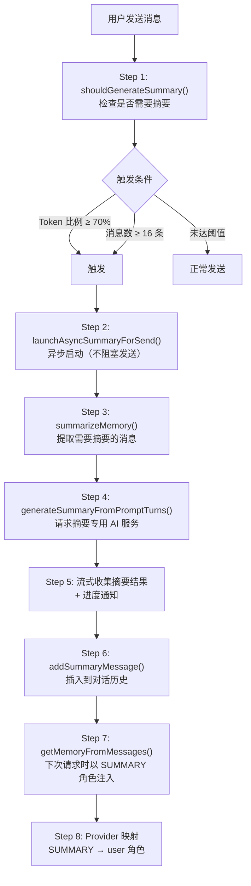

# Walkthrough: 上下文摘要与 Token 管理

> **场景：** 用户和 AI 持续对话，消息越来越多。当 Token 使用率达到 70% 阈值时，系统自动生成对话摘要，压缩历史上下文。从触发条件到摘要注入回对话，经过了哪些代码。
>
> **预计时间：** 25-35 分钟。

---

## 全链路总览



---

## 配置参数

```
📂 data/model/ModelConfigData.kt L40-47
```

```kotlin
object ModelConfigDefaults {
    const val DEFAULT_CONTEXT_LENGTH = 48.0f          // 48K tokens
    const val DEFAULT_MAX_CONTEXT_LENGTH = 128.0f     // 128K tokens
    const val DEFAULT_SUMMARY_TOKEN_THRESHOLD = 0.70f // 70% 填充率触发摘要
    const val DEFAULT_ENABLE_SUMMARY = true
    const val DEFAULT_ENABLE_SUMMARY_BY_MESSAGE_COUNT = true
    const val DEFAULT_SUMMARY_MESSAGE_COUNT_THRESHOLD = 16
}
```

用户可以在 ModelConfigScreen 的上下文设置区域调整这些参数。`summaryTokenThreshold = 0.70` 意味着当已用 Token 数达到上下文窗口的 70% 时触发摘要。

---

## Step 1: shouldGenerateSummary — 触发判定

```
📂 core/chat/AIMessageManager.kt L1108
```

```kotlin
fun shouldGenerateSummary(
    messages: List<ChatMessage>,
    currentTokens: Int,
    maxTokens: Int,
    tokenUsageThreshold: Float,
    enableSummary: Boolean,
    enableSummaryByMessageCount: Boolean,
    summaryMessageCountThreshold: Int
): Boolean {
    // 总开关关闭 → 不摘要
    if (!enableSummary) return false

    // 条件 1: Token 比例检查
    if (maxTokens > 0 && currentTokens.toFloat() / maxTokens >= tokenUsageThreshold) {
        return true
    }

    // 条件 2: 消息数检查
    if (enableSummaryByMessageCount) {
        val lastSummaryIndex = messages.indexOfLast { it.sender == "summary" }
        val userMessagesSinceSummary = messages
            .drop(if (lastSummaryIndex >= 0) lastSummaryIndex + 1 else 0)
            .count { it.sender == "user" }

        if (userMessagesSinceSummary >= summaryMessageCountThreshold) {
            return true
        }
    }

    return false
}
```

**两个独立触发条件（OR 关系）：**
1. **Token 比例** — `currentTokens / maxTokens ≥ 0.70`
2. **消息数** — 上次摘要后的用户消息数 ≥ 16

### 调用点

```
📂 services/core/MessageCoordinationDelegate.kt L427
```

```kotlin
// 发送消息前检查
if (AIMessageManager.shouldGenerateSummary(
        messages = currentMessages,
        currentTokens = estimatedTokens,
        maxTokens = (contextLength.value * 1024).toInt(),
        tokenUsageThreshold = summaryTokenThreshold.value,
        enableSummary = enableSummary.value,
        enableSummaryByMessageCount = enableSummaryByMessageCount.value,
        summaryMessageCountThreshold = summaryMessageCountThreshold.value
    )) {
    // Step 2: 异步启动摘要
    launchAsyncSummaryForSend(snapshotMessages, insertPosition, ...)
    // 同时提高阈值避免重复触发
    tokenUsageThresholdForSend += 0.5
}
```

**异步不阻塞：** 摘要生成在后台协程中执行，用户的当前消息不需要等待摘要完成就可以发送。

---

## Step 2-3: 启动摘要 — 提取待摘要消息

```
📂 core/chat/AIMessageManager.kt L628
```

```kotlin
suspend fun summarizeMemory(
    service: EnhancedAIService,
    currentMessages: List<ChatMessage>,
    autoContinue: Boolean
): ChatMessage {
    // L634: 找到上一次摘要的位置
    val lastSummaryIndex = currentMessages.indexOfLast { it.sender == "summary" }

    // L635: 提取上一次摘要内容（如果有的话）
    val previousSummary = if (lastSummaryIndex >= 0) {
        currentMessages[lastSummaryIndex].content
    } else null

    // L637: 提取需要摘要的消息（上次摘要之后的 user/ai 消息）
    val messagesToSummarize = currentMessages
        .drop(if (lastSummaryIndex >= 0) lastSummaryIndex + 1 else 0)
        .filter { it.sender in listOf("user", "ai") }

    // L894: 调用摘要服务
    val summaryText = service.generateSummary(messagesToSummarize, previousSummary)

    // L905-921: 追加对话回顾和包预热信息
    val finalSummary = summaryText + conversationReviewEntries + packageWarmupBlock

    // L923-927: 如果是自动继续模式，追加继续指令
    if (autoContinue) {
        finalSummary += "\n[继续执行之前的任务]"
    }

    return ChatMessage(sender = "summary", content = finalSummary, roleName = "system")
}
```

**`previousSummary` 的作用：** 摘要是增量式的。如果之前已经有一次摘要，新的摘要会在旧摘要的基础上扩展，而不是从零开始。这避免了信息丢失。

---

## Step 4: generateSummaryFromPromptTurns — 请求摘要 AI

```
📂 api/chat/enhance/ConversationService.kt L107
```

```kotlin
suspend fun generateSummaryFromPromptTurns(
    messages: List<PromptTurn>,
    previousSummary: String?,
    multiServiceManager: MultiServiceManager
): String {
    // L113: 根据语言选择中英文摘要提示词
    val useEnglish = !isChineseLocale()

    // L114: 构建摘要系统提示词（包含上一次摘要作为上下文）
    val systemPrompt = FunctionalPrompts.buildSummarySystemPrompt(previousSummary, useEnglish)

    // L125: 获取摘要专用 AI 服务实例
    val summaryService = multiServiceManager.getServiceForFunction(FunctionType.SUMMARY)

    // L193-208: 流式请求 + 收集
    val contentBuilder = StringBuilder()
    summaryService.sendMessage(
        conversationHistory = preparedHistory,
        modelParameters = summaryParameters
    ).collect { chunk ->
        contentBuilder.append(chunk)
    }

    // L217: 去除思考内容
    return ChatUtils.removeThinkingContent(contentBuilder.toString().trim())
}
```

**摘要用独立的 AI 服务实例。** `FunctionType.SUMMARY` 可以绑定不同的模型配置——比如对话用 GPT-4，摘要用更便宜的 GPT-3.5。

### Step 5: 进度通知

```kotlin
// L130-189: 流式收集时发送进度通知
ToolProgressBus.emit(ToolProgress(taskId = "summary", progress = 5))
// ... 收集过程中按标记更新进度
// 20% → 40% → 55% → 70% → 85% → 95%
```

UI 层可以监听 `ToolProgressBus` 显示摘要进度条。

---

## Step 6: 插入到对话历史

```
📂 services/core/ChatHistoryDelegate.kt L986
```

```kotlin
suspend fun addSummaryMessage(summaryMessage: ChatMessage, insertPosition: Int) {
    // 找到合适的插入位置（最后一条 AI 消息之后）
    val position = findProperSummaryPosition(insertPosition)

    // 持久化到数据库
    chatHistoryManager.addMessage(chatId, summaryMessage, position)

    // 更新内存中的对话历史
    val currentHistory = _chatHistory.value.toMutableList()
    currentHistory.add(position, summaryMessage)
    _chatHistory.value = currentHistory
}
```

**摘要消息的 `sender = "summary"`**。它不是 user 也不是 ai，而是一个特殊角色。

---

## Step 7-8: 下次请求时注入

```
📂 core/chat/AIMessageManager.kt L1158
```

```kotlin
fun getMemoryFromMessages(messages: List<ChatMessage>): List<PromptTurn> {
    // L1166: 找到最后一条摘要
    val lastSummaryIndex = messages.indexOfLast { it.sender == "summary" }

    // L1167: 只保留摘要及之后的消息
    val relevantMessages = if (lastSummaryIndex >= 0) {
        messages.subList(lastSummaryIndex, messages.size)
    } else {
        messages
    }

    return relevantMessages.map { message ->
        when (message.sender) {
            // L1199: 摘要消息 → SUMMARY 角色
            "summary" -> PromptTurn(kind = PromptTurnKind.SUMMARY, content = message.content)
            "user" -> PromptTurn(kind = PromptTurnKind.USER, content = message.content)
            "ai" -> PromptTurn(kind = PromptTurnKind.ASSISTANT, content = message.content)
            else -> null
        }
    }.filterNotNull()
}
```

**关键设计：** 摘要之前的消息全部丢弃。对话历史变成：`[摘要] + [摘要后的消息]`。这就是上下文压缩的本质。

### Provider 角色映射

```
📂 api/chat/llmprovider/OpenAIProvider.kt L651
```

```kotlin
val role = when (turn.kind) {
    PromptTurnKind.USER,
    PromptTurnKind.SUMMARY,       // 摘要被当作 user 角色
    PromptTurnKind.TOOL_RESULT -> "user"
    PromptTurnKind.ASSISTANT -> "assistant"
    PromptTurnKind.SYSTEM -> "system"
    // ...
}
```

`SUMMARY` 映射为 `"user"` 角色。从 LLM 的视角看，摘要就是一条特殊的 user 消息，包含了之前对话的压缩版本。

---

## Token 限制回调（工具执行中触发）

```
📂 api/chat/EnhancedAIService.kt L2088
```

除了发送前检查，工具执行过程中也会检查 Token 用量：

```kotlin
// 每次工具执行完毕后
if (maxTokens > 0) {
    val usageRatio = currentTokens.toDouble() / maxTokens.toDouble()
    if (usageRatio >= tokenUsageThreshold) {
        onTokenLimitExceeded?.invoke()
        context.isConversationActive.set(false)
    }
}
```

`onTokenLimitExceeded` 回调触发 `handleTokenLimitExceeded()`，启动带 `autoContinue = true` 的摘要。摘要完成后 AI 会自动继续之前的任务。

---

## 完整调用链回顾

```
触发判定:
MessageCoordinationDelegate.sendUserMessage()              [L427]
  → AIMessageManager.shouldGenerateSummary()                [L1108]
    → Token 比例 ≥ 70% OR 消息数 ≥ 16                       返回 true
  → launchAsyncSummaryForSend()                             异步启动

摘要生成:
summarizeHistory()                                          [L1418]
  → AIMessageManager.summarizeMemory()                      [L628]
    → 提取 previousSummary + messagesToSummarize
    → ConversationService.generateSummaryFromPromptTurns()   [L107]
      → FunctionalPrompts.buildSummarySystemPrompt()         中英文提示词
      → summaryService.sendMessage()                         流式请求
      → 收集 + removeThinkingContent()
  → ChatMessage(sender = "summary", content = finalSummary)

注入:
ChatHistoryDelegate.addSummaryMessage()                     [L986]
  → 持久化到数据库 + 更新内存历史

下次请求:
AIMessageManager.getMemoryFromMessages()                    [L1158]
  → 丢弃摘要前的消息
  → 摘要 → PromptTurn(SUMMARY)
  → Provider: SUMMARY → "user" 角色                         [OpenAIProvider L651]

涉及文件:
1. core/chat/AIMessageManager.kt                    — 触发判定 + 摘要生成
2. services/core/MessageCoordinationDelegate.kt     — 发送前检查 + 异步启动
3. api/chat/enhance/ConversationService.kt          — 摘要 AI 服务调用
4. services/core/ChatHistoryDelegate.kt             — 摘要插入对话历史
5. data/model/ModelConfigData.kt                    — 摘要配置参数
6. services/core/ApiConfigDelegate.kt               — 运行时配置 StateFlow
7. api/chat/EnhancedAIService.kt                    — 工具执行中的 Token 检查
```

---

## 动手练习

### 练习 1: 触发摘要

把 `summaryMessageCountThreshold` 设为 3（Settings → 模型配置 → 上下文）。发送 3 条消息后，观察是否自动生成摘要。在 `AIMessageManager.kt:1108` 加断点跟踪判定逻辑。

### 练习 2: 观察摘要内容

在 `ConversationService.kt:217` 加断点。触发一次摘要后，检查 `contentBuilder.toString()` 的内容——这就是 AI 对之前对话的压缩总结。

### 练习 3: 比较摘要前后的 Token 数

在 `EnhancedAIService.kt:554`（`estimatePreparedRequestWindow`）加断点。分别在摘要前和摘要后发送消息，比较 `calculateInputTokens()` 的返回值变化。

---

## 关联文档

| 文档 | 关系 |
|------|------|
| `chat-message-flow.md` | 摘要在消息发送链路中的位置 |
| `model-config.md` | 摘要参数在模型配置中设置 |
