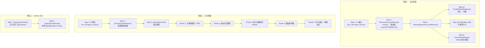

# Walkthrough: 记忆从创建到被 AI 检索

> **场景：** 用户对 AI 说"记住我喜欢用 Kotlin 写代码"。AI 创建了一条记忆。后来用户问"我喜欢什么语言？"，AI 通过记忆工具找到了之前存储的信息。从记忆写入到检索命中，经过了哪些代码。
>
> **预计时间：** 25-35 分钟。

---

## 全链路总览



---

## 阶段一：记忆创建

### Step 1: AI 输出创建记忆的工具调用

AI 分析用户意图后，输出：
```xml
<tool_call name="create_memory">
  <title>用户编程语言偏好</title>
  <content>用户喜欢用 Kotlin 写代码</content>
  <category>preference</category>
</tool_call>
```

这和 W3（工具调用完整过程）一样的 XML 解析流程：`ToolExecutionManager.extractToolInvocations()` 提取工具名和参数，进入 6 阶段执行管线。

### Step 2: MemoryQueryToolExecutor — 工具路由

```
📂 core/tools/defaultTool/standard/MemoryQueryToolExecutor.kt L154
```

```kotlin
override fun invoke(tool: AITool): ToolResult = runBlocking {
    when (tool.name) {
        "query_memory"          -> executeQueryMemory(tool)
        "get_memory_by_title"   -> executeGetMemoryByTitle(tool)
        "create_memory"         -> executeCreateMemory(tool)      // ← 走这里
        "update_memory"         -> executeUpdateMemory(tool)
        "delete_memory"         -> executeDeleteMemory(tool)
        else -> ToolResult(success = false, error = "Unknown tool: ${tool.name}")
    }
}
```

5 个记忆操作共用一个 Executor，通过 `when` 路由。`create_memory` → `executeCreateMemory()`。

### Step 3: saveMemory — 向量生成 + 持久化

```
📂 data/repository/MemoryRepository.kt L800
```

```kotlin
suspend fun saveMemory(memory: Memory): Long = withContext(Dispatchers.IO) {
    // L807: 生成文本嵌入向量
    val textForEmbedding = "${memory.title} ${memory.content}"
    memory.embedding = generateEmbedding(textForEmbedding, cloudConfig)

    // ObjectBox put — 持久化实体
    val id = memoryBox.put(memory)

    // 更新 HNSW 向量索引
    memory.embedding?.let { emb ->
        vectorIndexManager.addItem(id, emb.values)
    }

    id
}
```

三步操作：

#### Step 3a: 文本 → 向量（Embedding）

```
📂 data/repository/MemoryRepository.kt L97, L102
```

```kotlin
private val cloudEmbeddingService = CloudEmbeddingService(context)

private suspend fun generateEmbedding(text: String, config: CloudEmbeddingConfig): Embedding? {
    return cloudEmbeddingService.generateEmbedding(config, text)
}
```

`CloudEmbeddingService` 调用远程 Embedding API（OpenAI / 其他兼容接口），把文本转成浮点数数组（通常 768 或 1536 维）。这个向量捕获了文本的语义信息——"喜欢 Kotlin"和"偏好 Kotlin 语言"的向量会很接近。

#### Step 3b: ObjectBox 持久化

Memory 实体定义：

```
📂 data/model/Memory.kt L17-69
```

```kotlin
@Entity
data class Memory(
    @Id var id: Long = 0,
    var title: String = "",           // "用户编程语言偏好"
    var content: String = "",         // "用户喜欢用 Kotlin 写代码"
    var source: String = "unknown",   // "ai_created" / "user_created"
    var category: String = "",        // "preference"
    var importance: Int = 5,          // 1-10 重要程度

    @Convert(converter = EmbeddingConverter::class, dbType = ByteArray::class)
    var embedding: Embedding? = null, // 向量嵌入（序列化为 ByteArray）

    var createdAt: Long = System.currentTimeMillis(),
    var updatedAt: Long = System.currentTimeMillis(),
) {
    lateinit var tags: ToMany<MemoryTag>  // 多对多标签关系
}
```

`@Entity` 是 ObjectBox 的注解——ObjectBox 是一个高性能嵌入式数据库（类似 Room，但支持向量存储）。`embedding` 字段通过自定义 `EmbeddingConverter` 把 `FloatArray` 序列化为 `ByteArray` 存储。

#### Step 3c: HNSW 索引更新

```
📂 util/vector/VectorIndexManager.kt L59
```

```kotlin
/** 查询最近的K个邻居 */
fun findNearest(query: FloatArray, k: Int): List<T> {
    return index?.findNearest(query, k)?.map { it.item() } ?: emptyList()
}
```

HNSW（Hierarchical Navigable Small World）是一种近似最近邻搜索算法。它构建一个多层图结构，每层是一个随机化的跳表。查询时从顶层开始，逐层下降，每层在邻居中贪心搜索最近节点。

**对比暴力搜索：** 1000 条记忆，暴力搜索需要计算 1000 次余弦相似度。HNSW 平均只需要 ~30 次比较就能找到 top-K 近邻。

**记忆创建完成。** 文本被转成了向量，实体存入了 ObjectBox，向量索引已更新。

---

## 阶段二：记忆检索

### Step 4: AI 输出查询记忆的工具调用

用户问"我喜欢什么语言？"。AI 判断需要查询记忆，输出：

```xml
<tool_call name="query_memory">
  <query>用户喜欢的编程语言</query>
  <threshold>0.3</threshold>
  <limit>5</limit>
</tool_call>
```

### Step 5: executeQueryMemory — 提取查询参数

```
📂 core/tools/defaultTool/standard/MemoryQueryToolExecutor.kt L176
```

```kotlin
private suspend fun executeQueryMemory(tool: AITool): ToolResult {
    val query = tool.parameters.find { it.name == "query" }?.value ?: ""
    val threshold = tool.parameters.find { it.name == "threshold" }
        ?.value?.toDoubleOrNull() ?: 0.3
    val limit = tool.parameters.find { it.name == "limit" }
        ?.value?.toIntOrNull() ?: 5

    // L260-270: 调用仓库层搜索
    val results = memoryRepository.searchMemories(
        query = query,
        limit = limit,
        threshold = threshold
    )

    // L273-282: 快照去重（避免同一轮对话重复返回相同记忆）
    synchronized(snapshotState.lock) {
        results.forEach { memory ->
            snapshotState.returnedIds.add(memory.id)
        }
    }

    // L284-291: 构建结果
    return ToolResult(
        success = true,
        result = MemoryQueryResultData(results)
    )
}
```

**快照去重机制：** 如果 AI 在同一轮对话中多次查询记忆，已返回过的记忆 ID 会被记录。避免重复注入相同信息浪费 Token。

> **→ 下一步：`searchMemories` 混合检索。跳到 `MemoryRepository.kt` L1095**

### Step 6: 混合检索 — 5 阶段融合

```
📂 data/repository/MemoryRepository.kt L1095, L1143
```

```kotlin
suspend fun searchMemories(
    query: String,
    limit: Int = 5,
    threshold: Double = 0.3
): List<Memory> {
    return runSearchMemoriesWithDebug(query, limit, threshold)
}
```

核心在 `runSearchMemoriesWithDebug`（L1143），这是一个 ~350 行的混合检索实现：

#### Phase 1: 关键词检索 + RRF 评分（~L1290）

```kotlin
// 对查询文本分词
val queryTokens = segmentText(query)

// 遍历所有记忆，计算关键词匹配度
allMemories.forEachIndexed { index, memory ->
    val memoryTokens = segmentText(memory.content)
    val matchCount = queryTokens.count { it in memoryTokens }
    if (matchCount > 0) {
        keywordResults.add(Pair(memory.id, matchCount))
    }
}

// 按匹配数排序，用 RRF 公式计算基础分
keywordResults.sortByDescending { it.second }
keywordResults.forEachIndexed { rank, (id, _) ->
    scores[id] = (scores[id] ?: 0.0) + computeRrfBaseScore(rank)
}
```

#### RRF 公式（L242）

```kotlin
private const val SEARCH_RRF_K = 60.0

private fun computeRrfBaseScore(rank: Int): Double {
    return 1.0 / (SEARCH_RRF_K + rank)
}
```

**Reciprocal Rank Fusion（RRF）** 把多个排序列表融合成一个。公式 `1/(k+rank)` 的特点：排名越靠前分数越高，但差距递减。K=60 是经验值，让不同检索方式的贡献更均匀。

#### Phase 2: 反向包含检索（~L1319）

```kotlin
// 检查查询文本是否包含在记忆内容中，或记忆内容是否包含查询文本
allMemories.forEach { memory ->
    if (memory.content.contains(query) || query.contains(memory.content)) {
        val baseScore = computeRrfBaseScore(rank)
        scores[memory.id] = (scores[memory.id] ?: 0.0) + baseScore
    }
}
```

Phase 1 是分词后的模糊匹配，Phase 2 是原文的精确包含。两者互补：分词能处理同义词和词序变化，但可能漏掉精确匹配；反向包含能捕获完全匹配的情况。

#### Phase 3: 语义向量检索（~L1336）

```kotlin
// 生成查询文本的向量
val queryEmbedding = generateEmbedding(query, cloudConfig)

if (queryEmbedding != null) {
    // HNSW 最近邻搜索
    val nearestIds = vectorIndexManager.findNearest(
        queryEmbedding.values, limit * 3  // 多取一些候选
    )

    // 用 RRF 公式累加分数
    nearestIds.forEachIndexed { rank, id ->
        scores[id] = (scores[id] ?: 0.0) + computeRrfBaseScore(rank)
    }
}
```

这是记忆检索最核心的一步。"用户喜欢的编程语言"的向量会和"用户喜欢用 Kotlin 写代码"的向量很接近，即使两者没有共同的关键词。

#### Phase 4: 图边缘传播（~L1385）

```kotlin
// 如果记忆 A 和记忆 B 有关联（共享标签/相似内容），
// A 被检索命中时，B 也获得一部分分数
relatedMemories.forEach { relatedId ->
    val propagatedScore = baseScore * PROPAGATION_FACTOR
    scores[relatedId] = (scores[relatedId] ?: 0.0) + propagatedScore
}
```

知识图谱式的扩展检索。比如"用户喜欢 Kotlin"和"用户是 Android 开发者"虽然没有直接的词汇或语义关联，但它们可能共享 `preference` 标签，通过图传播也能被关联检索到。

#### Phase 5: RRF 融合 + 阈值过滤（~L1433）

```kotlin
// 按融合分数排序
val sortedResults = scores.entries.sortedByDescending { it.value }

// 阈值过滤
val filteredResults = sortedResults.filter { it.value >= threshold }

// 截取 limit 条
return filteredResults.take(limit).map { getMemoryById(it.key) }
```

4 种检索方式的分数通过 RRF 累加后，分数高于阈值（默认 0.3）的记忆被返回。

**为什么用混合检索而不只用向量？**
- 纯向量检索：语义相似度高，但可能漏掉精确匹配（"Kotlin" vs "kotlin"）
- 纯关键词检索：精确匹配好，但无法理解同义词（"编程语言" vs "开发语言"）
- 混合检索：两者优势互补，RRF 融合让最终排序更鲁棒

---

## 阶段三：记忆工具注入到 System Prompt

AI 不是天生知道有 `query_memory`、`create_memory` 这些工具的。它需要在 System Prompt 里看到工具的 Schema。

### Step 7: 记忆工具 Schema 定义

```
📂 core/config/SystemToolPrompts.kt L444-505
```

```kotlin
// L444: 记忆库工具（英文版）
val memoryTools = SystemToolPromptCategory(
    categoryName = "Memory Tools",
    tools = listOf(
        ToolPrompt(
            name = "query_memory",
            description = "Search memories by semantic similarity",
            parametersStructured = listOf(
                ToolParameterSchema(name = "query", type = "string", required = true),
                ToolParameterSchema(name = "threshold", type = "number", required = false),
                ToolParameterSchema(name = "limit", type = "integer", required = false)
            )
        ),
        ToolPrompt(
            name = "get_memory_by_title",
            description = "Retrieve a specific memory by its title",
            parametersStructured = listOf(
                ToolParameterSchema(name = "title", type = "string", required = true)
            )
        )
    )
)

// L476: 记忆库工具（中文版）
val memoryToolsCn = SystemToolPromptCategory(
    categoryName = "记忆库工具",
    tools = listOf(
        ToolPrompt(name = "query_memory", ...),
        ToolPrompt(name = "get_memory_by_title", ...)
    )
)
```

**双语 Schema：** 根据用户设置的语言，注入英文或中文版的工具说明。工具名不变（都是英文），变的是 description 和参数说明。

### Step 8: 条件注入到 System Prompt

```
📂 core/config/SystemPromptConfig.kt L484-541
```

```kotlin
// L484: 根据用户设置决定是否注入记忆工具
val availableToolsEn = if (useToolCallApi) "" else (
    if (enableMemoryQuery) {
        getMemoryToolsEn(toolVisibility) +    // 记忆工具 Schema
        getOtherToolsEn(toolVisibility)       // 其他工具 Schema
    } else {
        getOtherToolsEn(toolVisibility)       // 不含记忆工具
    }
)

// L514: 中文版同样逻辑
val availableToolsCn = if (useToolCallApi) "" else (
    if (enableMemoryQuery) {
        getMemoryToolsCn(toolVisibility) +
        getOtherToolsCn(toolVisibility)
    } else {
        getOtherToolsCn(toolVisibility)
    }
)
```

**`enableMemoryQuery` 开关：** 用户可以在 Settings 里关闭记忆功能。关闭后，AI 的 System Prompt 中不会出现记忆工具的 Schema，AI 也就不会尝试调用它们。

**`useToolCallApi`：** 如果使用原生的 Tool Call API（如 Claude/GPT 的 function calling），工具 Schema 通过 API 参数传递，不需要注入到 System Prompt 文本中。

---

## 完整调用链回顾

```
记忆创建:
AI 输出 <tool_call name="create_memory">
  → MemoryQueryToolExecutor.invoke()               [L154] when 路由
    → executeCreateMemory()
      → MemoryRepository.saveMemory()               [L800]
        → CloudEmbeddingService.generateEmbedding()  [L102] 文本→向量
        → ObjectBox put()                                    实体持久化
        → VectorIndexManager.addItem()                       HNSW 索引

记忆检索:
AI 输出 <tool_call name="query_memory">
  → MemoryQueryToolExecutor.invoke()               [L154] when 路由
    → executeQueryMemory()                          [L176] 参数提取
      → MemoryRepository.searchMemories()           [L1095]
        → runSearchMemoriesWithDebug()              [L1143] 混合检索
          Phase 1: 关键词检索 + RRF                          分词匹配
          Phase 2: 反向包含检索                               精确子串
          Phase 3: 语义向量检索                               HNSW 最近邻
          Phase 4: 图边缘传播                                 关联记忆
          Phase 5: RRF 融合 + 阈值过滤                        排序输出
      → 快照去重                                    [L273] 避免重复
      → ToolResult(MemoryQueryResultData)

Schema 注入:
SystemToolPrompts.memoryTools                       [L445] 工具定义
  → SystemPromptConfig                              [L484] 条件注入
    → if (enableMemoryQuery) → 注入到 System Prompt

涉及文件:
1. core/tools/defaultTool/standard/MemoryQueryToolExecutor.kt — 工具入口
2. data/repository/MemoryRepository.kt                       — 存储 + 检索
3. data/model/Memory.kt                                      — 实体定义
4. util/vector/VectorIndexManager.kt                         — HNSW 索引
5. core/config/SystemToolPrompts.kt                          — Schema 定义
6. core/config/SystemPromptConfig.kt                         — Schema 注入
```

---

## 动手练习

### 练习 1: 观察向量生成

在 `MemoryRepository.kt:807`（`generateEmbedding`）加断点。对 AI 说"记住我的名字是小明"。观察：
- `textForEmbedding` 的内容
- `embedding.values` 的长度（维度数）和前几个值

### 练习 2: 追踪混合检索

在 `MemoryRepository.kt:1143`（`runSearchMemoriesWithDebug`）加断点。对 AI 说"我叫什么名字？"。逐步跟踪 5 个 Phase 的执行：
- 每个 Phase 后 `scores` map 里有几条记录？
- 最终 `filteredResults` 保留了几条？

### 练习 3: 验证 RRF 融合效果

创建 3 条记忆："我喜欢 Kotlin"、"我是 Android 开发者"、"今天天气不错"。然后查询"编程语言偏好"。在 Phase 5 加断点，观察每条记忆的融合分数——第一条应该最高（关键词+语义都匹配），第二条次之（语义相关），第三条最低（不相关）。

---

## 关联文档

| 文档 | 关系 |
|------|------|
| `tool-execution.md` | 工具执行管线（记忆工具也走这个流程） |
| `chat-message-flow.md` | System Prompt 注入在对话链路中的位置 |
| `mcp-plugin-lifecycle.md` | 上一篇导读 |
