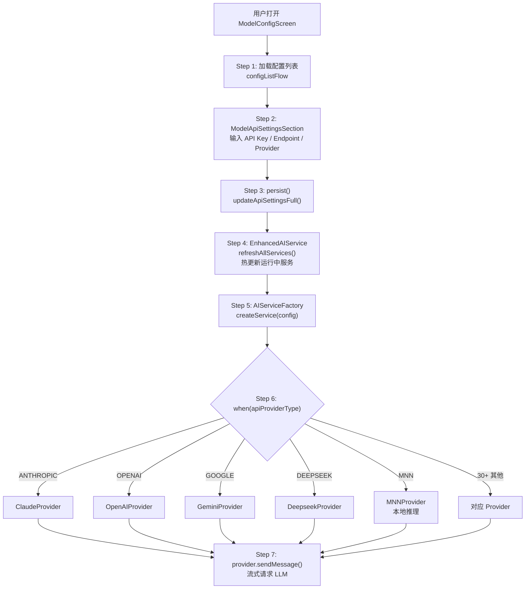

# Walkthrough: 模型配置与 Provider 切换

> **场景：** 用户打开 Settings → 模型配置，添加一个 Claude API Key 并选择 claude-sonnet 模型。保存后发送消息，请求自动路由到 Claude Provider。从配置到请求发出，经过了哪些代码。
>
> **预计时间：** 25-35 分钟。

---

## 全链路总览



---

## Step 1: 配置列表加载

```
📂 ui/features/settings/screens/ModelConfigScreen.kt L141, L153
```

```kotlin
@Composable
fun ModelConfigScreen(
    onBackPressed: () -> Unit = {},
    navigateToMnnModelDownload: (() -> Unit)? = null
) {
    // L153: 从 DataStore 收集所有配置 ID
    val configList = configManager.configListFlow
        .collectAsState(initial = listOf("default")).value
    var selectedConfigId by remember { mutableStateOf(ModelConfigManager.DEFAULT_CONFIG_ID) }
}
```

`configListFlow` 是一个 `Flow<List<String>>`，每个字符串是一个配置 ID（如 `"default"`、UUID）。用户可以创建多套配置，在不同场景（对话/摘要/函数调用）间切换。

### Step 2: API 设置输入

```
📂 ui/features/settings/sections/ModelApiSettingsSection.kt L73, L102
```

```kotlin
@Composable
fun ModelApiSettingsSection(
    config: ModelConfigData,
    configManager: ModelConfigManager,
    ...
) {
    // L102-105: 输入状态
    var apiEndpointInput by remember(config.id) { mutableStateOf(config.apiEndpoint) }
    var apiKeyInput by remember(config.id) { mutableStateOf(config.apiKey) }
    var modelNameInput by remember(config.id) { mutableStateOf(config.modelName) }
    var selectedApiProvider by remember(config.id) { mutableStateOf(config.apiProviderType) }
}
```

四个核心输入字段：Provider 类型、API Endpoint、API Key、Model Name。

**Provider 切换时自动重置 Endpoint（L260-303）：**

```kotlin
LaunchedEffect(selectedApiProvider) {
    // 切换 Provider → 自动填入该 Provider 的默认 Endpoint
    // Generic Provider（OPENAI_GENERIC/OLLAMA 等）允许自定义 Endpoint
    // 其他 Provider 锁定官方 Endpoint
}
```

### ModelConfigData — 完整配置字段

```
📂 data/model/ModelConfigData.kt L52-138
```

`ModelConfigData` 是一个 `@Serializable data class`，包含：
- **API 核心**：`apiKey`、`apiEndpoint`、`modelName`、`apiProviderType`
- **多 Key 池**：`useMultipleApiKeys`、`apiKeyPool`、`keyRotationMode`
- **推理参数**：`temperature`、`topP`、`topK`、`maxTokens`、`presencePenalty` 等
- **上下文管理**：`contextLength`、`maxContextLength`、`summaryTokenThreshold`
- **本地推理**：`mnnForwardType`、`mnnThreadCount`、`llamaContextSize` 等
- **多模态**：`enableDirectImageProcessing`、`enableDirectAudioProcessing`
- **工具调用**：`enableToolCall`

默认 Provider 是 `ApiProviderType.DEEPSEEK`（L60）。

---

## Step 3: 持久化 — 自动保存

```
📂 ui/features/settings/sections/ModelApiSettingsSection.kt L148
```

```kotlin
suspend fun persist(state: ApiAutoSaveState) {
    modelApiSettingsSaveMutex.withLock {
        withContext(Dispatchers.IO) {
            configManager.updateApiSettingsFull(
                configId = config.id,
                apiKey = state.apiKey,
                apiEndpoint = state.apiEndpoint,
                modelName = state.modelName,
                apiProviderType = state.provider,
                ...
            )
            // Step 4: 热更新
            EnhancedAIService.refreshAllServices(configManager.appContext)
        }
    }
}
```

**自动保存机制：** 输入框变化后 700ms 防抖（`DebouncedModelConfigAutoSaveEffect`），自动调用 `persist()`。不需要手动点保存按钮。

### ModelConfigManager 持久化

```
📂 data/preferences/ModelConfigManager.kt L335
```

```kotlin
suspend fun updateApiSettingsFull(
    configId: String,
    apiKey: String,
    apiEndpoint: String,
    modelName: String,
    apiProviderType: ApiProviderType,
    ...
) {
    // 读取当前配置 → copy 更新字段 → JSON 序列化 → 写入 DataStore
    val current = getModelConfig(configId)
    val updated = current.copy(
        apiKey = apiKey,
        apiEndpoint = apiEndpoint,
        modelName = modelName,
        apiProviderType = apiProviderType,
        ...
    )
    saveModelConfig(configId, updated)
}
```

每个配置存储在 DataStore 的 `"config_<id>"` key 下，值是 JSON 字符串。

---

## Step 4: 热更新运行中服务

`EnhancedAIService.refreshAllServices()` 通知所有运行中的 AI 服务实例重新加载配置。下次发送消息时，会用新的 Provider 和 API Key。

---

## Step 5-6: AIServiceFactory — Provider 路由

```
📂 api/chat/llmprovider/AIServiceFactory.kt L86, L109
```

```kotlin
fun createService(
    config: ModelConfigData,
    modelConfigManager: ModelConfigManager,
    context: Context
): AIService {
    // L95: 选择 API Key 提供方式
    val apiKeyProvider = if (config.useMultipleApiKeys) {
        MultiApiKeyProvider(config.id, modelConfigManager)
    } else {
        SingleApiKeyProvider(config.apiKey)
    }

    // L109-441: 30+ Provider 路由表
    return when (config.apiProviderType) {
        ApiProviderType.OPENAI,
        ApiProviderType.OPENAI_GENERIC -> OpenAIProvider(
            apiEndpoint = config.apiEndpoint,
            apiKeyProvider = apiKeyProvider,
            modelName = config.modelName,
            client = sharedClient,
            customHeaders = parseHeaders(config.customHeaders),
            enableToolCall = config.enableToolCall
        )

        ApiProviderType.ANTHROPIC,
        ApiProviderType.ANTHROPIC_GENERIC -> ClaudeProvider(
            apiEndpoint = config.apiEndpoint,
            apiKeyProvider = apiKeyProvider,
            modelName = config.modelName,
            client = sharedClient,
            enableToolCall = config.enableToolCall
        )

        ApiProviderType.GOOGLE,
        ApiProviderType.GEMINI_GENERIC -> GeminiProvider(
            apiEndpoint = config.apiEndpoint,
            apiKeyProvider = apiKeyProvider,
            modelName = config.modelName,
            client = sharedClient,
            enableGoogleSearch = config.enableGoogleSearch,
            enableToolCall = config.enableToolCall
        )

        ApiProviderType.DEEPSEEK -> DeepseekProvider(...)  // extends OpenAIProvider
        ApiProviderType.MNN -> MNNProvider(...)             // 本地推理
        ApiProviderType.LLAMA_CPP -> LlamaProvider(...)     // 本地 llama.cpp
        ApiProviderType.OLLAMA -> OllamaProvider(...)       // 本地 Ollama
        // ... 30+ 其他 Provider
    }
}
```

**共享 HTTP 客户端（L19-37）：** 所有云端 Provider 共用一个 OkHttp 实例（`SharedHttpClient`），连接池 10 个空闲连接，支持 HTTP/2。

**Provider 继承关系：**
- `ClaudeProvider` / `GeminiProvider` — 独立实现 `AIService` 接口
- `DeepseekProvider` — extends `OpenAIProvider`，override `createRequestBody()` 支持 `reasoning_content`
- 大部分国产 Provider（阿里云/百度/讯飞等）— 直接用 `OpenAIProvider`（兼容 OpenAI Chat Completions API）

---

## Step 7: Provider 发送请求

所有 Provider 实现 `AIService` 接口：

```kotlin
interface AIService {
    suspend fun sendMessage(
        conversationHistory: List<PromptTurn>,
        modelParameters: ModelParameters,
        availableTools: List<ToolPrompt>? = null
    ): Flow<String>

    suspend fun calculateInputTokens(
        conversationHistory: List<PromptTurn>,
        availableTools: List<ToolPrompt>? = null
    ): Int
}
```

`sendMessage` 返回 `Flow<String>`，每个 emit 是一个流式 chunk。上层（`EnhancedAIService`）collect 这个 Flow 进行流式渲染。

---

## 完整调用链回顾

```
用户在 ModelConfigScreen 修改配置
│
├─ Step 1:  configListFlow 加载配置列表             [ModelConfigScreen.kt L153]
├─ Step 2:  ModelApiSettingsSection 输入              [ModelApiSettingsSection.kt L102]
│           Provider / Endpoint / API Key / Model
├─ Step 3:  persist() → updateApiSettingsFull()       [ModelApiSettingsSection.kt L148]
│           700ms 防抖自动保存到 DataStore
├─ Step 4:  refreshAllServices() 热更新               [EnhancedAIService]
│
用户发送消息
│
├─ Step 5:  AIServiceFactory.createService(config)    [AIServiceFactory.kt L86]
├─ Step 6:  when(apiProviderType) 路由                [AIServiceFactory.kt L109]
│           → ClaudeProvider / OpenAIProvider / GeminiProvider / ...
└─ Step 7:  provider.sendMessage() 流式请求           [AIService 接口]

涉及文件:
1. ui/features/settings/screens/ModelConfigScreen.kt         — 配置页面
2. ui/features/settings/sections/ModelApiSettingsSection.kt  — API 输入区域
3. data/model/ModelConfigData.kt                              — 配置数据模型
4. data/preferences/ModelConfigManager.kt                     — 持久化管理
5. api/chat/llmprovider/AIServiceFactory.kt                   — Provider 工厂
6. api/chat/llmprovider/OpenAIProvider.kt                     — OpenAI 兼容实现
7. api/chat/llmprovider/ClaudeProvider.kt                     — Claude 实现
8. api/chat/llmprovider/GeminiProvider.kt                     — Gemini 实现
```

---

## 动手练习

### 练习 1: 追踪 Provider 选择

在 `AIServiceFactory.kt:109` 的 `when` 表达式加断点。发送一条消息，观察 `config.apiProviderType` 的值和最终创建的 Provider 类型。

### 练习 2: 测试热更新

在 `EnhancedAIService.refreshAllServices()` 加断点。在 ModelConfigScreen 里切换 Provider（比如从 Deepseek 切到 OpenAI），观察 700ms 后 `refreshAllServices` 被调用。

### 练习 3: 新增一个 Provider

按以下步骤新增 `MyCustomProvider`：
1. `ApiProviderType` 枚举新增 `MY_CUSTOM`
2. 创建 `MyCustomProvider` 类继承 `OpenAIProvider`
3. 在 `AIServiceFactory.kt` 的 `when` 块添加路由
4. 重编译，在 ModelConfigScreen 选择新 Provider

---

## 关联文档

| 文档 | 关系 |
|------|------|
| `chat-message-flow.md` | 消息发送的完整链路（Provider 在 Step 9 被调用） |
| `context-summary.md` | Token 管理与上下文摘要 |
